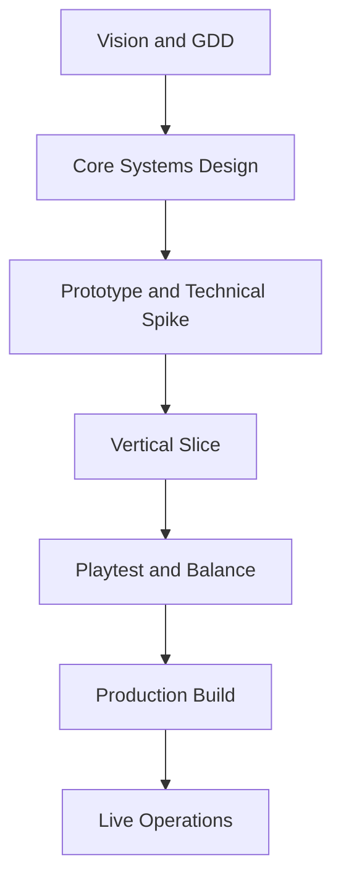

# Project Echo Documentation Repository

## Purpose

This repository contains the authoritative production documentation for Project Echo, a cooperative psychological horror game for 2–4 players on Windows PC via Steam. The documents in this repository are intended to guide design, engineering, art, audio, UX, QA, and production decisions throughout development.

The primary purpose of this repository is to reduce ambiguity. Every major system should be defined in a way that allows a developer to implement it without needing repeated clarification from the original designer.

## Scope

This repository covers:

- Core vision and high-concept design
- Gameplay systems and progression
- Multiplayer and backend architecture
- Art, UI, audio, accessibility, and performance constraints
- Testing strategy, risks, and future content planning

This repository does not cover unrelated game projects, non-Echo prototypes, or external vendor documentation unless those materials directly affect implementation.

## Dependencies

Project Echo depends on the following planning and technical foundations:

- Unity 6 as the game engine
- C# as the implementation language
- Photon Fusion 2 for authoritative multiplayer networking
- PlayFab for account, matchmaking, and cloud services
- Vivox for voice communication
- Steamworks integration for platform features and distribution
- GitHub for source control and documentation maintenance

All documents in this repository should assume these dependencies unless a later document explicitly overrides them.

## Diagrams

### High-Level Development Flow

### Documentation Relationship

## Examples

### Example Player Experience

A team enters a facility and each player receives a different view of the same hallway. One sees a locked door, another sees a maintenance panel, and a third hears a hidden alarm. None of them can escape alone. The team must cross-reference the information, decide which action is safe, and avoid triggering the creature’s attention.

### Example Communication Loop

1. Player A reports a distorted environmental cue.
2. Player B confirms that the cue exists only in their version of reality.
3. Player C identifies the required interaction.
4. The team executes the action under pressure.
5. The creature reacts to the team’s mistake or timing.
6. The team adapts and continues.

## Edge Cases

- A player joins mid-session with incomplete context.
- Voice chat drops or becomes unstable during a critical moment.
- Two players interpret the same clue differently and create conflict.
- The creature becomes active before the team reaches a safe state.
- A puzzle output appears valid to one player but misleading to another.
- Network latency causes desynchronization in movement or interaction timing.
- A player disconnects after the team has already committed to a risky action.

These edge cases should be handled by explicit design rules, not by ad hoc implementation decisions.

## Design Decisions

### Decision 1: Communication Is the Core Loop

The game is not built around combat or reflex mechanics. Communication is the primary system because it creates the strongest identity for the product. If the game were reduced to stealth or monster avoidance alone, it would become derivative and lose its core fantasy.

### Decision 2: Reality Is Fragmented, Not Random

Each player’s experience of the world should feel coherent within their own perspective, but incomplete when compared to the team’s combined knowledge. This avoids arbitrary confusion and preserves a structure that can be implemented and tested consistently.

### Decision 3: The Creature Functions as Pressure, Not Just Threat

The creature is designed to amplify communication failures, bad timing, and panic. This makes it a systemic tool for tension rather than a conventional enemy. The result is a stronger gameplay identity and a clearer distinction from other horror co-op titles.

### Decision 4: The MVP Must Remain Scope-Controlled

The first production milestone should focus on one facility, one creature behavior model, and a narrow but durable set of objectives. This reduces technical risk and ensures the design can be finished and polished within a realistic indie production schedule.

## Future Improvements

- Additional facilities with unique environmental logic
- New creature behavior patterns and escalation tiers
- Expanded objective and puzzle frameworks
- Seasonal or live-event content
- More advanced replayability systems and player-generated stories

## Risks

- Multiplayer communication may fail to feel meaningful if information sharing is too easy or too arbitrary.
- Asymmetric information may become frustrating if players cannot reliably verify what they are seeing.
- The creature may become repetitive if its behavior is too predictable.
- Scaling to 4 players may introduce coordination problems that are not solvable through design alone.
- Network synchronization may undermine the clarity of environmental states if not carefully constrained.

## Open Questions

- Should the game support both voice chat and text-based fallback communication?
- How much of the reality divergence should be visible through UI versus pure environmental presentation?
- What is the minimum number of distinct objective archetypes required for the MVP?
- Should the creature have a visible “state” that players can interpret, or should it remain partially ambiguous?
- How much procedural variation is required before replayability feels meaningful instead of superficial?

## Documentation Maintenance Rules

All future documents in this repository should follow the same structure:

- Purpose
- Scope
- Dependencies
- Diagrams
- Examples
- Edge Cases
- Design Decisions
- Future Improvements
- Risks
- Open Questions

Any document that omits these categories should be considered incomplete.
