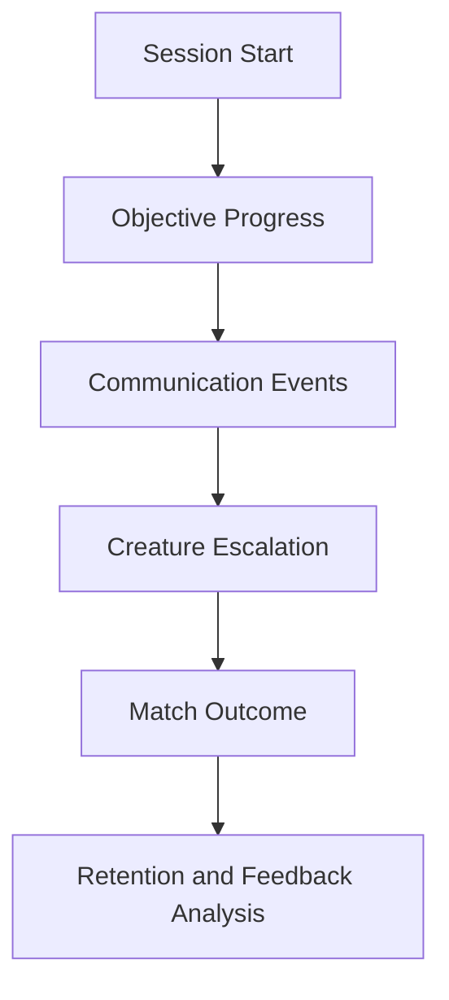

# Analytics

## Purpose

This document defines the telemetry and learnings strategy for Project Echo so design decisions can be supported by evidence.

## Scope

Covers gameplay telemetry, session analysis, retention tracking, and balancing feedback.

## Dependencies

- Privacy and compliance requirements must be considered from the start.
- Telemetry must not interfere with gameplay or create too much overhead.

## Diagrams

## Examples

- Measure how often players successfully share critical clues before the creature escalates.
- Track which objectives cause confusion or repeated failure.

## Edge Cases

- Players may disconnect before the session ends.
- Telemetry may be incomplete for players who decline consent.

## Design Decisions

- Analytics should answer gameplay questions, not merely report activity.
- Telemetry should be used to discover friction and improve clarity rather than to punish players.

## Future Improvements

- Add event-level tracing for objectives and creature states.
- Build post-match review summaries for community content and design analysis.

## Risks

- Over-collecting data can harm trust and complicate implementation.
- Poorly designed metrics can mislead decisions.

## Open Questions

- Which metrics are most valuable for the first playtest build?
- How much data is acceptable to collect from a live co-op session?
