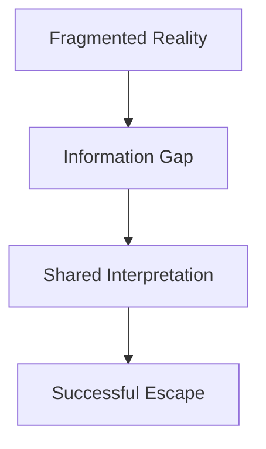

# Vision

## Purpose

This document formalizes the creative promise of Project Echo for all stakeholders.

## Scope

Defines the emotional fantasy, design pillars, and audience expectations.

## Dependencies

- The experience must support 2–4 online players.
- The game should remain feasible in Unity 6 with a small development team.

## Diagrams

## Examples

- One player sees a safety code while another sees the maintenance panel that uses it.
- The team must reconcile conflicting clues during rising creature pressure.

## Edge Cases

- Players may misread the intended information flow.
- A single dominant player may overtake group decision-making.

## Design Decisions

- The experience should reward coordination over individual heroics.
- The game should create tension through uncertainty, not simple jump scares.

## Future Improvements

- Expand the lore through optional environmental storytelling.
- Add more distinct facility identities.

## Risks

- If the information asymmetry is too opaque, the game may feel unfair.
- Emphasizing ambiguity without structure can reduce clarity.

## Open Questions

- How much of the truth should remain hidden until the end of a match?
- How much tutorial support is necessary for first-time groups?
