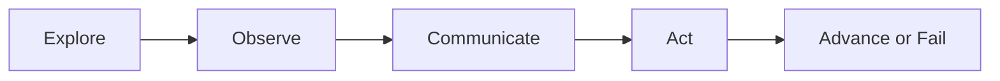

# Core Gameplay

## Purpose

This document defines the core player actions and interactions that form the foundation of Project Echo.

## Scope

Covers exploration, interpretation, objective completion, and escape preparation.

## Dependencies

- The game requires a stable communication channel between players.
- The environment must expose enough information for players to interpret and cross-reference.

## Diagrams

## Examples

- One player hears a mechanical clicking sound and another sees the corresponding hazard.
- The team must decide whether to proceed, disable the hazard, or retreat.

## Edge Cases

- A player may attempt to interact with an object that only appears in another reality.
- A hazard may become active before the full team is ready.

## Design Decisions

- Gameplay should prioritize interpretation and coordination over reflex-based action.
- Interactions should always have an understandable consequence.

## Future Improvements

- Add more sophisticated environmental interactions.
- Introduce more layered objectives across facilities.

## Risks

- Too many interactive systems may reduce clarity.
- A weak feedback loop may make the player feel powerless.

## Open Questions — Resolved

- **How much of the core loop should be time-limited?**
  - ✅ **Answer**: The overall facility session has a soft time pressure (creature escalation increases over match duration), but individual objectives should not have hard timers. Pressure comes from the creature system (GDD Ch. 10) and the stress system (GDD Ch. 11), not from countdown clocks. This preserves the communication-first design.

- **Should players be allowed to fail objectives and recover, or is failure a hard reset?**
  - ✅ **Answer**: Failure is **recoverable**. Per GDD Ch. 04 Decision 5 ("Failure States Must Be Recoverable"), a failed objective should create consequences (creature escalation, stress increase, lost resources) but should not immediately end the match. The team can adapt and attempt alternative approaches. Hard-fail only occurs when the creature fully escalates to its terminal state.

