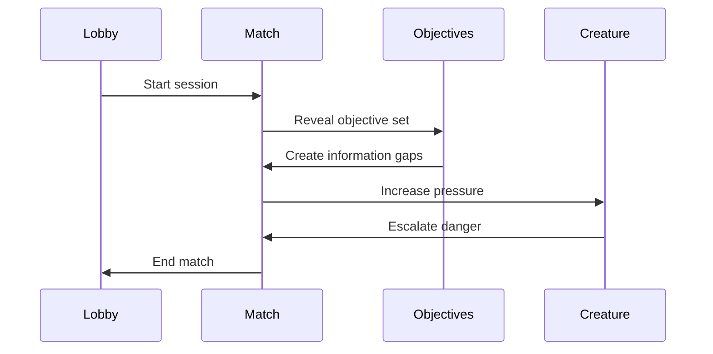

# Gameplay Loop

## Purpose

This document defines the repeatable loop that players experience in each match.

## Scope

Covers the match flow from lobby to extraction and post-session reflection.

## Dependencies

- Match flow depends on objective generation, communication pressure, and creature escalation.
- The structure must support short sessions of 15–30 minutes.

## Diagrams

## Examples

- The team discovers part of a system, then must exchange clues to repair it before the creature reaches them.
- A misordered action causes a new hazard and changes the remaining objectives.

## Edge Cases

- The match may end before all objectives are complete.
- A disconnect can reduce available information and create a new challenge.

## Design Decisions

- The loop should be easy to understand but rich enough to produce different stories.
- The creature should escalate in response to team behavior, not timetable alone.

## Future Improvements

- Add more varied objective sequences and escalation templates.
- Support event-driven match endings for richer storytelling.

## Risks

- If the loop is too long, it will exceed the target session length.
- If the loop is too short, it will feel shallow.

## Open Questions

- How many objectives should be expected in a standard match?
- Should each match end on a single extraction point or multiple possible exits?
