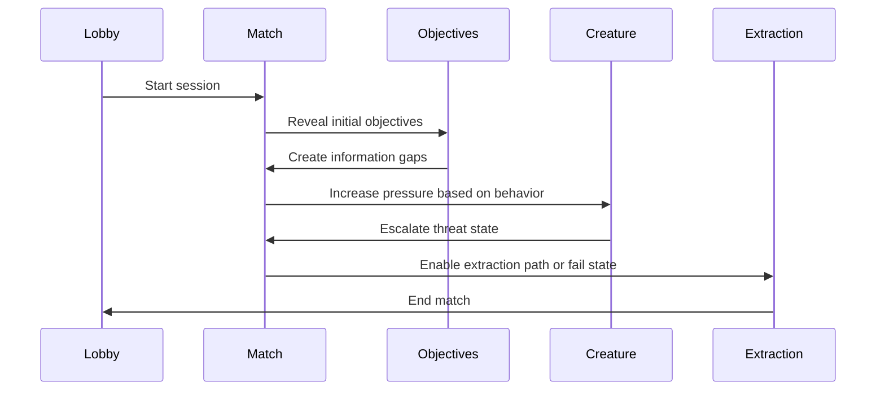

# Gameplay Loop

## Purpose

This document defines the repeatable match structure for Project Echo. It explains how a session progresses from setup to extraction and how each phase contributes to tension, clarity, and team coordination.

## Scope

This document covers:

- Match startup and onboarding
- The core loop of observation, decision, and action
- Pressure escalation over the course of a match
- Objective progression and extraction flow
- Session pacing and end-state behavior

This document does not define every room-specific event or every late-game scenario.

## Dependencies

- The gameplay loop depends on the core gameplay rules in [docs/GDD/02 Core Gameplay.md](docs/GDD/02%20Core%20Gameplay.md).
- It must support the objective model in [docs/GDD/09 Objective System.md](docs/GDD/09%20Objective%20System.md).
- It must respond to creature pressure in [docs/GDD/10 Monster AI.md](docs/GDD/10%20Monster%20AI.md).
- It must remain compatible with the asymmetric reality framework in [docs/GDD/06 Asymmetric Reality.md](docs/GDD/06%20Asymmetric%20Reality.md).

## Player Experience Goals

A match should feel like a short, sharp escalation from uncertainty to pressure to resolution. The player should feel that:

- They understand the current situation quickly.
- Every decision has a visible outcome.
- The team’s communication matters more than raw speed.
- The session ends with a meaningful sense of completion or failure.

## Match Structure

### Phase 1: Orientation

The team enters the facility, learns the basic controls, and establishes the first points of shared understanding. The main goals at this stage are:

- Establish common spatial awareness
- Introduce the first objective
- Teach the team how information differs across realities
- Create low-to-medium pressure so the players can adjust

### Phase 2: Discovery

The team begins to interpret the environment and uncover the first meaningful system interactions. This phase should feel exploratory, but not empty. The game should offer small but important successes that build confidence.

### Phase 3: Pressure Build

As the team progresses, objectives become more consequential and the creature begins to respond to their actions. The game should increase stakes through:

- Failed or delayed objective attempts
- Environmental hazards
- Communication breakdowns
- Creature proximity or tracking

### Phase 4: Commitment

The team reaches a point where the remaining objectives demand coordination and decisive action. This is the moment where communication quality matters most. The team should be forced to choose between speed, caution, and risk.

### Phase 5: Extraction or Collapse

The match ends when the team either completes the final objective and secures an extraction path or fails to stabilize the situation. A good ending should feel earned and readable, whether the outcome is success or collapse.

## Core Loop

The loop for each meaningful interaction is:

1. The team enters a situation with incomplete or partial information.
2. A player observes or acts on the environment.
3. The team interprets the result and shares information.
4. A decision is made.
5. The action resolves and changes the match state.
6. The creature, environment, or objectives respond.

This loop should repeat across the session in varied forms. The players must constantly revise their understanding as the environment changes.

## Match Flow Diagram

## Session Pacing Rules

### Rule 1: The Session Must Stay Compact

A standard match should fit within 15–30 minutes. The pacing should create momentum without forcing long downtime or repetitive tasks.

### Rule 2: Pressure Should Escalate Gradually

The game should not jump from calm to chaos immediately. The pressure curve should be visible and understandable.

### Rule 3: The Team Should Recover from Mistakes

A mistake should change the state of the match, but it should not eliminate all possible paths forward.

### Rule 4: The Final Phase Should Feel Decisive

The last part of the match should compress the team’s prior learning into a final sequence of meaningful choices.

## Examples

### Example 1: Controlled Escalation

The team restores one system, learns that the route ahead is unstable, and decides to use the creature as a distraction while they complete a second objective. The match feels tense but still coherent.

### Example 2: Recovery After Failure

A puzzle is attempted too early and creates a hazard. The team retreats, repositions, and uses the new information to complete the objective more safely. The failure produced pressure, not deadlock.

### Example 3: Communication-Driven Finale

In the late phase, two players uncover contradictory environmental clues. Their communication resolves the ambiguity, allowing the team to complete the escape sequence under pressure.

## Edge Cases

- The match ends before all objectives are complete.
- A disconnect reduces the available information or forces a temporary role shift.
- The team completes objectives in a different order than intended.
- A puzzle or hazard state changes mid-sequence due to creature pressure.
- The extraction path becomes unstable before the team can use it.

## Design Decisions

### Decision 1: The Loop Must Be Easy to Understand

The player should be able to describe the current situation in one sentence: what is happening, what is at risk, and what the team is trying to achieve.

### Decision 2: The Match Should Be Driven by Meaningful Choices

The loop must create decisions, not just repetitive actions. Each decision should influence the next state of the session.

### Decision 3: Pressure Should Be a Consequence of Behavior

Creature escalation and environmental threat should be tied to what the team does, not simply to elapsed time.

### Decision 4: The End State Should Feel Earned

Success should feel like the culmination of information, coordination, and restraint. Failure should feel like a consequence of the team’s choices, not random bad luck.

## Balancing Notes

- Early phases should allow the team to breathe and learn.
- Mid phases should create enough uncertainty to sustain tension.
- Late phases should compress decisions and increase risk without becoming unfair.
- Session pacing should support replayability by allowing different objective orders and different pressure patterns.

## Developer Notes

- The match flow should be driven by state transitions rather than a rigid linear script.
- Objective changes should trigger the next meaningful decision rather than relying on a timer.
- The system should support both scripted events and data-driven event sequences.
- The match should expose a clear state summary to designers and QA for debugging.

## Implementation Notes

- Implement the session flow as a state machine with phases such as Orientation, Discovery, Pressure, Commitment, and Extraction.
- Broadcast match phase changes to objectives, creature behavior, UI, and analytics.
- Keep the match flow deterministic enough for testing while still allowing dynamic changes based on player decisions.
- Use event hooks for phase transitions so systems can respond without tight coupling.

## Future Improvements

- Add more varied escalation templates and objective sequences.
- Support event-driven end states with more narrative flavor.
- Create alternate extraction outcomes and emergency fallback paths.

## Risks

- If the loop is too long, it will exceed the target session length.
- If the loop is too short, it will feel shallow.
- If the escalation curve is too steep, the game will feel unfair.
- If the match structure is too linear, it will reduce replayability.

## Open Questions

- How many objectives should be expected in a standard match?
- Should each match end on a single extraction point or multiple possible exits?
- Should the final phase include a mandatory “commit” decision, or should the team be able to continue adapting until the end?

