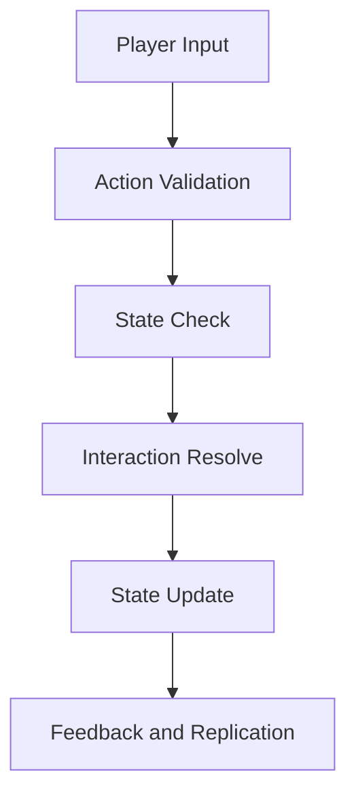
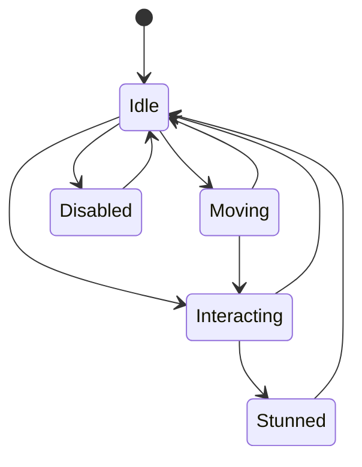

# Player Systems

## Purpose

This document defines the core player-facing systems that support movement, interaction, status, and team coordination in Project Echo. It specifies how players experience the facility and how their actions affect the match state.

## Scope

This document covers:

- Player movement and interaction model
- Body and camera state
- Interactables and action timing
- Player status state and fail states
- Team coordination affordances

This document does not define the full inventory implementation or the detailed monster behavior model.

## Dependencies

- The player system must support first-person interaction in a networked environment.
- The movement model must remain readable and usable under pressure.
- Player actions must be reflected consistently across all clients.
- The system must support 2–4 players without requiring role locking.

## Diagrams

### Player Interaction Flow

### Player State Machine

## Examples

### Example 1: Safe Interaction

A player approaches a maintenance panel, presses the interact key, and the panel opens only if the required authority state is satisfied. The interaction resolves on the server and broadcasts its result to all clients.

### Example 2: Interrupted Interaction

A player begins a repair action, but a creature-related event causes the task to be interrupted. The system cancels the action, marks it as failed, and applies the appropriate penalty or hazard state.

## Edge Cases

- A player attempts to interact while already performing another action.
- A player enters an interaction range while the object is already in an invalid state.
- A player uses movement input during a timed interaction and the action should either cancel or continue depending on the design rule.
- A player disconnects during an action and the system must recover gracefully.
- Two players attempt to use the same interactable at the same time.
- A player is stunned or immobilized while holding an objective-related item.

## Design Decisions

### Decision 1: Interaction Must Be Deterministic

All player interactions should resolve through the same authoritative validation path. This avoids situations where different clients disagree about whether an object was used, completed, or blocked.

### Decision 2: Action Timing Must Be Short and Understandable

Most interactions should take between 0.5 and 3 seconds. This is short enough to preserve urgency, but long enough to allow teammates to react or intervene.

### Decision 3: Movement Must Be Reliable Under Stress

The movement model should prioritize predictability over simulation complexity. Players should be able to reposition quickly and safely, but not feel like they are wrestling with the controls during a high-pressure moment.

### Decision 4: Players Should Not Be Forced Into Fixed Roles

The game should not require players to be designated as “scanner,” “runner,” or “healer.” The systems should support fluid cooperation where any player can contribute in different moments.

### Decision 5: Failure States Must Be Recoverable

A player should rarely be permanently disabled by a single mistake. Instead, the game should create temporary states such as stun, noise, or vulnerability that the team can respond to.

## Balancing Notes

- Interaction delays should be tuned so that a team can complete a task under pressure without feeling blocked by wait time.
- Movement speed should allow safe traversal of a small facility without making the game feel trivial.
- The cost of failed interactions should be meaningful, but not so severe that the team cannot recover within the match duration.
- The game should encourage communication before a mistake becomes catastrophic.

## Developer Notes

- Player actions should be implemented as stateful commands rather than ad hoc input handlers.
- Interactable objects should expose a shared interface for validation, activation, interruption, and completion.
- Audio and visual feedback should always accompany successful or failed interactions.
- The player state model should be replicated with a clear distinction between local input and authoritative state.

## Implementation Notes

- Use a small set of core player states: Idle, Moving, Interacting, Stunned, Disabled.
- Represent interaction status with explicit fields such as IsBusy, InteractionTarget, InteractionProgress, and InteractionCancelReason.
- Ensure that network prediction is limited to movement and simple local feedback, not full gameplay resolution.
- Keep all player-facing failure states visible in a minimal UI overlay or contextual indicator.

## Future Improvements

- Add more advanced locomotion options such as crouch, crawl, or limited stealth movement.
- Introduce player-specific status effects that reflect the fragmented reality system.
- Enable more expressive interaction behaviors for environmental storytelling.

## Risks

- Overly complex interaction timing can make the game feel clumsy or unfair.
- If player states are not replicated properly, the game may create visible desynchronization during critical moments.
- The movement system could become a source of frustration if it is not tuned for co-op pressure scenarios.

## Open Questions

- Should interaction cancellation be automatic, manual, or context-dependent?
- How much player mobility should be available in the MVP versus later content?
- Should players be able to carry multiple objective items, or should item handling remain simple?
