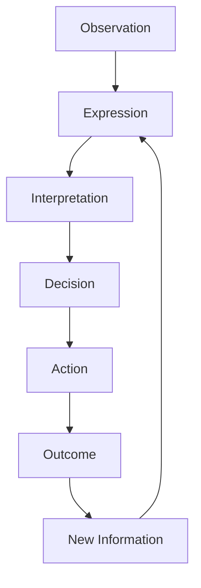
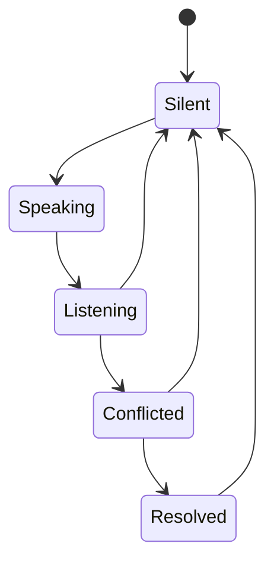

# Communication System

## Purpose

This document defines the communication framework for Project Echo. It specifies how players exchange information, how communication affects gameplay, and how the system should support both clarity and tension in a co-op horror experience.

## Scope

This document covers:

- Verbal communication expectations
- Shared information flow
- Communication-based gameplay consequences
- Fallback communication tools
- Communication failure modes

This document does not define the full voice backend implementation, but it does define the gameplay rules that the backend must support.

## Dependencies

- The game depends on voice communication as a primary interaction tool.
- Players must be able to communicate reliably under pressure.
- The system must remain functional if voice chat quality degrades or is unavailable.
- The communication system must support the asymmetric reality model.
- This system's three information states (Unshared, Shared, Confirmed — see §Implementation Notes below) are read directly by [docs/GDD/11 Stress System.md](docs/GDD/11%20Stress%20System.md) to drive the Uncertainty meter: an item stuck Unshared for more than 20 seconds raises Uncertainty; reaching Confirmed lowers it. This document owns the state definitions; 11 Stress System.md owns what happens to pressure as a result of them.

## Diagrams

### Communication Loop

### Communication State Flow

## Examples

### Example 1: Useful Communication

Player A reports that they saw a valve handle in their reality. Player B confirms that the same object appears as a panel in their version of the environment. The team identifies that the object must be manipulated through a specific sequence and proceeds successfully.

### Example 2: Harmful Miscommunication

Player A says “the door is open,” but Player B interprets that as permission to rush through it. The team moves too quickly, alerts the creature, and loses control of the situation.

## Edge Cases

- A player is too frightened or uncertain to speak clearly.
- Two players describe the same object using different terms and create confusion.
- Voice chat cuts out temporarily during a critical interaction.
- One player has information that is technically accurate but not useful in context.
- The team becomes over-reliant on one speaker and neglects other inputs.
- A player tries to use a fallback communication method while the team is already under pressure.

## Design Decisions

### Decision 1: Communication Must Have Gameplay Consequences

Communication cannot be decorative. If a player says something and nothing changes, the feature will feel superficial. Instead, communication should shape decisions, alter risk, and influence the outcome of objectives.

### Decision 2: The Game Should Reward Precision, Not Just Volume

The team should benefit from clear, specific, and relevant communication. Vague statements such as “I saw something” should be less useful than actionable messages such as “There is a red panel on the left wall of the maintenance corridor.”

### Decision 3: The System Must Support Ambiguity Without Becoming Frustrating

The game should allow misunderstandings, but not to the point that players are punished by the game’s own communication design. Misunderstanding should create tension and opportunity, not total deadlock.

### Decision 4: Fallback Communication Must Exist

Voice chat is expected to be the primary means of communication, but the game should provide a minimal fallback method such as quick communication pings, context tags, or text shortcuts. This improves accessibility and protects the experience when voice quality is poor.

## Balancing Notes

- Communication should feel essential, but not so mandatory that players who are not comfortable with voice chat are excluded.
- The system should reward concise, informative speech while allowing natural human interaction.
- The game should avoid requiring perfect communication for every single problem; some ambiguity should be survivable if the team adapts.
- Communication penalties should be meaningful but recoverable. A failed communication exchange should create pressure, not instantly destroy the run.

## Developer Notes

- The communication system should not rely on a single global chat channel for all information.
- The game should support both direct player-to-player communication and contextual information broadcasting.
- Communication events should be logged in a lightweight way for analytics and replay review.
- The UI should make it easy to understand which information is shared, confirmed, or disputed.

## Implementation Notes

- Support at least three information states: Unshared, Shared, and Confirmed.
- Allow players to mark observations as uncertain, confirmed, or contradictory.
- Provide a lightweight ping or context marker system for non-verbal communication.
- Ensure communication events are distinctly represented in the match state for post-session analysis.

## Future Improvements

- Add structured in-game communication tags such as “hazard,” “clue,” “objective,” or “danger.”
- Introduce communication-based advantages that reward strong teams without creating power imbalance.
- Expand accessibility options such as text-to-speech or speech-to-text assistance.

## Risks

- If communication is not integrated into core gameplay, it will feel like a feature rather than a mechanic.
- Voice chat dependence could alienate players who prefer text or who have unstable network conditions.
- Overly rigid communication tools could reduce emergent conversation and make the game feel scripted.

## Open Questions

- Should the game include a limited set of reusable communication phrases or allow free-form voice only?
- How much of the communication system should be visible to the team versus hidden for realism?
- What is the minimum fallback system required for the MVP?
