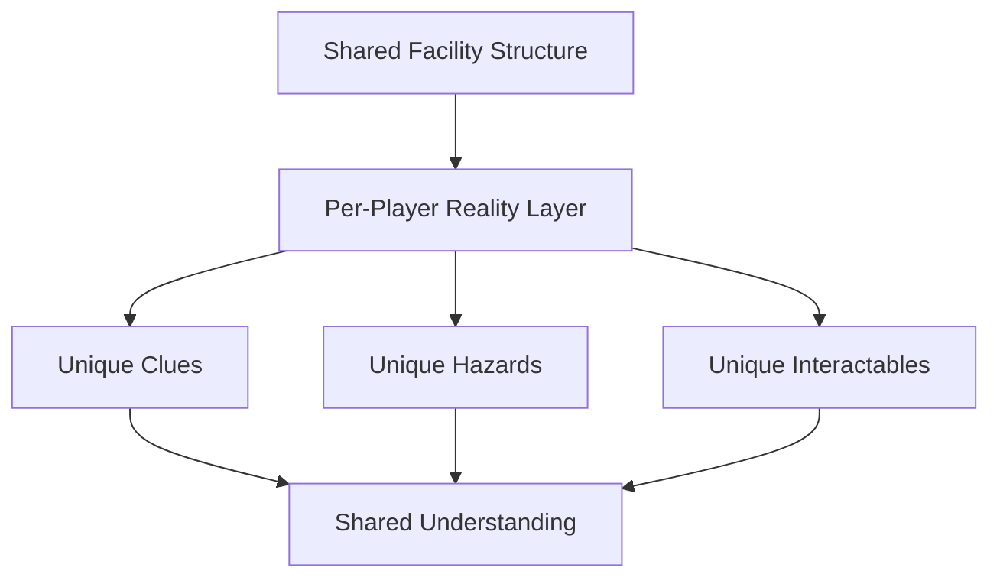
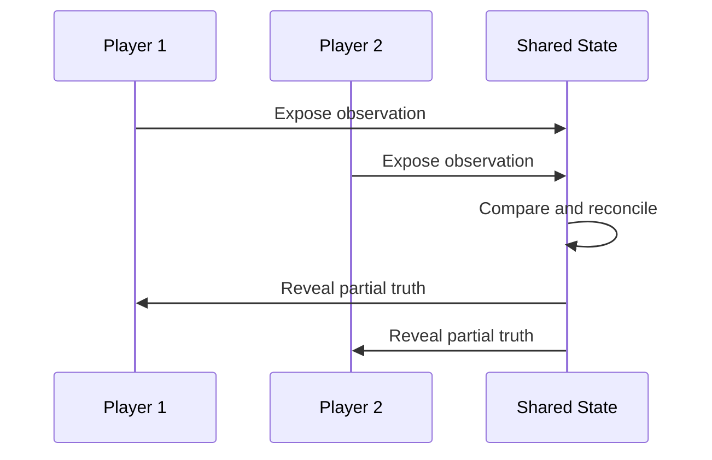

# Asymmetric Reality

## Purpose

This document defines the core asymmetric information system that makes Project Echo distinct. It specifies how each player experiences the facility differently, how those differences are generated, and how the game preserves fairness while encouraging communication-driven problem solving.

## Scope

This document covers:

- The reality divergence model
- The rules for information distribution across players
- The relationship between per-player perception and shared facility truth
- The fairness and readability constraints that keep the system playable
- The tools required to author and validate asymmetric content

This document does not define every puzzle type or every room-specific object variation.

## Dependencies

- The system depends on a structured generation framework rather than pure randomness.
- The game must preserve enough common ground for players to coordinate.
- The environment must support multiple valid interpretations without making the game incoherent.
- The system must integrate with the objective, puzzle, UI, and networking layers.

## Diagrams

### Reality Divergence Model

### Information Reconstruction Flow

## Examples

### Example 1: Partial Truth and Cross-Validation

One player sees a maintenance key hidden inside a false panel. Another player sees the corresponding cabinet but cannot access it until the key is found. The objective is not solved by one player alone; it is solved when the team realizes the cabinet and key belong to the same hidden system.

### Example 2: Divergent Hazard Perception

One player perceives a maintenance corridor as safe because it appears intact, while another player sees the same corridor as unstable because the environmental fault is visible in their version of reality. The team must decide whether to trust the visible hazard, the shared map, or the creature’s behavior before acting.

## Edge Cases

- A player receives a clue that appears to contradict another player’s experience.
- One player’s version of reality makes an objective impossible to complete without additional information.
- The system creates a clue that is technically visible but not meaningful without context.
- The team becomes too reliant on one player’s reality and ignores alternatives.
- A player’s reality is so different that navigation becomes ambiguous despite the shared structure.
- A player experiences a false positive and believes a danger is present when the team later proves it is not.

## Design Decisions

### Decision 1: Reality Differences Must Create Actionable Information

The game should not change visual content for the sake of novelty. Every divergence must create a meaningful difference in what the player knows, what they can safely do, or what they are likely to misunderstand.

### Decision 2: The Shared Foundation Must Remain Intact

All players still inhabit the same overall facility structure. Asymmetry should affect information and interpretation, not destroy the basic spatial coherence of the level.

### Decision 3: The Team Must Reconstruct Truth, Not Merely Compare Notes

The game should encourage players to synthesize partial truths into a functioning plan. This is more interesting than simply announcing “I saw something different.”

### Decision 4: Asymmetry Must Be Fair and Learnable

If one player receives significantly less usable information than others, the game becomes unfair. The system must ensure that each player receives enough information to meaningfully contribute while still being dependent on the team.

### Decision 5: The Game Must Preserve a Sense of Shared Reality

Players should never feel that they are inhabiting entirely separate worlds. The asymmetry should feel like a fracture in perception, not a complete disconnect from the same environment.

## Balancing Notes

- Each player should receive enough information to make progress, but not enough to solve the whole match alone.
- The total information available across the team should be greater than the information available to any single player.
- Reality variants should create pressure, not deadlock.
- The system should support both short-term tactical cooperation and long-term strategic interpretation.
- The game should allow enough ambiguity to create memorable moments, but not so much that players feel cheated.

## Developer Notes

- Implement asymmetry as layered state rather than separate full-scene variants where possible.
- The content framework should allow designers to tag objects as visible, hidden, transformed, or conditionally exposed by player reality.
- Reality differences should be testable through a simulation mode or debug view.
- Ensure that the team can identify common environmental anchors such as doors, structural features, and objective markers even when details diverge.
- The system should support deterministic authoring so that designers can reason about how a given object appears across player realities.

## Implementation Notes

- Represent each player’s reality as a set of visibility and accessibility rules applied to shared environmental objects.
- Use a deterministic assignment model for the MVP to avoid random cases that cannot be validated easily.
- Provide a debug tool that displays a player’s reality layer and the shared facility layer side by side.
- Keep the mapping between common geometry and individual reality state explicit in data assets.
- Expose a simple authoring interface for designers to mark an object as hidden, transformed, or conditionally revealed by reality state.

## Future Improvements

- Expand the system to create more dramatic and varied reality conflicts.
- Introduce player-specific narrative lenses that alter how clues are perceived.
- Add optional “reality drift” events that temporarily alter the information landscape mid-session.
- Support dynamic reality shifts that change what the team can trust as the match progresses.

## Risks

- If the asymmetry system becomes too opaque, players may feel the game is unfair or arbitrary.
- If the system is too simple, the mechanic will not create enough memorable moments.
- If the system is implemented inefficiently, it could increase content production complexity beyond the team’s capacity.
- If the system is too consistent, it may become predictable and lose its emotional impact.

## Open Questions

- How many different reality modes should be available in the MVP?
- Should reality divergence be static for a match or dynamic during a match?
- How much of the asymmetry should be visible in the environment versus communicated through the game system?
- How should the game communicate when a player’s reality is missing critical information versus when it is simply different?
