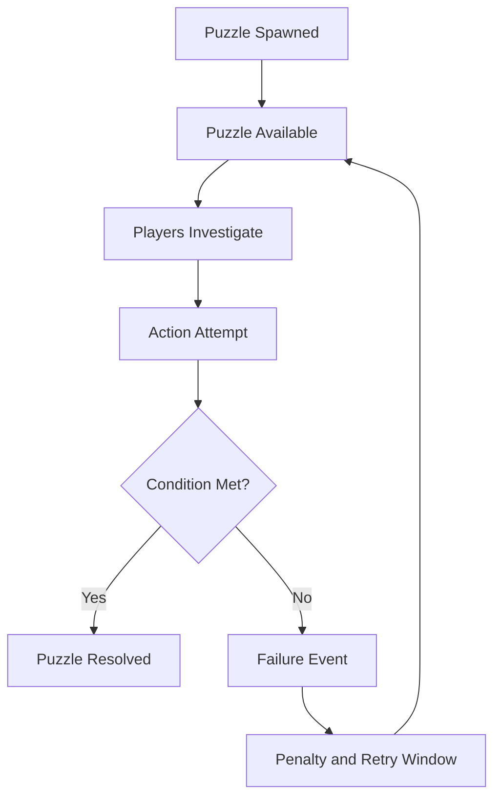
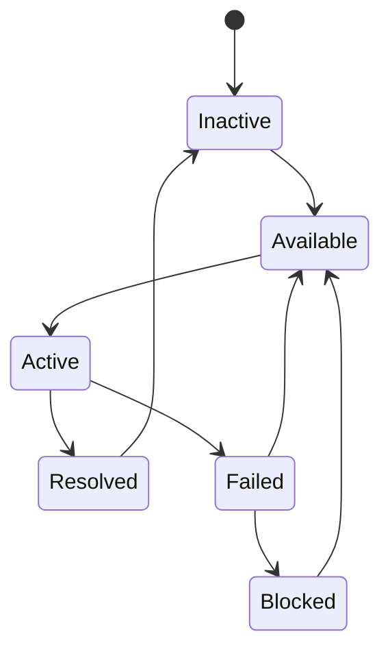
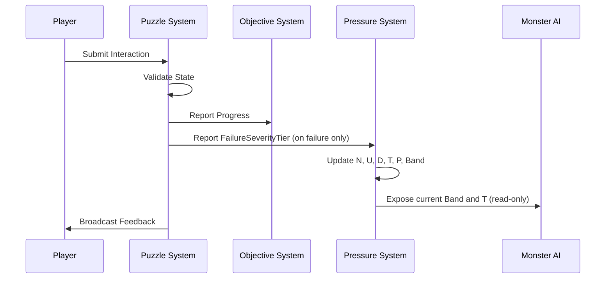
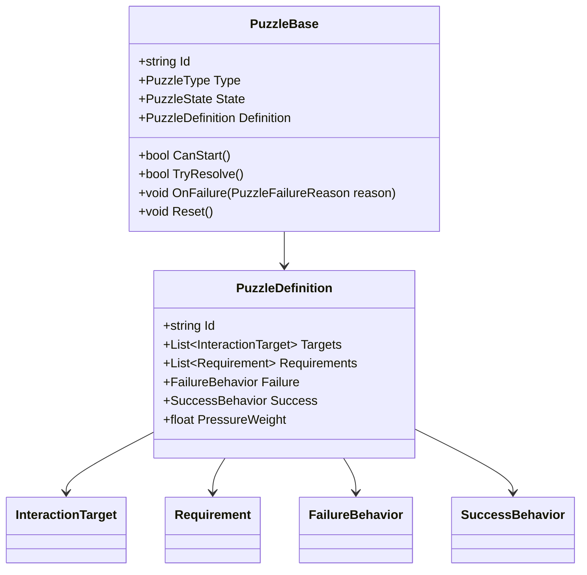
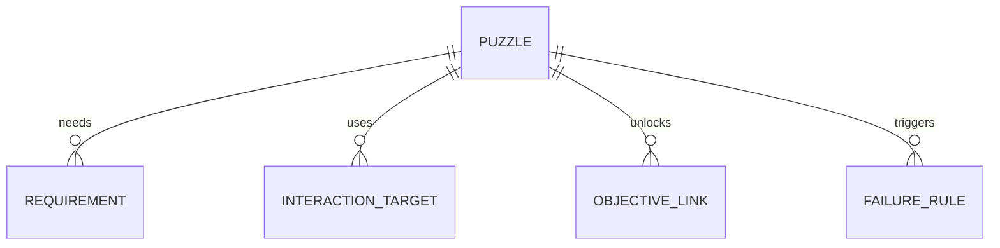

# Puzzle Framework

## Purpose

This document defines the reusable puzzle framework for Project Echo. It specifies how puzzles are authored, how they are evaluated, how they interact with the asymmetric reality system, and how they support the game’s communication-first design without becoming a generic escape-room mechanic.

## Scope

This document covers:

- Puzzle design principles
- Puzzle lifecycle and state model
- Puzzle authoring requirements
- Puzzle data structure and runtime behavior
- Player experience expectations
- Failure, recovery, and escalation rules
- Networking and save/load behavior
- Debugging and QA requirements
- Implementation notes and future expansion ideas

This document does not define every individual puzzle in the game. It defines the rules and infrastructure that make puzzle content consistent, maintainable, and playable.

## Dependencies

- Puzzles must support the asymmetric reality model defined in [docs/GDD/06 Asymmetric Reality.md](docs/GDD/06%20Asymmetric%20Reality.md).
- Puzzle logic must integrate with the objective system in [docs/GDD/09 Objective System.md](docs/GDD/09%20Objective%20System.md).
- Puzzle failure and unresolved observations feed the shared pressure model in [docs/GDD/11 Stress System.md](docs/GDD/11%20Stress%20System.md), which is the sole authority for pressure/threat values. This document no longer defines its own pressure formula (see §Balancing Philosophy).
- Puzzle completion and failure must be visible to the UI and reflected in the match state.
- The system must support 2–4 players online and remain deterministic under network variance.
- **Design authority for all puzzle content — principles, communication taxonomy, fairness rules, replayability standards, production constraints, and the evaluation framework that every current and future puzzle must satisfy — is owned by [docs/GDD/Puzzle Design Bible.md](Puzzle%20Design%20Bible.md). This document defines the runtime infrastructure; the Puzzle Design Bible defines what that infrastructure must serve.**

## Player Experience Goals

The puzzle experience should feel like this:

- The team discovers new information through exploration and discussion.
- A puzzle creates a moment of alignment between players who see different realities.
- The solution feels earned because the team had to compare interpretations and act under pressure.
- Failure creates tension, not frustration.
- Success produces a clear sense of progress and relief.

The player should never feel that a puzzle is solved by rote memorization or random trial-and-error. The core fantasy is interpretation, not brute-force logic.

## Core Design Principles

### Principle 1: Puzzles Must Be Communication Tools

A puzzle should force the team to exchange information, verify assumptions, and coordinate actions. If a puzzle can be solved by a single player without speaking to anyone, it is not using the game’s core identity well enough.

### Principle 2: Puzzles Must Be Readable Under Pressure

A good puzzle should be understandable within a few seconds of the team encountering it. The player should not need to parse a hidden logic chain while also managing creature pressure.

### Principle 3: Puzzle Failure Must Be Consequential but Recoverable

A failed attempt should make the team feel the cost of their mistake. It should raise danger, consume time, or alter the environment. It should not wipe out progress or make the session feel unfair.

### Principle 4: Puzzles Must Be Modular

The framework should support many puzzle variants using a small set of reusable building blocks. This reduces production cost and preserves maintainability.

### Principle 5: Puzzles Must Preserve Narrative Coherence

A puzzle should feel like it belongs in the facility’s systems. It should not feel like a disconnected logic gate inserted to create content.

## Puzzle Categories

The MVP should use a small set of authoritative puzzle categories.

### 1. Relay Puzzles

These require the team to connect information from different players or different locations. One player sees the clue, another can act on it, and the puzzle resolves only when the relationship is understood.

### 2. Sequence Puzzles

These require an ordered set of actions or interactions. The order is not obvious from a single perspective and must be reconstructed from partial knowledge.

### 3. Containment Puzzles

These involve stabilizing, disabling, or sealing a hazard. The team must decide when to act, how to manage risk, and whether to proceed or hold.

### 4. Divergence Puzzles

These rely directly on the asymmetric reality system. The puzzle is only solvable because each player sees a different part of the required truth.

### 5. Conditional Puzzles

These are activated or altered by state changes such as creature pressure, objective progression, or environmental hazards.

## Gameplay Rules

### Rule 1: Every Puzzle Must Have a Clear Intent

Every puzzle must answer one of these questions:

- What is the team trying to learn?
- What is the team trying to change?
- What risk is the team trying to manage?

If the puzzle cannot be summarized as one of these, it is too vague.

### Rule 2: Every Puzzle Must Have a Clear Failure Outcome

Failure must produce one of the following:

- Increased creature pressure
- Environmental hazard activation
- Temporary lockout
- Objective delay
- Visibility change
- State reset with penalty

### Rule 3: Every Puzzle Must Have a Clear Success Outcome

Success must produce one of the following:

- Objective progression
- Facility state change
- New clue availability
- Access grant
- Hazard suppression
- Creature pressure reduction

### Rule 4: Every Puzzle Must Be Solvable Through Team Interpretation

A puzzle should not require hidden knowledge outside the game’s rules. The team should be able to reason from visible information, shared communication, and known system behavior.

### Rule 5: Every Puzzle Must Support Retry

Players should be able to retry a puzzle after failure. Reattempts may carry cost, but they should not require a full session restart.

## Puzzle Lifecycle



## Puzzle State Machine



## Puzzle Data Model

Each puzzle should be represented by a data structure with the following fields:

- PuzzleId: unique identifier
- PuzzleType: enum such as Relay, Sequence, Containment, Divergence, Conditional
- State: current runtime state
- RequiredPlayers: minimum number of players needed to solve or trigger it
- DependencyIds: objectives, rooms, or systems the puzzle depends on
- RelevanceTags: clue, hazard, objective, communication, containment, escape
- InteractionTargets: objects or nodes that can affect the puzzle
- RequiredObservations: information that must be known before solution is possible
- FailureBehavior: penalty model, reset behavior, or escalation behavior
- SuccessBehavior: reward state, objective unlock, or room state change
- ResetCooldown: time before the puzzle can be retried
- FailureSeverityTier: `Minor`, `Moderate`, or `Severe` — looked up directly against the Noise contribution table in [11 Stress System.md](docs/GDD/11%20Stress%20System.md) (+1.50 / +2.25 / +3.00 respectively). This field replaces the former free-floating `PressureWeight` value; puzzles no longer compute a pressure delta themselves, they only classify their own failure severity.
- AuthoringVersion: schema revision for save compatibility

## Puzzle Runtime Interface

The implementation should use a shared interface for all puzzles:

```csharp
public interface IPuzzle
{
    string PuzzleId { get; }
    PuzzleState State { get; }
    PuzzleDefinition Definition { get; }
    bool CanStart();
    bool TryResolve();
    void OnFailure(PuzzleFailureReason reason);
    void Reset();
    void OnLateJoin(PlayerContext player);
}
```

## Puzzle Authoring Rules

### Authoring Rule 1: One Clear Core Mechanic

Each puzzle should contain one primary mechanic. Additional layers may exist, but the main resolution should be obvious.

### Authoring Rule 2: Use Reusable Interaction Components

Designers should compose puzzles from a small set of interaction components such as:

- Toggle
- Sequence input
- Observation requirement
- Multi-node dependency
- Conditional unlock
- Hazard containment
- Synchronization event

### Authoring Rule 3: Keep Puzzle Clues Visible in Context

A clue should not be hidden in an unrelated corner of the map if the puzzle is intended to be solvable during the session. If the clue is hidden intentionally, the surrounding environment should make that hiddenness meaningful.

### Authoring Rule 4: Ensure the Puzzle Can Be Described in One Sentence

If a designer cannot describe the puzzle in one sentence, it is probably too complex for the MVP.

## Success Conditions

A puzzle is considered successful when:

- The required state transition is reached
- The correct team interpretation is applied
- The associated objective or system enters a resolved state
- The team receives clear feedback that progress occurred
- The puzzle does not leave the team in a deadlocked state

## Failure Conditions

A puzzle fails when:

- The team makes an invalid action attempt
- The required information is incomplete or misapplied
- The team exceeds the allowed retry or timing window
- Environmental disruption causes the puzzle to become invalid
- The creature escalates to a level that makes continued interaction unsafe
- The puzzle state is interrupted by disconnect, host handoff, or desync

Failure should produce a meaningful but recoverable cost.

## Balancing Philosophy

> **Constants Authority:** All numeric values in this section — Diff scale, Diff MVP target range, Diff severe threshold, FailureSeverityTier noise contributions, and the unshared observation timeout — are owned by [`docs/GDD/Gameplay Constants Bible.md`](Gameplay%20Constants%20Bible.md) §Puzzle Constants. Values shown here are for design context only. Edit the Bible to change them.

Puzzle balance should be based on four factors:

- Information clarity
- Communication demand
- Time pressure
- Consequence of failure

The target balance is not “hard” or “easy.” The target balance is “legible under pressure.”

### Difficulty Formula

A practical puzzle difficulty score, `Diff`, can be estimated as:

$$Diff = C_d + I_d + T_d + F_d$$

Where each term is scored 0–2.5 by the designer against the rubric below (chosen so `Diff` naturally falls in the 0–10 range without post-hoc scaling):

| Term | 0 | 1 | 2 | 2.5 |
|---|---|---|---|---|
| $C_d$ communication demand | Solvable by one player alone | Needs one clarifying exchange | Needs sustained back-and-forth | Needs simultaneous coordinated action from all present players |
| $I_d$ information scarcity | All required info visible to the solving player(s) | One piece of info held by another player | Multiple pieces split across players | Info must be inferred, not just relayed |
| $T_d$ time pressure | No timer/pressure interaction | Solvable comfortably under Tense band | Meaningfully harder under Critical band | Intended primarily as a Collapse-window puzzle |
| $F_d$ failure consequence | Maps to `FailureSeverityTier: Minor` | — | Maps to `FailureSeverityTier: Moderate` | Maps to `FailureSeverityTier: Severe` |

(Renamed from the prior `D` to `Diff` specifically to avoid collision with 11 Stress System's Delay meter `D` — the two systems previously reused the same symbol for unrelated values, which this remediation pass corrects.)

The MVP should keep most puzzle `Diff` values between 3 and 7 on a 10-point scale. Values above 8 should be rare and reserved for special pacing moments, and should generally carry `FailureSeverityTier: Severe`.

### Pressure Contribution

Puzzle failure no longer computes its own escalation value. On `OnFailure`, the puzzle reports its `FailureSeverityTier` to the Pressure System, which applies the fixed Noise contribution defined in [11 Stress System.md § Event → Meter Contribution Tables](docs/GDD/11%20Stress%20System.md). Unresolved `RequiredObservations` older than 20 seconds separately and automatically contribute to the Uncertainty meter in the same document — puzzle authors do not need to trigger this manually; it is driven by the observation's Unshared/Shared/Confirmed state from 05 Communication System.

## Networking Considerations

### Authority Model

Puzzle state must be resolved authoritatively. The server should own the puzzle’s current state, objective dependency, and failure/reward transitions. Clients should not be allowed to independently resolve puzzle completion.

### State Replication

The following puzzle data should be replicated:

- Puzzle state
- Current interaction progress
- Dependency flags
- Failure cooldowns
- Reward unlock status

Note: pressure contribution itself is not part of puzzle state — it is reported once as an event to the Pressure System (11 Stress System.md) on failure/resolution and is not stored or replicated by the puzzle system.

### Late Joiners

When a player joins mid-session:

- They should receive the current puzzle state snapshot
- They should not be forced to re-solve already-completed puzzles
- They should be shown which puzzles are currently active or blocked
- They should be told which information is already shared and which is still unknown

### Disconnect Handling

If a player disconnects while interacting with a puzzle:

- The interaction should cancel cleanly
- The puzzle should not become permanently stuck
- If the puzzle depends on that player’s participation, the system should either reassign the interaction or downgrade the puzzle to a blocked state

## Save/Load Behavior

Puzzle state should be saved in a way that preserves logical continuity without forcing full-session replay.

### Persisted Data

The save system should store:

- Puzzle completion state
- Current active state
- Remaining time before retry or reset
- Which clues have been revealed to the team
- Which objective dependencies have already been satisfied

### Non-Persisted Data

The save system should not persist:

- Temporary animation state
- Local-only UI animations
- Transient visual effects
- Frame-by-frame interaction progress that can be safely recomputed

### Load Rules

On load:

- The puzzle should restore to a consistent state
- Any in-progress interaction should be canceled or resumed according to the implemented rule
- The UI should reflect whether the puzzle is active, blocked, or resolved

## Debugging Notes

The puzzle system should support a dedicated debug panel that exposes:

- Current state
- Dependency graph
- Active clue set
- Failure and success conditions
- `FailureSeverityTier` (read-only here; see 11 Stress System.md for the debug commands that manipulate the resulting meters directly)
- Which player is currently relevant to the puzzle
- Whether the puzzle is waiting on communication or on environmental state

A designer should be able to force:

- Puzzle success
- Puzzle failure
- Reset state
- Block state
- Re-enable state

## QA Checklist

A puzzle should be considered ready for QA only if:

- It can be solved without ambiguity by a coordinated team
- It fails in a readable and recoverable way
- It does not require hidden knowledge outside the intended design
- It works with 2, 3, and 4 players
- It remains understandable when the creature is active
- It can be solved under network variance without soft-locking the session
- It preserves the game’s communication-first identity

## Implementation Notes

- Implement the core puzzle system as a data-driven controller with a standardized interface.
- Keep puzzle logic separate from prefab visuals to reduce content production cost.
- Use an event-driven architecture so objectives, creature behavior, and UI can subscribe to puzzle state changes.
- Favor small, composable rule sets over a large number of bespoke one-off scripts.
- Ensure each puzzle supports local testing through debug commands and simulation tools.

## Event Flow Example



## Class Diagram



## ER Diagram for Puzzle Data



## Future Improvements

- Add procedural puzzle generation within content rules.
- Expand the library into more facility-specific systems.
- Introduce multi-stage puzzles that require cross-room coordination.
- Add puzzle modifiers that alter the communication and pressure demand dynamically.
- Support puzzle variants that change depending on the player count or session difficulty.

## Risks

- If puzzles are too abstract, players will not understand how to solve them.
- If puzzles are too linear, they will reduce replayability.
- If puzzle authoring is too complex, content production will slow down significantly.
- If the puzzle framework is too generic, the game may lose its distinct identity.

## Open Questions

- How many unique puzzle archetypes are required for the MVP?
- Should puzzles be solved individually or grouped into larger mechanical sequences?
- How much randomness should appear in puzzle setup versus deterministic design?
- Should some puzzles intentionally require one player to trust another player’s information rather than verify it directly?
