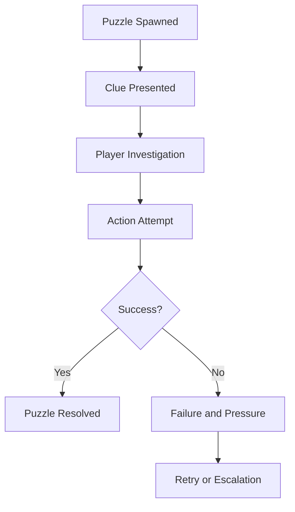
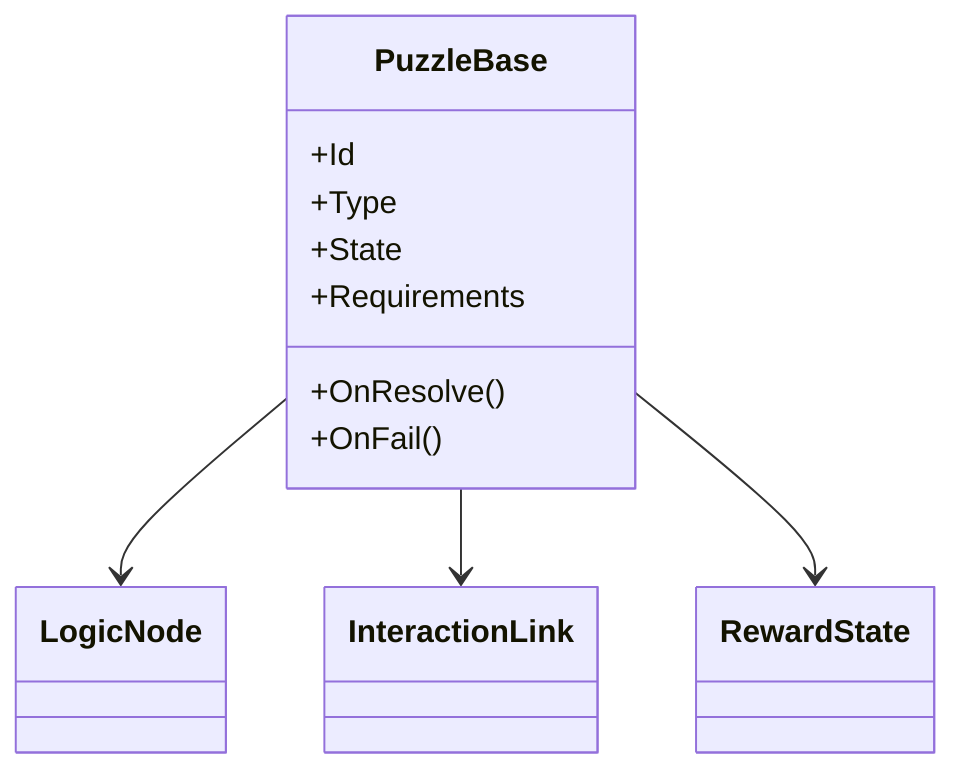

# Puzzle Framework

## Purpose

This document defines the reusable structure for puzzle design in Project Echo. It establishes how puzzles should be authored, how they should integrate with the asymmetric information system, and how they should support the game’s communication-first design.

## Scope

This document covers:

- Puzzle archetypes and design principles
- Puzzle state flow and failure handling
- Authoring requirements for designers
- Integration with objectives and communication

This document does not define every final puzzle in the game.

## Dependencies

- Puzzles must support the asymmetric reality model.
- Puzzle logic must be readable to players under pressure.
- Puzzle content must be modular enough to support replayability.
- The system must be practical for a small team to maintain.

## Diagrams

### Puzzle Lifecycle

### Puzzle Component Model

## Examples

### Example 1: Multi-Player Puzzle

A maintenance sequence requires two players to act at different points in the facility. One sees the required sequence, the other controls the trigger. The puzzle only resolves when the team verbally confirms the timing.

### Example 2: Information-Dependent Puzzle

A door panel only opens if the team has gathered two contradictory clues from different realities. The puzzle is not solved by brute force or random guessing.

## Edge Cases

- Players attempt to solve a puzzle with incomplete or conflicting information.
- The puzzle state is altered by a creature event or environmental hazard.
- The team attempts to brute-force a solution and triggers a penalty.
- A player disconnects while the puzzle is partially solved.
- The puzzle relies on a clue that only one player can see, but that player is absent from the current area.

## Design Decisions

### Decision 1: Puzzles Must Be Communication Tools

Puzzles should not be isolated logic problems. They should force discussion, comparison, and interpretation. The difficulty should be in reconstructing the truth, not in memorizing a sequence.

### Decision 2: Puzzle Failure Must Be Non-Destructive but Consequential

A failed puzzle attempt should create pressure or risk, but it should not completely ruin the session. The game should allow the team to recover and continue.

### Decision 3: Puzzles Must Be Modular

The framework should let designers create many puzzle variants from a small set of reusable interaction types. This keeps content production manageable.

### Decision 4: Puzzle Complexity Must Scale with Time

The simplest puzzles should be understandable in seconds. More complex ones should demand communication and planning but not lengthy stall states.

## Balancing Notes

- Each match should contain a mix of short, medium, and high-intensity puzzles.
- Puzzle density should be tuned so the team is under pressure without becoming overwhelmed.
- Puzzle solutions should generally require one meaningful exchange of information rather than many trivial steps.
- Puzzle failure should increase danger, but rarely erase progress entirely.

## Developer Notes

- Use a standardized puzzle interface with states such as Inactive, Active, Solved, Failed, and Resetting.
- Keep puzzle logic separate from visual presentation.
- Support puzzle tags for clue dependency, environmental hazard, communication requirement, and failure consequence.
- Favor deterministic puzzle resolution over random or hidden logic.

## Implementation Notes

- Build a generic puzzle controller that can host different puzzle types through data-driven configuration.
- Expose a debug state viewer for designers to inspect a puzzle’s current condition and dependencies.
- Keep puzzle progress visible in the objective system so the team can understand what remains.
- Integrate puzzle events with the creature pressure system to create escalating consequences.

## Future Improvements

- Add procedural puzzle generation within content rules.
- Expand the puzzle library into more thematic facility-specific systems.
- Introduce multi-stage puzzles that require cross-room coordination.

## Risks

- If puzzles are too abstract, players will not understand how to solve them.
- If puzzles are too linear, they will reduce replayability.
- If puzzle authoring is too complex, content production will slow down significantly.

## Open Questions

- How many unique puzzle archetypes are required for the MVP?
- Should puzzles be solved individually or grouped into larger mechanical sequences?
- How much randomness should appear in puzzle setup versus deterministic design?
