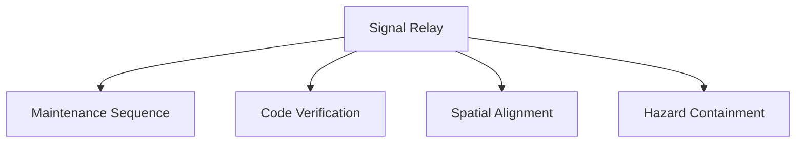
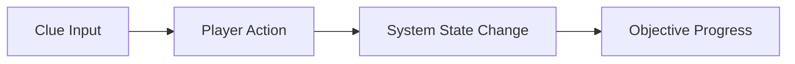

# Puzzle Library

## Purpose

This document defines the initial set of puzzle archetypes that will be available in the MVP. It serves as a practical library for designers and programmers to implement and balance content efficiently.

## Scope

This document covers:

- The puzzle types planned for the first production milestone
- Their required inputs, outputs, and failure states
- Their relationship to the communication and asymmetric reality systems

This document does not define every future puzzle variant.

## Dependencies

- The library must fit the puzzle framework and objective system.
- Each puzzle should be implementable using a small set of reusable mechanics.
- The examples must be testable with 2–4 players.

## Diagrams

### Puzzle Library Overview

### Puzzle Archetype Flow

## Examples

### Example 1: Signal Relay

One player sees a signal pattern in their reality. Another player can activate the corresponding relay. The puzzle is solved only when both pieces of information are connected verbally.

### Example 2: Maintenance Sequence

A panel requires a sequence of repairs that must be completed in a specific order. Players must compare their partial information and determine the correct sequence under pressure.

## Edge Cases

- A player sees a clue but cannot access the corresponding interacting object.
- The team solves the puzzle through brute force and creates unnecessary risk.
- The puzzle design creates a “one player dominates” dynamic.
- The puzzle requires a piece of information that is not visible to the team because of an asymmetry bug.

## Design Decisions

### Decision 1: The Initial Library Should Be Small and Reusable

The MVP should not contain 30 puzzle types. A smaller set of well-designed archetypes is more reliable and easier to balance.

### Decision 2: Each Puzzle Must Support Communication

Every puzzle should allow the team to solve it through discussion or interpretation. The core design should not rely solely on a mechanical sequence.

### Decision 3: Puzzle Types Should Share a Common Runtime Model

Even if the visual presentation differs, each puzzle should resolve through the same state machine and event model.

## Balancing Notes

- The library should contain a mix of low-stress and high-stress puzzles.
- Some puzzles should be solvable through rapid cooperation; others should require cautious planning.
- Puzzle difficulty should be tuned around the team’s shared information, not the fastest individual player.

## Developer Notes

- The library should be data-driven and configurable by designers.
- Each puzzle should expose its own tags, dependencies, and failure consequence.
- Use common effects such as lock/unlock, reset, drain, reveal, and delay to reduce implementation variance.

## Implementation Notes

- Implement each puzzle type as a prefab plus a configuration asset.
- Ensure that each puzzle can be placed in a room without custom code per room.
- Support optional debug visualization for puzzle state and dependencies.

## Future Improvements

- Add more thematic puzzle variants as new facilities are introduced.
- Introduce puzzle modifiers that change the communication demands.
- Add procedural combinations of existing puzzle archetypes.

## Risks

- Too many puzzle types early can create content bloat.
- A weak puzzle library will make the game feel repetitive quickly.
- Poorly balanced clue distribution can make certain puzzles feel unfair.

## Open Questions

- Which puzzle archetypes are essential for the first facility?
- How many times should players encounter each archetype in a single match?
- Should puzzle information ever be intentionally contradictory in a way that requires trust rather than pure deduction?
