# Puzzle Library

## Purpose

This document is the production catalog of puzzle specifications for Project Echo. It is a working production asset, not reference documentation. Every specification is implementation-ready and QA-testable against the rules in [07 Puzzle Framework](07%20Puzzle%20Framework.md).

## Scope

This document covers:

- 10 production-ready puzzle specifications
- Per-puzzle state machines, layout descriptions, interaction rules, and QA checklists
- Per-puzzle networking, save, late join, and host migration behavior
- A comparative evaluation of implementation cost, replayability, and communication design
- A priority ranking distinguishing MVP Essential, Vertical Slice, and Post-Launch content

This document does not define Puzzle Framework rules or the Pressure System. Those are owned by [07 Puzzle Framework](07%20Puzzle%20Framework.md) and [11 Stress System](11%20Stress%20System.md). This document consumes both.

## Dependencies

- All puzzles implement the `IPuzzle` interface defined in 07 Puzzle Framework.md.
- `FailureSeverityTier` values feed directly into 11 Stress System.md's Noise meter contribution table (+1.50 / +2.25 / +3.00 for Minor / Moderate / Severe).
- Unresolved `RequiredObservations` older than 20 seconds contribute to the Uncertainty meter per 11 Stress System.md §Uncertainty.
- Puzzle state authority is the session Host per technical/NetworkArchitecture.md and ADR-0002.
- Asymmetric visibility rules are governed by 06 Asymmetric Reality.md.
- Communication states (Unshared, Shared, Confirmed) are defined in 05 Communication System.md.
- `Diff` scores use the formula defined in 07 Puzzle Framework.md §Difficulty Formula.

## Communication Design Coverage

The ten puzzles collectively cover the full communication vocabulary of the game. No two puzzles occupy the same primary communication slot.

| Pattern | Puzzle |
|---|---|
| Simultaneous coordination | PZL-001, PZL-003, PZL-009, PZL-010 |
| Information synthesis | PZL-002, PZL-005 |
| Consensus | PZL-003, PZL-009 |
| Resource allocation | PZL-004 |
| Negotiation | PZL-004, PZL-007 |
| Trust | PZL-003, PZL-005 |
| Sacrifice | PZL-006, PZL-010 |
| Priority management | PZL-006 |
| Sequencing | PZL-008 |
| Role inversion | PZL-010 |
| Truth determination | PZL-007 |
| Verification | PZL-009 |

---

## PZL-001: Pressure Cascade

### Puzzle ID
`PZL-001`

### Puzzle Name
Pressure Cascade

### Purpose
Force simultaneous physical commitment from all present players with zero tolerance for staggered action. The puzzle produces its defining moment when one player must call "go" based on information only they hold, and everyone else must trust that call without confirmation.

### Narrative Context
The facility's coolant loop has over-pressurized. Emergency bleed valves are distributed across the maintenance section. All valves must be held open simultaneously for five full seconds to safely evacuate pressure without rupturing the main line. Releasing any valve before the cycle completes causes a pressure spike that vents through the facility.

### Player Count
2–4. Valve count scales to player count: 2 players = 2 valves, 3 players = 3 valves, 4 players = 4 valves. Every present player is required.

### Difficulty
`Diff = 7.5`

| Term | Score | Rationale |
|---|---|---|
| $C_d$ | 2.5 | Simultaneous coordinated hold from all present players |
| $I_d$ | 1.0 | One player holds the countdown gauge; others hold blind |
| $T_d$ | 2.0 | Valve hold noise is continuous; meaningfully harder under Critical |
| $F_d$ | 2.0 | Moderate failure consequence |

### Estimated Solve Time
90–150 seconds from discovery to resolution. A fully coordinated team resolves in under 2 minutes. A team with communication breakdown may consume 4–5 minutes across multiple attempts.

### Required Communication Pattern
**Simultaneous coordination with asymmetric countdown.** One player (the Gauge Reader) watches a pressure gauge that counts 5 to 0. All other players hold their valves and wait. The Gauge Reader calls the start of the hold and must call any abort before 5 seconds elapse. Other players must commit without independent verification. The communication challenge is not "what do I tell them" but "when do I tell them, and do they trust me enough to hold."

### Gameplay Flow

1. Team discovers a MAINTENANCE OVERRIDE panel showing `COOLANT CASCADE IMMINENT`. Panel lists valve stations by room code.
2. Players split to locate their assigned valve stations. Each valve has a red/green indicator visible only locally.
3. One valve station — randomized per session — has a pressure gauge showing the current cycle timer. This player becomes the Gauge Reader by default; there is no formal assignment.
4. Players verbally confirm readiness. No in-game "ready" button exists — confirmation is purely verbal.
5. Gauge Reader calls "hold." All players press and hold their interact button simultaneously.
6. If all players are holding within a 1.5-second grace window, the Resolving phase begins. The gauge counts down from 5.
7. If any player releases during the countdown, all valve indicators reset to red and the attempt fails.
8. If all players hold for 5 full seconds, all valves seal, and the system enters Resolved.

### State Machine

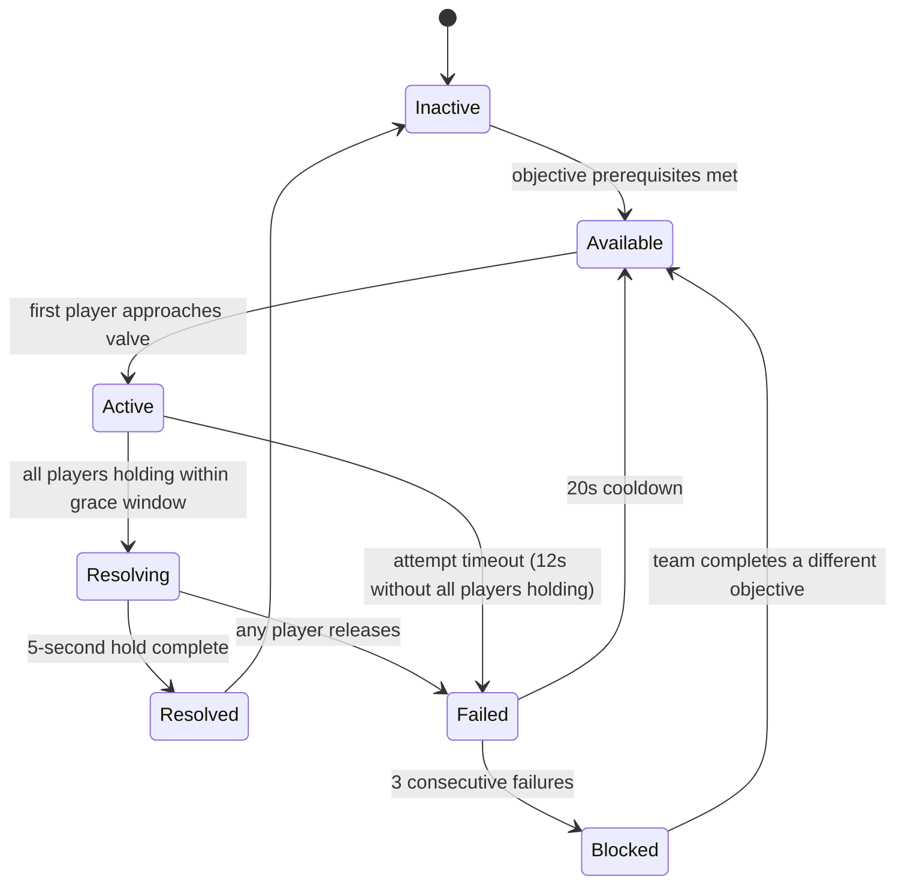

### Puzzle Layout
- One valve station per player, distributed across 2–3 connected maintenance rooms.
- Valve stations are visible in all player realities identically (no asymmetry on the valves themselves).
- The pressure gauge is attached to one valve station only. Its location is randomized from a pool of 3 possible valve stations per session.
- The gauge is only readable when a player is within 1.5 meters of it; it cannot be read from across the room.
- Valves are large physical levers. Holding requires sustained button input, not a single press.

### Interaction Rules

- Hold input must be sustained. Releasing the button ends the contribution.
- The 1.5-second grace window for "all holding" is server-validated. The Host checks that all `PlayerInteract` states are active within the window.
- A player moving more than 3 meters from their valve while holding breaks their hold. The valve resets.
- The creature's proximity during Resolving does not automatically cancel the puzzle. Players may choose to release. This is an intentional design decision — the team must decide whether to hold through a scare or abandon the attempt.

### Success Conditions
- All present players hold their valve interact for 5 consecutive server-validated seconds.
- Host confirms `AllValvesHeld == true` for duration of countdown.
- Objective system receives `PuzzleResolved` event.
- MAINTENANCE OVERRIDE panel switches to `COOLANT STABLE`. Valves lock open permanently.

### Failure Conditions
- Any player releases their valve before the gauge reaches 0.
- A player moves more than 3 meters from their valve during hold.
- The attempt times out (no valid "all holding" state reached within 12 seconds of first player holding).

### FailureSeverityTier
`Moderate` — reports +2.25 to Noise meter on `OnFailure`. Valve pressure spike causes audible venting sound (+0.40/tick for the 3 seconds of sound, treated as loud interaction noise). Designer note: the combined Noise cost of a failed attempt followed by the sound effect can push a team from Calm to Tense in a single bad attempt; this is intentional.

### Pressure Events

| Event | Contribution | Source |
|---|---|---|
| Puzzle failure | +2.25 N (instant) | `FailureSeverityTier: Moderate` |
| Valve hold noise during Resolving | +0.40 N/tick while all valves active | Treated as loud sustained action |
| Unresolved gauge location (first 20s) | +1.00 U (once) | RequiredObservation: gauge station identity |

### Networking Ownership

- Puzzle state authority: Host.
- Each `PlayerValveHold` is an RPC from client to Host. Host validates position and hold state.
- `AllValvesHeld` is computed server-side. Clients receive replicated state but do not compute the condition.
- The 5-second countdown runs on Host. Countdown value is replicated to the Gauge Reader's valve station display only (not to all clients).
- If two clients send `PlayerValveHold` events in the same tick, Host processes both before evaluating `AllValvesHeld`.

### Late Join Behaviour
A player joining during an Active or Resolving state is not assigned a valve — the attempt in progress uses the valve count established when the puzzle entered Active. The late joiner receives a spectator-only view of the puzzle state and can participate only in the next attempt. Designer note: if the late joiner's absence means the puzzle requires more players than are currently active, the valve count should have been set at Available entry and remain fixed. Do not reassign valve count mid-session.

### Host Migration Behaviour
If Host migrates during Resolving, the incoming Host is initialized from the last acknowledged `PressureSnapshot` and the most recent puzzle state snapshot. The 5-second countdown is reset to 5 (the attempt fails cleanly). Do not attempt to resume a partial countdown after migration; the cost of a clean retry is lower than the risk of desync from an estimated countdown position.

### Save Behaviour
- Persisted: `PuzzleState` (Inactive / Available / Active / Resolved / Blocked), Blocked state flag, failure count, cooldown timer.
- Not persisted: current hold state, partial countdown value, which valve is the gauge station (re-randomized on resume if not yet Resolved).

### Replication Requirements
- `PuzzleState` replicated to all clients.
- `PlayerValveHoldState[playerId]` replicated per player so each player's valve indicator shows their teammates' hold status.
- Countdown value replicated only to the client occupying the gauge station valve. Not broadcast to others; the Gauge Reader's verbal call is the intended delivery mechanism.
- Failure event replicated to all clients to trigger venting sound and feedback.

### Analytics Events
- `PuzzleAttempted { puzzleId: "PZL-001", playerCount, gaugeReaderId, timestamp }`
- `PuzzleResolved { puzzleId: "PZL-001", solveTimeSeconds, attemptCount, timestamp }`
- `PuzzleFailed { puzzleId: "PZL-001", failureReason: "PlayerReleased"|"Timeout"|"PlayerMoved", releasePlayerId, timestamp }`
- `ValveHoldAbandoned { puzzleId: "PZL-001", secondsIntoHold, abandoningPlayerId, timestamp }` — tracks how close teams get before failing, informs countdown tuning.

### Accessibility Notes
- Valve hold requires sustained button input. Offer a "toggle hold" accessibility option: first press begins hold, second press cancels. Server evaluates toggle state identically to button-hold state.
- Gauge countdown must be readable without color discrimination. Use a numeric counter and a fill indicator, not color alone.
- Gauge audio cue (beep every second of countdown) assists players with low-visibility situations.
- Valve stations must be reachable by players using accessibility movement speeds without requiring a sprint.

### Edge Cases
- **Player disconnects during Resolving**: disconnect handling per 07 Puzzle Framework §Disconnect Handling. The attempt fails immediately. Valve count is not recalculated; the remaining players must re-attempt with the disconnected player's valve either locked open (bypass mode, activated by Host if player count drops below minimum) or the puzzle downgrades to Blocked until a replacement joins.
- **Creature enters maintenance section during hold**: players may choose to release. The game does not force a release; this tension is intentional.
- **Gauge Reader is the last player to reach their valve**: gauge is still only readable by proximity. Gauge Reader must be at the valve. If no player reaches the gauge valve before others begin holding, the Gauge Reader must communicate a self-timed count verbally.
- **All players hold but one arrives 0.1s after the grace window**: grace window is 1.5 seconds, not a frame. This should not happen under normal latency. If it does, the attempt fails cleanly and the team retries.

### Exploit Prevention
- Server validates all hold states. Clients cannot self-report a resolved state.
- Players must be within 3 meters of their valve when the Host evaluates `AllValvesHeld`. Position is server-checked.
- The countdown only advances when `AllValvesHeld == true` on the server. Clients cannot locally predict resolution.

### Balancing Notes
- 5-second hold duration is the baseline. Reduce to 4 for lower difficulty presets; increase to 7 for higher.
- Grace window of 1.5 seconds is intentionally generous for network variance. Tighten to 1.0 only if playtests show that teams are waiting too long to commit once the "go" call is made.
- The puzzle should be encounteered first in a low-pressure state (Band: Calm) to allow teams to learn the mechanic. Reserve a later encounter in a Critical-band facility state for the high-pressure version.

### QA Checklist
- [ ] Puzzle resolves correctly with 2 players (2 valves), 3 players (3 valves), and 4 players (4 valves).
- [ ] Releasing one player's hold at second 4.9 causes failure and resets correctly.
- [ ] Gauge station assignment is randomized across 3 locations per session.
- [ ] Gauge countdown is not visible to non-gauge-station players from any distance.
- [ ] Late joiner cannot interfere with an in-progress attempt.
- [ ] Host migration during Resolving causes clean fail-and-retry, not a soft lock.
- [ ] Toggle-hold accessibility option functions identically to button-hold in server validation.
- [ ] Valve hold noise contributes +0.40/tick to N during Resolving.
- [ ] Three consecutive failures enter Blocked state correctly.
- [ ] Blocked state clears after team completes any other active objective.
- [ ] Puzzle preserves communication-first identity: a team that communicates clearly solves in one attempt.

### Developer Notes
- Valve count is set when the puzzle enters Available state and must not change during a session, even if player count changes.
- The gauge display is a separate `NetworkBehaviour` with a `[Networked]` property visible only to the occupying client. Do not broadcast countdown to all.
- Sound design note: the venting failure sound should be loud enough to plausibly attract the creature (supporting the Noise contribution), but short enough (3 seconds) that it doesn't permanently disadvantage the team.

### Future Variants
- **Staggered Release**: instead of all holding simultaneously, each player releases their valve in a specific sequence. Sequence order is distributed across player realities.
- **Partial Pressure**: not all valves need to be held — the team must determine which subset based on distributed pressure readings. Introduces resource negotiation on top of the timing challenge.
- **Moving Gauge**: the gauge station relocates after each failed attempt.

---

## PZL-002: Convergent Fault

### Puzzle ID
`PZL-002`

### Puzzle Name
Convergent Fault

### Purpose
Force the team to synthesize distributed numerical readings into a combined conclusion that no individual player can reach alone. The defining moment is the realization that individually alarming values cancel each other out — or that innocuous-looking values combine into a critical state.

### Narrative Context
A facility sub-system is producing fault readings across its distributed sensors. Each sensor is routed to a specific monitoring terminal. The sensors do not display a unified status — each shows only a local delta value. The team must determine the net system state from their combined readings to select the correct stabilization protocol. Applying the wrong protocol causes an overcorrection that damages the sub-system.

### Player Count
2–4. With 2 players, each player monitors 2 terminals. With 3 or 4 players, each player monitors 1–2 terminals. Terminal count is always 4, regardless of player count.

### Difficulty
`Diff = 4.5`

| Term | Score | Rationale |
|---|---|---|
| $C_d$ | 2.0 | Sustained back-and-forth synthesis; no simultaneous action required |
| $I_d$ | 2.5 | Net system state must be inferred from partial data; no player sees total |
| $T_d$ | 0 | No timer; designed as a deliberative puzzle |
| $F_d$ | 0 | Minor failure consequence |

### Estimated Solve Time
60–120 seconds. A team comfortable with addition and communication resolves quickly. Teams that second-guess readings or struggle to describe values clearly may require 2–3 attempts.

### Required Communication Pattern
**Information synthesis.** Each terminal shows a signed delta value (positive or negative integer, range −9 to +9). Players must verbally share their readings and compute the sum. The net value maps to one of five stabilization protocols displayed on a central Protocol Selection panel. No single player can see both the full set of terminal readings and the protocol table — the Protocol Selection panel is in a separate room from most terminals. The communication challenge is arithmetic under social pressure: once the team agrees on a net value, one player must select the protocol before the others second-guess them.

### Gameplay Flow

1. An alert activates a fault display on a sub-system monitoring station. The station lists 4 sensor IDs by room location.
2. Players locate terminals. Each terminal displays a blinking signed integer (for example, `−3`, `+7`, `+2`, `−5`).
3. Players read their terminal values aloud. One player stands at the Protocol Selection panel and records the spoken values.
4. Players sum the values together and identify the net result: `NET = sum of all four terminal readings`.
5. The Protocol Selection panel shows 5 protocols mapped to net value ranges:
   - Protocol A: NET ≤ −10
   - Protocol B: NET −9 to −1
   - Protocol C: NET 0
   - Protocol D: NET +1 to +9
   - Protocol E: NET ≥ +10
6. The player at the Protocol Selection panel selects the correct protocol.
7. If correct, the sub-system stabilizes. If incorrect, an overcorrection event triggers and the values shuffle.

### State Machine

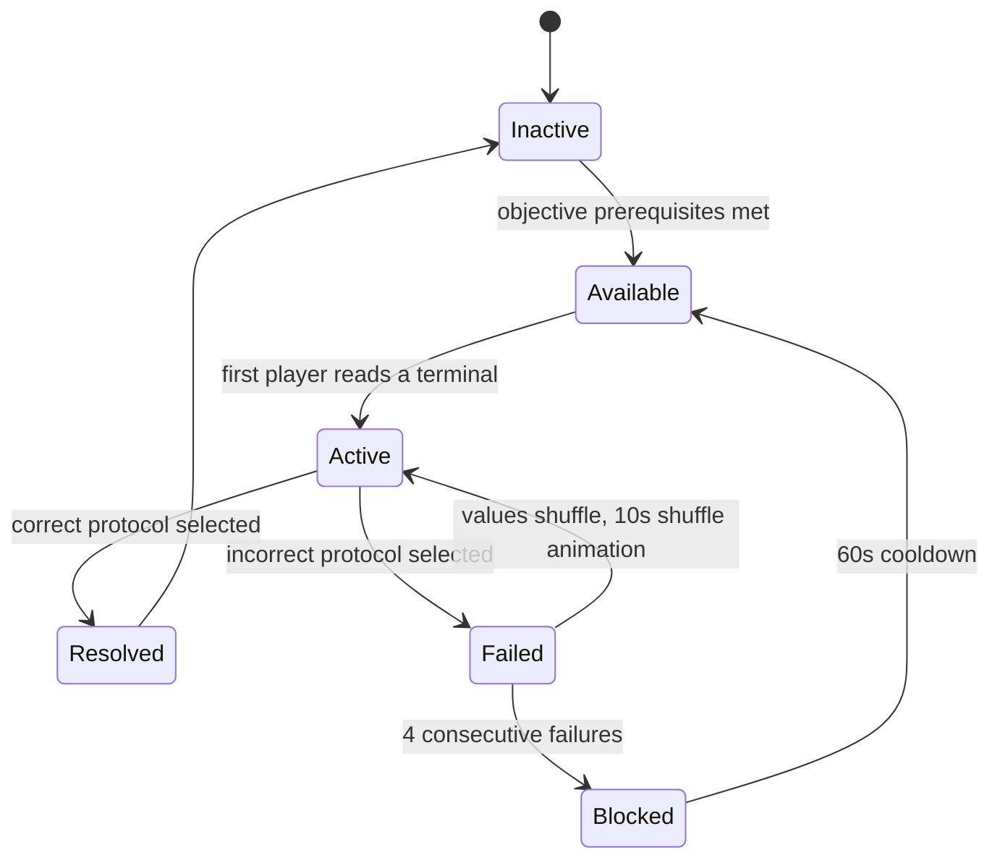

### Puzzle Layout
- 4 sensor terminals distributed across 2–3 connected rooms. At least 2 terminals are not in the same room.
- Protocol Selection panel in a separate room or at a minimum 10 meters from the nearest terminal. The player at the panel cannot see any terminal from their position.
- Terminal values are visible from 2 meters away. They are not readable from across a room.
- Asymmetric reality note: terminal display labels (the sensor descriptions) may vary per player reality — Player A sees "Thermal Sensor 4" where Player B sees "Pressure Node 4" — but the numeric delta values are identical in all realities. The asymmetry creates naming confusion, not value divergence. This is intentional: the puzzle tests number communication under naming ambiguity.

### Interaction Rules
- Terminals display their value passively; no interaction is required to read them.
- Terminals flash their value every 3 seconds and hold it for 2 seconds. Players must pay attention, but the flash rate is not a significant time constraint.
- Protocol Selection requires a single button press. No hold time required.
- Players may re-read terminals as many times as needed before selecting a protocol.
- Terminal values are fixed for the duration of an Active state. On failure, values shuffle to a new valid configuration.

### Success Conditions
- Player selects the protocol matching the correct NET value range.
- Host validates selection against server-authoritative terminal values.
- Sub-system monitoring station shows `FAULT CLEARED`. Protocol Selection panel locks.

### Failure Conditions
- Player selects a protocol that does not match the net value range.
- Note: there is no time limit failure mode for this puzzle. It cannot fail by inaction alone.

### FailureSeverityTier
`Minor` — reports +1.50 to Noise meter on `OnFailure`. The overcorrection event produces a brief alarm sound.

### Pressure Events

| Event | Contribution | Source |
|---|---|---|
| Puzzle failure | +1.50 N (instant) | `FailureSeverityTier: Minor` |
| Terminal values unshared after 20s | +1.00 U (once, per unshared terminal) | RequiredObservation per terminal reading |

### Networking Ownership
- Puzzle state authority: Host. Terminal values are generated server-side at puzzle activation and stored in authoritative state.
- Protocol selection is an RPC. Host validates against stored terminal values.
- Terminal display values are replicated to all clients.
- On failure, Host generates a new value set and replicates to all clients simultaneously.

### Late Join Behaviour
Late joiner receives the current terminal values and active state. If the team is mid-discussion, the late joiner can immediately read their assigned terminal and contribute. No progress is lost.

### Host Migration Behaviour
Incoming Host receives terminal values from the most recent puzzle state snapshot. Values are not re-randomized on migration. If migration occurs during a shuffle (post-failure animation), the incoming Host completes the shuffle with the new values that were already committed to the snapshot.

### Save Behaviour
- Persisted: `PuzzleState`, current terminal values (if Active), failure count, Blocked state.
- Not persisted: player positions, current verbal discussion progress.

### Replication Requirements
- `TerminalValue[terminalId]` replicated to all clients.
- `PuzzleState` replicated to all clients.
- Protocol selection result (success or failure) replicated with a brief confirmation animation trigger.

### Analytics Events
- `PuzzleAttempted { puzzleId: "PZL-002", playerCount, terminalValues[], timestamp }`
- `PuzzleResolved { puzzleId: "PZL-002", solveTimeSeconds, attemptCount, selectedProtocol, timestamp }`
- `PuzzleFailed { puzzleId: "PZL-002", selectedProtocol, correctProtocol, netValueReported, netValueActual, timestamp }` — `netValueReported` vs `netValueActual` tracks arithmetic errors vs. communication errors separately.

### Accessibility Notes
- Terminal values must be large, high-contrast numerals. Minimum 72pt equivalent in world space.
- Signed values must clearly distinguish + and − at distance. Use color (green/red) plus symbol, not symbol alone.
- Protocol Selection panel must describe ranges in words as well as numbers for players who struggle with signed arithmetic.
- Consider offering an optional "tally mode" accessibility UI that lets players enter each terminal value they hear, with the UI computing the sum. This removes arithmetic burden without removing communication burden.

### Edge Cases
- **Two players misread the same terminal**: the terminal values are fixed and visible. Misreads are a player error, not a system fault. The retry mechanism allows correction.
- **All four terminals are in a player's personal reality but they disconnect**: remaining players cover each other's terminals. If player count drops to 1, the puzzle enters Blocked (insufficient players to read all terminals without unreasonable solo traversal).
- **Net value of exactly 0 on Protocol C**: this edge case should appear in the value generation pool. Confirming "the answer is zero" is its own communication challenge — players tend to distrust a zero sum.
- **Naming divergence causes misidentification**: if two players call the same terminal by different names (per asymmetric reality labels), they may double-report one terminal and miss another. The system does not catch this; it is an intentional communication failure mode. The team will discover the error when the protocol selection fails and the values haven't changed.

### Exploit Prevention
- Protocol selection is server-validated. Clients cannot self-report success.
- Terminal values are stored server-side. Clients receive display-only values; the server does not trust client-reported sums.
- A player cannot select a protocol from outside the Protocol Selection room; interaction range is enforced server-side (3-meter radius).

### Balancing Notes
- Value range −9 to +9 per terminal keeps sums within a range teams can compute verbally without written math.
- Do not generate configurations where all four terminals are positive or all are negative — this removes the synthesis challenge (a team that just adds positives and picks Protocol E is not synthesizing). Require at least one sign change in every configuration.
- Introduce "near-miss" configurations where the net is −1 or +1 specifically to catch teams that estimate instead of relay exactly.
- Four consecutive failure protection (Blocked) exists because this puzzle has no time pressure; without it, a stubborn team could cycle indefinitely.

### QA Checklist
- [ ] Terminal values sum correctly to the net value used for protocol validation.
- [ ] Protocol C (NET = 0) appears in the configuration pool and validates correctly.
- [ ] Failure shuffles all four terminal values simultaneously.
- [ ] Asymmetric reality name labels differ per player while numeric values remain identical.
- [ ] Protocol Selection interaction range is enforced server-side.
- [ ] Four consecutive failures enter Blocked state.
- [ ] Blocked clears after 60-second cooldown.
- [ ] Tally mode accessibility UI computes correct sums without revealing values to non-using players.
- [ ] Puzzle works correctly when a 2-player team monitors 2 terminals each.
- [ ] Unshared terminal readings after 20 seconds correctly contribute to U meter.

### Developer Notes
- Value generation must produce configurations with at least one sign change. Reject all-positive and all-negative sets at generation time.
- Terminal flash rate (3 seconds hidden, 2 seconds visible) prevents a player from simply staring at a terminal and always reading it; they must be present when it flashes. If this creates frustration in playtest, increase the visible hold time to 3 seconds before tuning anything else.
- The protocol table on the Selection panel is static across all sessions (same five ranges, same five protocol names). Only the terminal values change. This allows players to memorize the protocol structure over repeat sessions, which is intentional — the replayability comes from the values, not the protocol system.

### Future Variants
- **Weighted Terminals**: terminals have multipliers (×1, ×2, ×0.5) visible only to the player standing at that terminal. Verbal math becomes harder.
- **Drifting Values**: terminal values slowly drift over time, requiring the team to call values quickly before they change.
- **Contradictory Terminal**: one terminal is faulty and displaying a false value. The team must identify and exclude it before summing.

---

## PZL-003: Consent Lock

### Puzzle ID
`PZL-003`

### Puzzle Name
Consent Lock

### Purpose
Test whether the team can reach unanimous physical commitment under asymmetric pressure information. The defining moment is the instant where players who cannot see the countdown must decide whether to hold or release based purely on what one teammate tells them.

### Narrative Context
A critical facility override requires a multi-party authorization handshake. Each connected terminal must register a sustained authorization signal simultaneously. The facility's protocol was designed to prevent any single operator from issuing an override — every connected station must commit before the authorization window closes. One terminal shows the authorization window countdown; the others do not. The window was designed this way to force coordination between operators who could not all be in the same room.

### Player Count
2–4. Authorization terminal count matches player count. All present players are required.

### Difficulty
`Diff = 7.5`

| Term | Score | Rationale |
|---|---|---|
| $C_d$ | 2.5 | Simultaneous authorization hold from all present players |
| $I_d$ | 1.0 | Only one player sees the authorization window countdown |
| $T_d$ | 2.0 | Meaningfully harder under Critical band; creature proximity during hold creates abort pressure |
| $F_d$ | 2.0 | Moderate failure consequence |

### Estimated Solve Time
90–180 seconds. Teams that pre-coordinate before committing resolve in one attempt. Teams that commit before everyone is in position fail and face a 45-second lockout per attempt.

### Required Communication Pattern
**Consensus with asymmetric information.** One player (the Authorization Holder) can see the 8-second window countdown. Other players must complete a prerequisite micro-task at their own terminal (a single-button press to "authenticate") before the Authorization Holder opens the window. The Authorization Holder cannot see whether other players have authenticated — they must ask. The team must reach verbal consensus on readiness before the Authorization Holder opens the window. Once the window opens, all players must hold their authorize button simultaneously. If the window expires without all players holding, the authorization fails. The holding player with the countdown sees time remaining; others hold until told to release.

### Gameplay Flow

1. Team discovers a MULTI-PARTY AUTHORIZATION console showing `OVERRIDE PENDING — REQUIRES ALL OPERATORS`.
2. Authorization terminals are distributed across connected rooms. One terminal has a countdown display panel; others show only `STANDBY`.
3. Each non-countdown terminal requires a one-time authentication keypress before the window can be opened. Authentication is not a hold; it is a single press that permanently unlocks that terminal for this attempt.
4. Players authenticate their terminals and verbally confirm readiness to the Authorization Holder.
5. Authorization Holder opens the window by pressing their terminal's activate button.
6. Countdown begins: 8 seconds visible only to the Authorization Holder.
7. All players must hold their authorize button simultaneously within a 2-second grace window of the countdown starting.
8. All players must hold for the full duration of the countdown (8 seconds).
9. If all players hold for 8 seconds without releasing, the override resolves.
10. If the window expires without all holding, or if any player releases, the attempt fails and a 45-second lockout begins.

### State Machine

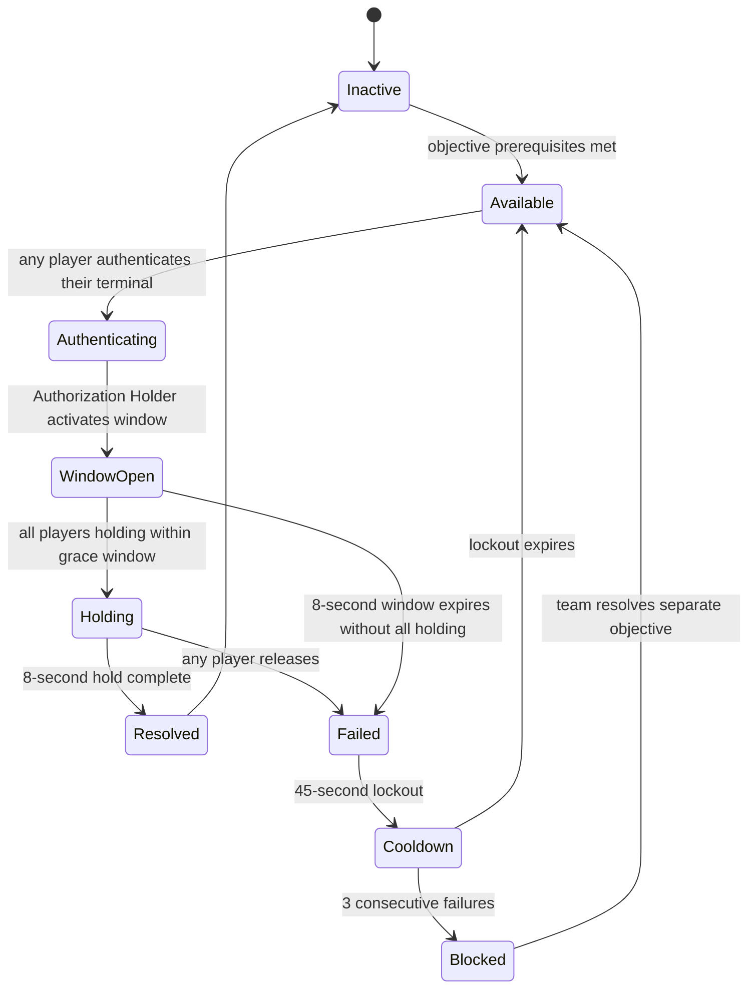

### Puzzle Layout
- One authorization terminal per player, distributed across 2–3 connected rooms.
- The countdown terminal is the one furthest from the MULTI-PARTY AUTHORIZATION console entry point. This placement ensures the Authorization Holder is usually not the first player to arrive.
- Countdown display is only visible from within 2 meters of the countdown terminal.
- Non-countdown terminals show `STANDBY` before authentication and `AUTH READY` after the one-time press.
- Terminals are visually identical; the countdown terminal is distinguished only by its display content.

### Interaction Rules
- Authentication (non-countdown terminals): single button press. Cannot be undone. Survives a failed attempt — players do not need to re-authenticate per attempt, only per session.
- Window activation (countdown terminal): single button press. Starts the 8-second countdown.
- Authorization hold: sustained button input at any authenticated terminal, including the countdown terminal. The Authorization Holder both sees the countdown and must hold.
- Moving more than 3 meters from a terminal during hold breaks that player's authorization.
- The creature's proximity does not mechanically cancel the hold. Players may voluntarily release.

### Success Conditions
- All present players hold their authorized terminal for 8 consecutive server-validated seconds after window activation.
- Host confirms `AllTerminalsHeld == true` for the full 8-second window.
- Override console shows `AUTHORIZATION GRANTED`. Terminals unlock permanently.

### Failure Conditions
- The 8-second window expires before all players are holding.
- Any player releases their hold during the 8-second hold phase.
- A player moves more than 3 meters from their terminal during hold.

### FailureSeverityTier
`Moderate` — reports +2.25 to Noise meter on `OnFailure`. Lockout alarm plays for 5 seconds (+0.40/tick, counted as environment noise during alarm).

### Pressure Events

| Event | Contribution | Source |
|---|---|---|
| Puzzle failure | +2.25 N (instant) | `FailureSeverityTier: Moderate` |
| Lockout alarm (5 seconds) | +0.40 N/tick | Environmental sound during lockout |
| Unauthenticated terminal after 30s | +1.00 U (once, per terminal) | RequiredObservation: terminal authentication state |

### Networking Ownership
- Puzzle state authority: Host.
- Each `PlayerTerminalAuthenticate` and `PlayerTerminalHold` event is an RPC from client to Host.
- Countdown is a Host-side timer replicated only to the countdown terminal's occupying client.
- `AllTerminalsHeld` is computed server-side.
- Lockout timer is replicated to all clients so all terminals show `LOCKOUT — XX SECONDS`.

### Late Join Behaviour
A player joining during Authenticating receives the current authentication state of all terminals. If their terminal is unoccupied, they can authenticate and participate. If the session is in WindowOpen or Holding, the late joiner cannot participate in the current attempt. Their terminal is bypassed for the current attempt only (not for future attempts), and the server validates using only the terminals that were authenticated before window activation.

### Host Migration Behaviour
Incoming Host is initialized from the last snapshot. If migration occurs during Holding, the attempt fails cleanly (hold state cannot be guaranteed across migration). Lockout begins from the migration point. Authentication states (the one-time keypresses) are preserved in the snapshot and not lost on migration.

### Save Behaviour
- Persisted: `PuzzleState`, per-terminal authentication state (one-time presses survive save/load), failure count, Blocked state.
- Not persisted: current countdown value, in-progress hold state, lockout remaining time (if interrupted mid-lockout, lockout is not resumed — the team gets a clean start, which slightly benefits them but avoids an unfair restart penalty).

### Replication Requirements
- `TerminalAuthState[terminalId]` replicated to all clients.
- `PuzzleState` replicated to all clients.
- Countdown value replicated only to the countdown terminal occupant.
- Lockout remaining time replicated to all clients.
- Hold state per player replicated to all (so each terminal shows whether its assigned player is currently holding — visual feedback for the Authorization Holder).

### Analytics Events
- `PuzzleAttempted { puzzleId: "PZL-003", playerCount, windowOpenedAtSecond, timestamp }`
- `PuzzleResolved { puzzleId: "PZL-003", solveTimeSeconds, attemptCount, timestamp }`
- `PuzzleFailed { puzzleId: "PZL-003", failureReason: "WindowExpired"|"PlayerReleased"|"PlayerMoved", failingPlayerId, secondsIntoHold, timestamp }`
- `EarlyWindowOpen { puzzleId: "PZL-003", playersAuthenticated, totalRequired, timestamp }` — tracks how often Authorization Holders open the window before all players are ready.

### Accessibility Notes
- Hold requires sustained button input. Offer toggle-hold accessibility option (same server behavior).
- Countdown is audio-accompanied (beep at each second) for the Authorization Holder.
- Non-countdown terminals must display something (not silence) so players who cannot see the countdown still have sensory feedback that time is passing. Use a flashing indicator light.
- Lockout alarm must not be exclusively audio for players with hearing impairments — use a screen pulse or controller vibration pattern.

### Edge Cases
- **Authorization Holder opens window before all players authenticate**: the window opens, but unauthentic players cannot hold. Window likely expires. This is a player error, not a system fault — the system should allow it so teams can learn the penalty.
- **Player authenticates then immediately moves away from terminal**: authentication persists. The player must return to their terminal to hold.
- **All players authenticated and holding except the Authorization Holder who forgot to hold**: the Authorization Holder must both start the window and hold. If they activate and then fail to hold, the attempt fails as soon as the grace window passes.
- **Creature enters the authorization room mid-hold**: players may release. This is an intentional tension point. If the Authorization Holder releases and others don't, the attempt fails even if others continue holding.

### Exploit Prevention
- Server validates all hold states and terminal positions.
- Authentication state is server-authoritative; clients cannot self-report authenticated status.
- Window activation is only permitted when the activating player is within 3 meters of the countdown terminal.
- Countdown timer runs exclusively on Host. Clients cannot predict or report resolution.

### Balancing Notes
- 8-second hold is shorter than PZL-001's valve hold because the authorization window creates an additional coordination layer (authentication + window timing + hold). The cognitive load is higher even if the physical hold is shorter.
- 45-second lockout per failure is intentionally steep. This puzzle should not be attempted until the team has verbally confirmed readiness. The lockout trains cautious coordination.
- Do not reduce the lockout below 30 seconds — shorter lockouts encourage impulsive retries rather than deliberate communication.

### QA Checklist
- [ ] Countdown is visible only from within 2 meters of the countdown terminal.
- [ ] Authentication persists across failed attempts within the same session.
- [ ] Authentication is reset on session resume from save (must re-authenticate on load).
- [ ] Window expiry before all players hold triggers correct failure and lockout.
- [ ] All players holding within 2-second grace window registers as a valid hold start.
- [ ] Toggle-hold accessibility option works identically to button-hold server-side.
- [ ] Lockout timer visible on all terminal displays.
- [ ] 3 consecutive failures enter Blocked state.
- [ ] Late joiner's terminal is correctly bypassed for an in-progress attempt.
- [ ] Puzzle works with 2, 3, and 4 players.
- [ ] Communication-first identity preserved: a team that communicates clearly before committing resolves in one attempt.

### Developer Notes
- The Authorization Holder is not formally designated. The player who reaches the countdown terminal first holds that role by default. Design the room so that the countdown terminal is naturally the last to be reached by normal flow, not the first — this prevents one player from unilaterally taking the role before the team has discussed.
- Consider adding a brief `WINDOW ACTIVATING — CONFIRM READINESS` UI prompt on all terminals when the Authorization Holder presses the window button, with a 2-second delay before the countdown actually begins. This gives the team a last-moment abort option. This is a balancing call for playtest.

### Future Variants
- **Rotating Authority**: the countdown terminal changes each attempt. The team must coordinate who goes to which terminal.
- **Silent Window**: the countdown is not audio-accompanied. The Authorization Holder must count internally and relay to the team.
- **Partial Override**: the system resolves if 3 of 4 players hold successfully, but the missing authorization applies a minor penalty. Tests negotiation: who is permitted to skip.

---

## PZL-004: Power Allocation

### Puzzle ID
`PZL-004`

### Puzzle Name
Power Allocation

### Purpose
Force the team to negotiate a shared resource distribution where no individual player has full visibility of the system's needs. The defining moment is the realization that someone's critical system must go offline to prevent total failure — and that the team must decide together who accepts the cost.

### Narrative Context
The facility's emergency power bus has been damaged. The bus can only supply a fixed budget of 12 power units across its connected systems. The systems collectively demand more than 12 units. Players must negotiate which systems stay online and which are shut down to prevent a cascade failure. Shutting down a system causes a local hazard for players near that system. No single player can see all system demands; each player's terminal shows only a subset of the bus connections.

### Player Count
2–4. Each player sees a different subset of system demands. With 2 players, each sees 2 of 4 systems. With 3 players, one player sees 2 systems, two players see 1 system each. With 4 players, each player sees 1 system.

### Difficulty
`Diff = 7.0`

| Term | Score | Rationale |
|---|---|---|
| $C_d$ | 2.0 | Sustained negotiation; no simultaneous action required, but all perspectives must be voiced |
| $I_d$ | 2.0 | Multiple pieces of demand information split across players; no inference required, just synthesis |
| $T_d$ | 1.0 | No hard timer; mild urgency from Delay meter if team stalls |
| $F_d$ | 2.0 | Moderate failure consequence |

### Estimated Solve Time
120–240 seconds. First encounter with this puzzle tends to be slow while teams understand the budget constraint. Replay encounters are significantly faster.

### Required Communication Pattern
**Resource allocation through negotiation.** Players must share their system demands verbally. The total demand always exceeds the budget by a fixed amount (6–8 units above the 12-unit cap). The team must collectively decide which systems to depower. Depowering a system causes a local hazard for whoever is nearest it — meaning the negotiation involves not just numbers, but also which player is willing to accept a hazard in their immediate area.

### Gameplay Flow

1. A POWER BUS CRITICAL alert activates on a central Power Management Terminal showing total current draw and the 12-unit budget cap.
2. Players locate their assigned Power Management Terminals. Each terminal lists 1–2 system names and their current power demands.
3. Players verbally share their system demands. The team sums the total demand and calculates the excess (always exceeds 12 units).
4. Players negotiate which systems to depower. Each system's status (online/offline) is visible on the central terminal only. Individual terminals show only the systems assigned to that terminal.
5. One player must reach the central terminal and toggle the target systems offline to bring total draw within 12 units.
6. The team has 3 toggles maximum per attempt — toggling a system offline and then back online counts as 2 toggles. Exceeding 3 toggles causes an overcurrent event and the puzzle fails.
7. If total draw is brought within budget with 3 or fewer toggles, the puzzle resolves.

### State Machine

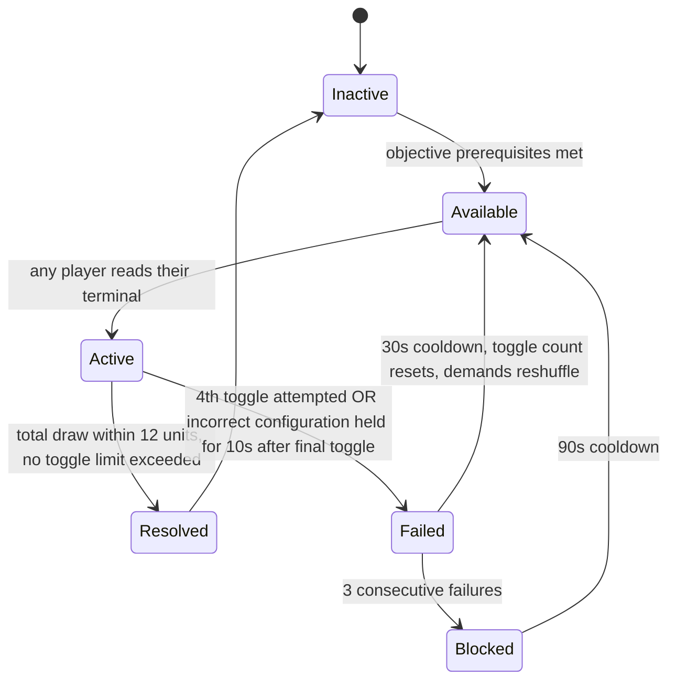

### Puzzle Layout
- 4 system demand terminals distributed across connected rooms. Each is a small wall-mounted panel showing system name(s) and demand values.
- One central Power Management Terminal in a hub room. Central terminal shows total draw, budget (12), and toggle controls for all 4 systems. Central terminal does not show individual system demands — only their current state (online/offline) and their contribution to total draw.
- Asymmetric reality note: system names may differ per player reality (Player A sees "HVAC Core," Player B sees "Atmospheric Recycler" for the same system). Demand values are identical in all realities. The naming divergence is intentional — it creates negotiation friction when players refer to "the HVAC" and "the recycler" as if they are different systems.
- Hazard zones: each system has an associated area in the facility. Depowering that system activates a local hazard (darkness, locked door, audio distortion) in its zone for the remainder of the session. Players must factor hazard locations into their negotiation.

### Interaction Rules
- Individual terminals: passive display only. No interaction required to read.
- Central terminal: toggle interaction for each system (press to toggle online/offline). Toggle is a non-hold single press.
- Toggle limit: 3 toggles per attempt. Counter displayed on central terminal.
- A player at an individual terminal cannot access the central terminal from there. They must physically move.
- Hazards from depowered systems activate 5 seconds after the system is toggled offline on the central terminal. Players can see a countdown for their system's hazard on their individual terminal.

### Success Conditions
- Total system draw ≤ 12 units on the central terminal.
- No more than 3 toggles used.
- Configuration held for 5 seconds without further toggles (stabilization window).
- Host confirms `TotalDraw <= BudgetCap && TogglesUsed <= 3`.

### Failure Conditions
- Player attempts a 4th toggle.
- Configuration is held for more than 10 seconds after the 3rd toggle but total draw still exceeds 12 units.
- Note: there is no time-based failure before the first toggle; the Delay meter applies if the team is genuinely stalling, but the puzzle does not fail on its own timer until after the 3rd toggle.

### FailureSeverityTier
`Moderate` — reports +2.25 to Noise meter on `OnFailure`. Overcurrent event causes a loud electrical discharge (instant +1.00 to Noise as a hazard trigger in addition to the failure tier contribution).

### Pressure Events

| Event | Contribution | Source |
|---|---|---|
| Puzzle failure | +2.25 N (instant) | `FailureSeverityTier: Moderate` |
| Overcurrent discharge | +1.00 N (instant, additional) | Environmental hazard trigger |
| Unshared demand readings after 20s | +1.00 U (once, per unshared terminal) | RequiredObservation per terminal |
| Team stalls without any toggle | `D` accumulation per standard rules | 09 Objective System delay clock |

### Networking Ownership
- Puzzle state authority: Host.
- System demand values are generated server-side at puzzle activation.
- Toggle events are RPCs from client to Host. Host validates toggle count before applying.
- Central terminal state (all system online/offline flags, total draw, toggle count) is replicated to all clients.
- Individual terminal displays are replicated to all clients (not hidden — players can see each other's terminals if they walk to them, but the information is only available if they go there).

### Late Join Behaviour
Late joiner receives current puzzle state including system demands and toggle count. If the puzzle is Active, they can immediately proceed to any unoccupied terminal and contribute. If the puzzle is in Resolved state, the depowered system hazards remain active and are communicated to the late joiner via the central terminal's status display.

### Host Migration Behaviour
All authoritative state (demand values, toggle count, current system states) is in the snapshot. Incoming Host initializes from snapshot. In-flight toggle RPCs that were not acknowledged before migration are considered lost — the toggle does not apply. The client will need to re-issue the toggle if they still want it applied.

### Save Behaviour
- Persisted: `PuzzleState`, system online/offline configuration (hazards activated from depowered systems persist across save/load — depowering decisions are permanent), failure count.
- Not persisted: verbal discussion, current toggle count for an in-progress attempt (resets to 0 on load if not Resolved).

### Replication Requirements
- `SystemDemand[systemId]` replicated to all clients.
- `SystemOnlineState[systemId]` replicated to all clients.
- `TotalDraw` replicated to all clients (central terminal display).
- `TogglesUsed` replicated to all clients (central terminal display).
- Hazard activation events replicated to all clients.

### Analytics Events
- `PuzzleAttempted { puzzleId: "PZL-004", playerCount, totalDemand, budgetCap, timestamp }`
- `PuzzleResolved { puzzleId: "PZL-004", solveTimeSeconds, togglesUsed, depoweredSystems[], timestamp }`
- `PuzzleFailed { puzzleId: "PZL-004", failureReason: "TogglesExceeded"|"HeldOverBudget", togglingPlayerId, timestamp }`
- `SystemToggled { puzzleId: "PZL-004", systemId, newState: "Online"|"Offline", toggleNumber, playerId, timestamp }` — tracks negotiation patterns across sessions.

### Accessibility Notes
- Demand values and budget must be displayed as numbers with high contrast, not as bar graphs alone.
- Toggle limit counter must be visible from 3 meters away on the central terminal.
- Hazard countdowns on individual terminals must be audio-accompanied (beeps) to alert players who may not be watching their terminal.
- Consider a "budget summary" UI that shows a running total as the team negotiates, without requiring them to do mental math. This reduces arithmetic burden without reducing negotiation burden.

### Edge Cases
- **Multiple valid solutions exist**: the puzzle does not enforce a specific solution. Any configuration that meets the budget within 3 toggles is accepted. This is intentional — teams can find different answers depending on which hazards they prefer to accept.
- **Team toggles offline the same system twice (back to online)**: that's 2 of their 3 toggles spent on no net change. Server tracks this. The team must work within their remaining toggles.
- **Player at central terminal toggles without team consensus**: the toggle is irreversible for the remaining attempt. This is an intentional social trust failure mode — it creates pressure for the team to agree before anyone touches the central terminal.
- **Hazard from depowered system blocks another puzzle**: level design must not place a subsequent puzzle in the hazard zone of this puzzle's systems without accounting for the blocked state. Flag in QA.

### Exploit Prevention
- Toggle count is server-validated. Clients cannot circumvent the 3-toggle limit.
- System demand values are server-generated and server-stored. Clients cannot inspect or modify them directly.
- Stabilization 5-second window prevents rapid toggle cycling (toggling offline then online then offline counts as 3 toggles before any stabilization occurs).

### Balancing Notes
- Total demand should always exceed 12 by 6–8 units. Smaller excess makes the puzzle too easy (always one obvious system to remove). Larger excess forces 3+ systems offline and may create too many simultaneous hazards.
- System demand values should include at least one system that looks expensive but is affordable and one that looks cheap but combined with others creates the problem. This creates a "aha" moment in synthesis.
- Never generate a configuration where only one solution exists (exactly one system removal brings the budget to ≤12). Always ensure at least two valid toggle configurations — this preserves the negotiation identity.

### QA Checklist
- [ ] Total demand always exceeds 12 by 6–8 units. No underdraft configurations generated.
- [ ] At least two valid solutions exist per generated configuration.
- [ ] 4th toggle attempt is blocked server-side.
- [ ] Stabilization window (5 seconds, no further toggles, ≤12 draw) triggers resolution correctly.
- [ ] System names differ by player reality while demand values remain identical.
- [ ] Hazard activates 5 seconds after system is toggled offline.
- [ ] Depowered system hazards persist through save/load.
- [ ] Hazard zone from this puzzle does not block access to required puzzles (flag if found in level QA).
- [ ] Toggle count resets on retry after failure.
- [ ] Puzzle works with 2, 3, and 4 players (different terminal distribution rules).
- [ ] Budget summary accessibility UI shows correct running total.

### Developer Notes
- The 3-toggle limit is the critical design constraint. Without it, teams solve by brute force. With it, teams must discuss before acting. Enforce it aggressively.
- System names are defined in a localization table that includes per-player-reality variants. The same underlying `systemId` may have 2–3 name variants in the table; which one a player sees is determined by their reality layer. The central terminal always uses a canonical name (visible to all) to reduce ambiguity at the point of action.
- Hazard implementation is system-specific. "HVAC offline" → lights flicker in zone. "Pressure offline" → doors lock in zone. These are authored per system in the facility design, not defined here.

### Future Variants
- **Dynamic Demand**: system demands drift slowly over time. The team must act before the current configuration they agreed on is no longer accurate.
- **Cascading Dependency**: some systems depend on others. Disabling system A also reduces system B's demand. Dependency tree must be verbally communicated.
- **Contested Priority**: one player's terminal shows a system as CRITICAL (must stay on), while another player's terminal shows the same system as REDUNDANT (safe to disable). Whose information is correct?

---

## PZL-005: Delayed Mirror

### Puzzle ID
`PZL-005`

### Puzzle Name
Delayed Mirror

### Purpose
Force the team to act on temporally displaced information. One player interprets the past; others act in the present. The defining moment is the uncertainty of inference — the Mirror Reader's confidence in their prediction determines whether the team moves safely or walks into danger.

### Narrative Context
A security monitoring array was damaged during the containment breach. Its display feed is functional but delayed by 20 seconds. One player has access to a mirror display room that shows a 20-second-old recording of the creature's position across the facility. Other players cannot see the creature directly and must rely on the Mirror Reader's interpretation of where the creature is now based on where it was then. The mirror feed is not a clue — it is a liability. The team is committed to a route they cannot safely verify until it is too late to change course.

### Player Count
2–4. One player occupies the Mirror Display Room (the Mirror Reader). 1–3 players are in the facility and reliant on the Mirror Reader's predictions.

### Difficulty
`Diff = 9.0`

| Term | Score | Rationale |
|---|---|---|
| $C_d$ | 2.0 | Sustained back-and-forth; Mirror Reader continuously provides predictions while field players act |
| $I_d$ | 2.5 | Information must be inferred — past position must be translated to current risk |
| $T_d$ | 2.0 | Meaningfully harder under Critical band; creature is actively threatening during mirror-guided navigation |
| $F_d$ | 2.5 | Severe failure consequence |

### Estimated Solve Time
180–360 seconds. High variance. Teams with a confident Mirror Reader resolve in 3 minutes. Teams with an uncertain Mirror Reader stall and accumulate Delay and Threat.

### Required Communication Pattern
**Trust under temporal uncertainty.** The Mirror Reader watches a 20-second-old feed and translates it into predictions: "Based on where it was near the east corridor 20 seconds ago moving toward the cooling tanks, it should be past the tanks now — you have a window to cross the corridor." Field players must decide whether to trust that inference and move. They have no independent verification mechanism. The Mirror Reader's uncertainty must be communicated explicitly — "I think it's clear" is not the same as "I know it's clear" — because field players will act on the distinction.

### Gameplay Flow

1. Team discovers the Mirror Display Room containing a bank of monitors showing the facility from 20 seconds ago.
2. One player volunteers or is designated as the Mirror Reader and enters the room. The Mirror Reader must stay in the Mirror Display Room for the puzzle duration — the door locks behind them (narrative lock, not a mechanical punishment, but it should be communicated clearly).
3. Field players must navigate from their current position to an Objective Terminal in a room that requires passing through 2–3 creature patrol zones.
4. The Mirror Reader watches the feed and calls out where the creature was 20 seconds ago, adding their inference about current position.
5. Field players move when the Mirror Reader predicts a safe window.
6. The Objective Terminal is activated once all field players are present and interact simultaneously.
7. Once the Objective Terminal activates, the Mirror Display Room door unlocks and the Mirror Reader can rejoin the team.

### State Machine

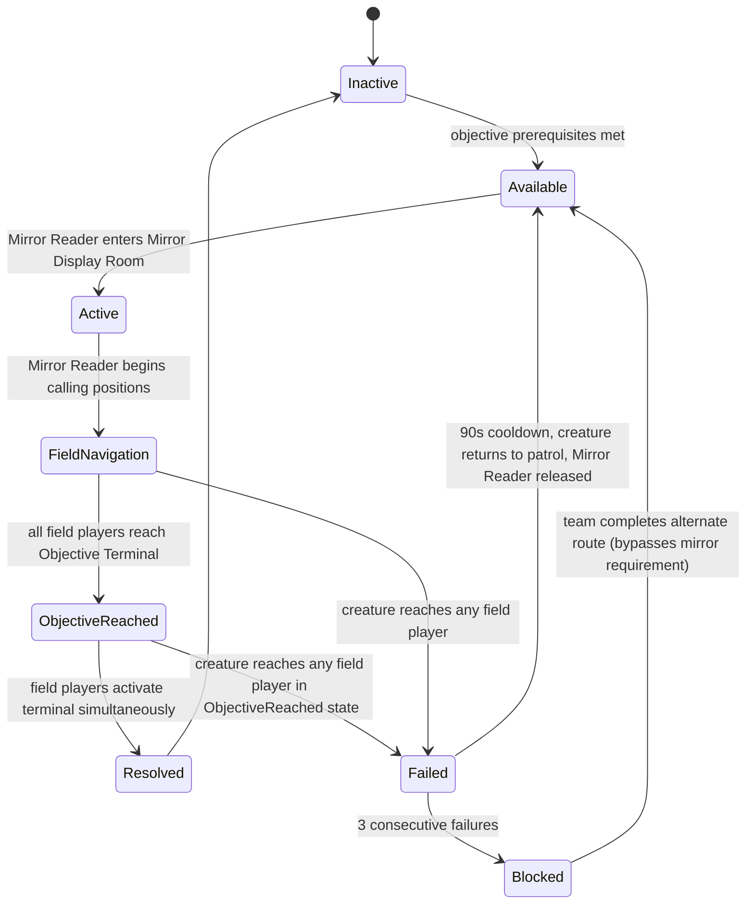

### Puzzle Layout
- Mirror Display Room: a dedicated monitoring room with 4–6 screens showing a delayed feed of creature position across key patrol zones. The room has no other useful objects. The door locks when the Mirror Reader enters (unlocks on resolution or failure).
- Patrol zones: 2–3 distinct areas the field players must pass through. These are not puzzle-specific rooms but existing facility spaces that the creature actively uses.
- Objective Terminal: the target destination for field players. Requires simultaneous interaction by all present field players (not the Mirror Reader). Terminal is visible on the mirror feed 20 seconds after field players reach it.
- Communication between Mirror Reader and field players is voice-only. No in-game waypoint system; no shared map. The Mirror Reader must describe positions verbally using room landmarks.

### Interaction Rules
- Mirror Reader: observation only. Cannot interact with the feed. Cannot leave the Mirror Display Room during Active state. Can communicate with field players through voice.
- Field players: standard movement and interaction. Cannot see the mirror feed. Can see and hear the creature directly (audio) but cannot see it visually until it is within line of sight.
- Objective Terminal: requires all field players (not Mirror Reader) to simultaneously hold interact for 3 seconds.
- If the creature reaches a field player while they are at the Objective Terminal, the puzzle fails (field players scatter, terminal loses hold state).

### Success Conditions
- All field players are within 3 meters of the Objective Terminal.
- All field players simultaneously hold interact for 3 seconds.
- Host confirms `AllFieldPlayersHolding == true` for 3 consecutive seconds.
- Mirror Display Room door unlocks.

### Failure Conditions
- The creature reaches any field player (within 4 meters of creature, creature in Tracking or Hunting state).
- The creature reaches a field player at the Objective Terminal before the 3-second hold completes.
- Note: there is no time limit. The puzzle cannot fail by stalling unless the creature eventually catches the team.

### FailureSeverityTier
`Severe` — reports +3.00 to Noise meter on `OnFailure`. Creature contact also contributes to `T` directly (via proximity). Combined failure in this state can push `P` to or past the Tense threshold in a single event.

### Pressure Events

| Event | Contribution | Source |
|---|---|---|
| Puzzle failure | +3.00 N (instant) | `FailureSeverityTier: Severe` |
| Field player creature contact | T contribution via proximity sensor | 11 Stress System §Threat formula |
| Mirror Reader's information unshared after 20s | +1.00 U (once) | RequiredObservation: creature position |
| Stalled field players | D accumulation per standard rules | 09 Objective System delay clock |

### Networking Ownership
- Puzzle state authority: Host.
- Mirror feed is a delayed replay of authoritative creature position data from the Host. Delay is 20 real-time seconds. The Host buffers creature position at each tick and serves the 200-tick-ago position to the mirror display.
- Field player positions are server-known (standard player state replication).
- Creature contact detection is server-validated.
- Mirror Display Room door lock state is server-authoritative.

### Late Join Behaviour
A player joining during Active state is designated as a field player (not Mirror Reader — Mirror Reader is locked in room and cannot be replaced). The late joiner receives current creature position information from the delayed feed (they can see the mirror if they enter the Mirror Display Room, but the room is locked). The late joiner must navigate without mirror support until the puzzle resolves or fails.

### Host Migration Behaviour
If Host migrates during Active state, the creature position buffer (20-second history) must be rebuilt from the last authoritative snapshot. If the buffer cannot be restored with less than 10 seconds of history, the puzzle fails cleanly. The creature position buffer is the highest data cost element of this puzzle; budget accordingly.

### Save Behaviour
- Persisted: `PuzzleState`, Blocked state.
- Not persisted: creature position buffer (non-persistent, rebuilt on resume), Mirror Reader identity, field player progress toward Objective Terminal.
- On load, puzzle resets to Available state with the door unlocked. Mirror Reader is not locked in on resume; the team must re-designate on load.

### Replication Requirements
- Mirror feed display is a dedicated render target driven by the 20-second-buffered creature position data. Replicated to Mirror Display Room screens only.
- Creature current position is replicated normally per 10 Monster AI replication rules.
- Door lock state is a replicated boolean.
- `FieldPlayerHoldState[playerId]` replicated to all clients for Objective Terminal feedback.

### Analytics Events
- `PuzzleAttempted { puzzleId: "PZL-005", mirrorReaderId, fieldPlayerCount, timestamp }`
- `PuzzleResolved { puzzleId: "PZL-005", solveTimeSeconds, attemptCount, creatureContactCount, timestamp }`
- `PuzzleFailed { puzzleId: "PZL-005", failureReason: "CreatureContact", contactedPlayerId, secondsIntoAttempt, timestamp }`
- `MirrorCallMade { puzzleId: "PZL-005", timestamp }` — fired whenever the Mirror Reader presses a "I'm calling position now" ping (optional UX feature) to track how often predictions are offered vs. field players acting blind.

### Accessibility Notes
- Mirror feed must be visually distinct from live gameplay in a way that is identifiable by players with color-processing differences. Use a desaturated or stylized filter on the feed, not color alone.
- Mirror Reader should not be required to read fine detail on screen at a distance. Creature representation on the mirror feed must be high-contrast and large enough to read from 2–3 meters away from the screens.
- The one-player-locked-in-a-room design may create isolation anxiety. The door should always have a visible unlock countdown or a "DOOR UNLOCKS ON RESOLUTION" indicator.
- Accessibility option: allow Mirror Reader to use a radial ping system to mark a position on a shared map overlay instead of purely verbal description. This assists players who struggle with spatial language under pressure.

### Edge Cases
- **Mirror Reader gives a confident wrong call**: field player walks into creature. Puzzle fails. This is the core failure mode and is entirely intentional. The game is designed so that this happens in early attempts. The Mirror Reader must learn to communicate uncertainty.
- **Creature is stationary during the 20-second window**: the mirror feed shows the creature in the same position it was 20 seconds ago and where it currently is. This creates a false sense of certainty — "it's been stationary, it's definitely still there." In practice, creatures may move immediately after the mirror's snapshot. Design patrols to include occasional stationary holds followed by sudden movement.
- **Field players scatter when panicked**: if a field player runs away from the Objective Terminal toward the creature to avoid it, they may accidentally create a second route to the terminal that was never covered by the Mirror Reader's plan. Legitimate emergent gameplay.
- **Mirror Reader loses audio contact with field players**: voice chat failure. If the team is using the fallback ping system, the Mirror Reader can still indicate danger. If neither voice nor pings are available, the puzzle is functionally broken. Flag as a platform-level risk.

### Exploit Prevention
- Creature position data is server-authoritative. The mirror feed is a server-generated replay, not a client-rendered approximation.
- Mirror Display Room door lock is server-enforced. Client cannot pass through the door while locked.
- Field player contact detection is server-validated (4-meter radius check against creature position, not client-reported).

### Balancing Notes
- The 20-second delay is the core tuning parameter. Less than 15 seconds makes the mirror too accurate (reduces inference burden). More than 25 seconds makes the mirror nearly useless for fast-moving creatures. 20 seconds is the starting point; adjust by 2.5-second increments based on playtest.
- Creature patrol patterns in the zones the field players must cross should include at least one direction change during the 20-second window. If the creature always moves in a straight line, the mirror becomes trivially predictable.
- This puzzle is intended to appear in the Deep Facility placement. Do not place it early. Teams should have navigated with the creature for several minutes before encountering this puzzle, so they have an intuitive sense of patrol speed to combine with the Mirror Reader's positional data.

### QA Checklist
- [ ] Mirror feed is delayed by exactly 20 server seconds, verified frame-by-frame.
- [ ] Mirror Display Room door locks when Mirror Reader enters.
- [ ] Door unlocks on resolution and on failure (after 90s cooldown starts).
- [ ] Field player creature contact at 4 meters triggers failure correctly.
- [ ] Creature contact does not trigger failure when creature is in Probing state (Calm band).
- [ ] Objective Terminal requires all field players simultaneously; Mirror Reader hold does not count.
- [ ] 3-second terminal hold resets if any field player releases.
- [ ] Creature position buffer is correctly restored (or puzzle fails cleanly) on host migration.
- [ ] Puzzle resets to Available on save/load with door unlocked.
- [ ] Severe failure tier correctly contributes +3.00 to N.
- [ ] Mirror feed filter is visually distinct from live gameplay for players with color-processing differences.

### Developer Notes
- The creature position buffer is the most technically complex part of this puzzle. Budget 20 seconds × 10Hz tick rate = 200 position samples per creature. Each position sample is a float3 (12 bytes). Buffer total: 2400 bytes per creature, per active mirror puzzle instance. This is acceptable but must be allocated at puzzle activation, not at session start, to avoid holding memory for unreached puzzles.
- The mirror feed rendering: render the creature as a simplified icon on the feed rather than a full 3D replay. Full 3D replay of creature state at 20-second delay has animation edge cases that will be expensive to address and are not central to the design. An icon with directional indicator is sufficient.
- "Direction change during 20-second window" is a patrol design note, not a runtime constraint. Coordinate with Level Design to ensure patrol waypoints are tuned so the creature's position 20 seconds ago is not always deterministic of its current position.

### Future Variants
- **Dual Feed**: two mirror displays showing different zones, each with different delays (15s and 30s). The Mirror Reader must integrate two temporal streams.
- **Corrupted Feed**: the mirror feed occasionally drops frames or glitches, showing incorrect positions. The Mirror Reader must identify corrupted segments and warn field players accordingly.
- **Inverse Mirror**: field players can see the creature live through a narrow window but cannot move without the Mirror Reader's authorization. Inverts which player is the bottleneck.

---

## PZL-006: Parallel Decay

### Puzzle ID
`PZL-006`

### Puzzle Name
Parallel Decay

### Purpose
Force the team to make a sacrifice decision under time pressure. Two facility systems are simultaneously decaying. Stabilizing either requires two players present. The team never has enough players to stabilize both at once. Someone must accept personal risk by delaying the neglected system alone while the rest of the team handles the other. The defining moment is the negotiation over who accepts that exposure.

### Narrative Context
Two containment systems in different sections of the facility have begun simultaneous degradation following a power surge. Each system has a stabilization interface that requires two operators at once to prevent a breach. Leaving either system unattended accelerates its decay. The team must decide which system to address first, who monitors the neglected system alone, and whether to rotate between systems or hold one until resolved.

### Player Count
2–4. Requires minimum 3 players for full effectiveness. With 2 players, one must solo-monitor (high personal risk) while the other cannot stabilize alone — puzzle enters a semi-blocked state until a third arrives or one system is allowed to reach breach.

### Difficulty
`Diff = 8.5`

| Term | Score | Rationale |
|---|---|---|
| $C_d$ | 2.5 | All players must coordinate simultaneously; sacrifice decision requires real-time group negotiation |
| $I_d$ | 1.0 | Decay rates are displayed locally; no hidden information |
| $T_d$ | 2.5 | Intended for Critical-band or Collapse-window timing |
| $F_d$ | 2.5 | Severe failure consequence |

### Estimated Solve Time
240–360 seconds from activation to resolution. The decision loop (who goes where, who sacrifices, when to rotate) takes longer than the mechanical stabilization.

### Required Communication Pattern
**Priority management with sacrifice.** The team must verbally decide which system to address first. They must also designate who monitors the neglected system alone — and that player must communicate their decay readings in real time so the team knows when to abort stabilization and switch focus. The monitor player has no way to slow decay; they can only observe and report. The communication challenge is continuous: the monitor is a live sensor for the rest of the team, and the rest of the team must decide when the monitor's reported value becomes too critical to ignore.

### Gameplay Flow

1. Two CONTAINMENT BREACH IMMINENT alerts activate simultaneously on systems in different facility sections. Each alert shows its system's current decay percentage and decay rate.
2. Team splits. Two players move to System A; remaining player(s) move to System B.
3. System stabilization requires two players both holding a stabilization interface simultaneously. A single player can slow the decay by 50% but cannot reverse it.
4. The solo player at the neglected system monitors decay and reports verbally.
5. When System A's decay reaches 0% (stabilized), the two-player group moves to System B.
6. If either system reaches 100% decay before it is stabilized, a breach event occurs.
7. The puzzle resolves when both systems are stabilized.

### State Machine

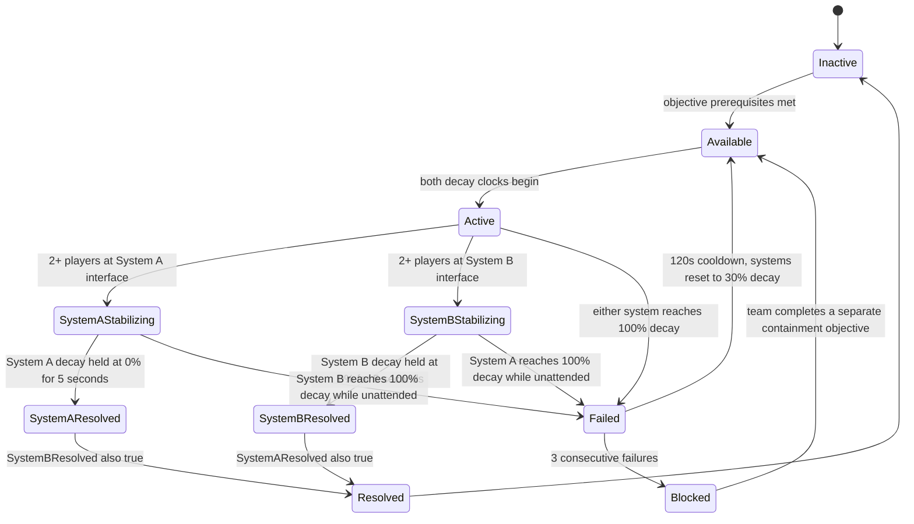

### Puzzle Layout
- System A and System B are in different facility sections, minimum 25 meters apart.
- Each system has a decay display visible from 5 meters (large numerical percentage + rate indicator).
- Each system has two stabilization interfaces (handholds), positioned side by side. Both must be held simultaneously.
- A single-player slow interface exists at each system: a separate hold point that reduces decay rate by 50% but cannot halt or reverse it.
- The systems are not visible from each other's location. No line of sight between them.

### Interaction Rules
- Two-player stabilization: both players must hold their respective stabilization interfaces simultaneously. Hold is sustained input. The moment either player releases, stabilization halts and decay resumes at full rate.
- Stabilization reverses decay at a fixed rate of −5%/second. Decay accelerates at +3%/second unattended, +1.5%/second with a solo monitor on the slow interface.
- A system is "resolved" when decay is held at 0% for 5 consecutive seconds.
- Moving more than 2 meters from a stabilization interface breaks the hold.
- Breach event (100% decay) triggers a hazard in that system's section: an environmental effect that persists until the team resolves the puzzle.

### Success Conditions
- Both System A decay and System B decay are held at 0% for 5 consecutive seconds.
- Host confirms `SystemADecay == 0 && SystemBDecay == 0` for 5 seconds.

### Failure Conditions
- Either system reaches 100% decay before both systems are resolved.

### FailureSeverityTier
`Severe` — reports +3.00 to Noise meter on `OnFailure`. Breach event additionally contributes +3.00 as a hazard trigger (alarm + environmental disturbance). Total Noise contribution on failure: +6.00, which in one event pushes N from 0 to 6.00 and can place a team in Tense immediately.

### Pressure Events

| Event | Contribution | Source |
|---|---|---|
| Puzzle failure | +3.00 N (instant) | `FailureSeverityTier: Severe` |
| Breach hazard trigger | +3.00 N (instant, additional) | Environmental hazard system |
| Unmonitored system decay | T contribution during solo monitoring | Creature drawn to breach alarm |
| Team stalling on allocation decision | D accumulation | 09 Objective System delay clock |

### Networking Ownership
- Puzzle state authority: Host.
- Decay percentages computed server-side at 10 Hz. Each stabilization hold state is an RPC from client to Host.
- Decay values are replicated to all clients for display at both systems.
- Breach event is triggered server-side and replicated as an environment state change.

### Late Join Behaviour
A late joiner receives current decay percentages and stabilization states. If systems are actively decaying, the late joiner should be directed immediately to whichever system is in greater need. No penalty for late joiners; decay state reflects the current match situation.

### Host Migration Behaviour
Decay percentages are the critical persistent values. Incoming Host initializes from snapshot decay values. If migration occurs during a stabilization hold, holds are lost (clients must re-issue). Decay does not accelerate during the migration window — it is frozen for the 2–3 second migration period.

### Save Behaviour
- Persisted: `PuzzleState`, Blocked state, failure count.
- Not persisted: current decay percentages (puzzle resets systems to 30% decay on resume — mid-decay is not a stable save point). Breach hazards from a failed run persist in the environment on resume.

### Replication Requirements
- `SystemADecay` and `SystemBDecay` replicated to all clients at 10 Hz.
- `SystemAHoldCount` and `SystemBHoldCount` (number of players currently holding) replicated to all clients.
- Breach state replicated to all clients.

### Analytics Events
- `PuzzleAttempted { puzzleId: "PZL-006", playerCount, initialDecayRates, timestamp }`
- `PuzzleResolved { puzzleId: "PZL-006", solveTimeSeconds, attemptCount, systemAResolvedFirst, timestamp }`
- `PuzzleFailed { puzzleId: "PZL-006", breachingSystem: "A"|"B", decayAtFailure, solverCount, timestamp }`
- `SystemAbandoned { puzzleId: "PZL-006", system: "A"|"B", decayAtAbandonment, playerCount, timestamp }` — tracks when teams switch focus to inform patrol of "how long a team typically leaves a system unattended."

### Accessibility Notes
- Decay displays must use numbers in addition to visual fill bars. Color (green → yellow → red) must not be the sole indicator of urgency.
- Both stabilization interfaces at a given system must be within 1 meter of each other. Do not spread them across the room — players with limited mobility should not need to sprint between them.
- Solo slow interface must be visually distinct from stabilization interfaces. Use shape difference, not color alone.
- The 2-player hold requirement should be labeled on the interface itself so players do not spend attempts on solo holds and wonder why it is not resolving.

### Edge Cases
- **2-player team**: one player must solo one system's slow interface while the other cannot stabilize alone. The puzzle cannot be resolved with 2 players unless they accept a breach (one system degrades to 100% and the breach hazard activates, but the two players then have a single stabilization target). Consider whether breach + single-target is an acceptable 2-player path or whether the puzzle should downgrade to single-system at 2-player count.
- **Team stalls on who sacrifices**: decay is advancing during the discussion. The Delay meter climbs. This is the intentional cost of indecision — the puzzle punishes committees.
- **Solo monitor leaves to rejoin the stabilization group prematurely**: the neglected system accelerates back to full +3%/second. If the solo monitor is essential for keeping the other system from breaching while the group stabilizes System A, leaving early is a real strategic risk.
- **Breach occurs while team is resolving the other system**: the breach event causes a hazard and pressure spike but does not automatically fail the match. The team must still resolve the non-breached system, and then address the breach consequence. The puzzle fails on breach because it represents the containment protocol failing, not a game-over.

### Exploit Prevention
- Decay computation is server-side. Clients cannot report false decay values or false stabilization states.
- Hold states are validated by player proximity (within 2 meters of interface) on the server.
- Breach detection is server-side. Clients cannot prevent breach events by manipulating state.

### Balancing Notes
- Decay rates are the primary tuning knobs: unattended (+3%/sec), solo monitor (+1.5%/sec), stabilizing (−5%/sec). At these rates, an unattended system breaches from 0% in 33 seconds. A monitored system breaches in 67 seconds. The team has roughly 33 seconds to resolve System A before System B becomes critical if System B was left unmonitored.
- Starting decay at 30% means the team has ~23 seconds of unmonitored time before breach, plus additional time with a monitor. This creates genuine pressure without being punishing from the first moment.
- If playtests show teams consistently failing at 2 players, add a 2-player mode variant that reduces system count to 1 larger system (one system, two stabilization interfaces in the same room). This is a design fallback, not a first-pass solution.

### QA Checklist
- [ ] Decay rates correct: unattended +3%/sec, slow-monitored +1.5%/sec, stabilized −5%/sec.
- [ ] 5-second hold at 0% triggers resolution correctly for each system independently.
- [ ] Puzzle resolves only when both systems are resolved.
- [ ] Either system reaching 100% triggers failure and breach event.
- [ ] Breach hazard activates in correct facility section.
- [ ] 120-second cooldown and 30% reset after failure.
- [ ] Three consecutive failures enter Blocked state.
- [ ] Decay freezes during host migration window.
- [ ] Decay percentages replicated to all clients at 10 Hz.
- [ ] 2-player count edge case documented and handled (breach path or downgrade mode).
- [ ] Severe failure tier contributes +3.00 N; breach trigger contributes additional +3.00 N.

### Developer Notes
- The two systems must be authored at sufficient distance that no player can monitor both from one position. 25-meter minimum is a design floor, not an approximation — validate in level review.
- The decay formula must use server-tick fractions (at 10 Hz, +3%/sec = +0.30%/tick). Cap decay at 100% and floor at 0%; do not allow negative decay percentages to accumulate if a system is over-stabilized.
- System A and System B are generic labels. In production, name them after the facility's specific systems (e.g., "Specimen Tank Pressure" and "Emergency Coolant Flow"). The names should be chosen so that level designers can communicate hazard consequences to players through environmental context.

### Future Variants
- **Three-System Cascade**: a third system begins decaying partway through the puzzle, requiring the team to re-evaluate their allocation mid-task.
- **Asymmetric Decay Rates**: each system decays at different rates, requiring the team to prioritize by rate rather than arbitrarily.
- **Shared Monitor**: a single monitoring panel in a third room shows both systems' decay rates — but that player can only monitor, not slow. The team must decide whether to use that position or split monitoring across the two systems.

---

## PZL-007: Unreliable Witness

### Puzzle ID
`PZL-007`

### Puzzle Name
Unreliable Witness

### Purpose
Force the team to reconcile contradictory information before they can act. Two players observe the same physical space but describe it differently due to the asymmetric reality layer. A third player (or the team collectively) must determine which observation is accurate before committing to a repair action. Acting on the wrong observation wastes a limited-resource repair token. The defining moment is the social discomfort of telling a teammate their information might be wrong.

### Narrative Context
A specimen containment panel has three status indicators. The indicators determine which sealing protocol must be applied. Two players are asked to inspect the panel from the same room, but the facility's degraded reality layer is displaying different indicator states to each of them. Before the repair team can apply a sealing protocol, they need to know which player is seeing the correct state — because the degraded reality layer always shows one player a false state while the other sees the truth.

### Player Count
2–4. Effective at 3 players. With 2 players, the "tiebreaker" role defaults to a cross-examination between the two. With 4 players, two players act as observers and two cross-examine.

### Difficulty
`Diff = 4.5`

| Term | Score | Rationale |
|---|---|---|
| $C_d$ | 2.0 | Sustained back-and-forth interrogation to identify reliability |
| $I_d$ | 2.5 | The ground truth must be inferred from testimony; no direct verification available |
| $T_d$ | 0 | No timer; designed as a deliberative puzzle |
| $F_d$ | 0 | Minor failure consequence |

### Estimated Solve Time
60–150 seconds. Simple teams with good communication resolve quickly. Teams that argue without a structured approach cycle indefinitely on a dead-end.

### Required Communication Pattern
**Negotiation and truth determination.** Two players each describe what they observe. The descriptions contradict on 1–2 of the 3 indicators. The team must determine which player is the reliable observer by asking cross-examination questions — "what color is the pipe behind the panel?", "what is written on the label above indicator 2?" — comparing answers against known common-ground elements that appear identically in all realities. The reliable observer will answer correctly on common-ground questions. The unreliable observer will give answers consistent with their false reality layer. Once the team identifies the reliable observer, they select the protocol matching that observer's indicator readings.

### Gameplay Flow

1. Team discovers a CONTAINMENT PANEL with a SEALING PROTOCOL REQUIRED status.
2. Two players designated as observers examine the panel. They each see 3 indicators but 1–2 indicators show different states in each player's reality.
3. Observers describe their indicator states to the rest of the team (or to each other with 2 players).
4. The team identifies which indicators are in conflict.
5. Non-observer players (or both players in a 2-player session) ask cross-examination questions about common-ground environment details that should be identical in all realities.
6. Based on cross-examination answers, the team identifies the reliable observer.
7. One player selects the sealing protocol matching the reliable observer's indicator states (3 protocol options on the Sealing Protocol Terminal).
8. If correct, the panel seals. If incorrect, a repair token is consumed and the indicators reshuffle.

### State Machine

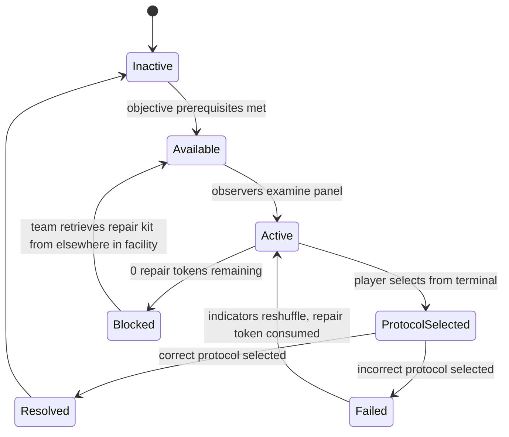

### Puzzle Layout
- One containment panel in a room accessible to both observers simultaneously.
- Panel has 3 indicators. Each indicator is a binary state (two possible values per indicator, e.g., "SEALED / VENTING", "PRESSURIZED / DEPRESSURIZED", "LOCKED / UNLOCKED").
- Common-ground elements near the panel: pipe labels, wall markings, serial numbers. These appear identically in all realities and can be used for cross-examination.
- Sealing Protocol Terminal: separate from the panel, 5–10 meters away. Shows 3 protocol options labeled A, B, C, each corresponding to a different 3-indicator combination.
- Repair tokens: 3 repair tokens available per puzzle instance. Tokens are physical items in the room (displayed on a counter near the terminal). Each failed attempt removes one token.
- Asymmetric reality note: the false reality layer changes which 1–2 of the 3 indicators are wrong, but never all 3. There is always at least 1 indicator that both observers agree on — this is the anchor that tells a careful team which player is consistent and which is not.

### Interaction Rules
- Observers: examine the panel by approaching within 2 meters. Indicator states are displayed passively.
- Cross-examination questions: verbal only. The environment provides answers through readable labels and markings. No "question" button exists — this is purely emergent communication.
- Protocol terminal: single button press per protocol choice. No hold required.
- If the team identifies the reliable observer but selects the wrong protocol anyway (simple mistake), a token is consumed. This catches arithmetic-style errors where the communication was correct but the selection was wrong.

### Success Conditions
- Player selects the protocol matching the reliable observer's 3-indicator configuration.
- Host validates selection against the server-authoritative true indicator state.

### Failure Conditions
- Player selects a protocol not matching the true indicator configuration.
- Team has 0 repair tokens remaining (puzzle enters Blocked until tokens are retrieved from elsewhere in the facility).

### FailureSeverityTier
`Minor` — reports +1.50 to Noise meter on `OnFailure`. Sealing failure makes a brief alarm sound.

### Pressure Events

| Event | Contribution | Source |
|---|---|---|
| Puzzle failure | +1.50 N (instant) | `FailureSeverityTier: Minor` |
| Unshared observer readings after 20s | +1.00 U (once, per unshared indicator) | RequiredObservation per indicator |

### Networking Ownership
- Puzzle state authority: Host.
- True indicator states are generated server-side at puzzle activation.
- Each player's observed state (which may differ from the true state per their reality layer) is assigned by the Host based on the Asymmetric Reality system.
- Protocol selection is an RPC. Host validates against the true indicator state.
- Token count is server-authoritative and replicated to all clients.
- On failure, Host generates a new indicator configuration and reassigns reality-layer divergences.

### Late Join Behaviour
A late joiner receives current puzzle state including token count. If they join during Active, they can immediately participate in cross-examination (they are an additional observer if within 2 meters of the panel). Their reality layer assignment for this puzzle instance is provided on join. Note: a late joiner's fresh reality layer may help break a deadlock if the team was unable to determine reliability using only two observers.

### Host Migration Behaviour
True indicator states and token count are in the snapshot. Incoming Host initializes from snapshot. Reality layer assignments per player are preserved in the puzzle state (not re-rolled on migration).

### Save Behaviour
- Persisted: `PuzzleState`, token count, Blocked state.
- Not persisted: current observer assignments, in-progress cross-examination. On load, observers must re-examine the panel. Indicator states are preserved from the save — the team resumes with the same true configuration they were working with.

### Replication Requirements
- `TrueIndicatorState[3]` — server-authoritative, not sent to clients directly (clients see only their per-reality observation).
- `PlayerObservedState[playerId][3]` — each player's reality-layer-filtered observation, replicated only to that player.
- `TokenCount` replicated to all clients.
- `PuzzleState` replicated to all clients.
- Protocol selection result (success/failure + shuffle animation trigger) replicated to all clients.

### Analytics Events
- `PuzzleAttempted { puzzleId: "PZL-007", playerCount, conflictingIndicatorCount, timestamp }`
- `PuzzleResolved { puzzleId: "PZL-007", solveTimeSeconds, tokensRemaining, attemptCount, timestamp }`
- `PuzzleFailed { puzzleId: "PZL-007", selectedProtocol, correctProtocol, reliableObserverId, timestamp }`
- `CrossExaminationAttempted { puzzleId: "PZL-007", timestamp }` — fired when a player uses a "cross-examine" ping to flag a common-ground element. Tracks how often teams use structured vs. freeform approaches.

### Accessibility Notes
- Indicator states must use both visual (icon/shape) and textual labels, not color alone.
- Common-ground elements used for cross-examination must be readable from 1.5 meters away.
- Offer a "comparison mode" accessibility option: a shared overlay showing both observers' indicator readings side by side. This reduces memory burden without removing the cross-examination challenge (players still need to determine who is reliable).
- Protocol terminal descriptions must be fully textual. Do not rely on icon-only protocol labels.

### Edge Cases
- **Both observers are assigned the same reality layer** (system error): both describe identical states, cross-examination passes for both, and the team cannot distinguish reliability. Prevent this at generation time: the two observers must always be assigned different reality layers if one is showing a false state.
- **The team selects the correct protocol on the first attempt without cross-examination**: this is valid. The 50% chance per conflicting indicator means lucky guessing exists. Do not punish this; it is a legitimate outcome.
- **3 tokens consumed, puzzle Blocked**: the repair kit elsewhere in the facility must be a reachable objective that does not require solving this puzzle first. Level design dependency review required.
- **Observer gives false testimony intentionally** (social deception by a player): this is player behavior, not a system failure. The puzzle supports it by design — player-authored deception is a valid communication failure mode.
- **Only 1 indicator conflicts**: cross-examination is much faster when the team only needs to determine reliability on a single indicator. Minimum conflict count should be 1 indicator to avoid trivial cases — consider making the minimum 2 indicators for higher tension.

### Exploit Prevention
- True indicator state is server-authoritative. Clients receive only their reality-layer-filtered view.
- Protocol selection is server-validated. Clients cannot self-report a resolved state.
- Token count is server-authoritative. Clients cannot circumvent the Blocked state.

### Balancing Notes
- Number of conflicting indicators (1–2 out of 3) is the primary difficulty tuning knob. 1 conflict = easier (team only needs to resolve one disagreement). 2 conflicts = harder (more cross-examination required). Start with 1 conflict for the first encounter, 2 conflicts for subsequent encounters.
- Do not make common-ground cross-examination answers procedurally random — they should be authored into the level so designers know what players will use. This also means QA can verify them.
- Three repair tokens is the balance point. Fewer (2) is punishing for a Minor-severity puzzle. More (4) removes the cost of failure entirely.

### QA Checklist
- [ ] True indicator state is generated server-side. Clients never receive it directly.
- [ ] Two designated observers always receive different reality-layer assignments on this puzzle.
- [ ] At least 1 indicator always conflicts between the two observer realities.
- [ ] At least 1 indicator always matches between the two observer realities (anchor point).
- [ ] Common-ground cross-examination elements exist in the room and are readable at 1.5m.
- [ ] Correct protocol validates against true (not per-player) indicator state.
- [ ] Three consecutive failures consume 3 tokens and enter Blocked.
- [ ] Repair kit for Blocked recovery is reachable without solving this puzzle.
- [ ] Comparison mode accessibility overlay shows both observers' readings without revealing true state.
- [ ] Puzzle works with 2, 3, and 4 players with correct observer assignment rules.

### Developer Notes
- Reality layer assignment for this puzzle is a puzzle-local override, not necessarily consistent with the player's global reality layer assignment. This puzzle needs explicit divergence on exactly 1–2 indicators to function. Do not rely on the global asymmetric reality system to produce the correct divergence — implement a local divergence assignment at puzzle activation.
- Common-ground cross-examination elements must be authored per-room by the level designer. Provide a tagging system (e.g., `[CommonGround = true]` on readable objects) so the QA team can verify that every containment room has at least 3 usable cross-examination elements within 3 meters of the panel.

### Future Variants
- **Three Observers**: a third observer's reality layer agrees with one of the other two on all indicators. The team must now identify the 2-person consensus, not just the single reliable witness.
- **Shifting Reliability**: which observer is "unreliable" changes mid-puzzle (the reality layer assignment swaps partway through). Teams using only initial cross-examination will be misled.
- **No Common Ground**: common-ground cross-examination elements are absent or all compromised. The team must determine reliability through logical inference from the indicator states alone, not environmental verification.

---

## PZL-008: Tidal Lock

### Puzzle ID
`PZL-008`

### Puzzle Name
Tidal Lock

### Purpose
Require the team to be in the right place at the right time — not solve a puzzle from a fixed position. Movement IS the mechanic. The defining moment is step 4 of a 6-step sequence appearing in the section the creature was just spotted in, forcing the team to decide who runs that step and when.

### Narrative Context
A facility-wide environmental control system requires a calibration sequence to be run manually at distributed sensor nodes. Each step in the sequence must be triggered in order at the correct node within a 30-second window. The sequence steps appear one at a time, rotating through nodes across the facility. The team must coordinate movement and coverage to ensure someone is at each step's node when its window opens.

### Player Count
2–4. The sequence always has 6 steps. With 4 players, coverage is comfortable. With 2 players, significant improvised sprint routes are required.

### Difficulty
`Diff = 7.0`

| Term | Score | Rationale |
|---|---|---|
| $C_d$ | 2.0 | Sustained positional coordination; no simultaneous action but ongoing movement negotiation |
| $I_d$ | 1.0 | Next step location announced to team; challenge is execution, not hidden information |
| $T_d$ | 2.0 | 30-second windows per step are meaningfully harder under Critical band |
| $F_d$ | 2.0 | Moderate failure consequence |

### Estimated Solve Time
180–300 seconds. A 6-step sequence with 30-second windows per step. The team must not only succeed at each step but navigate between them across the facility.

### Required Communication Pattern
**Sequencing with movement coordination.** The team's shared coordination task is deciding who covers each step based on their current position in the facility. The sequence step locations are announced to all players via a global alert panel. Players must verbally negotiate coverage: "I'm at the east generator — step 4 is there, I've got it. Who's near the refrigeration bay for step 5?" Failure occurs when no one is at the step's node when its 30-second window closes. The creature's location adds route negotiation to the coverage problem.

### Gameplay Flow

1. A CALIBRATION SEQUENCE INITIATED alert appears on a central display showing that 6 steps must be completed in order.
2. Step 1's sensor node location is displayed on all in-game location markers and announced as a room name.
3. A 30-second window opens. A player must reach Step 1's node and interact (single button press) before the window closes.
4. On successful step completion, Step 2's node location appears. A new 30-second window opens.
5. Each step's location is randomized from a pool of 8–12 sensor node positions distributed across the facility.
6. The sequence completes when all 6 steps are completed within their windows.
7. If a window closes without the step being completed, the sequence resets from the failed step (not from the beginning — teams lose the failed step and the preceding step only).
8. Three missed windows cause a full reset with penalty.

### State Machine

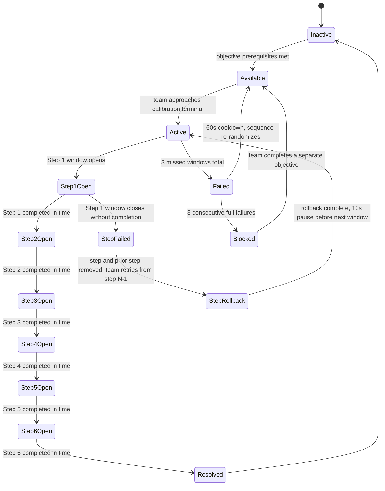

### Puzzle Layout
- 8–12 sensor nodes distributed across the full facility — not clustered. Each step may pull from any node in the pool.
- Nodes are permanently installed in the facility (visible throughout the session). They display a pulsing green light when active (their step's window is open) and are inert otherwise.
- Central calibration terminal at the facility's mid-point shows current step number, active node location name, and remaining window time.
- Window time remaining is displayed on the active node itself (countdown timer) and on the central terminal.
- Sequence step locations are announced via a global audio cue (facility intercom) in addition to the visual display.

### Interaction Rules
- Node interaction: single button press while within 2 meters of the node. No hold required.
- Only one player needs to press each node. Multiple players pressing the same node have no additional effect.
- A node can only be activated during its active window. Pressing an inactive node does nothing.
- Rollback: if a step fails, the current step and the immediately preceding step are re-added to the sequence. The team must complete those 2 steps again before advancing. This is a partial penalty, not a full reset, to reward partial progress.

### Success Conditions
- All 6 steps completed in order, each within their 30-second window.
- Host confirms `SequenceStep == 7` (post-step-6 completion).

### Failure Conditions
- A step's 30-second window closes without any player interacting with the active node.
- Three missed windows across the entire sequence attempt.

### FailureSeverityTier
`Moderate` — reports +2.25 to Noise meter on `OnFailure`. A calibration failure alarm sounds for 4 seconds.

### Pressure Events

| Event | Contribution | Source |
|---|---|---|
| Puzzle failure (full reset) | +2.25 N (instant) | `FailureSeverityTier: Moderate` |
| Calibration alarm (4 seconds) | +0.40 N/tick | Environmental sound |
| Missed step (rollback, not full fail) | +1.00 N (instant) | Treated as a failed interaction event |
| Steps unactioned after 20s | +1.00 U (once, per step) | RequiredObservation: who is covering each step |

### Networking Ownership
- Puzzle state authority: Host.
- Sequence step locations and window timers are server-side.
- Node interaction events are RPCs from client to Host. Host validates player proximity and active step.
- Step completion, rollback, and full failure events are replicated to all clients.
- Active node location (room name + node identifier) is replicated to all clients on each step transition.

### Late Join Behaviour
A late joiner receives the current step number and active node location. They can immediately participate in coverage. They are not required to have been present for earlier steps. If they join during a step's window, they can complete that step if they can reach the node in time.

### Host Migration Behaviour
Current step number, missed window count, and sequence randomization seed are in the snapshot. Incoming Host initializes from snapshot. If migration occurs during an active window, the window timer is extended by 5 seconds to compensate for the migration overhead. If the extension is not enough and the step fails, it is treated as a missed window.

### Save Behaviour
- Persisted: `PuzzleState`, failure count, Blocked state.
- Not persisted: sequence randomization or step progress (puzzle resets to Available with a freshly randomized sequence on load). Partial sequences cannot be meaningfully resumed; a full reset is cleaner than an ambiguous mid-sequence resume.

### Replication Requirements
- `CurrentStep` replicated to all clients.
- `ActiveNodeId` replicated to all clients on each step transition.
- `WindowTimeRemaining` replicated to all clients at 10 Hz during an active window.
- `MissedWindowCount` replicated to all clients.
- Step completion and rollback events replicated with animation triggers.

### Analytics Events
- `PuzzleAttempted { puzzleId: "PZL-008", playerCount, timestamp }`
- `PuzzleResolved { puzzleId: "PZL-008", solveTimeSeconds, totalMissedWindows, timestamp }`
- `PuzzleFailed { puzzleId: "PZL-008", failedStep, missedWindowCount, timestamp }`
- `StepCompleted { puzzleId: "PZL-008", stepNumber, nodeId, completingPlayerId, windowTimeRemaining, timestamp }` — tracks which steps are commonly rushed vs. comfortable, informs node placement tuning.
- `StepMissed { puzzleId: "PZL-008", stepNumber, nodeId, closestPlayerDistance, timestamp }` — `closestPlayerDistance` indicates whether the miss was "no one tried" or "someone was almost there."

### Accessibility Notes
- Active node must be announced via audio cue (intercom) in addition to visual display for players who cannot see the central terminal.
- Node pulsing indicator must be visible from 10 meters. Use both a physical light and a particle effect to ensure visibility in poor lighting.
- 30-second window must be clearly displayed as a number, not only as a fill bar.
- Rollback must be clearly communicated (on-screen text + audio) so players understand why the sequence stepped back rather than forward.
- Movement between nodes requires traversing the facility. Accessibility movement speeds must be accommodated; the 30-second window was designed to allow a player walking (not sprinting) to reach any node from any adjacent room. Verify this in level design review.

### Edge Cases
- **Two players race to the same node**: only one press is needed. Second press has no effect. Players should communicate who is covering which step to prevent wasted movement.
- **Step 4 node is in creature's current zone**: the team must decide who runs it, or wait for the creature to move, accepting the risk that the window may close. This is intentional — the puzzle creates creature-routing tension by placing steps randomly across the facility.
- **Player reaches node exactly as window closes**: server-side, the window closes at the tick where `WindowTimeRemaining == 0`. If the interaction RPC arrives in the same tick, it is accepted. If it arrives in the next tick, it is rejected. This 100ms edge case is unavoidable; flag it in QA as "last-tick interaction accepted" to verify.
- **Rollback sends sequence back to step 0 on step 1 miss**: step 1 has no preceding step. The rollback rule (step + prior step re-added) should specify that a step 1 miss causes a rollback to step 1 only (no prior step to re-add). Verify this edge case in the state machine implementation.

### Exploit Prevention
- Node interactions are server-validated. Clients cannot self-report step completion.
- Player proximity is validated server-side (2-meter radius check).
- Sequence step locations are server-generated. Clients cannot predict or influence step assignments.
- Window timer runs server-side. Clients cannot extend the window through any client action.

### Balancing Notes
- 30-second window is designed for a player who must cross 1–2 rooms at walking speed. If level geometry makes any node unreachable in 30 seconds from any other node, the node pool must be trimmed or the window extended for that specific node.
- The rollback rule (not a full reset) is critical for motivation. Full resets on step failure are punishing and create negative experiences. Rollback-two is the balance point — enough cost to matter, not enough to demoralize.
- Step 6 should always be placed at a node near the facility's mid-point or exit route. A step 6 that requires the team to run to the facility's far edge after 5 steps of traversal is anti-climactic and potentially brutal if the creature is active.

### QA Checklist
- [ ] 6 steps always assigned from a pool of 8–12 nodes with no consecutive repeat of the same node.
- [ ] 30-second window per step, countdown visible on both active node and central terminal.
- [ ] Single button press registers completion; hold not required.
- [ ] Rollback correctly re-adds current step and prior step; step 1 miss rolls back to step 1 only.
- [ ] Three missed windows across any attempt causes full failure.
- [ ] Full failure triggers +2.25 N and 60-second cooldown.
- [ ] Sequence re-randomizes on full failure.
- [ ] Last-tick interaction is accepted.
- [ ] Active node pulsing light visible from 10 meters in poorest facility lighting.
- [ ] Audio announcement on each step transition is audible from anywhere in the facility.
- [ ] Accessibility walking speed allows reaching any adjacent-room node within 30 seconds.

### Developer Notes
- The node pool must be designed so that any node is reachable from any other node in ≤25 seconds at walking speed. This is a level design constraint, not a runtime check — validate in level design review before finalizing node pool.
- Active node announcement must use the room name, not the node identifier (node identifiers like "N-07" are meaningless to players; "refrigeration bay" or "the east stairwell" are actionable).
- Sequence step randomization must use the session seed to ensure replicated identical sequences on all clients. Never randomize step assignment separately per client.

### Future Variants
- **Simultaneous Steps**: steps 3 and 4 must be completed within 5 seconds of each other, requiring two players to be in position simultaneously.
- **Reverse Sequence**: after completing the 6-step forward sequence, the system requires a 3-step reverse sequence (steps 6, 4, 2 in reverse). A new challenge for teams who memorized the forward path.
- **Corrupted Node**: one node in the pool is faulty and will reject interactions (give failure sound instead of completion). The team must identify the faulty node during the sequence and avoid assigning it.

---

## PZL-009: Confession Loop

### Puzzle ID
`PZL-009`

### Puzzle Name
Confession Loop

### Purpose
Make communication verification the puzzle, not just communication itself. The team cannot simply relay information — they must confirm that the information was received correctly before the system will accept it. The defining moment is the team simultaneously confirming they heard the same thing when they are not certain they did.

### Narrative Context
A facility data recovery terminal requires each connected workstation to confirm receipt of a critical system code before the data can be committed. The code is only displayed at one workstation for 8 seconds. The workstation operator must transmit it verbally. All other operators must confirm receipt by entering what they heard into their workstations simultaneously. The system rejects the commit if any workstation entry differs — and the code changes if the commit is rejected.

### Player Count
2–4. One workstation displays the code (the Transmitter). All other workstations must confirm. With 2 players, only one confirmation is required. With 4 players, three simultaneous confirmations are required.

### Difficulty
`Diff = 7.5`

| Term | Score | Rationale |
|---|---|---|
| $C_d$ | 2.5 | All players must simultaneously confirm receipt; partial confirmation is rejected |
| $I_d$ | 2.0 | Code is split: Transmitter hears the code, others must receive it verbally; no player knows others' entries before committing |
| $T_d$ | 1.0 | Time pressure exists (code window, commit window) but solvable comfortably under Tense band |
| $F_d$ | 2.0 | Moderate failure consequence |

### Estimated Solve Time
90–180 seconds. Teams that communicate clearly and confirm confidently resolve quickly. Teams that second-guess their entries burn time and may face the code change.

### Required Communication Pattern
**Verification.** The Transmitter reads the code aloud once during the 8-second display window. Other players must hear it, remember it, and enter it at their workstations without seeing it themselves. Before committing, all players verbally confirm what they intend to enter. The Transmitter confirms what was displayed. Only when the team is satisfied do they commit simultaneously. If any entry differs from the Transmitter's display — due to mishearing, mis-remembering, or mistyping — the commit is rejected and the code changes.

### Gameplay Flow

1. Team discovers a DATA RECOVERY TERMINAL with workstations distributed across a room or adjacent rooms.
2. One workstation is designated as the Transmitter workstation (identified by a `TRANSMIT` label). The Transmitter player stands at it.
3. Transmitter player activates the data pull. A code appears at their workstation for 8 seconds. Code format: 3 alphanumeric characters (e.g., `G4R`, `2WP`, `K9F`). Code is not displayed at any other workstation.
4. Transmitter reads the code aloud during the 8-second window.
5. After the window, the code disappears. All players must now enter what they heard at their workstations.
6. A 20-second commit window opens. All players enter their believed code at their respective workstations.
7. All players must simultaneously hold a "commit" button. The system evaluates all entries at the moment of simultaneous commit.
8. If all entries match the true code, the data commits and the puzzle resolves.
9. If any entry differs, the commit is rejected, all entries clear, and a new code is generated for the next attempt.
10. Three rejections in one session trigger an extended lockout (60 seconds) before a new code cycle.

### State Machine

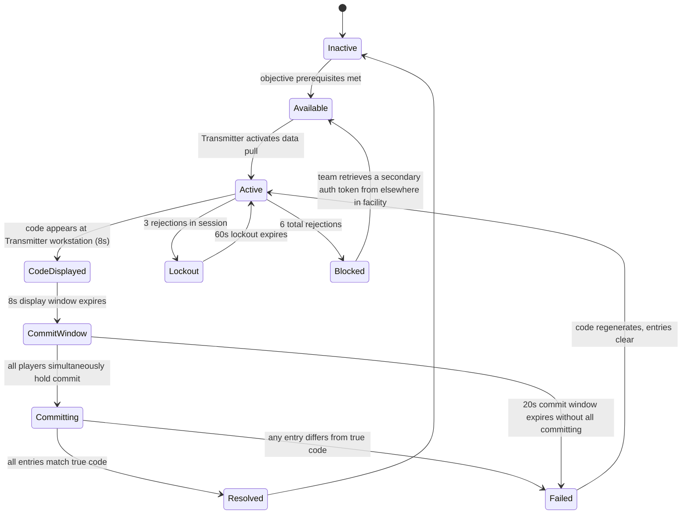

### Puzzle Layout
- 2–4 workstations in a connected room cluster. At least one workstation is around a corner or in an adjacent room, not directly visible from the Transmitter station.
- Transmitter workstation: identical in appearance to others except for the `TRANSMIT` label. Designation is fixed per session.
- Code display panel: visible only on the Transmitter workstation screen, facing toward the wall (not visible from other workstations).
- Commit buttons: one per workstation, clearly labeled.
- Entry interface: minimal — 3-character text input using an on-screen character picker (no physical keyboard in the game world). Designed for speed, not complexity.

### Interaction Rules
- Transmitter activates pull: single button press. This starts the 8-second code display window.
- Entry: use character picker to input 3-character code. Entry is local until committed.
- Simultaneous commit: all players must hold their commit button within a 2-second grace window.
- If a player at a non-Transmitter workstation tries to commit before all others, the system waits for the grace window (holds the commit attempt). The commit executes at the end of the grace window or when all players have committed, whichever comes first.
- Entries are private until commit. No player can see another player's entry before they commit.

### Success Conditions
- All workstation entries match the true code simultaneously on the commit hold.
- Host confirms `AllEntriesMatch == true` at commit evaluation.

### Failure Conditions
- Any entry differs from the true code at commit evaluation.
- 20-second commit window expires without all players committing.
- Three rejections enter lockout; six rejections enter Blocked.

### FailureSeverityTier
`Moderate` — reports +2.25 to Noise meter on `OnFailure`. Rejection event produces a sharp error tone.

### Pressure Events

| Event | Contribution | Source |
|---|---|---|
| Puzzle failure | +2.25 N (instant) | `FailureSeverityTier: Moderate` |
| Code unshared after 20s | +1.00 U (once) | RequiredObservation: received code value |
| Stalled commit window | D accumulation | 09 Objective System delay clock |

### Networking Ownership
- Puzzle state authority: Host.
- True code is generated server-side and never sent to non-Transmitter clients.
- Transmitter sees code via a server-pushed display event (push to Transmitter workstation client only).
- Each workstation entry is an RPC from client to Host (entry content is not broadcast to other clients).
- Commit hold events are RPCs. Host evaluates `AllEntriesMatch` at the end of the grace window.
- Rejection or resolution result is replicated to all clients.

### Late Join Behaviour
A late joiner receives current puzzle state and is assigned the workstation closest to their spawn position if it is unoccupied. If the code display window is active, the late joiner will not have heard the code and must ask the Transmitter or a teammate to repeat it. The Transmitter cannot redisplay the code (it is gone after 8 seconds). This is intentional: late joiners must ask, and the team must repeat from memory.

### Host Migration Behaviour
True code and rejection count are in the snapshot. If migration occurs during the code display window, the window timer is reset to 5 seconds (reduced, not full — the code has already been partially displayed). If migration occurs during the commit window, the window is extended by 5 seconds.

### Save Behaviour
- Persisted: `PuzzleState`, rejection count, Blocked state.
- Not persisted: current code (regenerated on resume), player entries (cleared on resume). Teams must restart the data pull cycle on load.

### Replication Requirements
- Code is pushed only to Transmitter client's display. Never broadcast.
- `WorkstationEntryState[workstationId]` (entered / empty, not the entry content) replicated to all clients so players know who has entered and who has not.
- `CommitState[playerId]` replicated to all clients during simultaneous commit grace window.
- Rejection count replicated to all clients.
- Lockout timer replicated to all clients.

### Analytics Events
- `PuzzleAttempted { puzzleId: "PZL-009", playerCount, transmitterId, timestamp }`
- `PuzzleResolved { puzzleId: "PZL-009", solveTimeSeconds, rejectionCount, timestamp }`
- `PuzzleFailed { puzzleId: "PZL-009", failureReason: "EntryMismatch"|"WindowExpired", mismatchCount, timestamp }`
- `EntryMismatch { puzzleId: "PZL-009", workstationId, enteredCode, trueCode, timestamp }` — hashed per analytics policy; do not store plain codes if they could correlate to player inputs.

### Accessibility Notes
- 3-character code uses only uppercase letters and digits. Avoid characters that are visually ambiguous: exclude O (looks like 0), I (looks like 1), and S (looks like 5) from the code generation pool.
- Code display must be large enough that the Transmitter player can read it clearly at normal viewing distance without needing to move closer.
- Character picker must support controller input without fine-motor precision. Use a large-tile grid picker.
- Audio read-back option: when the Transmitter activates the pull, the game can optionally read the code aloud through the Transmitter player's speaker only. This assists players who struggle to read and relay quickly. Disabled by default; accessibility toggle.
- Simultaneous commit grace window (2 seconds) must accommodate players with slower reaction times. Expand to 3 seconds for accessibility mode.

### Edge Cases
- **Transmitter mishears their own code and relays it incorrectly**: this is possible if the player is distracted or reads the display wrong. The displayed code is correct; the relayed code may not be. The team can only correct this by asking the Transmitter to read the display again — but the display is gone after 8 seconds. If the Transmitter read it wrong, the attempt will fail. The Transmitter learning to read carefully before the window ends is part of the skill curve.
- **All other players enter correctly but Transmitter enters incorrectly at their own workstation**: the Transmitter must also enter the code they displayed. If they mis-enter (typo or memory lapse), the commit fails. This is a rare but valid failure mode.
- **Player tries to commit before entering a code**: the commit is held in the grace window but the server rejects an empty entry as a mismatch. Do not silently skip empty entries.
- **Player loses audio/voice and cannot hear the Transmitter**: if a player cannot hear the code verbally, they must use the fallback ping system or in-game text input to receive the code. If no fallback is available and audio is down, the player must guess. This is a platform-level risk, not a system failure.

### Exploit Prevention
- True code is server-authoritative and never broadcast to non-Transmitter clients.
- Entries are RPCs to Host; other clients do not receive entry content before commit.
- Commit evaluation is server-side. Clients cannot self-report a match.
- 3-character code with a pool that excludes ambiguous characters still provides sufficient entropy to prevent brute-force guessing within a session.

### Balancing Notes
- 3 characters from a pool of ~30 characters = ~27,000 combinations. Teams cannot guess their way through this puzzle without the voice relay.
- 8-second display window is intentionally short. Teams that ask "wait, say that again" during the display window are losing available time. This creates real pressure to listen the first time.
- 20-second commit window gives teams time to verbally confirm what they heard, reconcile discrepancies, and re-enter if needed — without requiring perfect instant entry.
- The lockout at 3 rejections protects against teams who cycle randomly. The Blocked state at 6 rejections is a safety valve for sessions where one player genuinely cannot hear the Transmitter.

### QA Checklist
- [ ] Code generated server-side; never broadcast to non-Transmitter clients.
- [ ] Code display window is exactly 8 seconds.
- [ ] Code disappears from Transmitter workstation after 8 seconds.
- [ ] Ambiguous characters (O, I, S) excluded from code generation pool.
- [ ] All workstations must commit simultaneously within 2-second grace window.
- [ ] Any entry mismatch causes full rejection; no partial credit.
- [ ] Three rejections enter 60-second lockout.
- [ ] Six rejections enter Blocked state.
- [ ] Empty entry treated as mismatch.
- [ ] Commit window expiry (20 seconds) without all committing causes rejection.
- [ ] Audio read-back accessibility option functions correctly (Transmitter only, not broadcast).
- [ ] Puzzle works with 2 players (1 confirm) and 4 players (3 confirms) correctly.

### Developer Notes
- The entry interface (character picker) must be fast. If players spend their 20-second commit window fighting the input method, the design will feel punishing through the interface, not through the puzzle. Target: 3 characters entered in ≤6 seconds by a player who knows what they want to enter. Run usability testing on the picker before finalizing window durations.
- Code generation should avoid real words. A 3-character code that spells "PIG" or "WAR" may have unintended tonal or cultural implications. Run generated codes through a word filter.
- The Transmitter assignment is fixed per session (always the same workstation). This allows teams to pre-assign roles before approaching the puzzle in repeat sessions, which is a valid learned strategy.

### Future Variants
- **Multi-Code Sequence**: the terminal displays 3 codes in sequence, each for 6 seconds. Players must remember all 3 and enter them in order during a single commit window.
- **Corrupted Channel**: one player's audio is distorted during code relay. They must clarify what they heard by asking specific character-by-character confirmation questions.
- **Role Rotation**: the Transmitter workstation designation rotates each attempt. Players cannot reliably pre-assign the role between sessions.

---

## PZL-010: The Anchor

### Puzzle ID
`PZL-010`

### Puzzle Name
The Anchor

### Purpose
Invert one player's role completely. The Anchor cannot advance objectives, cannot escape, and cannot help directly. They can only observe and communicate. Every other player depends on the Anchor's intelligence while simultaneously protecting them from a creature that is drawn toward them. The defining moment is the Anchor realizing they are the most important person in the room and the most helpless.

### Narrative Context
The facility's central monitoring array requires one operator to physically interface with its core terminal for the duration of a critical data extraction. The interface locks the operator in place — they cannot move once connected. The connected operator gains access to the facility's entire sensor grid, giving them unprecedented situational awareness. But the facility's containment entity is drawn to active monitoring signatures, meaning the Anchor is broadcasting their position to the creature for the entire extraction duration. The team must complete the extraction while protecting the Anchor from a creature that knows exactly where they are.

### Player Count
3–4. Not supported at 2 players — with 2 players, the non-Anchor player must simultaneously complete objectives and protect the Anchor, which is mechanically possible but functionally impossible against an aggressive creature. Designer note: if 2-player sessions encounter this puzzle, consider either skipping it (replaced with a 2-player alternative objective) or reducing the extraction duration to 60 seconds with reduced creature aggression.

### Difficulty
`Diff = 9.5`

| Term | Score | Rationale |
|---|---|---|
| $C_d$ | 2.5 | All players must coordinate simultaneously; Anchor provides live intelligence while others execute and protect |
| $I_d$ | 2.0 | Anchor has exclusive sensor access; field players have exclusive mobility. Neither set of information is usable alone |
| $T_d$ | 2.5 | Extraction runs 90 seconds; intended as a Collapse-window puzzle at high Band states |
| $F_d$ | 2.5 | Severe failure consequence |

### Estimated Solve Time
300–480 seconds including approach, commitment, and the 90-second extraction. High variance based on creature state during the extraction.

### Required Communication Pattern
**Sacrifice with role inversion.** The Anchor accepts immobility and vulnerability in exchange for near-omniscient situational awareness. Field players accept physical risk in exchange for the Anchor's intelligence. Communication flows from Anchor to field players: creature position, objective status, incoming hazards. Field players relay their own positions and needs back. The Anchor cannot act on any of this information directly — they can only speak. This creates a unique pressure: the most informed player is the least powerful, and the most powerful players are working blind without the Anchor's guidance.

### Gameplay Flow

1. Team discovers the CENTRAL MONITORING ARRAY. A display shows EXTRACTION REQUIRED — 90 SECOND DURATION and a warning: MONITORING SIGNATURE ATTRACTS CONTAINMENT ENTITY.
2. One player voluntarily connects to the array terminal. Their character enters an animation that locks them in position. Their interface switches to the facility sensor grid — a live overhead view of all rooms showing creature position, objective markers, and hazard states.
3. A 90-second extraction countdown begins. The creature's behavior shifts: it receives a continuous directional pull toward the Anchor's location (not an instant teleport — the creature must still navigate).
4. Field players must complete a minimum of 2 objective interactions across the facility during the 90-second window. These interactions are existing facility objectives (not puzzle-specific tasks) that were previously accessible but not time-constrained.
5. The Anchor provides live intelligence: "Creature is in the east corridor moving toward you. North stairwell is clear. Objective B is active — it's past the generator room."
6. Field players must also periodically return to physically check on the Anchor — the creature's approach path may require interruption (a field player can create a distraction by making noise elsewhere, drawing the creature away).
7. If the creature reaches the Anchor (within 2 meters, Hunting state), the extraction aborts. The Anchor is released and the extraction must be restarted.
8. If 2 field objectives are completed and 90 seconds elapse without creature contact, the extraction resolves.

### State Machine

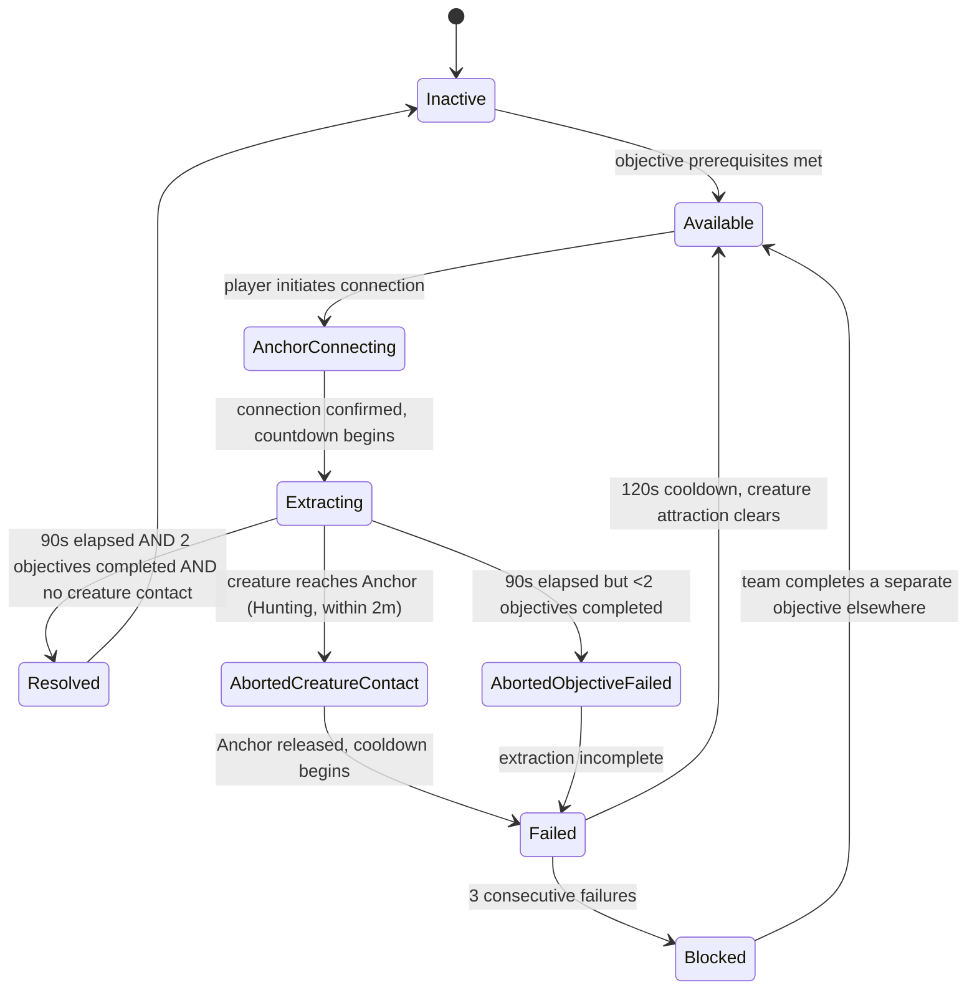

### Puzzle Layout
- Central Monitoring Array: a large terminal in the facility's hub or deep-facility control room. Fixed position, large footprint. Anchor connects here and cannot leave.
- Sensor grid display: shown on Anchor's screen only. Full overhead facility view showing creature, players, objectives, and hazards. Not accessible to field players.
- Creature attraction indicator: a visible directional pull effect on the Anchor's terminal showing the creature's current trajectory toward the array. Countdown to estimated creature arrival based on current speed/path.
- Field objectives: 2 of the session's existing non-completed minor objectives are selected by the Host at extraction start. Their locations are announced to all players via the Anchor's sensor grid. Field players do not see the grid directly.
- Distraction points: fixed locations around the facility where a field player can create a loud noise (break something, trigger an alarm) to temporarily redirect the creature away from the Anchor. Distraction pulls last 15 seconds.

### Interaction Rules
- Anchor connection: single button press followed by a 5-second animation. Anchor is immobile for the duration. Pressing interact a second time disconnects (aborting extraction and failing the puzzle — this is an emergency abort, not a strategy).
- Anchor interface: Anchor can ping locations on their sensor grid (a visual marker appears in field players' HUDs at the marked location). This is the primary non-verbal communication tool for the Anchor.
- Field objective interaction: standard interaction per the objective type. No special rules.
- Distraction: field player interacts with a designated distraction point. Creature redirects for 15 seconds. Distraction point has a 45-second cooldown before reuse.
- Creature contact: if the creature enters within 2 meters of the Anchor and is in Hunting state, the extraction aborts immediately.

### Success Conditions
- 90-second extraction timer elapses without creature contact.
- A minimum of 2 field objectives completed during the extraction window.
- `ExtractionComplete == true && CreatureContactDuringExtraction == false`.

### Failure Conditions
- Creature reaches within 2 meters of Anchor while in Hunting state during extraction.
- 90 seconds elapse with fewer than 2 field objectives completed.
- Anchor manually disconnects (emergency abort).

### FailureSeverityTier
`Severe` — reports +3.00 to Noise meter on `OnFailure`. Extraction abort also triggers a monitoring array overload (+3.00 as an environmental hazard trigger). Total: +6.00 Noise — this single failure can flip a team from Calm to Critical if they were already under moderate Pressure.

### Pressure Events

| Event | Contribution | Source |
|---|---|---|
| Puzzle failure | +3.00 N (instant) | `FailureSeverityTier: Severe` |
| Monitoring overload on abort | +3.00 N (instant, additional) | Environmental hazard trigger |
| Anchor monitoring signature | T contribution amplified: creature directed, not random | Creature FSM modification during extraction |
| Unshared field objective updates after 20s | +1.00 U (once, per objective) | RequiredObservation: objective locations |
| Stalled field objectives | D accumulation | 09 Objective System delay clock |

### Networking Ownership
- Puzzle state authority: Host.
- Anchor connection state is RPC from client to Host. Host confirms connection and begins extraction.
- Sensor grid data (creature position, objective states) is computed server-side and pushed to Anchor client only (not broadcast to field players).
- Anchor pings are sent from Anchor client to Host, then replicated to all field players' HUDs.
- Creature attraction modifier is applied server-side in the Monster AI FSM. The creature receives a persistent weighted pull toward the Anchor's world position.
- Extraction timer and objective completion states replicated to all clients (countdown visible to all).

### Late Join Behaviour
A player joining during Extracting is assigned a field player role. They receive the current objective states and extraction timer but cannot see the sensor grid. They can immediately participate in field objectives or creature distraction. Late joiners are not assigned as Anchor mid-extraction.

### Host Migration Behaviour
If Host migrates during Extracting, the extraction timer and objective completion states are in the snapshot. Incoming Host resumes extraction with preserved timer. Creature attraction modifier must be re-applied to the new Host's Monster AI instance from the snapshot. If migration causes a gap in creature attraction (>2 seconds without the modifier), the creature's position at migration resumption may not reflect the attraction path — this is acceptable; the gap is brief.

### Save Behaviour
- Persisted: `PuzzleState`, failure count, Blocked state.
- Not persisted: extraction progress (extraction cannot be saved mid-run — Anchor is physically interfaced during extraction, which is an action state, not a stable resting state). On load, puzzle resets to Available. The 2 field objectives required may change on load if session state has changed.

### Replication Requirements
- Sensor grid data replicated only to Anchor client. Highest data rate of any puzzle system: creature position (float3), all objective states, all hazard states — packaged as a dedicated `SensorGridSnapshot` sent to Anchor at 5 Hz (not 10 Hz — the grid is for strategic intelligence, not real-time precision).
- Anchor ping markers replicated to all field player HUDs.
- `ExtractionTimeRemaining` replicated to all clients at 10 Hz.
- `ObjectivesCompleted` count replicated to all clients.
- Creature contact event replicated to all clients (abort trigger).

### Analytics Events
- `PuzzleAttempted { puzzleId: "PZL-010", anchorPlayerId, fieldPlayerCount, timestamp }`
- `PuzzleResolved { puzzleId: "PZL-010", extractionTimeSeconds, objectivesCompleted, creatureNearMisses, timestamp }`
- `PuzzleFailed { puzzleId: "PZL-010", failureReason: "CreatureContact"|"ObjectivesIncomplete"|"AnchorAbort", secondsIntoExtraction, timestamp }`
- `AnchorPingSent { puzzleId: "PZL-010", pingType: "Creature"|"Objective"|"Hazard"|"Clear", timestamp }` — tracks how actively Anchors communicate.
- `DistractionUsed { puzzleId: "PZL-010", distractionNodeId, creatureRedirectedSuccessfully, timestamp }`

### Accessibility Notes
- The Anchor's immobility is a core mechanic, not an accessibility failure. However, offer a visual indicator showing how long the Anchor has been connected and how long remains, to reduce time uncertainty.
- Sensor grid must be usable by players with limited spatial reasoning. Use distinct icons for creature, players, and objectives. Provide text labels on hover/inspect.
- Anchor ping system must work without requiring the Anchor to describe positions verbally. Ping types (creature, objective, hazard, clear) should cover the common communication needs without requiring spatial language.
- If a player with mobility impairments selects the Anchor role, ensure their reduced movement speed during the approaching phase (before connection) does not prevent them from reaching the terminal. Place the terminal in a reachable location without sprint-distance requirements.
- Creature attraction modifier is a navigation change, not a speed change. The creature is drawn toward the Anchor but still moves at normal speed on its path. Field players must understand this distinction — the creature does not teleport.

### Edge Cases
- **Anchor disconnects deliberately (emergency abort)**: extraction fails immediately. This should be treated identically to creature contact failure for penalty purposes. Do not allow emergency abort as a "free reset."
- **All field players are incapacitated or blocked during extraction**: the Anchor cannot help them. The puzzle continues toward a failure by objective incompletion at 90 seconds. The Anchor must verbally direct them to regroup and retry within the window.
- **Creature reaches Anchor while in Tracking state (not Hunting)**: creature contact only triggers failure in Hunting state. A Tracking creature approaching the Anchor is a warning, not an automatic fail. Field players can intercept a Tracking creature before it enters Hunting, which is the intended interaction.
- **No field objectives available** (all previous objectives resolved): the puzzle's objective requirement must source from the facility's full objective pool, not just the currently active objectives. If all objectives have been completed before this puzzle is reached, the puzzle should generate 2 new procedural minor objectives specific to the extraction (e.g., "power restoration at generator A" and "door seal at north exit"). This fallback must be authored.
- **Multiple players try to be the Anchor**: only the first confirmed connection counts. The second press cancels and returns the player to normal state with an "ARRAY OCCUPIED" message.

### Exploit Prevention
- Anchor connection is server-confirmed. Client cannot self-report as connected.
- Sensor grid is a server-push-only data stream to the Anchor client. It is not accessible to other clients.
- Creature contact detection is server-side (2-meter proximity, Hunting state check).
- Extraction completion requires both timer expiry AND objective count. Neither alone resolves the puzzle.

### Balancing Notes
- 90-second extraction is calibrated for the creature to realistically reach the Anchor 1.5–2 times during an extraction if undistracted. With one distraction (15 seconds redirect × 2–3 uses), the team can manage one full path cycle. This makes each distraction decision consequential.
- The 2-objective minimum during 90 seconds is achievable if field players already know objective locations and the creature is being managed. It is not achievable if field players are spending the whole extraction protecting the Anchor. The puzzle rewards teams who split roles: at least one player distracting/protecting and at least one player advancing objectives.
- Placing this puzzle at the end of the session (deep facility, high Band) means it is encountered when the team is already under Pressure and the creature is already aggressive. This is the intended placement. Do not place it as an early or mid-facility puzzle.

### QA Checklist
- [ ] Anchor connection triggers 5-second animation and locks player position.
- [ ] 90-second extraction countdown begins at connection confirmation.
- [ ] Creature attraction modifier applies immediately on connection and clears on disconnect.
- [ ] Sensor grid pushed to Anchor client only at 5 Hz; no other client receives it.
- [ ] Anchor ping system delivers markers to all field player HUDs correctly.
- [ ] Creature contact at 2 meters in Hunting state triggers extraction abort.
- [ ] Creature in Tracking state at 2 meters does not trigger abort.
- [ ] 2 objectives must be completed AND 90 seconds must elapse for resolution.
- [ ] Timer expiry alone without 2 objectives is a failure (AbortedObjectiveFailed).
- [ ] Emergency abort (second interact press) treated as a failure, not a free reset.
- [ ] Distraction redirects creature for 15 seconds. Distraction cooldown is 45 seconds.
- [ ] Severe failure contributes +3.00 N; overload contributes additional +3.00 N.
- [ ] Not accessible at 2 players without fallback mode (see Player Count note).
- [ ] Puzzle resets to Available on save/load.

### Developer Notes
- The creature attraction modifier is a Monster AI FSM input, not a Pressure System input. It directly modifies the pathfinding target weight toward the Anchor's world position. It does not set `T` directly — `T` rises naturally as the creature approaches. Coordinate with Monster AI implementation to ensure the attraction modifier does not create a circular dependency (attraction → proximity → T → Band → FSM state → attraction again). The modifier should be a constant additive weight, not a multiplier on `T`.
- Sensor grid at 5 Hz means the Anchor sees creature position updates every 200ms. This may feel laggy; the team will need to communicate as if prediction is needed. This is intentional — it preserves inference as a communication task rather than making the Anchor a perfect real-time tracker.
- The "ARRAY OCCUPIED" state for concurrent connection attempts must be replicated to all clients so other players see why they cannot connect.

### Future Variants
- **Dual Anchor**: two players connect to two different monitoring terminals. Neither can see the other's sector. They must combine their partial grid views verbally to guide the single field player.
- **Anchor Overload**: the sensor grid degrades partway through the extraction, providing less reliable data. Anchor must communicate uncertainty to field players.
- **Rotating Anchor**: the connection can be transferred mid-extraction, but the transfer takes 10 seconds during which neither Anchor is connected and the creature attraction lingers. The team must decide whether to rotate Anchors or commit the original player.

---

## Comparison Table

### Puzzle Evaluation Matrix

| Puzzle | Diff | Implementation Effort | Replayability | Communication Intensity | Pressure Generation | Required Systems |
|---|---|---|---|---|---|---|
| PZL-001 Pressure Cascade | 7.5 | Medium | Medium | High | High | Puzzle, Pressure, Monster AI |
| PZL-002 Convergent Fault | 4.5 | Low | High | Medium | Low | Puzzle, Pressure, Asymmetric Reality |
| PZL-003 Consent Lock | 7.5 | Medium | Medium-High | High | High | Puzzle, Pressure, Monster AI |
| PZL-004 Power Allocation | 7.0 | Medium | High | High | Medium | Puzzle, Pressure, Environmental Hazards |
| PZL-005 Delayed Mirror | 9.0 | High | High | Very High | Very High | Puzzle, Pressure, Monster AI, Position Buffering |
| PZL-006 Parallel Decay | 8.5 | Medium | High | Very High | Very High | Puzzle, Pressure, Monster AI |
| PZL-007 Unreliable Witness | 4.5 | Low-Medium | High | Medium | Low | Puzzle, Pressure, Asymmetric Reality |
| PZL-008 Tidal Lock | 7.0 | Medium | High | High | Medium | Puzzle, Pressure, Monster AI |
| PZL-009 Confession Loop | 7.5 | Medium | High | High | Medium | Puzzle, Pressure |
| PZL-010 The Anchor | 9.5 | High | High | Very High | Severe | Puzzle, Pressure, Monster AI, Sensor Grid, FSM Modifier |

### Facility Placement Recommendations

| Puzzle | Recommended Placement | Rationale |
|---|---|---|
| PZL-002 Convergent Fault | Entry / Orientation Zone | Lowest difficulty; teaches information synthesis without timing pressure |
| PZL-007 Unreliable Witness | Entry / Orientation Zone | Low consequence; teaches asymmetric reality mechanics deliberately |
| PZL-001 Pressure Cascade | Mid-Facility | Introduces simultaneous coordination; creature not yet highly aggressive |
| PZL-003 Consent Lock | Mid-Facility | Builds on PZL-001's simultaneous hold; adds prerequisite layer |
| PZL-004 Power Allocation | Mid-Facility | High negotiation depth; works in any Band state |
| PZL-008 Tidal Lock | Mid-Facility | Positional sequence; moderate creature interaction |
| PZL-009 Confession Loop | Mid-to-Deep Facility | Verification puzzle; most powerful when team is slightly stressed |
| PZL-005 Delayed Mirror | Deep Facility | Requires creature familiarity; temporal inference is high-skill requirement |
| PZL-006 Parallel Decay | Deep Facility | Critical-band puzzle; intended to be encountered under pressure |
| PZL-010 The Anchor | Final Deep Facility | Session climax; highest pressure, role inversion, full system engagement |

### Reuse Potential

| Puzzle | Reuse Potential | Notes |
|---|---|---|
| PZL-001 Pressure Cascade | High | Valve count, hold duration, gauge station location all configurable |
| PZL-002 Convergent Fault | High | Terminal values randomized each session; protocol ranges fixed |
| PZL-003 Consent Lock | High | Terminal count, window duration, lockout duration all configurable |
| PZL-004 Power Allocation | High | Demand values and system names randomizable; topology can vary |
| PZL-005 Delayed Mirror | High | Buffer delay, creature patrol patterns, objective terminal locations all variable |
| PZL-006 Parallel Decay | High | Decay rates, system locations, and system count configurable |
| PZL-007 Unreliable Witness | Medium | Requires authored reality-layer divergence per instance; not fully procedural |
| PZL-008 Tidal Lock | High | Node pool, step count, window duration all configurable |
| PZL-009 Confession Loop | High | Code format, character pool, window durations all configurable |
| PZL-010 The Anchor | High | Extraction duration, objective count, creature attraction weight all configurable |

---

## Priority Ranking

### Tier 1: MVP Essential

These puzzles must ship with the first playable facility. They establish the game's communication identity, demonstrate diverse mechanics, and cover the full Band range.

| Priority | Puzzle | Rationale |
|---|---|---|
| 1 | PZL-007 Unreliable Witness | Teaches asymmetric reality as a puzzle mechanic. Lowest cost, highest identity clarity. |
| 2 | PZL-002 Convergent Fault | Teaches information synthesis. Low implementation cost, high replayability. |
| 3 | PZL-001 Pressure Cascade | Demonstrates simultaneous coordination. Core feel of the game's tension. |
| 4 | PZL-004 Power Allocation | Demonstrates negotiation and resource management. Permanent environmental consequences add depth. |
| 5 | PZL-008 Tidal Lock | Demonstrates sequencing and movement as communication. Requires no special systems beyond standard puzzle infrastructure. |

### Tier 2: Vertical Slice

These puzzles are needed for the vertical slice demo but are not required on day one of implementation. They add breadth and depth to the communication vocabulary.

| Priority | Puzzle | Rationale |
|---|---|---|
| 6 | PZL-003 Consent Lock | Deepens simultaneous coordination with asymmetric countdown. Requires timing systems already built for PZL-001. |
| 7 | PZL-009 Confession Loop | Adds verification as a unique communication layer. Mid-complexity implementation. |
| 8 | PZL-006 Parallel Decay | Sacrifice and priority management. Requires session-pacing context to land correctly. |

### Tier 3: Post-Launch Content

These puzzles require either significant additional systems or a level of player sophistication best developed after the MVP has been in players' hands.

| Priority | Puzzle | Rationale |
|---|---|---|
| 9 | PZL-005 Delayed Mirror | Requires creature position buffering system not needed by other puzzles. High design and technical cost. |
| 10 | PZL-010 The Anchor | Highest implementation cost (sensor grid, FSM modifier, role inversion). Intended as a post-launch feature puzzle for teams that have mastered the base game. |

---

## Diagrams

### Library Overview

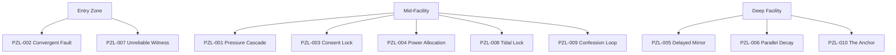

### Communication Pattern Coverage

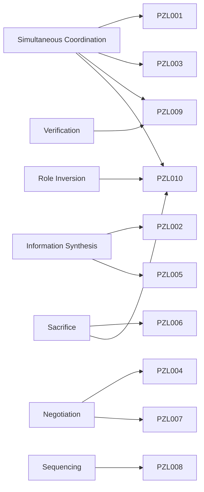

---

## Edge Cases

- A session in which all MVP Essential puzzles are available but the player count drops to 2 mid-session: PZL-001 and PZL-003 scale to 2 players. PZL-004 assigns 2 terminals per player. PZL-007 handles 2 players with the cross-examination between the two observers. PZL-008 is mechanically possible at 2 players with increased movement demand. No essential puzzle requires 3+ players at minimum.
- A player who does not use voice chat: PZL-002 can be completed with text input (pings and short messages). PZL-007 is significantly harder. PZL-001, PZL-003, PZL-009 rely on timing communication that is extremely difficult without voice. Accessibility fallback for all: ping system that allows pre-agreed signals for "ready," "abort," and "now." Define the minimum non-voice fallback per puzzle in each puzzle's Accessibility Notes.
- Two puzzles simultaneously active: the framework supports concurrent puzzles via independent `PuzzleState` instances. The Pressure System will accumulate contributions from multiple sources. No two MVP-essential puzzles should be placed in the facility such that they can be simultaneously triggered — pace them through objective prerequisites.

## Design Decisions

### Decision 1: Communication Style Is the Primary Identity of Each Puzzle

Every puzzle in this library was selected for its primary communication pattern, not for its visual presentation or mechanical complexity. When a puzzle variant is considered, it must be evaluated first for whether it introduces a new communication style, not whether it looks different.

### Decision 2: No Puzzle Uses a "Guide and Executor" Dynamic as Its Primary Structure

Every puzzle requires both information contribution and physical action from more than one player. No player sits in a room and simply reads clues to a passive executor. Even PZL-007's observers both contribute information and both have their information challenged.

### Decision 3: High-Difficulty Puzzles Carry Severe Consequences

PZL-005, PZL-006, and PZL-010 carry `FailureSeverityTier: Severe`. This is intentional. These puzzles are placed late in the facility where pressure is already elevated. A failure should feel costly. Reserve lower-consequence placements for the entry and mid-facility puzzles.

### Decision 4: Replayability Requires Session-Variable Parameters

Every puzzle in this library has at least one session-variable parameter (randomized value, randomized location, randomized assignment). Puzzles that would resolve identically every session (fixed code, fixed protocol, fixed sequence) have been explicitly designed to shuffle those elements on each attempt.

## Future Improvements

- Define a second tier of puzzle variants for each MVP Essential puzzle, buildable from the same system infrastructure.
- Introduce cross-puzzle dependencies where one puzzle's resolution changes another puzzle's configuration (e.g., depowering system in PZL-004 affects node availability in PZL-008).
- Add facility-specific flavor versions of each puzzle that use the facility's thematic systems rather than generic facility components.
- Introduce time-limited modifiers: puzzle windows that only open during specific Band states, creating "opportunity puzzles" that reward teams for managing pressure.

## Risks

- If the creature's behavior is not tuned per facility zone, PZL-005, PZL-006, and PZL-010 may be unapproachable in their intended placement.
- PZL-010's sensor grid is the most technically novel feature in this library. If the creature position buffer fails, the puzzle becomes a pure guessing exercise with no communication value. The buffer must be treated as a first-class system, not a single-puzzle feature.
- PZL-007's reliability depends on the Asymmetric Reality system producing consistent reality-layer divergence per session. If the divergence is randomly insufficient (e.g., all 3 indicators match between observers), the puzzle cannot be played as designed. Build a validation check at puzzle activation that guarantees at least 1 and at most 2 conflicting indicators before the puzzle enters Available state.
- PZL-009 depends heavily on voice communication quality. On platforms with poor voice quality or in sessions with players who prefer non-verbal communication, the 8-second display window creates an irrecoverable failure state if the code cannot be relayed. Ensure the accessibility audio read-back option is enabled by default, not opt-in.

## Open Questions

- Should PZL-005 (Delayed Mirror) be redesigned to use a 10-second delay instead of 20 seconds for the MVP, with the longer delay as a difficulty modifier? The shorter delay reduces inference burden while preserving the core temporal uncertainty mechanic.
- Should PZL-010 (The Anchor) be triggered manually by player choice or automatically by objective progression? Manual choice preserves agency but may result in teams avoiding it. Automatic trigger ensures the team encounters it but removes consent.
- How many instances of each puzzle should appear in a single facility run? Current design assumes one instance per facility. Should certain puzzles (PZL-001, PZL-002, PZL-008) appear multiple times per run with different parameters to establish the mechanic before escalating difficulty?
- Should the Blocked state for any puzzle be resolvable through a different route that completely bypasses the puzzle (skip it entirely) versus retrieving resources to retry? Bypasses reduce frustration but reduce pressure diversity. Resource retrieval preserves pressure but adds navigation burden.

