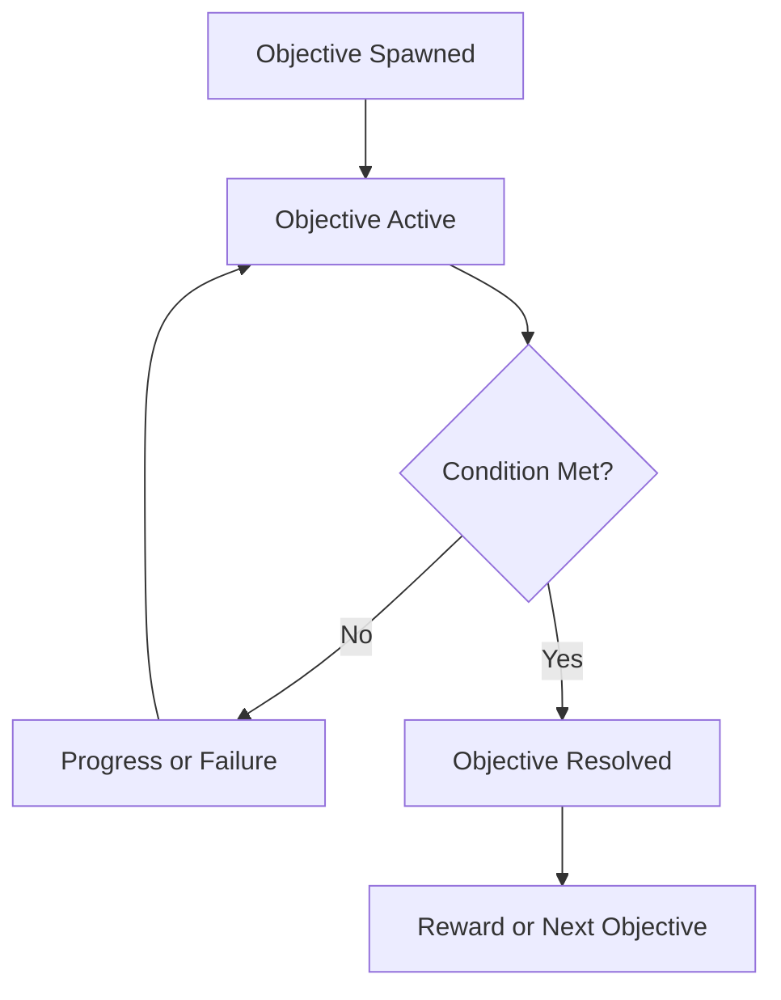

# Objective System

## Purpose

This document defines how objectives are created, tracked, completed, and failed in Project Echo. It establishes the rules that connect player actions, puzzle resolution, environmental changes, and the escape condition into a coherent session flow.

## Scope

This document covers:

- Objective categories and lifecycle
- Success and failure handling
- Progress tracking and visibility
- Objective dependencies and branching
- Match-end conditions

This document does not define every individual objective in the first facility.

## Dependencies

- The objective system must integrate with the puzzle framework and player systems.
- Objective stall and progress events are the sole input to the Delay meter defined in [docs/GDD/11 Stress System.md](docs/GDD/11%20Stress%20System.md), which is the sole authority for pressure/threat. This document no longer describes pressure consequence in prose; it emits the specific events listed in §Pressure Integration below.
- Objectives must be understandable to players and maintainable by designers.
- The system must support short-session pacing and dynamic difficulty.

## Diagrams

### Objective Lifecycle

### Objective Dependency Graph

## Examples

### Example 1: Multi-Step Objective

The team must restore power to a corridor, then use the newly available maintenance access to reach a relay panel, and finally open the exit hatch. Each step depends on the previous one and creates a clear progression path.

### Example 2: Conditional Objective

A panel can only be activated if the team has previously prevented the creature from reaching a specific room. This introduces a dynamic dependency that changes based on match state.

## Edge Cases

- An objective becomes impossible because a required object is unavailable.
- The team resolves an objective too early and creates a new hazard unexpectedly.
- The game spawns an objective that requires information only one player possesses.
- A player disconnects before an objective can be completed.
- The match reaches an objective state that cannot be resolved because of a bug or missing dependency.

## Design Decisions

### Decision 1: Objectives Must Be Understandable at a Glance

Players should always know what they are trying to do, even if the exact solution is not obvious. The objective system should present clear states such as active, blocked, in progress, and complete.

### Decision 2: Objectives Should Create Narrative Momentum

The objectives should feel like a coherent sequence of actions inside the facility rather than disconnected tasks. Each objective should contribute to the meaning of the run.

### Decision 3: Failure Should Change the State of the Match

Failure should not simply reset the objective. It contributes directly to the Delay meter (see §Pressure Integration) and may alter the environment or change the future set of options available to the team.

### Decision 4: The System Must Support Branching

The game should allow objectives to change based on player success, creature escalation, or environmental state. This keeps matches varied and supports replayability.

## Balancing Notes

- The objective count should keep the session between 15 and 30 minutes.
- Hard objectives should be paired with enough support information to keep the team moving.
- The game should avoid forcing the team into long periods of idle waiting.
- Failed objectives should create a meaningful cost without completely stalling the match; the specific cost is the Delay meter's zero-passive-decay rule (11 Stress System.md) — waiting alone never reduces it, only a Progress or Resolved event does.

## Pressure Integration

This system emits exactly three event types to the Pressure System, and defines no pressure value itself:

| Event | Emitted when | Effect on Delay (`D`) in 11 Stress System.md |
|---|---|---|
| `ObjectiveStalled` | An Active objective has produced no `Progress` event for 30.0s (the grace period), then again every 12.0s thereafter | `D += 1.00` per occurrence, capped at 10 |
| `ObjectiveProgress` | Any partial-completion state change on the active objective (e.g., one step of a multi-step objective per Example 1) | `D -= 4.00` instantly (floor 0) |
| `ObjectiveResolved` | The objective reaches its Resolved state | `D` resets to 0 instantly |

The ObjectiveManager (see Implementation Notes) is responsible for firing these three events; it does not compute or store a Delay or pressure value itself.

## Developer Notes

- Represent objectives as data-driven tasks with a defined lifecycle and dependency graph.
- Support both active objectives and hidden objectives that become visible once conditions are met.
- Provide a deterministic logging interface for objective start, update, completion, and failure events.
- Ensure objective state is authoritative and replicated across clients.

## Implementation Notes

- Implement a central ObjectiveManager that receives objective events from systems such as puzzles, player interactions, hazards, and creature escalation.
- Use a shared objective state model with fields for status, progress, dependency IDs, and completion conditions.
- Tie objective completion to the match flow and progression tracker.
- Use event-based callbacks so new objective types can be added without rewriting the manager.
- The ObjectiveManager must fire `ObjectiveStalled`, `ObjectiveProgress`, and `ObjectiveResolved` per the §Pressure Integration table above; these are the only events 11 Stress System.md listens for from this system.

## Future Improvements

- Add more complex branching objectives and dynamic mission structures.
- Support procedural objective generation based on facility state.
- Expand post-session objective summaries for review and analysis.

## Risks

- Too many objectives can create cognitive overload.
- Poorly scoped dependencies can create deadlocks.
- A weak objective presentation can make the team feel lost even when progress is occurring.

## Open Questions

- Should objectives be visible to all players at all times, or partially hidden for story reasons?
- How much objective branching should exist in the MVP?
- What is the maximum acceptable number of active objectives at once?
