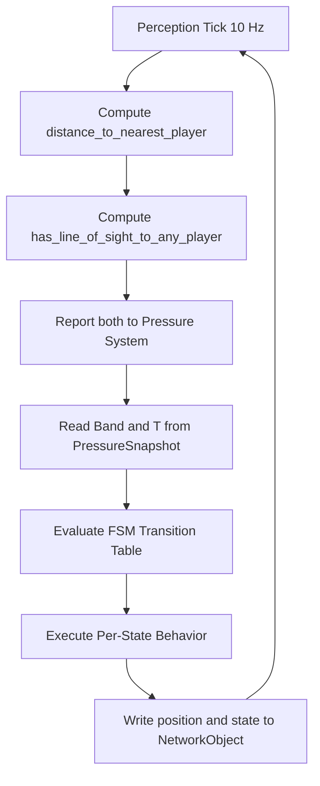
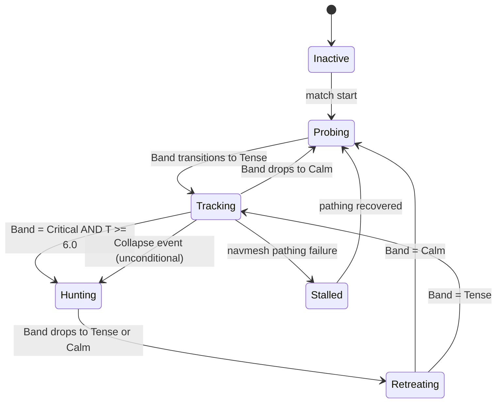

# Monster AI

## Purpose

This document defines the complete behavior specification for Project Echo's creature — its perception system, movement model, per-state behavior, patrol architecture, player contact rules, distraction model, puzzle integration, networking ownership, save behavior, and QA requirements. The creature is not a combat system. It is the game's pressure engine: a system that converts team mistakes, hesitation, and poor coordination into escalating danger.

> **Authority Notice:** This document is the sole authority on creature behavior, movement, perception, and player contact. It does not define pressure values — those are owned by [docs/GDD/11 Stress System.md](11%20Stress%20System.md). The creature's FSM state is a direct function of `Band` and `T` read from the Pressure System's replicated snapshot. This document defines what the creature *does* in each state; 11 Stress System.md defines when it enters each state.

## Scope

This document covers:

- The creature's behavioral goals and design identity
- The perception system and what it reports to the Pressure System
- The FSM state model and per-state behavior specification
- The movement system: speeds, patrol architecture, and Last Known Position
- The investigation and distraction sub-systems
- Player contact rules and outcomes
- Puzzle-specific creature integration (PZL-005, PZL-006, PZL-010)
- Audio and visual signal design per state
- Networking ownership and replication
- Late join, host migration, and save/load behavior
- Analytics events
- QA checklist

This document does not define:
- Pressure values, thresholds, or formulas — owned by 11 Stress System.md
- Audio asset specifications — owned by 18 Audio.md
- Visual asset specifications — owned by art direction documentation
- Lore, creature origin, or narrative details — owned by narrative documentation

## Dependencies

- The creature FSM reads `Band` and `T` from the `PressureSnapshot` defined in [11 Stress System.md](11%20Stress%20System.md). These are the only values that drive state transitions. The creature computes no scoring of its own.
- The creature is the source of raw `distance_to_nearest_player` and `has_line_of_sight_to_any_player` data that 11 Stress System.md consumes to compute the Threat meter `T`. Sensing is owned here; scoring is owned there.
- The creature's Detection Radius is fixed at **18.0 meters** for the MVP. This value is defined in 11 Stress System.md's `T` formula (`T = 10 × clamp(0, 1, 1 − d / 18.0)`) and must not be tuned independently in this document. Any change to the Detection Radius must be made in 11 Stress System.md; this document inherits it by reference.
- Movement, player contact, and distraction events contribute to `N` (Noise) via the Event→Meter table in 11 Stress System.md. The creature does not write to `N` directly; the events it generates are consumed by the Noise meter's existing event listeners.
- Puzzle integration (PZL-005 position buffer, PZL-010 attraction modifier) is specified in [08 Puzzle Library](08%20Puzzle%20Library.md) and referenced here as implementation coordination notes.
- Networking authority follows the Host Model defined in [technical/NetworkArchitecture.md](../../technical/NetworkArchitecture.md) and ADR-0002.

---

## Diagrams

### Creature Decision Loop



### Creature FSM



### System Authority Diagram

```mermaid
flowchart LR
    C[Creature Perception] -->|distance + LoS flag| PS[Pressure System]
    PS -->|Band, T in PressureSnapshot| C
    C -->|creature position, state| NC[NetworkObject replicated to clients]
    PZL010[PZL-010 Anchor Puzzle] -->|attraction weight| C
    PZL005[PZL-005 Position Buffer Request| C -->|creature position history| PZL005
```

---

## Behavioral Identity

### Identity Principle 1: The Creature Is a Pressure Layer, Not a Combat System

The creature does not attack, deal damage, or create health attrition. Player contact results in temporary incapacitation — a state managed by 04 Player Systems — not death. The creature's purpose is to make coordination harder, not to punish individual players for combat failure. This distinction is fundamental: the creature makes the *team* feel threatened, not the individual.

### Identity Principle 2: The Creature Responds to Team Behavior

The creature does not operate on random timers or scripted patrol loops. Its escalation state is a direct product of team noise, hesitation, uncertainty, and proximity. A team that coordinates well can meaningfully reduce creature danger through skillful play. A team that panics will reliably escalate the creature's state.

### Identity Principle 3: The Creature Is Partially Readable

Players should be able to infer what the creature is doing from audio and environmental signals. They should not be able to predict its exact path or timing with certainty. The `T >= 6.0` Hunting gate exists specifically to preserve this property: the creature can be in Critical band without hunting if the team has kept their distance, giving them an observable "danger but not immediate threat" state.

### Identity Principle 4: The Creature Creates New Problems, Not Just End States

Player contact should not terminate a run or create a hard punishment loop. It should redirect the team's priorities, consume their resources, and introduce new communication demands. The creature's most important contribution to any session is the conversation the team has in response to it.

### Identity Principle 5: The Creature Is a Shared Threat

The creature's state is driven by team-wide `P` — not individual player behavior in isolation. An individual player's mistake raises pressure for the whole team, but the creature does not personally track or disproportionately target individual players (except during PZL-010, where an explicit attraction modifier applies).

---

## Perception System

The creature's perception system is a sensor module that runs at the same 10 Hz tick rate as the Pressure System. It produces two outputs per tick: `distance_to_nearest_player` and `has_line_of_sight_to_any_player`. These outputs are the only data the Pressure System reads from the creature.

### Distance Sensing

At each tick, the creature computes the Euclidean distance from its world position to the world position of each connected player. `distance_to_nearest_player` is the minimum of all per-player distances.

- Players who are incapacitated (see §Player Contact) are excluded from the distance computation for the tick during which the incapacitation begins. From the following tick, incapacitated players are included but their positions are frozen at the incapacitation point.
- Disconnected players are excluded from all distance computation immediately on disconnect.
- The 18.0-meter Detection Radius is used by the Pressure System's `T` formula. The creature itself has no internal distance threshold — it responds to `Band` and `T`, not to raw distance.

### Line-of-Sight Sensing

`has_line_of_sight_to_any_player` is `true` if a raycast from the creature's eye position to any player's body center is unobstructed by environment geometry.

- Line-of-sight is evaluated independently per player. If any player is in line of sight, the flag is `true`.
- A 0.5-second grace timer prevents single-frame LoS loss from clearing the flag. If LoS is lost, the flag transitions to `false` only after 0.5 seconds of continuous LoS absence. This prevents brief obstruction events (a pillar corner, a door edge) from falsely signaling LoS loss during a hunt.
- Incapacitated players remain in the LoS computation (a downed player still has a position that the creature can see).

### Noise Event Reception

The creature does not maintain an internal noise score. High-noise events (above the Investigation Threshold defined below) that are registered in the Pressure System's Noise meter simultaneously create a `NoiseEvent` payload with a world position (the source of the noise). The creature's Investigation sub-system reads these events per tick during Probing and Tracking states (see §Investigation Sub-System).

The creature does not read `N` directly. It reads `NoiseEvent` payloads. The distinction matters: the Noise meter accumulates over time, but the creature only reacts to individual noise events above the threshold, not to the cumulative meter value.

### Perception Module Interface

```csharp
public class CreaturePerception : MonoBehaviour
{
    public float DistanceToNearestPlayer { get; private set; }
    public bool HasLineOfSightToAnyPlayer { get; private set; }

    // Called once per tick by the creature's update loop
    public void Tick(IReadOnlyList<PlayerState> players) { ... }

    // Called when a NoiseEvent above InvestigationThreshold is registered
    public void OnNoiseEvent(NoiseEvent evt) { ... }

    public static float DetectionRadius => PressureSystem.DetectionRadius; // 18.0m
    public static float InvestigationThreshold = 2.0f; // N contribution >= 2.0 triggers investigation
}
```

---

## FSM State Model

The creature has five active states. Transitions are defined by the following table. No state transition may be triggered by the creature itself — all transitions result from reading `Band` and `T` from the Pressure System's snapshot.

| State | Entry Condition | Exit Condition | Behavior Summary |
|---|---|---|---|
| Inactive | Pre-match | Match start → Probing | No movement, no sensing |
| Probing | Band = Calm (from any state) | Band ≥ Tense → Tracking | Wide patrol, investigates loud events |
| Tracking | Band = Tense | Band = Calm → Probing; Band = Critical and T ≥ 6.0 → Hunting; pathing failure → Stalled | Directed toward LKP; patrol narrows |
| Hunting | Band = Critical and T ≥ 6.0, OR any Collapse event | Band ≤ Tense → Retreating | Full pursuit of nearest player; no detours |
| Retreating | Exiting Hunting | Band = Calm → Probing; Band = Tense → Tracking | Moves away from team; speed reduces |
| Stalled | Navmesh pathing failure during Tracking | Pathing recovered → Probing | Stationary; recovery attempts; audio signal |

### State Transition Rules

- State transitions are evaluated once per tick after the Pressure System snapshot is read.
- Transitions trigger audio and visual signals on the frame they occur (see §Audio and Visual Signals).
- No transition may be triggered by the creature's own state. The creature FSM is purely reactive — it is a consumer, not a producer, of pressure state.
- Collapse-triggered Hunting (the unconditional entry) ignores the `T >= 6.0` gate. During a Collapse event, the creature enters Hunting regardless of distance. This is intentional: Collapse represents a systemic crisis that forces creature engagement independent of positioning.

---

## Movement System

> **Constants Authority:** All numeric values in this section — movement speeds, detection radii, timers, contact ranges, buffer sizes, and pathfinding modifiers — are owned by [`docs/GDD/Gameplay Constants Bible.md`](Gameplay%20Constants%20Bible.md) §Monster Constants. Values shown here are for readability and implementation context only. To tune any creature constant, edit the Bible.

### Speed Table

| State | Base Speed | Notes |
|---|---|---|
| Inactive | 0 m/s | No movement |
| Probing | 2.5 m/s | Walking pace; patrol path traversal |
| Tracking | 4.5 m/s | Directed movement toward LKP |
| Hunting | 7.0 m/s | Full sprint to nearest player |
| Retreating | 3.5 m/s decelerating to 2.0 m/s | Decelerates over 12 seconds from transition |
| Stalled | 0 m/s | Stationary until recovery |

All speeds are expressed in world units per second. Movement uses navmesh-constrained pathfinding. The creature cannot pass through walls, locked doors, or explicitly blocked navmesh areas.

### Patrol Architecture (Probing State)

During Probing, the creature follows a facility-specific patrol graph. The patrol graph is a directed graph of waypoints, defined per facility in the level design data. Patrol behavior:

- The creature traverses waypoints in order, looping when the last waypoint is reached.
- At each waypoint, the creature pauses for 2–4 seconds (randomized) before continuing.
- Pause duration is the primary source of patrol unpredictability during Probing.
- If a `NoiseEvent` above the Investigation Threshold is received during a pause or between waypoints, the creature enters the Investigation sub-system before resuming patrol.
- Patrol waypoint progress is the only session-persistent creature movement data (see §Save Behavior).

**Patrol graph requirements (per level design):**
- Minimum 6 waypoints per patrol graph.
- No two consecutive waypoints may be in the same room.
- At least one waypoint must pass through each objective zone per facility.
- Patrol waypoints must not cluster in any single facility section (maximum 2 waypoints within any 20×20m area).

### Last Known Position (Tracking State)

When the creature transitions to Tracking, it records the Last Known Position (LKP). LKP is the world position of the nearest player at the tick of transition. The creature moves toward LKP until it either:

- Arrives within 3 meters of LKP (LKP is then cleared; creature enters a local search pattern for 8 seconds before resuming patrol within Tracking)
- Receives a new `NoiseEvent` above the Investigation Threshold (LKP is updated to the noise source)
- Achieves line of sight to any player (LKP is updated to that player's current position every tick while LoS is maintained)
- Transitions out of Tracking (LKP is cleared)

LKP is the creature's only memory of player position. It does not track player paths, infer routes, or predict movement. Once at LKP with no line of sight and no noise events, the creature searches locally and then resumes patrol.

**LKP local search pattern:**
When the creature reaches LKP without finding a player, it performs a 360-degree rotation scan over 4 seconds, then checks the two nearest waypoints in the patrol graph before resetting to Tracking patrol movement. This keeps the creature in the area rather than immediately returning to a fixed patrol route.

### Investigation Sub-System

The investigation sub-system is active during Probing and Tracking states. It is suspended during Hunting and Retreating.

When a `NoiseEvent` with a world position is received:
1. The creature's current path is interrupted.
2. The creature pathfinds to the `NoiseEvent` world position.
3. On arrival (within 3 meters), the creature pauses for 3–5 seconds, performing a look-around animation.
4. If no player is found (no LoS), the creature resumes its prior state behavior (patrol in Probing, LKP pursuit in Tracking).
5. If LoS is achieved during investigation, `T` rises and may trigger a state transition in the next tick.

Investigation does not change the FSM state — it is a sub-behavior within Probing or Tracking. The creature is still in Probing or Tracking during investigation; only its movement target temporarily changes.

Investigation events do not stack. If two `NoiseEvent` payloads arrive while the creature is already investigating, only the higher-priority one (closer to the creature's current position) is queued. The second is discarded.

### Distraction Sub-System

Some puzzle interactions (PZL-010 distraction nodes) and environmental events generate `DistractionEvent` payloads. A `DistractionEvent` is structurally identical to a `NoiseEvent` but carries a `duration` field (seconds) and a `priority` field (Normal or High).

During Probing and Tracking, the creature responds to `DistractionEvent` the same way it responds to `NoiseEvent`. The `duration` field specifies how long the investigation pause at the distraction source lasts (replacing the default 3–5 second pause).

During Hunting, `DistractionEvent` with `priority: Normal` is ignored. `DistractionEvent` with `priority: High` is accepted only if it arrives within 3 meters of the current hunt target's position (it is effectively treated as a noise event from the hunt target's vicinity). This prevents distractions from trivially aborting hunts, while allowing environmental events near the player to have some redirecting effect.

---

## Per-State Behavior Specification

### Probing

**Goal**: Maintain facility presence and investigate environmental anomalies. The creature should feel present and aware, but not immediately threatening.

**Movement**: Traverse patrol graph at 2.5 m/s with 2–4 second pauses at waypoints.

**Perception**: Full perception active. Both distance and LoS computed every tick. Investigation sub-system active.

**Response to team actions**:
- `NoiseEvent` above Investigation Threshold (≥ 2.0 N contribution): creature investigates source.
- Player within Detection Radius with LoS: `T` rises (11 Stress System computes). If this causes `Band` to reach Tense, creature transitions to Tracking on the next tick.
- Player within Detection Radius without LoS: `T` rises. Creature does not investigate unless a `NoiseEvent` is also generated.

**Audio signals**: Ambient creature sounds — distant footsteps, environmental disturbances attributed to creature presence. No directed pursuit sounds. Players in the same room may hear creature movement; players in adjacent rooms hear only faint ambient signals. See 18 Audio.md for asset specifications.

**Visual signals**: Creature is visible at patrol waypoints if a player has LoS. Creature silhouette should be readable at 15 meters. No glow, no highlighting.

### Tracking

**Goal**: Close in on the area where the team is known or suspected to be. The creature is alert and directed but not yet in full pursuit.

**Movement**: Move toward LKP at 4.5 m/s. Perform LKP local search on arrival if no player found.

**Perception**: Full perception active. LoS acquisition immediately updates LKP. Investigation sub-system active but deprioritized vs. LKP pursuit (the creature will investigate a `NoiseEvent` only if it is between the creature and LKP or within 8 meters of the current position — it does not detour significantly from LKP pursuit for investigations).

**Response to team actions**:
- `NoiseEvent` above Investigation Threshold: creature updates LKP to noise source if noise source is closer than current LKP.
- Player in LoS: LKP updated to player's current position every tick. `T` rises. If `T >= 6.0` and `Band = Critical`, transitions to Hunting.
- Player leaves LoS: LKP is frozen at last LoS position. Creature continues toward that position.
- Collapse event: transitions to Hunting unconditionally.

**Audio signals**: Increased activity sounds. Louder creature footsteps that are directionally audible to players in nearby rooms. A low ambient "hunt approaching" sound layer that increases in volume as the creature gets closer to the team's area. See 18 Audio.md for the specific audio layer transitions.

**Visual signals**: Creature moves with noticeably more purpose than Probing. Head orientation tracks toward LKP. Visible to players at reduced LoS distance (10 meters clearly identifiable vs. 15 meters in Probing).

### Hunting

**Goal**: Reach the nearest player as quickly as possible. No detours. No investigation. No patrol.

**Movement**: Sprint at 7.0 m/s toward the nearest player's current position. Path is recalculated every 0.5 seconds to account for player movement. The creature will use the shortest available navmesh path; it does not flank or predict routes.

**Perception**: Perception still runs (distance and LoS reported for `T` calculation). Investigation sub-system suspended. LKP is continuously updated to nearest player's position (effectively LKP = live player position during Hunting).

**Response to team actions**:
- Player dodges behind cover: creature continues toward last-tick position, path recalculates. If LoS is lost for more than 5 seconds and the creature cannot pathfind to a position with LoS, it slows to Tracking speed and continues toward last known position.
- Collapse event (already in Hunting): no change. Collapse re-enters Hunting if the creature has already transitioned out; it is redundant if already in Hunting.
- Player creates distraction (High priority `DistractionEvent` within 3m of hunt target): creature may briefly investigate before returning to target.
- Player contact: see §Player Contact.

**Audio signals**: Full pursuit audio. Loud, immediate creature sounds audible throughout the facility. All players receive the pursuit audio regardless of their distance from the creature. Player heartbeat audio intensifies per `S_i` (per 11 Stress System.md §Per-Player Stress). See 18 Audio.md.

**Visual signals**: Creature silhouette fully illuminated by its own bioluminescence or emission (art direction). Clearly readable at maximum detection distance. Motion blur or animation accelerate to communicate speed.

### Retreating

**Goal**: Return to a non-threatening posture after Hunting state. The creature should feel like it has receded but not disappeared.

**Movement**: Move away from the team's last known position at 3.5 m/s, decelerating to 2.0 m/s over 12 seconds. Target position is the patrol waypoint furthest from the nearest player.

**Perception**: Perception active but reaction thresholds are elevated. Investigation sub-system resumes but investigation pause is reduced to 1–2 seconds (the creature is less interested in noises during retreat). LoS still updates `T`.

**Response to team actions**:
- Band transitions to Calm: transitions to Probing.
- Band remains Tense at end of Retreating (no further `T` drop): transitions to Tracking.
- Player actively follows the creature and maintains LoS: `T` does not drop; `Band` may remain elevated; transition back to Tracking or Hunting is possible.

**Audio signals**: Receding creature sounds. Footsteps decreasing in volume. Environmental settling sounds (doors, debris). The team should audibly register that the creature is leaving but not be certain it is gone.

**Visual signals**: Creature visible moving away if player has LoS. Creature silhouette less prominent than in Hunting — emission or bioluminescence reduced.

### Stalled

**Goal**: Graceful failure state when navmesh cannot produce a valid path during Tracking. The creature holds position until pathing recovers.

**Entry**: Navmesh returns no valid path to LKP during Tracking for 3 consecutive tick attempts.

**Movement**: Stationary. Creature performs a look-around animation (head rotation, periodic full-body turns).

**Perception**: Perception active at full sensitivity. LoS and distance continue to update `T`. Investigation sub-system active: if a `NoiseEvent` arrives with a reachable position, the creature attempts to path there immediately. If pathing succeeds, Stalled clears and creature enters Probing (regardless of `Band` — Stalled recovery always goes through Probing as a clean reset, because the creature's spatial context is uncertain after a pathing failure).

**Recovery condition**: Navmesh returns a valid path from current position to any patrol waypoint.

**Audio signals**: Stationary creature presence sounds. A distinct "confused" audio cue that players should learn to associate with Stalled state — this is the one state where the creature's behavior gives the team an explicit safe window.

**Designer note**: Stalled should be rare. If playtests show frequent Stalled occurrences, investigate navmesh coverage gaps in the facility geometry, not the creature AI. Stalled is a fallback, not a feature.

---

## Player Contact

Player contact is the event that occurs when the creature reaches a player during Hunting state. This section defines what happens; it does not define the incapacitation state itself (owned by 04 Player Systems).

### Contact Detection

Contact is detected when:
- The creature is in Hunting state.
- The creature's world position is within **1.5 meters** of any player's world position.
- Contact detection is server-side (Host validates both positions). The 1.5-meter threshold is intentionally generous to account for player lateral movement in narrow corridors.

Contact does NOT occur:
- During Probing, Tracking, Retreating, or Stalled states. The creature walking past a player in Probing is not contact.
- With incapacitated players (player is in incapacitation state from a prior contact event).

### Contact Outcomes

**Standard Contact (non-Collapse-triggered Hunting):**
1. The contacted player enters incapacitation state for **30 seconds** (managed by 04 Player Systems).
2. Noise contribution: +3.00 to `N` (treated as a `Severe` hazard trigger in 11 Stress System.md's event table).
3. The creature transitions to Retreating immediately on contact. It does not contact a second player in the same Hunting engagement.
4. Visual and audio contact event fires on all clients.

**Collapse-triggered Hunting Contact:**
1. The contacted player enters incapacitation state for **60 seconds**.
2. Noise contribution: +3.00 to `N` (same as standard contact).
3. The creature does NOT transition to Retreating. Instead, it moves to the nearest patrol waypoint and re-evaluates its state (which will still be Hunting if `Band` remains Critical). This means the team faces a creature that may immediately return to Hunting after Collapse contact.
4. Visual and audio contact event fires on all clients with a distinct "Collapse contact" signal.

### Incapacitation State (Brief Summary)

Incapacitation is fully defined in 04 Player Systems. For coordination purposes:

- An incapacitated player cannot interact with any puzzle or objective element.
- An incapacitated player can still speak (voice chat is not restricted).
- Other players may interact with the incapacitated player to reduce incapacitation duration (an "assist" mechanic, defined in 04 Player Systems).
- The incapacitated player's position is frozen. They contribute to LoS computation as a fixed-position target.

### Contact Refractory Window

After standard contact, the creature has a 5-second refractory window during which it cannot contact any other player. This prevents multi-player contact events from cascading in a single Hunting engagement. The refractory window applies only to contact detection — the creature continues moving during the window.

After Collapse-triggered Hunting contact, there is no refractory window. The creature may immediately contact another player if it encounters one.

---

## Audio and Visual Signal Summary

Designers must ensure the creature's state is readable from audio and visual signals alone, without a UI indicator. The following table defines the signal requirements; specific audio and visual assets are defined in 18 Audio.md and art direction documentation.

| State | Audio Signal | Visual Signal | Player-Perceivable From |
|---|---|---|---|
| Probing | Ambient presence; distant footsteps | Neutral silhouette; readable at 15m | Same room and adjacent rooms (audio only) |
| Tracking | Elevated activity; directional approach sounds | Same as Probing; head oriented toward LKP | Same section of facility (audio); LoS required (visual) |
| Hunting | Full pursuit audio; facility-wide | Full emission/illumination; maximum visibility | Entire facility (audio); LoS required (visual) |
| Retreating | Receding sounds; decreasing volume | Reduced emission; receding silhouette | Same section (audio); LoS required (visual) |
| Stalled | Stationary presence; confusion cue | Stationary posture; look-around animation | Same room (audio and visual) |

**Design requirement**: Any player, after 3–5 sessions, should be able to identify the creature's current state from audio alone. The acoustic identity of each state must be unambiguous.

---

## Puzzle Integration

### PZL-005: Delayed Mirror Integration

PZL-005 requires a 20-second buffer of creature position history. This buffer is maintained by the creature's `NetworkObject` host component (the Host), not by the puzzle system.

**Buffer specification:**
- Buffer capacity: 200 frames (20 seconds × 10Hz tick rate).
- Each frame stores `CreaturePositionSample { worldPosition: float3, timestamp: float }`.
- Buffer is a circular queue. The oldest sample is discarded when the buffer is full.
- Buffer starts accumulating from match start, regardless of whether PZL-005 is active.
- Buffer is not replicated. The Host reads the buffer and pushes the 20-second-ago sample to the mirror display (a `NetworkBehaviour` on the PZL-005 prefab).
- Buffer memory: 200 × 12 bytes (float3) = 2,400 bytes. Allocated from a fixed pool at match start; not dynamically allocated per puzzle activation.

**Coordination with 08 Puzzle Library PZL-005**: The buffer serves as the data source for the mirror display. The PZL-005 puzzle system reads the 200th-oldest entry (the 20-second-ago position) on each puzzle tick and pushes it to the mirror screen `NetworkBehaviour`. The puzzle system does not own the buffer; it reads from it.

### PZL-010: The Anchor Integration

When PZL-010 enters its `Extracting` state, the creature's movement system receives an **attraction modifier** — an additive pathfinding weight that pulls the creature's pathfinding target toward the Anchor's world position.

**Attraction modifier specification:**
- Modifier applied to: creature's `NavMeshAgent` pathfinding target weight.
- Modifier value: +30% weight toward Anchor position, additive on top of existing state behavior.
- Effect during each state:
  - Probing: Anchor position becomes a high-priority patrol waypoint for the duration of Extracting.
  - Tracking: LKP weighting shifts partially toward Anchor position. Creature path is a blend between LKP and Anchor, weighted 70% LKP / 30% Anchor.
  - Hunting: Nearest player remains the primary hunt target. Anchor attraction is suppressed during Hunting — the creature does not divert from an active player to hunt the Anchor instead. This prevents the puzzle from becoming a guaranteed death trap.
  - Retreating: Retreat path continues normally. Anchor attraction resumes on transition to Probing or Tracking.
- The modifier is a `float3` world position registered on the creature's `PathfindingWeight` component. PZL-010's `PuzzleState` notifies the creature via an event on entering and exiting `Extracting`.
- If PZL-010 resolves or fails, the modifier is removed immediately.

**Circular dependency prevention**: The Anchor attraction modifier is a pathfinding weight, not a `T` modifier or `Band` modifier. The creature's proximity to the Anchor will naturally raise `T` (via the standard distance formula), which may raise `Band`, which may trigger Hunting. This is intentional and expected — but it is a natural consequence of proximity, not a direct feedback loop from the puzzle state to the Pressure System. The creature's own FSM does not know about PZL-010's state; it only responds to standard Band/T inputs.

### PZL-006: Parallel Decay — Distraction Node Integration

PZL-006's distraction points (in PZL-010's facility integration) generate `DistractionEvent` payloads with `priority: Normal`. During Probing and Tracking, the creature investigates these normally. During Hunting, Normal-priority distractions are ignored.

The distraction cooldown (45 seconds per node) is tracked by the puzzle system, not by the creature. The creature simply responds to `DistractionEvent` payloads it receives; it has no awareness of cooldowns.

---

## Networking Ownership

### Authority Model

The creature is a session-authority-owned `NetworkObject`. All creature state — position, FSM state, LKP, patrol path index, investigation target — is computed exclusively on the Host. Clients receive replicated data only.

Clients never compute creature state, predict creature transitions, or self-report creature positions. This is non-negotiable: if any client were to independently compute creature state, desync with the authoritative state would produce inconsistent threat perception across players.

### Replication Schema

| Data | Replicated To | Frequency | Notes |
|---|---|---|---|
| `CreatureWorldPosition` | All clients | 20 Hz | Higher than Pressure System (10 Hz) to allow smooth client-side interpolation. Position updates twice per tick rather than once. |
| `CreatureState` (FSM enum) | All clients | On change | Not per-tick; only replicated when the state changes. State changes are infrequent. |
| `CreatureFacingDirection` | All clients | 10 Hz | Used by client-side animation to orient creature correctly. |
| `LastKnownPosition` | All clients | On change | Published when LKP is set or cleared so all clients can produce consistent debug and audio cues. |
| `IsInvestigating` | All clients | On change | Boolean; triggers investigation animation on all clients. |
| `ContactEvent` | All clients | Immediate | Replicated as a reliable event (not dropped) on player contact. |
| `CreaturePositionBuffer` | Not replicated | N/A | Host-only buffer for PZL-005. Never sent over network. |
| `AttractionModifierActive` | Not replicated | N/A | PZL-010 communicates directly with the creature component on Host. |

### Client-Side Behavior

Clients receive position snapshots at 20 Hz and interpolate smoothly between them for rendering. Clients do not predict creature movement beyond interpolation — they render what the Host last reported, with linear interpolation to smooth the 50ms gap between snapshots.

**State change audio events**: When `CreatureState` changes on a client, the client fires the appropriate audio event for the new state (per 18 Audio.md). Audio events are triggered on state change notification, not on every tick.

### Late Join Behavior

A player joining mid-session receives:
- Current `CreatureWorldPosition` and `CreatureFacingDirection` in the connection snapshot.
- Current `CreatureState` in the connection snapshot.
- Current `LastKnownPosition` (if Tracking or Hunting).

The late joiner does not receive the `CreaturePositionBuffer` history. If PZL-005 is active when the player joins, the mirror display they see will not have a complete history — they will see whatever the 200-frame buffer contains at join time, which may be a shorter history than 20 seconds if the match has run for less than 20 seconds. This is acceptable; the buffer will fill within 20 seconds of join.

### Host Migration

If the Host migrates mid-match, the incoming Host initializes from the last acknowledged creature state snapshot:
- `CreatureWorldPosition`: restored from snapshot. The creature teleports to the snapshot position on the incoming Host. Clients receive an updated position replicated immediately after migration.
- `CreatureState`: restored from snapshot. State machine resumes from the snapshot state.
- `LastKnownPosition`: restored from snapshot.
- `PatrolPathIndex`: restored from snapshot.
- `CreaturePositionBuffer`: **cannot be restored from snapshot**. The buffer is non-replicated. On migration, the buffer is lost. PZL-005 mirror display will show incorrect data for up to 20 seconds after migration. If PZL-005 is currently Active when migration occurs, the puzzle fails cleanly (the puzzle's Host Migration rule requires ≥10 seconds of buffer history for a valid continuation; see 08 Puzzle Library §PZL-005 Host Migration Behaviour).

---

## Save/Load Behavior

### Persisted Data

| Data | Persistence Rule |
|---|---|
| `CreatureState` | Persisted. Creature resumes in the same FSM state it was in when save occurred. |
| `CreatureWorldPosition` | Persisted. Creature resumes at its saved position. |
| `PatrolPathIndex` | Persisted. Patrol continues from the saved waypoint index. |
| `LastKnownPosition` | Persisted if `CreatureState == Tracking`. Cleared if `CreatureState == Probing` or `Retreating`. |

### Non-Persisted Data

| Data | Reason for Non-Persistence |
|---|---|
| `CreaturePositionBuffer` | Runtime data; rebuilt from match start on resume. PZL-005 is not mid-session saveable per its own Save Behaviour. |
| In-flight `NoiseEvent` or `DistractionEvent` | Transient; events that were in-flight before save are discarded on load. Any noise sources that are persistent (ongoing alarms) should re-register their events on load. |
| Investigation target position | Transient; cleared on load. The creature resumes patrol or LKP movement on load without completing a prior investigation. |
| Contact refractory timer | Transient; cleared on load. Players who were contacted before save have their incapacitation timer restored by 04 Player Systems; the creature's refractory timer is not needed on load. |
| `AttractionModifierActive` (PZL-010) | Cleared on load. PZL-010 is not mid-session saveable per its own Save Behaviour; the attraction modifier cannot exist on load. |

---

## Analytics Events

| Event | Fields | Notes |
|---|---|---|
| `CreatureStateChanged` | `fromState`, `toState`, `pAtTransition`, `tAtTransition`, `timestamp` | Fired on every FSM state transition. `pAtTransition` enables correlation with pressure conditions. |
| `CreatureHuntingBegun` | `trigger: "Pressure" or "Collapse"`, `nearestPlayerId`, `nearestPlayerDistance`, `pAtTrigger`, `timestamp` | Distinguishes pressure-driven vs. Collapse-forced hunts. |
| `CreaturePlayerContact` | `contactedPlayerId`, `huntingTrigger: "Pressure" or "Collapse"`, `pAtContact`, `secondsInHuntingState`, `timestamp` | `secondsInHuntingState` tracks how long the creature was hunting before contact — informs how survivable hunts are. |
| `CreatureInvestigation` | `sourceType: "NoiseEvent" or "DistractionEvent"`, `sourceWorldPosition`, `playerProximityAtSource`, `timestamp` | `playerProximityAtSource` tracks whether the creature actually found a player nearby when it investigated. |
| `CreaturePatrolCompleted` | `patrolGraphId`, `elapsedSeconds`, `investigationCount`, `timestamp` | One event per complete patrol loop. `investigationCount` shows how many investigations interrupted the patrol. |
| `CreatureStalled` | `durationSeconds`, `worldPosition`, `timestamp` | Fired when creature exits Stalled. High frequency or long duration signals navmesh coverage gaps to address. |
| `PZL010AttractionActive` | `anchorPlayerId`, `timestamp` | Fired when PZL-010 applies attraction modifier. Paired with `PZL010AttractionCleared` on puzzle resolution or failure. |

---

## Accessibility Notes

- The creature must be readable from audio signals alone. Players with visual impairments must be able to infer the creature's state (Probing vs. Tracking vs. Hunting vs. Retreating) from the audio layer. See 18 Audio.md for audio design requirements.
- The creature's world position must not be a required visual read for safe navigation. Players who use audio-first navigation must be able to detect the creature approaching and avoid it without seeing it.
- Contact outcome (incapacitation) must be communicated through audio, haptic, and visual channels simultaneously. Audio-only or visual-only contact signals are not acceptable.
- During Hunting, the facility-wide pursuit audio must respect per-player volume limits. The audio system must not exceed accessibility-safe decibel levels regardless of creature state. See 18 Audio.md for volume caps.
- Creature movement speed (7.0 m/s in Hunting) is significantly faster than the player's accessibility walking speed. Accessibility players must have a reliable audio cue that begins before the creature is within contact range (at minimum 6 meters from nearest player during Hunting). This gives accessibility-speed players approximately 0.85 seconds of warning — this is the lower bound; level design must not create corridors so narrow that 0.85 seconds is insufficient for course correction.

---

## Edge Cases

- **Creature reaches LKP during Tracking, player is not there**: creature performs local search pattern (8-second, 360-degree scan plus nearest waypoint check) before returning to patrol. This is the expected behavior; do not treat it as an anomaly.
- **Creature transitions from Hunting to Retreating mid-sprint**: movement immediately changes target from nearest player to furthest patrol waypoint. The transition may produce a visible direction change. Speed begins decelerating from 7.0 m/s at transition.
- **Two players in separate rooms both within Detection Radius**: `distance_to_nearest_player` is the minimum of both. `T` reflects the nearest. The further player does not contribute a separate `T` reading. This means a team that splits up is not more dangerous than a team that stays together (as far as `T` is concerned) — only the nearest player's distance matters.
- **Player jumps to a navmesh-disconnected area (accidental or intentional)**: creature cannot pathfind to that position. If this prevents LKP pursuit, creature may enter Stalled. This is an intended edge case; navmesh should be authored to minimize disconnected areas. If the player is in a disconnected area, `T` still reflects their distance (proximity is computed by world distance, not navmesh distance).
- **Collapse event fires while creature is already in Hunting**: no state change. The creature is already in Hunting. The Collapse event's "forced Hunting" entry condition is a no-op if the creature is already Hunting. However, the Collapse event's `priority: High` distraction immunity and the 60-second incapacitation duration of contact should still apply for the duration of the Collapse window.
- **Multiple players simultaneously in contact range during Hunting**: only the player that was nearest at contact detection is the contacted player. Contact detection resolves one contact per frame, in order of proximity. After the first contact, the 5-second refractory window applies (non-Collapse) or the creature moves to a waypoint (Collapse), preventing a second immediate contact.
- **PZL-010 Anchor player is the nearest player during Hunting**: the Anchor attraction modifier does not override Hunting behavior. During Hunting, nearest player is always the primary target — and if the Anchor is the nearest player, the creature will naturally hunt the Anchor. This is a risk the PZL-010 team must manage.
- **Creature enters Stalled within 3 meters of a player**: the player is not in danger (Stalled has no contact detection). The creature will attempt to recover pathing. If pathing recovers, it transitions to Probing — not directly to Tracking or Hunting. This gives the nearby player a brief safe window.
- **Host migration during active Hunting contact**: contact event is fired as a reliable RPC before migration. The contacted player's incapacitation begins. Post-migration, the creature's state is restored from snapshot (Hunting, last position). The contact refractory timer is lost; the incoming Host should treat the migration frame as if the refractory window just began.

---

## Exploit Prevention

- Creature state is computed exclusively on the Host. No client can submit a state report, a contact claim, or an LKP update. All creature data flows from Host to clients, never the reverse.
- Contact detection is Host-side (proximity check between Host-authoritative creature position and Host-authoritative player positions). Clients cannot spoof contact or avoid contact by manipulating their reported position.
- The `T` formula in 11 Stress System.md uses `distance_to_nearest_player` as computed by the Host. No client can alter their perceived distance to the creature to reduce `T`.
- Investigation and distraction events are generated by server-authoritative systems (Pressure System for `NoiseEvent`, puzzle systems for `DistractionEvent`). Clients cannot inject false events.

---

## Balancing Notes

- **Movement speed tuning**: the primary tension driver is the speed difference between Tracking (4.5 m/s) and Hunting (7.0 m/s). Player walking speed is approximately 3.0 m/s. This means the creature closes distance at +1.5 m/s while Tracking, and +4.0 m/s while Hunting. A 15-meter head start gives the team about 10 seconds while Tracking, about 3.75 seconds while Hunting. Tune these values based on facility scale.
- **Detection Radius (18.0 m)**: inherited from 11 Stress System. Changing it requires changing it there and verifying all references in this document. Do not tune here.
- **Investigation Threshold (2.0 N contribution)**: the primary knob for how "loud" a player must be to draw creature investigation. Lowering it makes the creature more reactive (investigates smaller noise events); raising it makes it less reactive. Target: puzzle failure events (Moderate = 2.25, Severe = 3.00) should reliably trigger investigation. Sprint noise (0.40/tick) should not trigger investigation from a single tick.
- **Pause duration at patrol waypoints (2–4 seconds randomized)**: the primary source of patrol unpredictability during Probing. Reducing the range (e.g., 1–2 seconds) produces a more predictable patrol; increasing it (3–6 seconds) produces more ambiguity. Keep the minimum ≥1 second to prevent the creature from appearing to teleport between waypoints.
- **Contact incapacitation duration (30 / 60 seconds)**: 30 seconds should be long enough to be meaningfully disruptive (other players must compensate for the missing team member) but not so long that a single contact ends the session's viability. If playtests show 30 seconds is too short to be felt, increase in 5-second increments. The 60-second Collapse contact is a deliberate punishment for sustained critical pressure.

---

## QA Checklist

- [ ] Creature state transitions match the FSM table exactly for all six Band/T combinations.
- [ ] Collapse event unconditionally triggers Hunting, regardless of `T` value or current state.
- [ ] Probing patrol visits all waypoints in order and loops correctly.
- [ ] LKP is set on Tracking entry and cleared on Tracking exit.
- [ ] LKP local search (8-second, 360-degree scan + nearest waypoints) fires when creature arrives at LKP without finding a player.
- [ ] Investigation sub-system fires on `NoiseEvent` ≥ 2.0 N contribution in Probing and Tracking states.
- [ ] Investigation does not fire during Hunting or Retreating.
- [ ] Normal-priority `DistractionEvent` is ignored during Hunting.
- [ ] High-priority `DistractionEvent` is accepted during Hunting only if within 3 meters of hunt target.
- [ ] Contact detection fires within 1.5 meters at Host-authoritative positions.
- [ ] Standard contact: player incapacitated 30 seconds, creature transitions to Retreating, refractory window begins.
- [ ] Collapse contact: player incapacitated 60 seconds, creature moves to nearest waypoint, no refractory window.
- [ ] Refractory window (5 seconds) prevents second contact in same Hunting engagement.
- [ ] Retreating speed decelerates from 3.5 m/s to 2.0 m/s over 12 seconds.
- [ ] Stalled: creature stationary, look-around animation, recovery attempts, transitions to Probing on recovery.
- [ ] LoS grace timer (0.5 seconds) prevents single-frame LoS loss from falsely clearing `has_line_of_sight_to_any_player`.
- [ ] `CreatureWorldPosition` replicates at 20 Hz. `CreatureState` replicates on change only.
- [ ] `CreaturePositionBuffer` is not replicated. Verified by network traffic inspection.
- [ ] PZL-005 mirror display receives correct 20-second-ago position from buffer.
- [ ] PZL-010 attraction modifier applies during Probing and Tracking; suppressed during Hunting.
- [ ] PZL-010 attraction modifier removed immediately on puzzle resolution or failure.
- [ ] Host migration restores creature to snapshot position and state. Buffer is lost (expected).
- [ ] On save/load: creature resumes at saved position in saved state. Investigation target is cleared.
- [ ] `CreatureStateChanged` analytics event fires on every FSM transition.
- [ ] Stalled state is rare in standard facility geometry. Flag if encountered more than once per 5 sessions in any zone.
- [ ] Creature audio signals are state-distinct and identifiable without visual confirmation in player testing.
- [ ] Creature contact signal fires on all clients simultaneously (reliable event).
- [ ] Two players in simultaneous contact range: only nearest player is contacted. Refractory window applies.

---

## Examples

### Example 1: Noise-Driven Escalation

The team fails PZL-001 (Pressure Cascade). The failure generates +2.25 to `N`, pushing `N` to 4.5. Combined with `T = 2.0` (creature is 15 meters away, Probing), `P = 6.5` — still in Calm. A second puzzle failure brings `N` to 6.75, `P = 8.75` — still Calm but approaching the threshold. The team fails a third time. `N = 9.0`, `P = 11.0` — Band transitions to Tense. The creature transitions from Probing to Tracking. Team now hears directional audio shifting. They understand they must reduce noise, confirm their next puzzle attempt, and separate from the creature.

### Example 2: LKP Pursuit and Evasion

Team is in Tracking band. The creature's LKP is the north stairwell where Player A was last seen. Player A is now in the south corridor. Player B is near the stairwell. The creature arrives at LKP (north stairwell), performs local search, finds Player B instead of Player A. Line of sight achieved with Player B: LKP updates to Player B's current position. `T` spikes. Team realizes the creature found B — B communicates this. Team attempts to navigate B away from the creature before `Band` reaches Critical and `T >= 6.0`.

### Example 3: Collapse Recovery

The team has been stalling (Delay meter high) and failing puzzles (Noise high). `P = 33`, sustained for 16 seconds. Collapse triggers. Creature enters Hunting unconditionally. One player is contacted — 60-second incapacitation. The remaining team prioritizes two actions: resolving an objective (which resets `D` to 0 and activates Recovery mode per 11 Stress System) and keeping the creature away from other players. The 20-second forced Recovery window begins. Decay triples. `P` falls from 33 to below 18 within the window. Creature transitions to Retreating. The contacted player's incapacitation ends. Team has a brief window to stabilize.

---

## Future Improvements

- **Facility-specific patrol variants**: different facilities should have different patrol densities and waypoint distributions, tuned to that facility's geometry and pacing target.
- **Creature behavior profiles**: additional behavioral modes for future facilities (e.g., a more erratic movement pattern for a facility with fewer hallways, a stealth-capable mode where the creature suppresses its own audio signals in Probing).
- **Group coordination behavior**: for post-launch consideration, a creature that adapts to team splitting — e.g., dividing attention between LKP and noise sources differently when the team is separated.
- **Reality-layer interaction**: in a future facility, the creature's presence in a player's reality layer might differ from another player's, creating divergent perceptions of creature position. This requires coordination with 06 Asymmetric Reality and is out of scope for MVP.
- **Creature as environmental alterer**: events where creature contact or creature proximity changes the facility's interactive state (a door locks, a system faults) rather than only the team's pressure state. Deferred post-MVP to keep creature behavior focused.

## Risks

- If the creature is too predictable in patrol, experienced teams will learn to ignore it entirely during Probing. Ensure patrol waypoint pauses and investigation responses preserve ambiguity.
- If the Hunting speed (7.0 m/s) is too fast relative to facility corridor length, contact will feel inevitable rather than avoidable. Calibrate against facility geometry in level design review.
- If the `T >= 6.0` Hunting gate is too permissive (players stay within Detection Radius too easily), Hunting will feel unearned. If too strict, Hunting will feel arbitrary. The gate value should be treated as a first-pass estimate and calibrated in Vertical Slice playtests.
- If the Stalled state appears frequently, it indicates navmesh coverage gaps. These gaps produce unfair safe zones (areas where the creature can never reach the team). Audit navmesh coverage as part of facility QA.
- If contact incapacitation is too long (>45 seconds), a single contact may effectively remove a player from a 15–30 minute session for a significant fraction of the remaining run. Monitor incapacitation duration vs. remaining session time in analytics.

## Open Questions

- Should the creature have a distinct third speed between Tracking and Hunting — a "sprint" state that activates when `T >= 6.0` but before contact — to give players a visible warning before contact range is reached?
- Should contact with the creature ever produce a permanent consequence (death, session end) for a specific difficulty mode, or should incapacitation always be temporary?
- How should the creature handle a facility with two separated floors or areas requiring traversal through specific chokepoints? Is a single patrol graph per facility sufficient, or does the creature need multiple sub-graphs?
- Should the creature's audio signals include any directional voice or language-like sounds, or should its communication be purely tonal/ambient? This has implications for accessibility (voice-like sounds may be harder to localize for hearing-impaired players) and for narrative tone.
- Should `CreatureStateChanged` analytics be used to generate real-time difficulty adjustment (lowering Investigation Threshold if the team is performing well), or should difficulty remain static per session for consistency?
