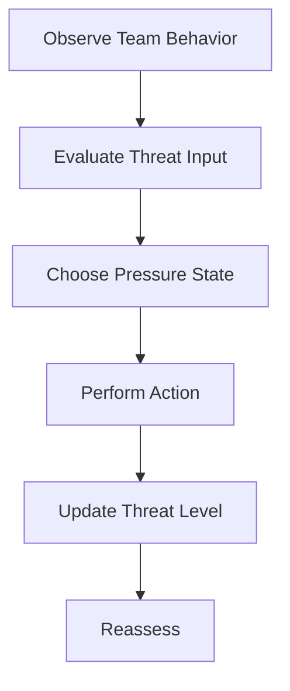
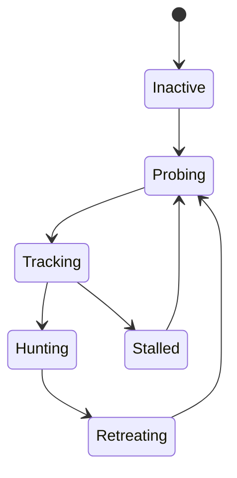

# Monster AI

## Purpose

This document defines the adaptive creature system in Project Echo. The creature is not a conventional enemy. It is the game’s pressure engine: a system that turns player mistakes, uncertainty, and poor coordination into escalating danger and renewed urgency.

## Scope

This document covers:

- The creature’s goals and behavior model
- How it reacts to team behavior and environmental signals
- The escalation states that increase pressure over the course of a match
- Its interaction with objectives, stress, and communication failures
- Its visibility, readability, and fail-safe behavior

This document does not define every lore-specific creature form or every future variant.

## Dependencies

- The creature system must integrate with the objective system, player systems, stress system, and audio system.
- The behavior must be readable enough for players to interpret, but not so obvious that it becomes predictable.
- It must operate reliably under networked conditions and remain understandable in a 2–4 player session.

## Diagrams

### Creature Decision Flow

### Creature State Machine

## Examples

### Example 1: Noise-Driven Escalation

The team produces loud, repeated actions while trying to repair a system. The creature shifts from a probing state to a tracking state and begins moving through the facility more aggressively. The team realizes the danger because the creature’s movement pattern changes and the environment becomes less safe.

### Example 2: Communication Failure

The team delays a decision, misinterprets an objective, and leaves a hazard active. The creature recognizes the uncertainty and shifts into a more dangerous posture. The team is forced to rethink both the objective and how it communicates under pressure.

### Example 3: Strategic Use of the Creature

A team deliberately creates a distraction by causing a loud interaction in one corridor while using a different route to complete a hidden objective. This is possible because the creature is not just a hunter; it is a pressure system that can be manipulated by clever play.

## Edge Cases

- The creature is near a player who is in a safe state but not actively performing a task.
- The creature reaches an objective location before the team does and changes the environment unexpectedly.
- Two players trigger overlapping noise events and create conflicting responses.
- The creature loses line of sight but remains in a threatening state.
- The team uses environmental features to distract or avoid the creature.
- A player is isolated from the team and is forced to react without coordination.

## Design Decisions

### Decision 1: The Creature Must Be a Pressure Layer, Not a Combat System

Combat is not the core fantasy. The creature should force players to think, coordinate, and manage risk. It should create consequence, not simply demand aim and reflexes.

### Decision 2: The Creature Should Respond to Team Behavior, Not Just Random Timers

The creature should escalate based on noise, objective failures, hesitation, environmental changes, and communication breakdowns. This reinforces the game’s systemic design and makes player choices matter.

### Decision 3: The Creature Should Be Partially Readable

Players should be able to infer what the creature is doing, but not fully predict it. This preserves tension while ensuring the game remains fair and legible.

### Decision 4: The Creature Should Create New Problems, Not Just Kill Players

The creature should force the team to adapt its priorities and communication. A simple attack loop would be too shallow for the core experience.

### Decision 5: The Creature Should Be a Shared Threat, Not a Personal Enemy

The creature should feel like a force that tests the team, not an entity that punishes one player in isolation. This preserves the cooperative identity of the game.

## Balancing Notes

- The creature should be dangerous enough to matter, but not so punishing that players cannot recover from a mistake.
- Escalation should be visible and understandable to players in the short term.
- The game should avoid hard-fail states caused by a single creature encounter unless the design clearly supports that outcome.
- The creature should increase pressure without making the team feel powerless.
- The threat curve should be steeper when the team is disorganized than when it acts coherently.

## Developer Notes

- Implement creature behavior as a state-driven system with clear transitions and scoring inputs.
- Separate perception, intent, movement, and action into distinct modules.
- Use a threat score that increases with specific player actions and environmental disturbances.
- Keep creature movement paths legible and understandable in the environment.
- The creature should produce different audio and visual signals in each state so players can interpret its intent.

## Implementation Notes

- Define a threat input model with categories such as Noise, Panic, Delay, Objective Failure, and Environmental Disturbance.
- Represent creature states as Probing, Tracking, Hunting, Retreating, and Stalled.
- Ensure that creature actions are replicated authoritatively and visible to all clients.
- Avoid making the creature rely on pathfinding in ways that create inconsistent or visually confusing behavior.
- Use a small set of reusable movement patterns rather than a fully complex behavior tree for the MVP.

## Future Improvements

- Add more creature behavior profiles for different facility themes.
- Expand behavior models to include group coordination or environmental adaptation.
- Introduce special events where the creature alters the reality state or objective flow.
- Add creature behaviors that specifically exploit communication failures, such as following a misunderstood instruction or reacting to false certainty.

## Risks

- If the creature is too unpredictable, it may feel unfair rather than tense.
- If the creature is too predictable, it will become repetitive quickly.
- If the creature behavior is too complex, content and debugging costs may rise significantly.
- If the creature is too lethal, it will overshadow the game’s central communication loop.

## Open Questions

- How much direct player interaction with the creature should be present in the MVP?
- Should the creature ever be avoidable through pure movement, or should it always force a team response?
- How much of the creature’s internal logic should be exposed through audio and visual cues versus kept ambiguous?
- Should the creature ever change the players’ reality state rather than only their immediate risk state?
