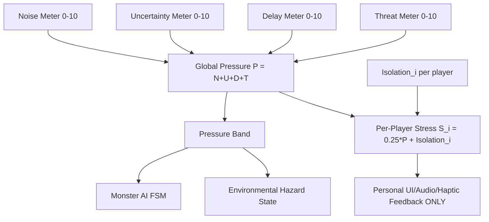
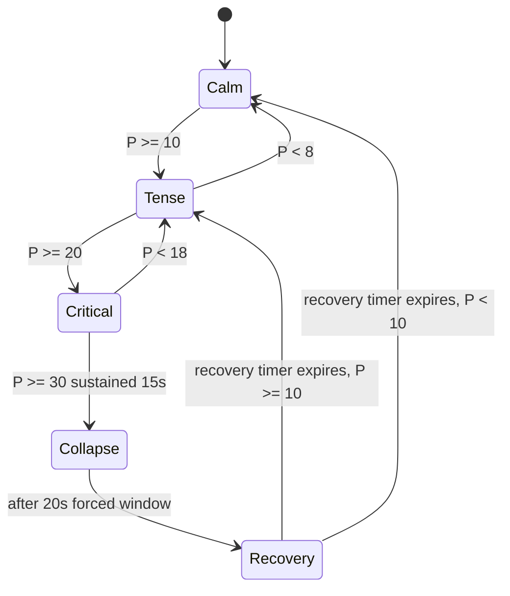

# Stress and Pressure System

> **Authority notice:** This document is the single authoritative source for Project Echo's pressure/threat model. Every other system that previously defined its own pressure or threat value — Puzzle Framework, Monster AI, Objective System — now **consumes** the values defined here. No other document may define a new pressure variable, formula, or threshold. "Pressure" is the internal/technical term for the value defined below; "Stress" is the same value's player-facing/narrative name used in UI, Audio, and Level Design documents. They are one system with two names, not two systems.

## Purpose

This document defines the complete pressure model for Project Echo: the team-shared numeric value that drives creature escalation, puzzle failure consequence, objective pacing danger, and environmental hazard state. It replaces four previously independent, uncoordinated definitions (Stress System's accumulator, Puzzle Framework's `P_next` formula, Monster AI's prose "threat score", and Objective System's unnamed "pressure") with one formula, one set of units, one set of thresholds, and one authority.

## Scope

This document covers:

- The four Category Meters and the Global Pressure formula
- The distinction between team-shared Global Pressure and personal, presentation-only Per-Player Stress
- Pressure Band thresholds (defined as a normalized percentage of Pressure's maximum, not hardcoded raw values), hysteresis, and the Collapse/Recovery event states
- Exactly how Noise, Uncertainty, Delay, and Threat accumulate and decay, with worked examples
- How Monster AI, Puzzle Framework, and Objective System write to and read from this system
- The full data model, authority, and replication cadence for both Pressure and Stress
- Save/load behavior
- Analytics events
- Debug commands

This document does not define UI presentation (owned by 17 UI/UX), creature movement/pathing (owned by 10 Monster AI), or puzzle content (owned by 07 Puzzle Framework and 08 Puzzle Library). It defines the shared number those systems all read and write, and the personal-feedback-only per-player value derived from it (§Per-Player Stress vs. Global Pressure).

## Dependencies

- Consumed by [docs/GDD/10 Monster AI.md](docs/GDD/10%20Monster%20AI.md) — creature FSM state is derived from Global Pressure (see §Consuming Systems).
- Consumed by [docs/GDD/07 Puzzle Framework.md](docs/GDD/07%20Puzzle%20Framework.md) — puzzle failure writes to Noise; unresolved `RequiredObservations` write to Uncertainty.
- Consumed by [docs/GDD/09 Objective System.md](docs/GDD/09%20Objective%20System.md) — objective stall writes to Delay; objective progress clears Delay.
- Reads communication state from [docs/GDD/05 Communication System.md](docs/GDD/05%20Communication%20System.md)'s Unshared/Shared/Confirmed model to drive Uncertainty.
- Replicated authoritatively per [technical/NetworkArchitecture.md](../../technical/NetworkArchitecture.md); this document assumes the topology decision recorded in ADR-0002 (see Priority 2 of this remediation pass).
- The pressure cadence must align with 15–30 minute sessions (Vision.md, HighConcept.md, GDD 30 Appendix.md).

## Diagrams

### Pressure Input Model



### Pressure Band State Flow



## Variables and Units

> **Constants Authority:** All numeric values in this section and in §Decay Rules, §Pressure Bands, and §Event → Meter Contribution Tables are owned by [`docs/GDD/Gameplay Constants Bible.md`](Gameplay%20Constants%20Bible.md). Values shown here are for readability and design context only. To change any threshold, rate, or contribution, edit the Bible — not this document.

All values are `float`, computed server/host-side at a fixed **10 Hz tick rate** (every 100 ms). No client ever computes these values locally; clients only render the replicated snapshot (see §Networking Synchronization).

| Symbol | Name | Range | Meaning |
|---|---|---|---|
| `N` | Noise | 0.00 – 10.00 | Accumulated loud/disruptive team actions |
| `U` | Uncertainty | 0.00 – 10.00 | Unresolved conflicting or unshared information |
| `D` | Delay | 0.00 – 10.00 | Time stalled without objective progress |
| `T` | Threat | 0.00 – 10.00 | Creature proximity/line-of-sight exposure |
| `P` | Global Pressure | 0.00 – 40.00 | Team-shared total; single source of truth for escalation |

### Formula

```
P = N + U + D + T
```

An unweighted sum is a deliberate MVP decision, not an omission: it keeps the relationship between an event and its effect on `P` legible to both players (who can be told "loud actions raise Noise, which raises Pressure 1:1") and designers tuning content. Category weighting is listed as a named post-launch tuning candidate in §Open Questions, not left undecided by default — the MVP ships with weights of 1.0 on all four terms.

## Per-Player Stress vs. Global Pressure

These are deliberately **two different values with two different jobs**, not one value with two names as the first draft of this document implied. Conflating them was a real gap: the prior version's Edge Cases section noted that an isolated player "cannot recover through communication" but had no personal value to reflect that isolation, because everything routed through the single team-wide `P`.

- **Global Pressure (`P`)** is the only value that drives *systemic* consequences — Monster AI's FSM, hazard activation, Collapse/Recovery. It remains exactly as specified above: one number, computed once for the whole team, because the creature and the environment are shared threats and must react to the team as a unit (this is the part of the original Decision 1 that is still correct and is preserved below as Decision 1a).
- **Per-Player Stress (`S_i`, one instance per connected player `i`)** is a *presentation-only* value: it drives that specific player's personal feedback (heartbeat SFX intensity, screen vignette, controller haptics — see 18 Audio.md and 17 UI/UX). **It must never be read by Monster AI, hazards, or any other systemic consumer.** This constraint is what stops the four-owners problem this document was written to fix from re-emerging as a five-owner problem with per-player state added back in.

### Per-Player Stress Formula

```
S_i = clamp(0, 10, 0.25 * P + Isolation_i)
```

Where:
- `0.25 * P` is a shared floor every player feels from the team's global Pressure (0.25 scales `P`'s 0–40 range down to `S_i`'s 0–10 range, so a team fully at max Pressure gives every player a baseline personal Stress of 10 before isolation is even considered).
- `Isolation_i` = **+3.00** if player `i` has no teammate within 15.0 meters, else **0.00**, applied with the same decay behavior as `N` (−0.30/sec once no longer isolated) so briefly stepping away from the group doesn't spike Stress instantly nor vanish instantly on regrouping.

`S_i` is computed server-side alongside `P` at the same 10 Hz tick rate, and is the direct answer to the isolation edge case: an isolated player now has a concrete, higher personal Stress value even though the team's shared `P` (and therefore the creature's behavior) is unaffected by their isolation alone.

## Pressure Bands

Bands use hysteresis (separate enter/exit thresholds) specifically to prevent state flicker when `P` oscillates near a boundary — a system design gap flagged directly against the previous version of this document in the production audit.

Thresholds are defined and stored as a **normalized percentage of `P`'s theoretical maximum**, not as hardcoded raw values, specifically so they survive future changes to the category model (e.g., the fifth `Fatigue` category proposed in §Future Improvements, or per-category weighting from §Open Questions) without every consumer document needing to be re-tuned:

```
P_norm = 100 * P / P_max      // P_max = 40.0 for the MVP's four-category model
```

If a category is added or `P_max` otherwise changes, `P_norm`'s meaning is preserved automatically; only `P_max` needs updating in one place. The raw event-contribution values in §Event → Meter Contribution Tables remain expressed in absolute units (not normalized) deliberately — designers tune individual events ("how much does one puzzle failure matter") far more legibly in absolute terms than in percentages of a whole they don't hold in their head turn-to-turn. Normalization is applied once, at the threshold layer, not throughout the model.

| Band | Enter threshold | Exit threshold | Player-facing meaning |
|---|---|---|---|
| Calm | `P_norm` < 20% (`P` < 8) (from Tense) / match start | `P_norm` >= 25% (`P` >= 10) | Baseline. Creature Probing. |
| Tense | `P_norm` >= 25% (`P` >= 10) | `P_norm` < 20% (`P` < 8) | Creature Tracking. Ambient audio layer shifts (see 18 Audio.md). |
| Critical | `P_norm` >= 50% (`P` >= 20) | `P_norm` < 45% (`P` < 18) | Creature Hunting eligible. Environmental hazards may activate. |
| Collapse | `P_norm` >= 75% (`P` >= 30) continuously for >= 15.0s | Fixed 20.0s forced window, then exits to Recovery | Guaranteed Hunting; one hazard force-activates. See below. |
| Recovery | Entered from Collapse, or manually when the team resolves any Active objective while in Critical | 10.0s timer, or immediately if `P_norm` falls below 20% during the window | Decay tripled; no new Collapse can trigger. |

The raw `P` values in parentheses are the MVP's actual numbers (`P_max = 40`) and are what implementation should check against directly — `P_norm` is the layer other documents and future tuning passes should reference by name ("Critical begins at 50% of max Pressure") rather than by the raw number, which is specific to the current four-category model.

**Collapse detail:** Collapse is an event window, not a standing band. It requires `P` >= 30 to hold continuously for 15.0 seconds (a single dip below 30 resets the sustain timer to zero — this is intentional: it rewards a team that manages to claw `P` down even briefly). Once triggered, Collapse forces the creature to Hunting and activates exactly one hazard (selected by the current facility's hazard pool, weighted toward hazards tagged `RelevanceTags: hazard` per 07 Puzzle Framework's data model) for a fixed 20.0 seconds, after which the match transitions unconditionally to Recovery regardless of current `P`.

## Decay Rules

Decay is applied every tick to any meter that received no contributing event that tick.

| Meter | Passive decay | Notes |
|---|---|---|
| `N` | −0.30 / sec | Continuous exponential-feel decay via fixed per-tick subtraction (−0.03 per 100ms tick). |
| `U` | −0.10 / sec passive; −1.00 instant on Confirmed | Passive decay only prevents indefinite drift; the intended clear path is confirming information (see below). |
| `D` | No passive decay | Delay does not fade with time alone — only team action (objective progress) reduces it. This is a deliberate design decision: idling should never look identical to recovering. |
| `T` | −0.50 / sec when creature has no line of sight; 0 / sec while in line of sight | Threat cannot decay while the creature can see a player. |

**Recovery multiplier:** during the Recovery band, all applicable decay rates above are multiplied by 3.0 for the duration of the Recovery timer.

## Event → Meter Contribution Tables

### Noise (`N`)

| Event | Contribution | Source |
|---|---|---|
| Sprinting / loud movement (sustained) | +0.40 per tick while active | Player Systems movement state |
| Forced or failed interaction | +1.00 (instant) | 04 Player Systems |
| Puzzle failure — Minor severity | +1.50 (instant) | 07 Puzzle Framework `FailureBehavior` tier |
| Puzzle failure — Moderate severity | +2.25 (instant) | 07 Puzzle Framework `FailureBehavior` tier |
| Puzzle failure — Severe severity | +3.00 (instant) | 07 Puzzle Framework `FailureBehavior` tier |
| Alarm or hazard trigger | +3.00 (instant) | Environmental hazard system |

`N` is clamped to [0, 10]; any contribution that would exceed 10 is discarded rather than banked.

### Uncertainty (`U`)

Driven directly by 05 Communication System's three information states (Unshared, Shared, Confirmed):

- Any `RequiredObservation` (07 Puzzle Framework field) that remains **Unshared** for more than 20.0 seconds after becoming relevant to an active puzzle or objective: **+1.00, once per item**, up to a maximum contribution of 4.00 from any single unresolved item (further time does not add more — this prevents one stale clue from being able to single-handedly drive `U` to its cap).
- An item transitioning to **Confirmed**: **−1.00** (floor 0), applied instantly regardless of how it accumulated.
- `U` is clamped to [0, 10].

### Delay (`D`)

Driven by 09 Objective System's lifecycle:

- 30.0-second grace period from the moment an objective enters Active with no Progress event.
- After the grace period: `D += 1.00` for every additional 12.0 seconds without a Progress event (≈0.083/sec, applied as a per-tick fraction).
- Any Progress event on the currently active objective: `D -= 4.00` instantly (floor 0).
- An Objective Resolved event: `D` resets to 0 instantly.
- `D` is clamped to [0, 10].

### Threat (`T`)

Threat is deliberately decoupled from the creature's own behavior-state output to avoid a circular dependency (proximity feeds `T`, `T` feeds `P`, `P` drives creature state — the creature's *state* must not also feed back into `T`, or the system self-reinforces without bound).

- `T = 10 × clamp(0, 1, 1 − distance_to_nearest_player / 18.0)` where distance is in meters and 18.0m is the creature's Detection Radius (see 10 Monster AI for the radius's use in its own perception logic).
- If the creature has direct line of sight to any player, `T` is floor-raised to `max(T, 4.0)` for the duration of line of sight.
- `T` is clamped to [0, 10] and recomputed every tick from live position data — it is a pure sensor value, never an accumulator.

## Worked Example

A team fails a Moderate-severity puzzle, has one clue that has sat Unshared for 25 seconds, their active objective has been stalled 42 seconds past its 30-second grace period (one full 12-second increment elapsed), and the creature is 9 meters away with no line of sight.

```
N: +2.25 (Moderate puzzle failure, instant)      -> N = 2.25
U: +1.00 (one item past the 20s Unshared window)  -> U = 1.00
D: +1.00 (one 12s increment past the 30s grace)   -> D = 1.00
T: 10 * (1 - 9/18) = 5.00 (no line of sight)       -> T = 5.00

P = N + U + D + T = 2.25 + 1.00 + 1.00 + 5.00 = 9.25
```

`P = 9.25` keeps the team in **Calm** (Tense enters at `P >= 10`) — one bad puzzle attempt alone should not flip the band, which matches Design Decision 4 below. If the team does nothing for the next 10 seconds and the creature holds its distance without gaining line of sight: `N` decays to ≈2.25 − 3.0 = 0 (floored), `U` decays to ≈0.90, `D` climbs to ≈1.83 (still short of the next full increment), `T` decays to 0 (10 × 0.5/sec ×10s = 5.0 decayed to 0, floored) — giving `P ≈ 2.73`, comfortably Calm. This demonstrates the system rewards disengaging from active mistakes even without a deliberate "recovery" action, while `D` alone can never be cleared by waiting.

## Consuming Systems — Single Ownership

This section is the authoritative statement of who writes what. No document listed below may define its own pressure/threat variable going forward.

| System | Writes to | Reads |
|---|---|---|
| 07 Puzzle Framework | `N` (on failure, via severity tier), `U` (via stale `RequiredObservations`) | `P`, current Band (to gate `PressureWeight`-tagged conditional puzzles) |
| 10 Monster AI | *(nothing — see below)* | `P`, Band, `T` (never `S_i`) |
| 09 Objective System | `D` (via stall/progress/resolve events) | `P`, Band |
| 05 Communication System | *(indirectly, via Unshared/Shared/Confirmed transitions)* | `U` |
| 17 UI/UX | *(nothing)* | `P`, Band, and each local player's own `S_i` — for personal feedback presentation only |
| 18 Audio | *(nothing)* | Band (for ambient layer, shared) and local player's own `S_i` (for personal heartbeat/vignette-adjacent cues, if any) |

**Monster AI's FSM is now purely a function of `P` and `T`, not an independent score.** Concretely:

- `Inactive`: match not yet started.
- `Probing`: default state whenever Band is Calm.
- `Tracking`: entered when Band becomes Tense (`P >= 10`).
- `Hunting`: entered when Band becomes Critical **and** `T >= 6.0` (direct proximity/line-of-sight, not pressure alone — this preserves Monster AI's Design Decision 3, "partially readable, not fully predictable"), **or** unconditionally during a Collapse event.
- `Retreating`: entered when Band drops back to Tense or Calm while the creature was Hunting.
- `Stalled`: unchanged fallback state for pathing failure; not pressure-driven.

Puzzle Framework's own `P_next = P_current + min(2, 1 + F_severity)` formula and its `PressureWeight` field as a free-floating pressure contributor are **deprecated by this document**. `PressureWeight` is retained only as the lookup key into the Noise severity tiers above (Minor/Moderate/Severe → 1.5/2.25/3.0); it no longer independently computes a pressure delta.

## Data Model, Ownership, and Replication

### Data Model

Two distinct structures exist, matching the split between systemic Pressure and personal Stress. The authoritative, server-only model is richer than what is actually sent over the wire — it carries per-meter timing state needed to compute decay and grace periods, none of which any client needs.

**`PressureState`** — authoritative, server/host-only, one instance per match. Never replicated in full; it is the source `PressureSnapshot` (below) is derived from every tick.

```csharp
public class PressureState
{
    public float N, U, D, T;                    // current meter values, each clamped [0,10]
    public float P => N + U + D + T;             // derived, not stored redundantly
    public PressureBand Band;
    public float BandSustainTimer;               // time current P has held >= Collapse threshold
    public float CollapseTimer;                  // counts down during a Collapse window, else 0
    public float RecoveryTimer;                  // counts down during Recovery, else 0
    public Dictionary<string, float> UnresolvedObservationAge; // RequiredObservation Id -> seconds Unshared, drives U per-item cap
    public float LastObjectiveProgressTime;      // drives D's grace/stall calculation
}
```

**`PlayerStressState`** — authoritative, server/host-only, one instance per connected player, computed from `PressureState.P` plus that player's own isolation timer.

```csharp
public class PlayerStressState
{
    public PlayerId Owner;
    public float S;                              // clamp(0,10, 0.25*P + Isolation), see formula above
    public bool IsIsolated;                      // no teammate within 15.0m this tick
    public float IsolationTimer;                 // time continuously isolated, drives Isolation_i decay on exit
}
```

**`PressureSnapshot`** — the compact wire format. This is the only one of the three ever sent over the network, and it is sent to every client identically (there is no per-client-secret data here — unlike Asymmetric Reality's object visibility, Pressure and Stress values are not part of the hidden-information design and can be shared openly):

```csharp
public struct PressureSnapshot
{
    public float N, U, D, T, P;                  // 5 x 4 bytes = 20 bytes
    public PressureBand Band;                    // 1 byte (enum)
    public float CollapseTimer;                  // 4 bytes, 0 if not in Collapse
    public float RecoveryTimer;                  // 4 bytes, 0 if not in Recovery
    public PlayerStressEntry[] PlayerStress;      // one entry per connected player, see below
}

public struct PlayerStressEntry
{
    public PlayerId Owner;                        // 4 bytes
    public float S;                                // 4 bytes
}                                                   // base snapshot ~29 bytes + 8 bytes per connected player (max 4 players = 32 bytes) = ~61 bytes/tick worst case, still well under Fusion's default MTU budget
```

`PressureState` and `PlayerStressState` intentionally never leave the server; only their derived `PressureSnapshot` does. This mirrors the same authority pattern 07 Puzzle Framework already uses for puzzle state, so there is one consistent replication idiom across the two documents rather than a bespoke one here.

### Ownership

- **Who calculates:** the session authority exclusively — the same node that owns `PuzzleDefinition` state per 07 Puzzle Framework and match state per 09 Objective System. This document does not itself choose host-authoritative vs. dedicated-server; it inherits whichever topology Priority 2 of this remediation pass fixes in ADR-0002, and refers to that node generically as "the session authority" throughout. No client, in either topology, ever computes `P`, any meter, or any `S_i` — this is non-negotiable regardless of which topology is chosen, because both Puzzle Framework and Objective System already require the same property for their own state.
- **Who receives:** all connected clients, unconditionally and identically (see note above on why this data is not part of the hidden-information model).
- **How often:** the session authority recomputes `PressureState` and every `PlayerStressState` at a fixed 10 Hz (every 100 ms), matching the tick rate already stated in §Variables and Units. The derived `PressureSnapshot` is serialized and sent at the same 10 Hz — there is deliberately no separate, lower "network send rate" distinct from the compute rate, because the payload (≤61 bytes/tick) is small enough that decoupling them would only add latency between a state change and players perceiving it, for no bandwidth benefit.
- **Host migration:** if the session authority changes mid-match (topology-dependent, see ADR-0002), the incoming authority must be initialized from the most recently acknowledged `PressureSnapshot`, not from zero — a migration must never reset `P` to Calm, which would let a team "escape" accumulated Pressure for free by forcing or exploiting a migration. This is a hard requirement carried into Priority 2's networking work, not an open question.
- **Late join:** a player joining mid-session receives the current `PressureSnapshot` immediately, including the full `PlayerStress` array with a fresh `PlayerStressEntry` initialized at `S = 0.25 * P` (no isolation bonus, since they have not yet had the chance to be isolated) — consistent with 07 Puzzle Framework's existing "Late Joiners" behavior of not penalizing a player for match state that predates them.

## Save/Load Behavior

Pressure state is **not persisted** across sessions. Matches are self-contained 15–30 minute runs (per Vision.md/HighConcept.md); there is no cross-match carryover of `P` or any meter. If mid-session save/resume is ever supported (currently out of MVP scope per 22 Save System's own open questions), the resumed session restores the last authoritative `PressureSnapshot` from the host rather than recomputing it from event history.

## Analytics Events

Replaces Analytics.md's undefined "Creature Escalation" telemetry stage with a concrete event schema:

- `PressureBandChanged { fromBand, toBand, pAtTransition, timestamp }`
- `CollapseTriggered { pAtTrigger, activatedHazardId, timestamp }`
- `RecoveryEntered { trigger: "Collapse" | "ObjectiveComplete", timestamp }`
- `MeterContribution { meter: "N"|"U"|"D"|"T", delta, sourceEvent, timestamp }`
- `PlayerIsolated { playerId, timestamp }` / `PlayerRejoinedGroup { playerId, isolationDurationSeconds, timestamp }` — logged from `PlayerStressState.IsolationTimer` transitions, feeding future analysis of whether isolation correlates with match failure independent of team-wide `P`.

These feed Analytics.md's "Creature Escalation" and "Match Outcome" telemetry stages directly.

## Debug Commands

Extends the debug-panel precedent set by 07 Puzzle Framework:

- `pressure.set <N|U|D|T> <value>` — force a single meter to a value for testing a specific band.
- `pressure.freeze` / `pressure.unfreeze` — halt all accumulation and decay.
- `pressure.collapse` — force-trigger a Collapse event immediately, bypassing the 15-second sustain requirement.
- `pressure.band` — prints current Band, `P`, `P_norm`, and estimated time-to-next-threshold at the current per-tick trend.
- `stress.set <playerId> <value>` — force a specific player's `S_i` directly, independent of `P`, for isolating personal-feedback QA from systemic-Pressure QA.
- `stress.isolate <playerId>` — force `IsIsolated = true` for a player without requiring an actual 15m separation, for testing the Isolation bonus in isolation (no pun avoided).

## Examples

### Example 1: Team Hesitation

The team spends too long discussing a clue (`U` climbs past the 20-second Unshared window) and fails to complete an objective quickly (`D` climbs past its grace period). `P` crosses 10, the Band becomes Tense, and Monster AI transitions to Tracking — the team hears the ambient audio shift defined in 18 Audio.md and understands, without a UI number, that their hesitation has consequences.

### Example 2: Successful Recovery

The team stabilizes by confirming a shared clue (`U -= 1.00`) and resolving the stalled objective (`D` resets to 0, and because the team was in Critical, Recovery is entered manually). Decay triples for 10 seconds, `P` falls quickly, and the creature returns to Probing.

## Edge Cases

- A single Severe puzzle failure (+3.00 `N`) does not, by itself, cross a Band threshold from Calm (`N=3.00` alone gives `P=3.00`) — this is intentional per Design Decision 4; only combined or repeated events change state.
- Two players trigger overlapping Noise events in the same tick: contributions sum normally within the same tick before clamping.
- A player is isolated from the team and cannot contribute to clearing `U` or `D`: the four team-shared meters and `P` remain unaffected by individual isolation, but that player's personal `S_i` receives the +3.00 `Isolation_i` bonus (§Per-Player Stress vs. Global Pressure), so the game does give them a personal signal even though the team-wide systemic state is untouched.
- The creature loses line of sight mid-tick: `T`'s line-of-sight floor is evaluated at tick resolution, so a brief flicker in raycast results should be smoothed by Monster AI's own perception module (a 0.5s grace before dropping the floor), not by this document.

## Design Decisions

### Decision 1a: Global Pressure Drives Every Systemic Consequence

One `P`, computed server-side, shared by the whole team, is the only value Monster AI, hazards, and Collapse/Recovery ever read. This was already true in the prior Stress System draft and is preserved for systemic effects: the creature and the environment are shared threats and must react to the team as a unit, not fragment into four separate creature reactions to four separate players.

### Decision 1b: Per-Player Stress Exists, but Only for Personal Feedback

Decision 1a does not mean individual players are invisible to the system — it means individual variation is confined to `S_i` (§Per-Player Stress vs. Global Pressure), which only ever drives that player's own audio/UI/haptic feedback. This was added in this remediation pass specifically to resolve a real contradiction in the prior draft (an isolated player was described narratively as being at more personal risk, with no value anywhere to represent that). The boundary is intentionally strict: if `S_i` were ever allowed to influence Monster AI or hazards, the document would have recreated the exact "four uncoordinated pressure sources" problem it exists to eliminate, just with per-player sources instead of per-system ones.

### Decision 2: Pressure Changes Real Systems, Not Just a UI Bar

`P` and its Band directly gate Monster AI's FSM transitions and hazard activation. It is never purely cosmetic.

### Decision 3: Recovery Must Be Reachable Through Play, Not Time Alone

`D` cannot decay passively — only action clears it. `N`, `U`, and `T` do decay passively, so a team that disengages from active mistakes drifts back toward Calm even without a deliberate "solve" action, but a team that is simply stalled cannot wait its way out of Delay.

### Decision 4: No Single Event Should Flip a Band

Every per-event contribution in the tables above is sized so that one instance of the worst-case Noise or Uncertainty event, alone, does not cross the Calm→Tense threshold (10.0). Bands should only flip from a pattern of events or a genuinely compounding failure, matching the original design intent ("stress should rise faster under poor coordination than under careful play").

## Balancing Notes

- The event-value table above (§Event → Meter Contribution Tables) is the tuning surface. Adjusting a single number (e.g., Moderate puzzle failure's +2.25) changes the whole system predictably because every consumer reads only `P` and Band, never a bespoke local score.
- Target: a team making zero further mistakes should return from Tense to Calm within roughly 15–25 seconds (worked example above validates ≈10s for a modest event; larger events take proportionally longer under the fixed decay rates).
- `D`'s zero passive decay is the single highest-leverage balancing lever for pacing — if MVP playtests show teams stalling too often without dying, lower the grace period (currently 30.0s) or the per-increment rate (currently 1.0/12.0s) rather than adding passive decay, to preserve Decision 3.

## Future Improvements

- Introduce per-category weighting (see formula note) once MVP playtests establish which category most reliably predicts player-reported tension, rather than guessing pre-launch.
- Add facility-specific Noise/Threat tuning presets once more than one facility exists.
- Consider a fifth category (`Fatigue`, session-length-based) for late-game escalation, deferred post-MVP.

## Risks

- If the four event tables are not kept in sync with new puzzle/objective content as it's authored, `P` will silently under- or over-react to new systems. Mitigation: the QA Checklist in 07 Puzzle Framework must include a line verifying every new puzzle's `FailureBehavior` maps to a defined severity tier before it ships.
- Fixed absolute thresholds (10/20/30) may not scale correctly if a future facility is significantly longer or shorter than the 15–30 minute target; flagged for revisit once multiple facilities exist (see Future Improvements).

## Open Questions

- Should Category weighting (currently equal at 1.0 each) be tuned per facility once more than one facility exists? Owner: Systems Design, revisit at Vertical Slice milestone.
- Should `T`'s Detection Radius (18.0m) vary by facility geometry (open vs. cramped)? Owner: Level Design, revisit once Facility Design's zone dimensions are numerically specified (see Priority 9 of this remediation pass).
