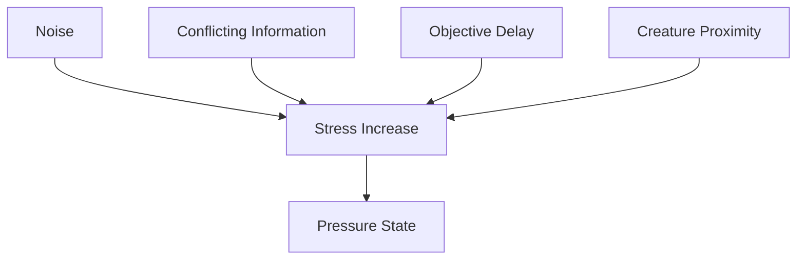
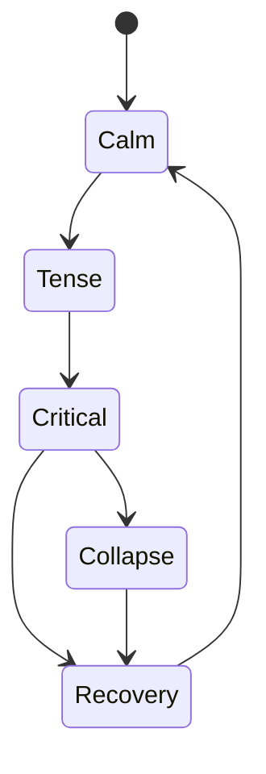

# Stress System

## Purpose

This document defines the stress and pressure model for Project Echo. Stress is not merely a meter; it is a systemic representation of uncertainty, time pressure, communication strain, and environmental danger.

## Scope

This document covers:

- Stress sources and state transitions
- Player-facing feedback and consequences
- Team-level pressure dynamics
- Recovery conditions and pacing

This document does not define every UI presentation of stress.

## Dependencies

- The stress system must integrate with the creature system, objective system, and communication system.
- The system should be readable to players without becoming too abstract.
- The pressure cadence should align with 15–30 minute sessions.

## Diagrams

### Stress Input Model

### Stress State Flow

## Examples

### Example 1: Team Hesitation

The team spends too long discussing a clue and fails to complete an objective quickly. The stress system increases, the creature becomes more active, and the environment becomes less forgiving.

### Example 2: Successful Recovery

The team stabilizes the situation by communicating clearly and completing an objective. The stress level begins to fall, reducing creature pressure and allowing the team to recover.

## Edge Cases

- A single loud player action causes a stress spike that is disproportionate to the team’s actual situation.
- The system becomes too punitive and makes every small mistake feel like a run-ending event.
- The team recovers from a panic state too quickly and the pressure loses impact.
- A player is isolated from the team and cannot recover through communication.

## Design Decisions

### Decision 1: Stress Should Be a Shared System

The pressure should reflect the team’s state rather than only a single player’s actions. This supports the game’s cooperative identity and makes communication feel consequential.

### Decision 2: Stress Should Be Expressed Through Consequence, Not Just UI

The stress system should change creature behavior, objective pacing, and environmental danger. It should not exist only as a bar that players ignore.

### Decision 3: Recovery Must Be Possible

Stress should be recoverable through strong team coordination and successful actions. A lasting punishment system would reduce the sense of control and undermine the game’s replayability.

### Decision 4: Stress Should Create Tension Without Removing Agency

The team should still feel capable of acting even when under pressure. Stress should motivate adaptation, not immobilize the player.

## Balancing Notes

- The stress system should be tuned so that teams can recover from a mistake within a few minutes of play.
- Stress should rise faster under poor coordination than under careful play.
- The game should not punish the team for every minor uncertainty; only for patterns of poor communication or repeated mistakes.

## Developer Notes

- Implement stress as a composite system derived from multiple inputs rather than a single raw meter.
- Expose the stress state to the creature system, objective pacing, and environmental hazard modules.
- Provide a clear in-match feedback signal so players understand the source of rising pressure.

## Implementation Notes

- Use a stress accumulator with categories for Noise, Uncertainty, Delay, and Threat.
- Apply smoothing and thresholds so the stress curve feels readable and not overly jittery.
- Ensure that stress state changes are replicated to all clients and logged for analysis.

## Future Improvements

- Add more nuanced stress signatures for different facility themes.
- Introduce optional stress modifiers tied to player roles or difficulty levels.
- Expand the system to support late-game escalation with new environmental pressure states.

## Risks

- The system could become too abstract if players cannot connect stress to their actions.
- Overly aggressive stress escalation could reduce the game’s replayability and create frustration.
- Poor tuning could make the game feel unfair at key moments.

## Open Questions

- Should stress be visible as a meter, as environmental effects, or as a combination of both?
- How quickly should teams recover from elevated stress?
- Should stress ever be used as a primary objective mechanic in the MVP?
