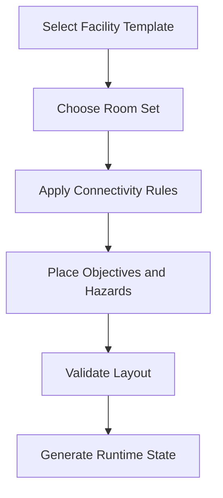

# Map Generation

## Purpose

This document defines the map generation framework for Project Echo. It specifies how facilities are assembled, how variation is introduced, and how the generation system supports replayability without breaking consistency or playability.

## Scope

This document covers:

- Facility assembly rules
- Room and corridor generation logic
- Objective placement constraints
- Procedural variation and safety rules
- Validation and fail-safe behavior

This document does not define the final layout of every facility or room.

## Dependencies

- The generation system must support the asymmetric reality model and objective flow.
- The generated layouts must be readable and playable by 2–4 players.
- The system must be maintainable by a small content team.

## Diagrams

### Facility Assembly Flow

### Generation Rules Overview

## Examples

### Example 1: Procedural Layout Variation

A facility template may produce different room orders in each run while preserving the same general objective flow and connectivity rules.

### Example 2: Safe Variation

A generated map may swap which corridor contains a relay room, but the path between entry, objective, and exit must always remain navigable and understandable.

## Edge Cases

- The generation system creates a room sequence that is too difficult to navigate.
- A procedural layout places a critical objective behind a dead-end with no clear path.
- Two key rooms are separated by a path that is too long for the target session length.
- Room generation creates impossible sightlines or poor player visibility.
- The map generation breaks the asymmetric information logic by placing key clues in inaccessible locations.

## Design Decisions

### Decision 1: Procedural Generation Should Support Replayability, Not Replace Design

The game should use generation to create variation, not to avoid deliberate level design. The core structure should be authored by designers and then varied through controlled rules.

### Decision 2: Every Map Must Be Validated Before Play

No generated map should reach players without passing a validation step. This is essential to maintain fairness, readability, and technical stability.

### Decision 3: The Generation System Must Preserve Narrative Flow

Each generated facility should still feel like a coherent place. The rules should preserve environmental logic and support the game’s story and tone.

## Balancing Notes

- Room size and path length should be tuned to the target session duration.
- Generated layouts should not create unfair bottlenecks or overly confusing loops.
- The system should support both compact and more spread-out layouts without breaking pacing.

## Developer Notes

- Use a seeded generation system with deterministic validation.
- Separate room templates from layout rules so designers can author content independently of generation logic.
- Maintain a clear set of generation constraints for pathing, sightlines, objective access, and spawn locations.

## Implementation Notes

- Build the generator around room templates, connection rules, and placement constraints.
- Mark certain rooms as mandatory anchors such as entry, objective, and exit nodes.
- Validate pathing and objective reachability after generation.
- Expose generation debug output to designers for playtesting and tuning.

## Future Improvements

- Add more facility templates and room archetypes.
- Improve procedural storytelling by tying room variation to narrative states.
- Support live tuning for difficulty and pacing based on telemetry.

## Risks

- Poor generation rules can create unreadable or frustrating maps.
- Too much procedural variation can undermine the intended tone and clarity.
- Validation bugs could allow broken layouts to reach release.

## Open Questions

- How much of the map should be procedural versus authored for the MVP?
- What is the minimum acceptable room count per match?
- Should map generation be seeded by match difficulty or player count?
