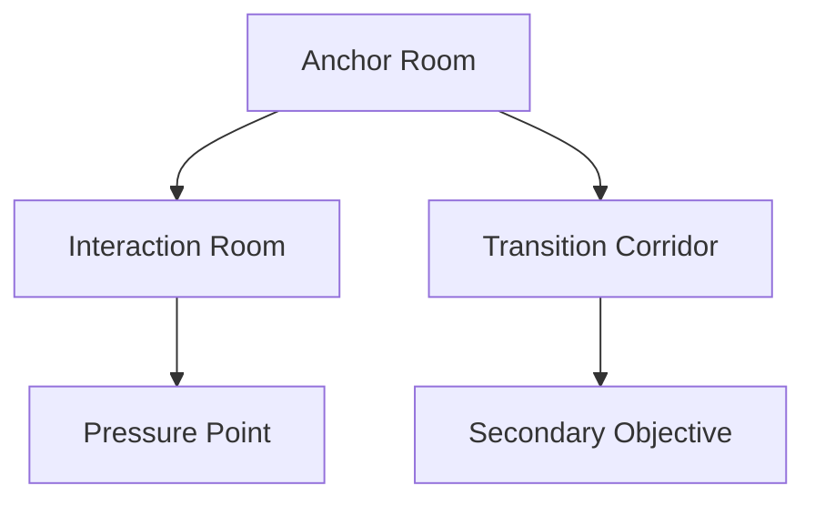

# Level Design

## Purpose

This document defines the level design principles for Project Echo. It specifies how rooms, corridors, sightlines, hazards, and objectives should be arranged to support communication, tension, and replayability.

## Scope

This document covers:

- Room composition and pacing
- Navigation readability
- Environmental storytelling
- Transition and choke-point design
- Multi-player spatial coordination

This document does not define the layout of a specific facility in full detail.

## Dependencies

- Level design must support the asymmetric reality system, objective flow, and creature pressure model.
- The layout must be navigable and understandable for 2–4 players.
- The design must work in both authored and procedurally generated contexts.

## Diagrams

### Spatial Pacing Flow

### Room Composition Model

## Examples

### Example 1: Communication-Friendly Layout

A room contains two distinct interactable positions separated by a visible line of sight. Players can observe and discuss the space without completely isolating each other.

### Example 2: Pressure Zone

A corridor with limited visibility and one critical objective creates tension because players must decide whether to split up, regroup, or communicate before acting.

## Edge Cases

- The level creates dead ends that trap players under creature pressure.
- Multiple objectives are placed too close together and the team loses pacing.
- Narrow choke points make the game feel unfair in multiplayer.
- The environment provides too much visual noise and reduces readability.

## Design Decisions

### Decision 1: The Level Must Support Communication, Not Hide It

Level design should create opportunities for discussion and shared interpretation. It should not make players feel forced into silent, isolated exploration.

### Decision 2: Each Area Must Have a Clear Purpose

Every room should either support exploration, objective interaction, tension, or transition. Rooms that do not contribute to the match should be removed.

### Decision 3: Pressure Should Be Spatially Readable

Players should understand when a space is dangerous or becoming dangerous. The level should communicate that through geometry, lighting, sound, and pacing.

### Decision 4: Players Must Have Safe Recovery Paths

A level should allow players to retreat, regroup, or reassess without feeling trapped. The game should support tactical decision-making rather than forcing constant forward momentum.

## Balancing Notes

- The average match should alternate between exploration, interaction, and pressure zones.
- Room density should be tuned to prevent the session from feeling either empty or excessively cramped.
- Environmental hazards should be readable before the team commits to an action.

## Developer Notes

- Use modular room templates that support different pacing and objective types.
- Ensure that visual readability is preserved even when the environment is partially obscured by horror effects.
- Design with both normal play and 4-player congestion in mind.

## Implementation Notes

- Provide navigation tags for entry, objective, danger, and retreat states.
- Keep common room anchors consistent for procedural generation and authored layouts.
- Use lighting and audio cues to reinforce spacing and pressure without overloading the player.

## Future Improvements

- Add more specialized room templates for different facility themes.
- Create dynamic environmental events that alter the level during a match.
- Introduce environmental storytelling layers that reward repeated play.

## Risks

- Bad level flow can make the game feel like a random walk rather than a tense cooperative experience.
- Excessive complexity can reduce readability and cause avoidable frustration.
- Multiplayer congestion can create technical and gameplay issues if not designed around.

## Open Questions

- How much of the facility should be open exploration versus guided progression?
- Should the first facility be more linear or more branching in structure?
- What amount of environmental storytelling is appropriate for the MVP?
