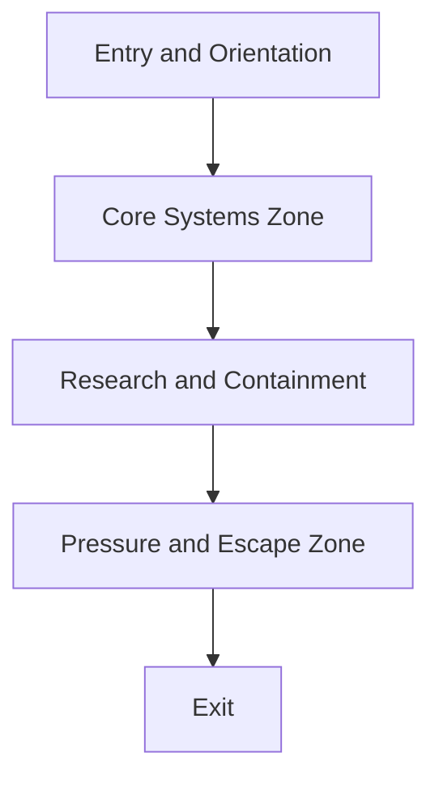

# Facility Design

## Purpose

This document defines the design language and functional identity of the research facility used in Project Echo. It establishes the visual, narrative, and gameplay logic of the space so that all content in the first facility remains coherent.

## Scope

This document covers:

- Facility theme and narrative framing
- Core facility zones and their purpose
- Environmental logic and systems integration
- Visual and audio identity

This document does not define the complete final content of every room or asset.

## Dependencies

- Facility design must support the objective, puzzle, creature, and asymmetry systems.
- The environment should reinforce the game’s communication-first identity.
- The facility should fit within the target session length and technical scope.

## Diagrams

### Facility Zone Flow

### Facility Narrative Logic

## Examples

### Example 1: Functional Zone

The maintenance corridor exists to provide a place for repair-based objectives and environmental hazard interactions.

### Example 2: Narrative Zone

The containment wing contains evidence of the facility’s failings and reinforces the game’s psychological horror tone.

## Edge Cases

- The facility theme becomes too generic and loses identity.
- The environment overuses horror clichés and reduces originality.
- The layout becomes too similar to other co-op horror facilities.
- The facility is difficult to navigate under network latency or with 4 players present.

## Design Decisions

### Decision 1: The Facility Should Feel Like a Research Complex, Not a Generic Horror Map

The environment should communicate that the players are inside an active, failed scientific installation. That identity supports the story and gives the game a distinct visual and mechanical flavor.

### Decision 2: The Facility Should Be Functional First

Every area must contribute to the gameplay loop. Decorative spaces should be rare and purposeful.

### Decision 3: The Facility Should Make the Monster’s Presence Feel Embedded in the Place

The creature should feel like an extension of the facility’s systems rather than a separate element dropped into the world.

### Decision 4: The Facility Must Support Reinterpretation

The environment should reward the team for comparing perspectives and discovering hidden meanings in the space.

## Balancing Notes

- The facility should not be so large that it breaks the session pacing.
- The environment should create pressure without requiring excessive backtracking.
- The facility should maintain a mix of visible and hidden information to support asymmetry.

## Developer Notes

- Use modular zones with clear gameplay roles.
- Provide environmental storytelling through signage, damage patterns, recordings, and functional systems.
- Ensure that the visual language remains readable even under dark lighting conditions.

## Implementation Notes

- Represent facility zones as authored templates that can be combined by the map generator.
- Support optional narrative triggers and environmental state changes tied to objective progress.
- Keep room and corridor dimensions consistent with multiplayer readability and navigation.

## Future Improvements

- Add new facilities with different systems and thematic identities.
- Expand the facility’s historical narrative through optional evidence and logs.
- Create facility variants that change the creature pressure profile.

## Risks

- A generic facility can make the game feel derivative.
- Too much environmental storytelling may reduce playability or slow pacing.
- Content production complexity may rise if every zone is highly bespoke.

## Open Questions

- What is the thematic identity of the first facility beyond “research complex”?
- How much of the environment should be readable as a story without requiring external lore materials?
- Should later facilities reuse the same core architecture or be more distinct?
