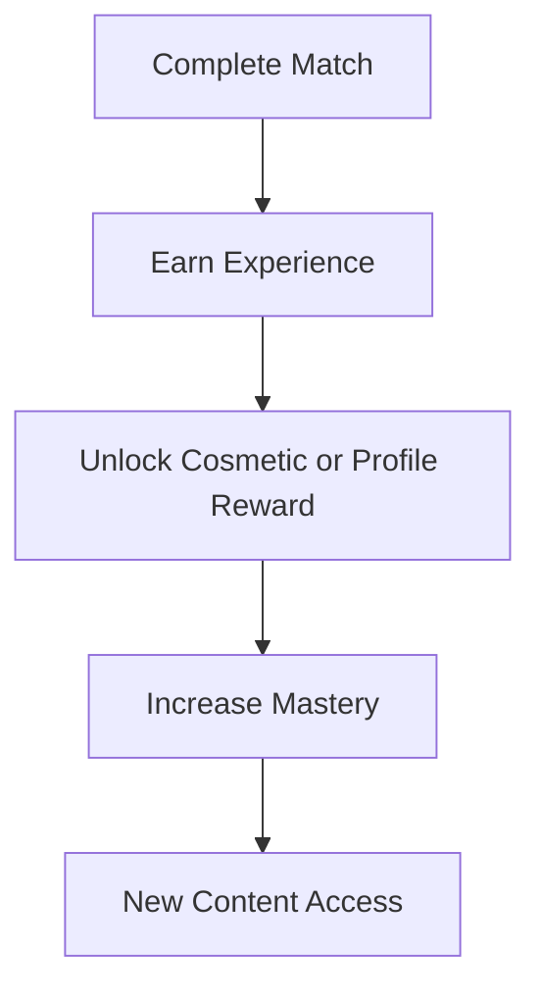
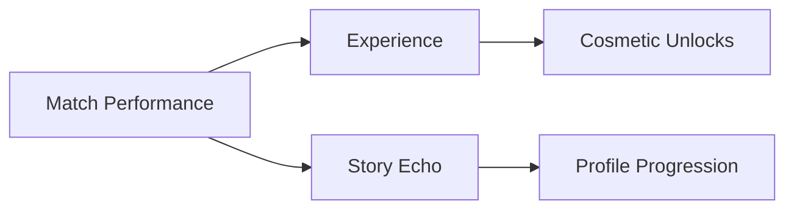

# Progression

## Purpose

This document defines how players progress through Project Echo. It covers match progression, unlocks, and player-facing rewards while preserving the game’s focus on cooperative horror rather than grind.

## Scope

This document covers:

- Match progression structure
- Unlocks and rewards
- Persistent progression rules
- Progression pacing and fairness

This document does not define the full economy or long-term live-ops structure.

## Dependencies

- Progression must support the game’s short-session structure and multiplayer design.
- Rewards should not create pay-to-win or gameplay imbalance.
- The system must be compatible with Steam and PlayFab services.

## Diagrams

### Progression Flow

### Reward Structure

## Examples

### Example 1: Match-Based Reward

A team escapes successfully and earns experience, along with a cosmetic reward or profile badge tied to their performance and consistency.

### Example 2: Cooperative Milestone

The team completes a set of matches with strong communication and earns a unique community-facing milestone.

## Edge Cases

- A player leaves early and should not receive the same progression as a full-session participant.
- A player has a poor match but still contributed meaningfully through communication.
- A player completes a match but has not unlocked the expected reward because of a backend issue.
- A progression system becomes too grind-heavy and undermines the short-session design.

## Design Decisions

### Decision 1: Progression Should Reinforce the Experience, Not Replace It

Rewards should make the game more satisfying without becoming the primary motivator. The core fun should remain the match itself.

### Decision 2: Progression Should Reward Cooperation, Not Individual Heroics Alone

The system should recognize team-based behavior such as successful coordination, useful communication, and shared problem-solving.

### Decision 3: Unlocks Should Be Mostly Cosmetic or Optional

The game should not gate progression-critical content behind a grind loop. The essential experience should remain accessible.

## Balancing Notes

- Experience gain should feel meaningful but not slow the loop down.
- Rewards should be paced to fit repeated short sessions.
- The system should not encourage exploitative or nonsensical behavior in order to farm rewards.

## Developer Notes

- Track both match outcomes and cooperation metrics for progression evaluation.
- Make progression events explicitly logged for analytics and debugging.
- Separate account-level progression from session-level state to preserve clarity.

## Implementation Notes

- Use PlayFab as the persistence layer for account progression and unlock state.
- Define a progression schema with experience, milestone flags, and cosmetic unlock records.
- Ensure progression events are awarded only after server-authoritative validation.

## Future Improvements

- Add more meaningful seasonal or event-based progression systems.
- Expand progression to include narrative unlocks and museum-style facility content.
- Support private profile and stat summaries.

## Risks

- Too much progression can make the game feel like a live-service product too early.
- Poor reward pacing can create boredom or dissatisfaction.
- Overly complex progression systems can increase backend and content support costs.

## Open Questions

- Should progression reward players with cosmetics, narrative content, or both?
- How much progression should be visible in the first release?
- How should the game treat players who only play casually versus frequently?
