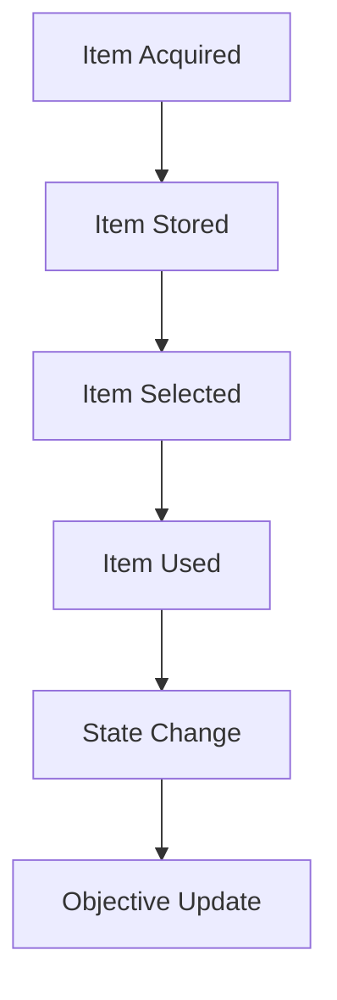
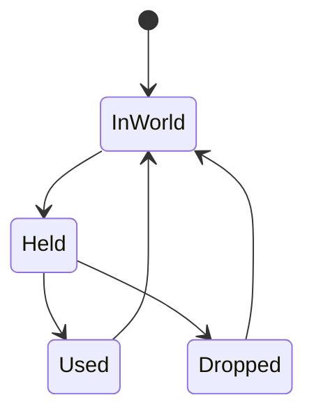

# Inventory

## Purpose

This document defines the inventory and item interaction model for Project Echo. It covers how players acquire, carry, use, and exchange items that support objectives and the communication loop.

## Scope

This document covers:

- Item types and ownership rules
- Pickup, transfer, and use rules
- Item persistence and state changes
- Item visibility and feedback

This document does not define every cosmetic or collectible item.

## Dependencies

- Inventory must integrate with player systems, objective system, and puzzle framework.
- Item handling should remain simple enough for fast-paced co-op sessions.
- The system must work well with both online and unstable network conditions.

## Diagrams

### Inventory Interaction Flow

### Item State Machine

## Examples

### Example 1: Key Item

A player picks up a maintenance key and must communicate its location or hand it off to another player who can use it at the correct panel.

### Example 2: Temporary Item

A player carries a diagnostic device that can be used once before it degrades or becomes unavailable.

## Edge Cases

- A player picks up an item while another player is already using it.
- An item is dropped during a high-pressure transition and becomes inaccessible.
- A player disconnects while holding an objective-critical item.
- Two players attempt to use the same item simultaneously.
- An item is visually present but not actually usable because of state mismatch.

## Design Decisions

### Decision 1: Inventory Should Remain Minimal

The game should not become an item-management game. Inventory should support objectives and communication, not create a separate burden for the player.

### Decision 2: Item Transfer Must Be Intentional

The team should be able to pass items to one another, but this should be a deliberate action rather than an accidental or overly frequent mechanic.

### Decision 3: Item Use Must Be Clear

If an item is important, the game should make its purpose obvious. Players should not need to guess whether the object is a clue, a tool, or a red herring.

## Balancing Notes

- Inventory should not slow pacing with excessive menu management.
- Important items should be easy to identify and use at the correct moment.
- Item loss should be meaningful but recoverable where possible.

## Developer Notes

- Keep the inventory model lightweight and deterministic.
- Separate item definition from item behavior to allow designers to create new item types quickly.
- Support both immediate use and deferred use depending on the item.

## Implementation Notes

- Represent item ownership and state as authoritative server-side data.
- Support item transfer events with clear validation and feedback.
- Ensure that item state changes are synced and visible to the team.

## Future Improvements

- Add more diverse item types tied to facility systems.
- Support item-specific interactions and contextual hints.
- Expand inventory UI for accessibility and readability.

## Risks

- Too much inventory management can undermine the core experience.
- Poorly designed item transfer rules can create confusion and frustration.
- Missing state synchronization can cause item loss or duplication bugs.

## Open Questions

- Should inventory be limited to one held item per player in the MVP?
- How much inventory should be visible to the team at all times?
- Should items be tied to specific player abilities or shared globally?
