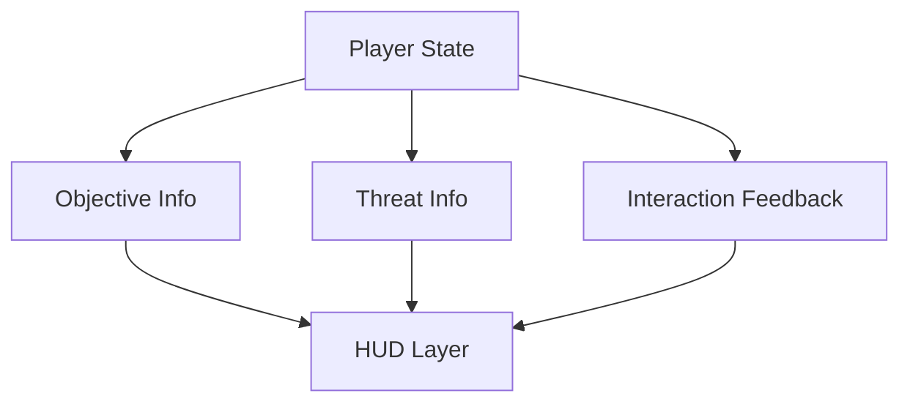
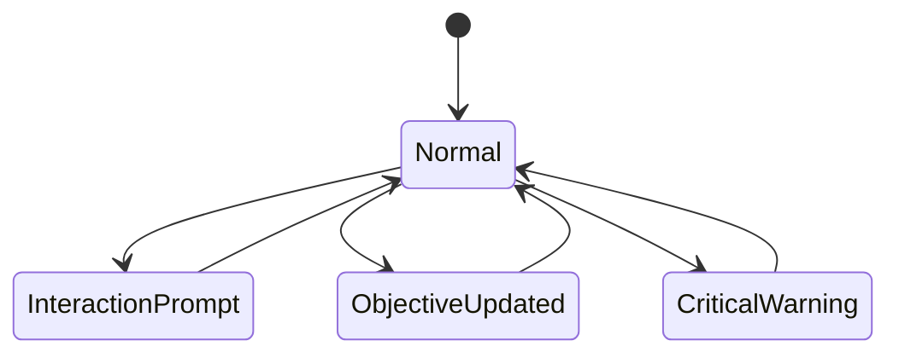

# UI UX

## Purpose

This document defines the user interface and user experience expectations for Project Echo. It focuses on clarity, readability, and supporting communication in a tense multiplayer environment without overwhelming players.

## Scope

This document covers:

- HUD composition
- Objective presentation
- Interaction feedback
- Communication support UI
- Accessibility and readability considerations

This document does not define every final UI screen or menu layout.

## Dependencies

- The UI must support first-person play and cooperative communication.
- It must work under stress and during low-visibility conditions.
- The UI should not block the player’s view or create unnecessary cognitive load.

## Diagrams

### HUD Information Flow

### UI State Flow

## Examples

### Example 1: Objective Feedback

When an objective is completed, the team receives a short, clear confirmation plus an updated objective list. The UI does not obstruct the gameplay view.

### Example 2: Threat Warning

When the creature becomes more active, the UI shows a brief but readable warning that highlights the current danger without relying on large, intrusive overlays.

## Edge Cases

- The UI becomes unreadable in low-light conditions.
- Too many objective updates flood the screen during a high-pressure moment.
- A player misses an interaction prompt because the UI is too subtle or too far from the center of view.
- The UI is too text-heavy for fast communication and decision-making.
- Accessibility settings are missing for players with color blindness or visual impairment.

## Design Decisions

### Decision 1: The UI Must Be Minimal and Contextual

The HUD should present a small amount of information at a time. Players should not be overwhelmed by dense overlays or endless menus.

### Decision 2: The UI Must Support Communication, Not Replace It

A good UI should help players share information and act on it. It should not become a substitute for talking to teammates.

### Decision 3: Feedback Must Be Immediate and Legible

Players should receive immediate confirmation when an action succeeds, fails, or changes the match state.

### Decision 4: UI Elements Must Be Readable Under Stress

The UI must remain legible at a glance during tension and low visibility. This is a core accessibility and usability requirement.

## Balancing Notes

- The UI should help the team understand the situation, not create new information overload.
- Important feedback should be noticeable but not so aggressive that it feels like a game-over screen during every mistake.
- The system should support repeated play without becoming visually stale.

## Developer Notes

- Keep HUD elements modular and composable.
- Use color sparingly and only in ways that are consistent with meaning.
- Provide localization hooks from the start.
- Ensure UI elements do not block spatial orientation or interaction prompts.

## Implementation Notes

- Use a layered UI approach with world-space prompts, overlay notifications, and contextual panels.
- Keep objective and threat information separate to reduce confusion.
- Support a lightweight communication aid such as ping markers or brief contextual tags.
- Ensure all important information is readable without requiring full-screen menus.

## Future Improvements

- Add richer post-match recap UI and player summaries.
- Expand accessibility settings such as subtitle support, color adjustments, and controller remapping.
- Introduce optional HUD customization for different play styles.

## Risks

- A cluttered UI can damage the game’s atmosphere and readability.
- Too much UI dependency can weaken the immersion and reduce communication quality.
- Poor accessibility design can exclude a significant set of players.

## Open Questions

- How much information should be shown by default versus hidden behind context menus?
- What is the minimum HUD required for the MVP?
- Should players be able to customize the amount of information shown in a match?
