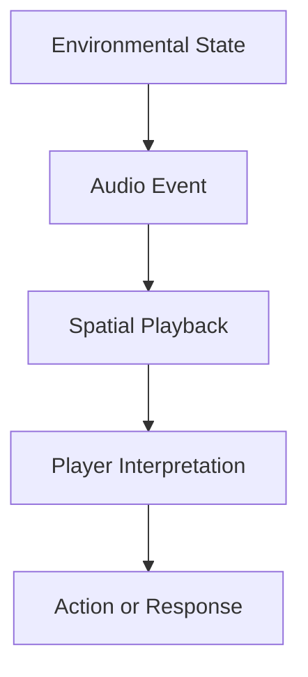

# Audio

## Purpose

This document defines the audio design strategy for Project Echo. Audio is not a secondary layer; it is a primary gameplay and narrative system that supports tension, direction, communication, and emotional impact.

## Scope

This document covers:

- Environmental audio design
- Creature audio language
- Communication clarity and voice support
- Spatial audio expectations
- Audio feedback for interactions and hazards

This document does not define all sound asset content or implementation details for every system.

## Dependencies

- Audio must support the first-person experience and the multiplayer communication loop.
- The system must remain clear under pressure and in a noisy voice-chat environment.
- Audio design must work with Unity 6 audio tools and the game’s networking architecture.

## Diagrams

### Audio Gameplay Flow

### Audio Layer Model

## Examples

### Example 1: Directional Threat Cue

A low mechanical hum grows louder in one corridor, causing players to infer that the creature is moving through that path.

### Example 2: Communication Reinforcement

A short audio cue confirms that a teammate has triggered an interaction or that a critical objective has changed state.

## Edge Cases

- Audio becomes muddy during heavy action or many simultaneous events.
- Voice chat overlaps too heavily with environmental audio.
- Players cannot distinguish between an objective cue and a creature cue.
- Audio cues are too subtle and fail to communicate danger in time.
- Audio feedback is inconsistent across clients or network states.

## Design Decisions

### Decision 1: Audio Must Serve Gameplay

Every major audio event should support player understanding, emotional tension, or communication. Audio should not simply decorate the environment.

### Decision 2: Silence Must Be Intentional

Silence is a design tool. The game should use absence of sound as seriously as it uses sound, especially during moments of uncertainty or threat.

### Decision 3: Spatial Audio Must Support Orientation

Players should be able to derive some directional information from audio, but not so much that it becomes a substitute for real map knowledge.

### Decision 4: Voice Communication Must Be Clear Above All Else

Teamm communication is more important than ambience. The audio mix must preserve clarity for voice chat even during intense events.

## Balancing Notes

- The audio mix must never overpower player voice communication.
- Threat audio should be noticeable but not overly repetitive.
- Environmental sound should support immersion without creating confusion.
- Horror should be driven by atmosphere and uncertainty rather than constant loudness.

## Developer Notes

- Use event-based audio playback rather than looping everything continuously.
- Support dynamic mixing for quiet moments, stress spikes, and creature escalation.
- Keep audio assets tagged by system and gameplay use so they can be reused and tuned efficiently.

## Implementation Notes

- Implement a modular audio event system that can be triggered by gameplay state changes.
- Use occlusion and attenuation carefully to preserve legibility in a multiplayer environment.
- Separate voice chat audio from gameplay audio in the mix pipeline.
- Provide tagged audio categories for ambience, interaction, creature, warning, and communication.

## Future Improvements

- Add more reactive audio systems tied to team communication quality and stress.
- Expand the creature’s sound language to support more sophisticated behavioral patterns.
- Add dynamic soundtrack layers to reflect tension and recovery.

## Risks

- Poor audio mixing can destroy the clarity of voice communication.
- The soundscape can become repetitive if the game relies on the same cues too often.
- Under-developed environmental audio can weaken the atmosphere and the game’s identity.

## Open Questions

- How much of the creature’s behavior should be communicated by sound versus by sight or gameplay state?
- Should the soundtrack be adaptive or mostly static in the MVP?
- How much voice processing or noise suppression is required for launch?
