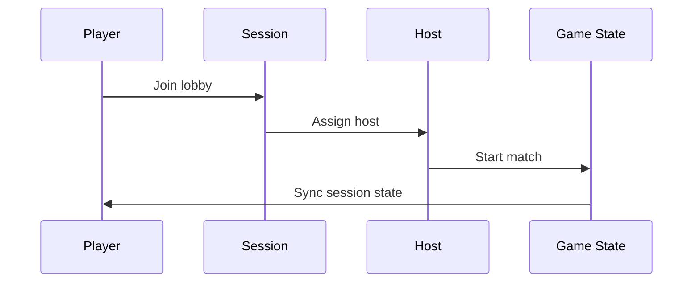
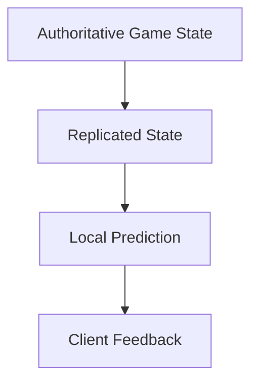

# Multiplayer

## Purpose

This document defines the multiplayer design for Project Echo. It specifies how sessions are formed, how players interact in a match, how authority is handled, and how the game preserves fairness, clarity, and momentum in online co-op play.

## Scope

This document covers:

- Match creation and session flow
- Player connection and host responsibilities
- Replication expectations
- Match state synchronization
- Session recovery and disconnect handling
- The interaction between voice communication and live match state

This document does not replace the technical network architecture document.

## Dependencies

- The game is designed for 2–4 players online.
- Photon Fusion 2 is the networking backend, running in **Host Mode** ([ADR-0002](../../technical/ADR/0002-network-topology-host-mode.md)) — a connected player's client is the Session Authority, not a dedicated server. This document's "Host" throughout means that elected client.
- The design must remain compatible with Steam and PlayFab services.
- Multiplayer must support voice communication, real-time shared objectives, and asymmetric player perception.

## Diagrams

### Match Flow

### Replication Model

## Examples

### Example 1: Host Migration

The host disconnects during a match. Fusion elects a new host from the remaining clients, which receives the last acknowledged Pressure/Puzzle/Objective snapshot per technical/NetworkArchitecture.md §Host Migration, and the match continues without a restart. The team does not lose the objective progress already achieved, and — critically — the team's accumulated Pressure (11 Stress System.md) does not reset to Calm as a side effect of the migration; a migration must never function as a free difficulty reset.

### Example 2: Late Joiner

A player joins during an active match. The client receives the current objective state, entity state, and enough context to participate without requiring a full reset. The late joiner can immediately understand what is happening and where the team stands.

### Example 3: Communication Under Pressure

Two players are trying to solve a puzzle while the creature escalates. Voice communication continues even as the match state updates, and the game preserves a stable shared understanding of the objective despite network jitter.

## Edge Cases

- A player joins mid-objective and misses relevant context.
- The host leaves during a critical interaction.
- Network latency causes delayed interaction confirmation.
- One client experiences desync and sees different puzzle state than the others.
- Players use voice chat while the session is under pressure and network performance drops.
- A reconnect occurs while the team is mid-puzzle and the game must decide whether the prior state is recoverable.

## Design Decisions

### Decision 1: Match State Must Be Authoritative

Critical match state such as objective progress, creature behavior, environmental hazards, and Pressure/Stress is resolved exclusively by the elected Host under Fusion Host Mode (ADR-0002), never by client-side assumptions. This preserves consistency and fairness at zero dedicated-hosting cost — the explicit trade-off recorded in ADR-0002 is that the Host has full authority and is trusted not to be adversarial, which is acceptable for private, invite-based 2–4 player sessions.

### Decision 2: The Game Should Support Seamless Rejoin Where Possible

Players should be able to reconnect without needing to restart the whole session when the situation is recoverable. Rejoins should preserve intent and momentum rather than forcing the team to start over.

### Decision 3: Communication Must Not Be Lost During Instability

Multiplayer design should not make players depend on perfect networking for the core party experience. The game should preserve the communication loop even when one client is degraded.

### Decision 4: Match Flow Should Be Short and Robust

The game should avoid long downtime or fragile lobby logic. The session must be easy to join, start, and recover.

### Decision 5: Cooperative Failure Should Feel Shared, Not Random

If a match goes badly because of network issues or player error, the team should feel that the failure was caused by the situation, not by hidden server-side unpredictability.

## Balancing Notes

- The match should not punish players for the host’s connectivity issues beyond the minimum necessary for fairness.
- The design should preserve the team’s ability to coordinate under network stress.
- The session should remain understandable even if one player’s latency is high.
- The game should preserve tension without making the player feel that the network is undermining the experience.

## Developer Notes

- Use authoritative replication for critical systems and local prediction only where it improves responsiveness without harming correctness.
- Design all shared systems so they can survive minor desynchronization without breaking the session.
- Ensure that late joiners receive a consistent snapshot and do not become stuck in a mismatched state.
- Build the session flow around determinism so that bugs can be reproduced and fixed quickly.
- Keep voice communication state and gameplay state synchronized in a way that supports both clarity and reliability.

## Implementation Notes

- Define clear ownership rules for interactables, hazards, objective state, and creature control.
- Build session management around deterministic match state transitions.
- Use standard event logging for session start, host change, player connect, player disconnect, and match end.
- Keep the lobby flow simple and reliable for first-time players.
- **Constants Authority:** Session parameters (disconnect grace window, minimum viable party size, migration timeout, late join transfer budget) are owned by [`docs/GDD/Gameplay Constants Bible.md`](../docs/GDD/Gameplay%20Constants%20Bible.md) §Networking Constants. Values referenced inline in this document are for context only; edit the Bible to change them.
- Reconnect procedure, grace window (60 seconds), and state hand-off are fully specified in [technical/NetworkArchitecture.md §Disconnect Recovery](../../technical/NetworkArchitecture.md#disconnect-recovery-non-host) (non-host) and [§Host Migration](../../technical/NetworkArchitecture.md#host-migration) (host) — this document does not redefine those procedures, only requires that they exist.
- **Minimum viable party size to continue a match:** 1 remaining connected player after any disconnect (the match does not force-end just because the team has shrunk to a solo player) — the match ends only if the sole remaining player also disconnects, or manually quits. This is the value technical/NetworkArchitecture.md's §Disconnect Recovery references as "owned by this document."

## Future Improvements

- Add cross-play support if platform expansion becomes viable.
- Expand session recovery tools and match diagnostics.
- Improve player skill matching and session quality controls over time.
- Add more social features for coordinated play groups such as party-based queueing and persistent squads.

## Risks

- A weak multiplayer architecture will make the game feel unstable or unfair.
- If authority rules are unclear, interactions may desync and create frustration.
- Voice and gameplay synchronization could become a production bottleneck if not prioritized.
- Overly aggressive recovery systems can create hidden complexity and increase debugging costs.

## Open Questions

- Should the game allow private sessions, public sessions, or both?
- How much matchmaking should be automated versus curated in the MVP?
- What is the minimum acceptable reconnect experience for the first release?
- Should late joiners be allowed to participate in the current objective, or should they join at the next safe transition point?
