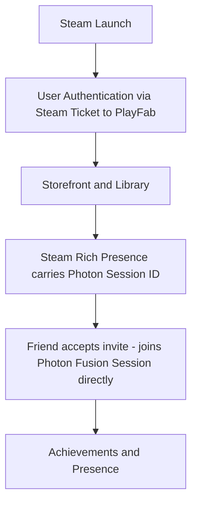

# Steam Integration

## Purpose

This document defines the Steam-specific integration requirements for Project Echo. It covers storefront, user account, presence, and platform features that should be incorporated from early development rather than treated as a post-launch add-on.

## Scope

This document covers:

- Steamworks integration points
- Achievements and cloud support
- Friend and lobby features
- Storefront and launch requirements

This document does not define the broader platform strategy beyond the Steam release.

## Dependencies

- Steamworks integration must align with the game's multiplayer and backend services.
- The game must remain compatible with PlayFab and Photon Fusion 2, running in Host Mode ([ADR-0002](../../technical/ADR/0002-network-topology-host-mode.md)).
- **Steam Rich Presence/lobby invites map directly to a Photon Fusion Session, not to a PlayFab-side construct.** When a player invites a Steam friend, the invite carries the inviting client's Photon Session identifier (the same identifier PlayFab's matchmaking-ticket flow would otherwise hand out, per 21 Backend.md's corrected flow); accepting the invite joins that Photon Session directly. This closes the gap the production audit flagged: Steam-friend-invite-to-lobby now has a defined path into the same session system every other document assumes, instead of two unreconciled join mechanisms.
- The release plan must account for Steam review requirements and platform best practices.

## Diagrams

### Steam Feature Flow

## Examples

### Example 1: Steam Friends Integration

A player hosting a match (the elected Fusion Host, per ADR-0002) sets their Steam Rich Presence to include the current Photon Session identifier. A friend invited from Steam accepts and joins that Photon Session directly — Steam brokers the invite and identity, Photon brokers the actual connection, and PlayFab is not in this path at all.

### Example 2: Achievements

The game unlocks achievements for successful escapes, cooperative milestones, or repeated communication-driven completions.

## Edge Cases

- A Steam user is not signed in when launching the game.
- Steam overlay behavior conflicts with the game’s input or UI.
- A player’s platform account changes or is unavailable during a session.
- Networking sessions require friend invitations but the Steam client is offline.

## Design Decisions

### Decision 1: Steam Should Support Social Play, Not Replace the Game’s Core Systems

Steam integration should make the game easier to launch, share, and play, but it should not become the core gameplay experience.

### Decision 2: Progress and Identity Should Be Cross-Platform Capable Where Reasonable

The game should use platform-agnostic account identity wherever possible to reduce friction when future platforms are considered.

### Decision 3: Steam Features Should Be Added Incrementally

The MVP should include the fundamentals, such as account integration and friend invites, before adding deeper community features.

## Balancing Notes

- Steam integration should improve discoverability and convenience without causing friction.
- Achievements should reward meaningful behavior and not encourage exploitative play.
- Social features should support the game’s co-op identity rather than distract from it.

## Developer Notes

- Use Steamworks for authentication, overlays, achievements, and social features.
- Keep platform integration isolated to a dedicated service layer so it can be tested and replaced if necessary.
- Ensure Steam events do not break gameplay when the overlay or library is unavailable.

## Implementation Notes

- Create a platform adapter layer for Steam features.
- Support direct invite and join flows from the Steam client.
- Use account identity mapping carefully to avoid conflicts with PlayFab accounts.

## Future Improvements

- Add richer Steam community features such as screenshots, broadcasts, and workshop support.
- Implement event-driven storefront campaigns and seasonal content visibility.
- Expand social features after the initial launch.

## Risks

- Platform integration issues can create user-facing confusion and support overhead.
- Poorly designed achievements can reduce the perceived quality of the game.
- Overly complex social features may distract from the core game loop.

## Open Questions

- Which Steam features are required for the MVP versus later content?
- Should achievements be tied to story progression or gameplay mastery?
- How much Steam-specific content should be available at launch?
