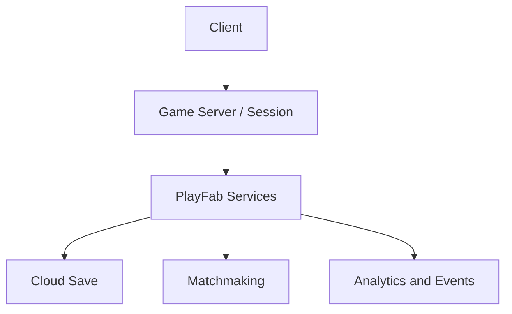
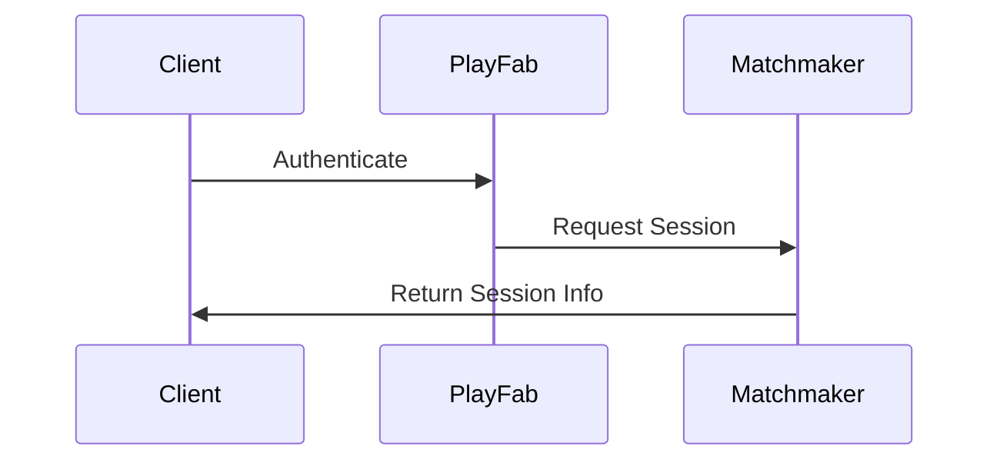

# Backend

## Purpose

This document defines the backend architecture and service responsibilities for Project Echo. It covers the systems required to support account management, matchmaking, session state, persistence, and live operations readiness.

## Scope

This document covers:

- PlayFab service responsibilities
- Session and player state persistence
- Matchmaking and player identity flows
- Backend reliability and monitoring expectations

This document does not recreate full PlayFab implementation documentation.

## Dependencies

- PlayFab is the primary backend service for persistence and account operations.
- Photon Fusion 2 provides the real-time multiplayer transport.
- Steam integration and Vivox integration must route through the backend service architecture in a controlled manner.

## Diagrams

### Backend Service Flow

### Backend Event Flow

## Examples

### Example 1: Account Sync

A player logs in through Steam and receives a PlayFab account identity that can be used to persist progression and cosmetic unlocks.

### Example 2: Session Persistence

A player disconnects and later returns. Their account state and progression are preserved while the live session state is restored or rejoined as appropriate.

## Edge Cases

- PlayFab services are temporarily unavailable during a session.
- A player’s identity cannot be resolved due to authentication issues.
- Matchmaking returns a session that later becomes unavailable.
- Cloud save conflicts occur after a reconnect or device change.
- A session state cannot be recovered after a host drop.

## Design Decisions

### Decision 1: Backend Services Should Support the Core Gameplay, Not Replace It

The backend should be reliable and low-friction, but it should not introduce complexity that distracts from the game design.

### Decision 2: Persistence Should Be Event-Based and Minimal

The game should persist only what is necessary for progression, unlocking, and session continuity. Over-persistence creates complexity and support overhead.

### Decision 3: The Backend Must Be Observable

The team should be able to inspect authentication failures, session issues, and event errors quickly. A backend that cannot be monitored is a production risk.

## Balancing Notes

- Backend reliability is a gameplay feature because it affects the fairness and continuity of every session.
- Matchmaking should not introduce long delays to the experience.
- Recovery systems should be transparent and efficient.

## Developer Notes

- Keep authentication and persistence behind a stable service wrapper.
- Build event logging into the backend path from the start.
- Use feature flags for backend-driven content or live events where appropriate.

## Implementation Notes

- Define a backend contract for account login, session creation, player state save, progression sync, and analytics events.
- Handle all service failures gracefully with fallback logic where possible.
- Normalize data schemas to reduce ambiguity between game client and backend systems.

## Future Improvements

- Add richer matchmaking quality controls and regional matching.
- Expand live event support and content rollout systems.
- Improve backend telemetry and incident response processes.

## Risks

- Backend complexity can become a major source of schedule risk if implemented too early or without clear scope.
- Service outages can directly interrupt the player experience.
- Poor data design can create migration and support problems later.

## Open Questions

- What backend features are mandatory for the MVP versus later live operations?
- How much session state should be recoverable after a disconnect?
- Should matchmaking be purely automatic or include party-based joins in the first release?
