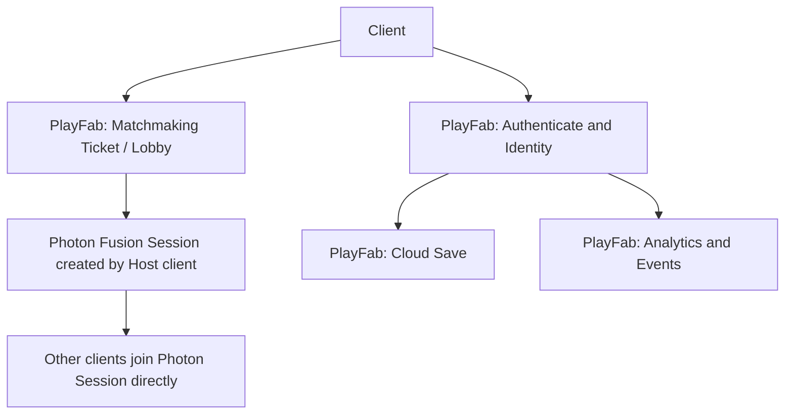
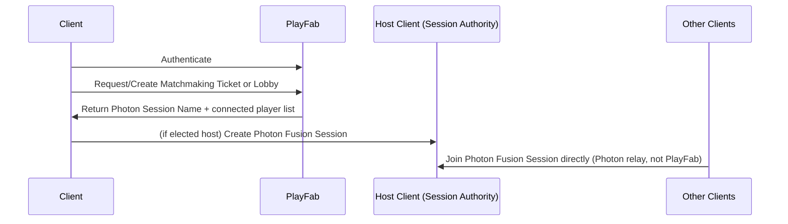

# Backend

## Purpose

This document defines the backend architecture and service responsibilities for Project Echo. It covers the systems required to support account management, matchmaking, session state, persistence, and live operations readiness.

## Scope

This document covers:

- PlayFab service responsibilities
- Session and player state persistence
- Matchmaking and player identity flows
- Backend reliability and monitoring expectations

This document does not recreate full PlayFab implementation documentation.

## Dependencies

- PlayFab is the primary backend service for persistence, account operations, and matchmaking-ticket/lobby coordination. **PlayFab does not run or host the game simulation** — that distinction is the fix this remediation pass makes to this document (see §Backend Service Flow below).
- Photon Fusion 2 provides the real-time multiplayer transport, running in Host Mode ([ADR-0002](../../technical/ADR/0002-network-topology-host-mode.md)) — the game simulation runs on a connected player's client (the elected Host), never on backend-owned infrastructure.
- Steam integration and Vivox integration must route through the backend service architecture in a controlled manner.

## Diagrams

### Backend Service Flow

**Corrected in this remediation pass:** the prior version of this diagram showed a "Game Server / Session" node between the client and PlayFab, which read as a dedicated game server — directly contradicting Multiplayer.md's host-migration model. Per [ADR-0002](../../technical/ADR/0002-network-topology-host-mode.md), there is no dedicated game server; PlayFab coordinates identity, matchmaking tickets, and persistence only, and the actual game session runs peer-to-peer via Photon Fusion Host Mode once PlayFab has connected the players.

### Backend Event Flow

Note the explicit boundary: **PlayFab never brokers or proxies live game-state traffic.** Its role ends at handing clients a Photon Session identifier; from that point, all real-time gameplay traffic (including the Pressure System's `PressureSnapshot`, per 11 Stress System.md) flows over the Photon connection directly between clients, with the elected Host as authority.

## Examples

### Example 1: Account Sync

A player logs in through Steam and receives a PlayFab account identity that can be used to persist progression and cosmetic unlocks.

### Example 2: Session Persistence

A player disconnects and later returns. Their account state and progression are preserved while the live session state is restored or rejoined as appropriate.

## Edge Cases

- PlayFab services are temporarily unavailable during a session.
- A player’s identity cannot be resolved due to authentication issues.
- Matchmaking returns a Photon Session that later becomes unavailable (host closed it, or it never actually formed) — the client must detect this and return to matchmaking rather than hang.
- Cloud save conflicts occur after a reconnect or device change.
- A host drop is handled by Fusion's native host migration (technical/NetworkArchitecture.md §Host Migration), not by this backend — PlayFab is not involved in mid-session recovery since it was never in the game-state path to begin with.

## Design Decisions

### Decision 1: Backend Services Should Support the Core Gameplay, Not Replace It

The backend should be reliable and low-friction, but it should not introduce complexity that distracts from the game design.

### Decision 2: Persistence Should Be Event-Based and Minimal

The game should persist only what is necessary for progression, unlocking, and session continuity. Over-persistence creates complexity and support overhead.

### Decision 3: The Backend Must Be Observable

The team should be able to inspect authentication failures, session issues, and event errors quickly. A backend that cannot be monitored is a production risk.

## Balancing Notes

- Backend reliability is a gameplay feature because it affects the fairness and continuity of every session.
- Matchmaking should not introduce long delays to the experience.
- Recovery systems should be transparent and efficient.

## Developer Notes

- Keep authentication and persistence behind a stable service wrapper.
- Build event logging into the backend path from the start.
- Use feature flags for backend-driven content or live events where appropriate.

## Implementation Notes

- Define a backend contract for account login, session creation, player state save, progression sync, and analytics events.
- Handle all service failures gracefully with fallback logic where possible.
- Normalize data schemas to reduce ambiguity between game client and backend systems.
- **Progression/currency/unlock writes must go through PlayFab CloudScript server-side validation with sanity bounds, not accept raw client-submitted values.** This is the anti-cheat boundary defined in [technical/NetworkArchitecture.md §Anti-Cheat Assumptions](../../technical/NetworkArchitecture.md#anti-cheat-assumptions): live match state trusts the Host fully (ADR-0002's accepted risk), but persistent PlayFab writes do not, because their consequences outlive the match. Each client submits its own results independently per [technical/NetworkArchitecture.md §Save Synchronization](../../technical/NetworkArchitecture.md#save-synchronization) — this document's matchmaking/session role ends before any progression write occurs.

## Future Improvements

- Add richer matchmaking quality controls and regional matching.
- Expand live event support and content rollout systems.
- Improve backend telemetry and incident response processes.

## Risks

- Backend complexity can become a major source of schedule risk if implemented too early or without clear scope.
- Service outages can directly interrupt the player experience.
- Poor data design can create migration and support problems later.

## Open Questions

- What backend features are mandatory for the MVP versus later live operations?
- How much session state should be recoverable after a disconnect?
- Should matchmaking be purely automatic or include party-based joins in the first release?
