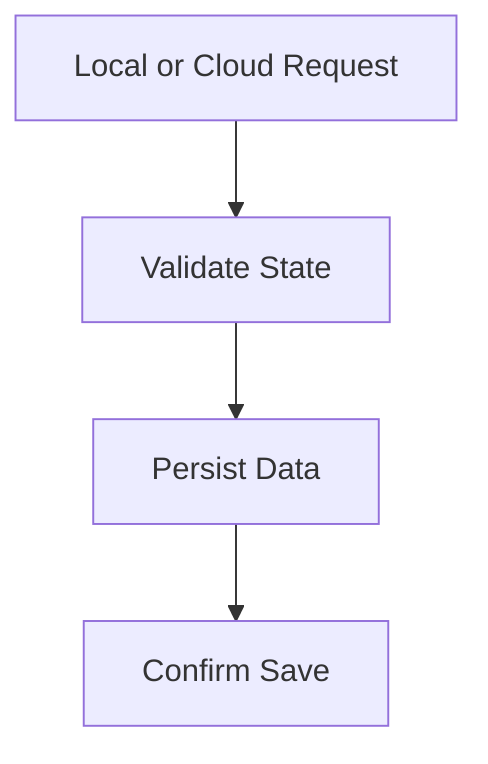
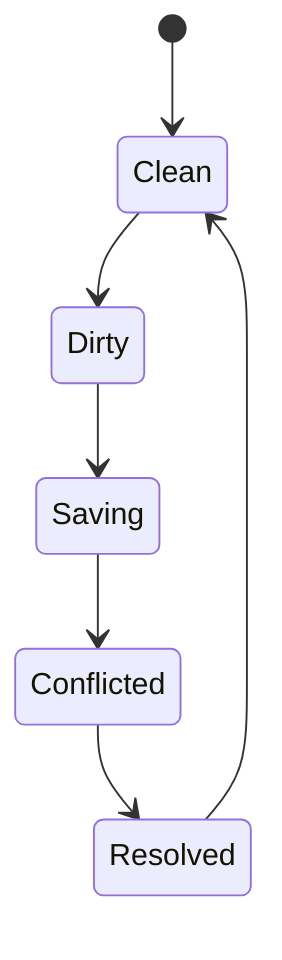

# Save System

## Purpose

This document defines how progress, settings, and session state are persisted in Project Echo. The save system must support player convenience, progression integrity, and recovery without making the game feel brittle.

## Scope

This document covers:

- Player settings persistence
- Progression and unlock persistence
- Session state and recovery requirements
- Save integrity and conflict handling

This document does not define all downloadable content or long-term cloud storage strategy.

## Dependencies

- Save persistence must integrate with PlayFab and Steam account systems.
- The system must preserve progression even when players disconnect or relaunch mid-session.
- The save system should not create a bottleneck for gameplay or content updates.

## Diagrams

### Save Flow

### Save Conflict Model

## Examples

### Example 1: Cosmetic Unlock Save

A player unlocks a cosmetic item after completing a match. The reward is saved to the account profile and remains available after relaunch.

### Example 2: Session Recovery

A player returns after a disconnect and the game restores the latest valid session state or offers a clean reconnect path.

## Edge Cases

- A save attempt fails during a network interruption.
- A player has multiple devices and the save state conflicts.
- A save is partially written and must be recovered.
- A player changes platform account and the previous save should remain isolated.

## Design Decisions

### Decision 1: Persistence Should Be Minimal and Reliable

The game should save only the state that matters to player continuity and progression. A large and complex save model increases failure risk.

### Decision 2: The Core Game Loop Must Not Rely on Local Save State Alone

Session continuity must be protected by server-authoritative or cloud-backed persistence where possible. In-session continuity specifically (surviving a disconnect mid-match) is a networking concern, not a save-system one — see [technical/NetworkArchitecture.md §Disconnect Recovery](../../../technical/NetworkArchitecture.md#disconnect-recovery-non-host) and §Host Migration. This document owns what happens to a player's account after the match ends, not during it.

### Decision 3: Save Failure Must Be Recoverable

The game should degrade gracefully when a save cannot be completed. It should not silently lose progression or corrupt the player experience.

## Balancing Notes

- Save operations should be invisible to the player most of the time.
- The game should preserve progression without requiring the player to grind or re-do content because of a failed save.
- Save reliability is a trust issue and should be treated seriously.

## Developer Notes

- Use versioned save data and schema migration support.
- Keep save write operations atomic where practical.
- Provide a save diagnostic pipeline for debugging and support.

## Implementation Notes

- Define a clear save schema for player profile, unlocks, settings, and session metadata.
- Write to cloud storage asynchronously and avoid blocking gameplay on save completion.
- Support local fallback save data for offline or degraded conditions.

## Future Improvements

- Add richer recovery tools for interrupted sessions.
- Expand save support for replay and post-match recap data.
- Introduce structured save snapshots for debugging and anomaly review.

## Risks

- Save corruption can create major player trust issues.
- Complex persistence layers can cause long debugging cycles.
- Overly aggressive autosave can create performance or network issues.

## Open Questions

- What save data is mandatory for the MVP versus what can wait?
- How much session recovery should be built into the first release?
- Should the game support cloud saves only or also local fallback saves?
