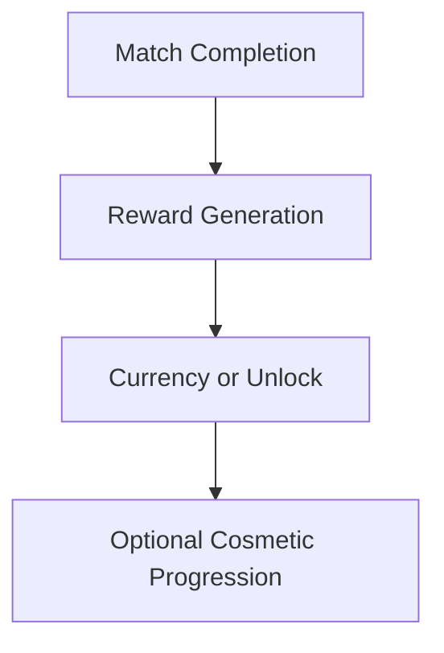

# Economy

## Purpose

This document defines the in-game economy model for Project Echo. It covers progression rewards, virtual goods, and monetization boundaries so that the system supports the game without undermining the core experience.

## Scope

This document covers:

- Cosmetic and optional reward structure
- Resource and progression pacing
- Monetization compatibility
- Fairness and balance constraints

This document does not define a broad free-to-play economy or a large transactional system.

## Dependencies

- The economy must align with the progression system and monetization strategy.
- Rewards should be easy to understand and not create gameplay imbalance.
- The system must remain compatible with Steam and PlayFab.

## Diagrams

### Economy Flow

## Examples

### Example 1: Cosmetic Unlock

A player earns a cosmetic outfit or profile item after reaching a progression milestone.

### Example 2: Event Reward

A limited seasonal event offers a unique cosmetic item tied to a specific event or achievement.

## Edge Cases

- A player cannot claim a reward because of a backend failure.
- Reward availability is inconsistent between platforms or accounts.
- A player accumulates rewards too quickly and feels the pacing is unfair.
- Cosmetic rewards create confusion if they appear to affect gameplay or status.

## Design Decisions

### Decision 1: The Economy Must Be Simple

The game should not introduce a dense resource economy. The economy should support progression and optional customizations while keeping the core experience clear.

### Decision 2: The Economy Must Not Affect Core Gameplay Balance

Cosmetics and other optional rewards should not provide mechanical advantage or influence match outcomes.

### Decision 3: Progression Must Reward Engagement, Not Frustration

Reward pacing should remain fair and should not force the player to grind in ways that damage the game’s identity.

## Balancing Notes

- Reward pacing should be steady and predictable.
- Cosmetic rewards should be visually distinctive but not excessively numerous in the early release.
- Premium content should remain optional and clearly separated from core progression.

## Developer Notes

- Define reward types as cosmetic, narrative, or milestone-based rather than gameplay-affecting.
- Keep the backend economy schema simple and versioned.
- Ensure that reward events are auditable for support and analytics.

## Implementation Notes

- Use a single progression and reward pipeline that feeds both cosmetics and account milestones.
- Keep reward issuance server-authoritative and logged for debugging.
- Provide a clear inventory or unlock UI for players to review their acquired items.

## Future Improvements

- Introduce seasonal bundles and limited events.
- Expand cosmetic themes for facility and player customization.
- Create in-game events that award themed content without altering gameplay balance.

## Risks

- An overly layered economy can increase development and support complexity.
- A confusing reward structure can reduce trust and player retention.
- Premium content that appears to affect progression can harm the game’s reputation.

## Open Questions

- Which rewards should be included in the initial launch economy?
- How much premium content is appropriate for the first post-launch phase?
- Should cosmetics be earned or purchased, or both?
