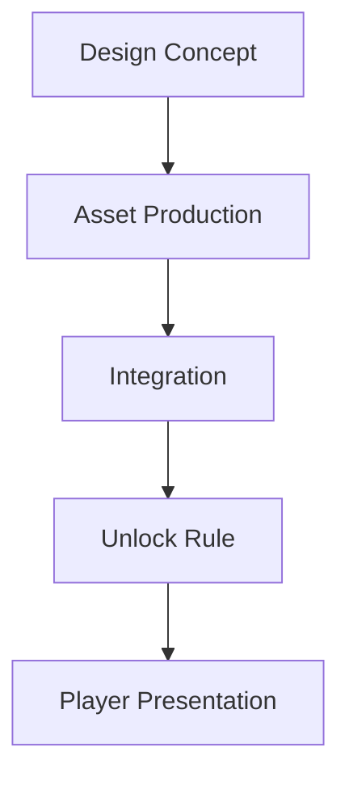

# Cosmetics

## Purpose

This document defines the cosmetic content strategy for Project Echo. Cosmetics are intended to support self-expression and long-term engagement without affecting gameplay balance or competitive fairness.

## Scope

This document covers:

- Cosmetic categories and design principles
- Unlock and presentation rules
- Content pacing and monetization compatibility
- Visual consistency and content pipeline expectations

This document does not define every cosmetic item that will be shipped.

## Dependencies

- Cosmetics must align with the art direction and progression system.
- They should not create gameplay advantage or confusion.
- The content pipeline must support efficient creation and iteration.

## Diagrams

### Cosmetic Pipeline

## Examples

### Example 1: Character Cosmetic

A player unlocks a protective suit skin that changes appearance but not gameplay mechanics.

### Example 2: Facility Cosmetic

A player earns a themed equipment cosmetic that reflects the player’s progression or event participation.

## Edge Cases

- A cosmetic item is visually confusing in dark environments and reduces readability.
- A cosmetic reward appears to grant an advantage due to color or visibility.
- A cosmetic item is too expensive or too rare for the intended audience.
- Cosmetic content becomes visually inconsistent with the game’s art style.

## Design Decisions

### Decision 1: Cosmetics Must Be Purely Optional

No cosmetic should alter gameplay or create unfair advantages. They should be expressive, not competitive.

### Decision 2: Cosmetics Should Reinforce the World

The art style of cosmetics should feel authentic to the game’s facility and scientific horror theme.

### Decision 3: Cosmetic Content Should Be Manageable

The production team should be able to create a reasonable amount of cosmetic content without undermining the core game development schedule.

## Balancing Notes

- Cosmetic visibility should be carefully managed to avoid disrupting readability in gameplay.
- The game should avoid cosmetics that make players harder to distinguish in a way that harms team coordination.
- Cosmetic rewards should support progression pacing without dominating the economy.

## Developer Notes

- Keep cosmetics modular and reusable where possible.
- Tag cosmetics by category and unlock rule to simplify the backend and UI integration.
- Ensure that cosmetics do not break the visual readability of essential gameplay elements.

## Implementation Notes

- Implement cosmetics as unlockable profile assets with clear ownership metadata.
- Maintain a consistent schema for item appearance, rarity, and unlock conditions.
- Support previews in menus without requiring a full match launch.

## Future Improvements

- Add themed cosmetic sets for seasonal events.
- Expand the range of cosmetic categories after the initial release.
- Introduce more community-driven cosmetic content if the game supports it.

## Risks

- Too many cosmetics can create a large production burden.
- Unclear cosmetic value can reduce engagement and perceived quality.
- Visual clutter can reduce readability and break the mood.

## Open Questions

- Which cosmetic categories are most important for the MVP?
- Should cosmetic rewards be earned or purchased, or both?
- How many cosmetic items should be released in the first post-launch content phase?
