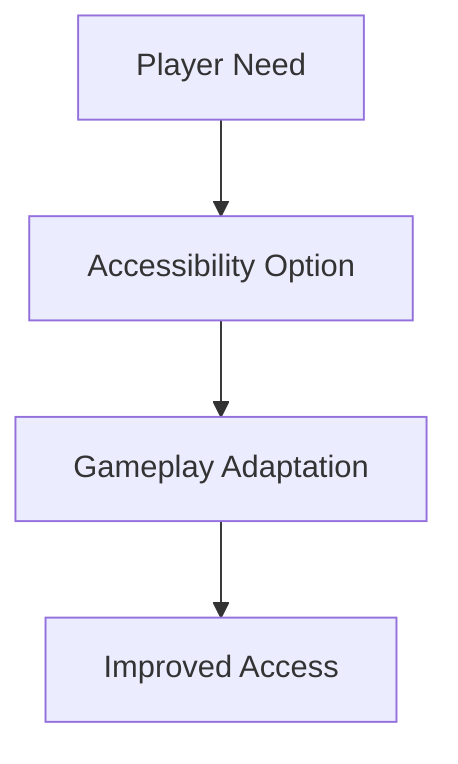

# Accessibility

## Purpose

This document defines the accessibility requirements for Project Echo. The game must be playable and understandable for a wide range of players, including those with sensory, cognitive, motor, or communication differences.

## Scope

This document covers:

- Visual accessibility
- Audio accessibility
- Input and control accessibility
- Communication accessibility
- Cognitive accessibility and clarity

This document does not define every possible assistive feature, but it establishes the minimum acceptable baseline.

## Dependencies

- Accessibility must be integrated into core game systems rather than added as a late patch.
- It must support the first-person co-op experience and Steam platform expectations.
- The design should remain compatible with the communication-first gameplay model.

## Diagrams

### Accessibility Support Flow

## Examples

### Example 1: Colorblind Support

The game uses color and shape cues together so players are not dependent on color alone to interpret a warning or objective state.

### Example 2: Subtitle Support

Environmental audio and communication cues include subtitles or captions so that players with hearing impairment can still follow events.

## Edge Cases

- A player has low vision and cannot read small text or subtle UI elements.
- A player has hearing impairment and cannot distinguish important audio cues.
- A player has motor impairments and cannot use a fast-twitch input pattern reliably.
- A player has anxiety or cognitive overload and needs reduced intensity or clearer pacing.
- A player cannot use voice chat and relies entirely on text or ping systems.

## Design Decisions

### Decision 1: Accessibility Is a Core Design Requirement

The game should not be considered complete if it is not understandable and playably accessible to as broad an audience as possible.

### Decision 2: Accessibility Features Must Not Remove the Core Experience

Options should improve access without fundamentally altering the game’s identity or reducing the value of cooperative play.

### Decision 3: The Game Must Support Communication Alternatives

The game should not make voice chat the only route to successful play. Accessibility and reliability both require alternatives.

## Balancing Notes

- Accessibility features should remain optional and configurable.
- The game should preserve tension and clarity at the same time.
- Assistive features should not create meaningfully unfair advantages unless they are explicitly designed as difficulty options.

## Developer Notes

- Build accessibility features into the UI and gameplay systems from the beginning.
- Use clear text, readable contrast, and strong visual hierarchy in all menus and HUD elements.
- Support remappable controls and multiple input styles where practical.

## Implementation Notes

- Provide options for subtitle captions, visual indicators, colorblind-safe palettes, and reduced motion.
- Offer configurable input dead zones, hold durations, and toggle-based interactions.
- Support text-based communication fallback and contextual pinging.
- Ensure that accessibility settings are persisted per account.

## Future Improvements

- Add more granular accessibility profiles.
- Expand support for dyslexia-friendly UI text and cognitive pacing options.
- Improve assistive technology support as the game matures.

## Risks

- Accessibility is often treated as a late-stage concern and becomes expensive to retrofit.
- Adding too many options can complicate the interface and content pipeline.
- Poor communication alternatives can exclude players who depend on non-voice systems.

## Open Questions

- Which accessibility options are mandatory for the first public release?
- How much of the communication system should be accessible through non-voice means in the MVP?
- What accessibility requirements should be used for Steam certification and QA validation?
