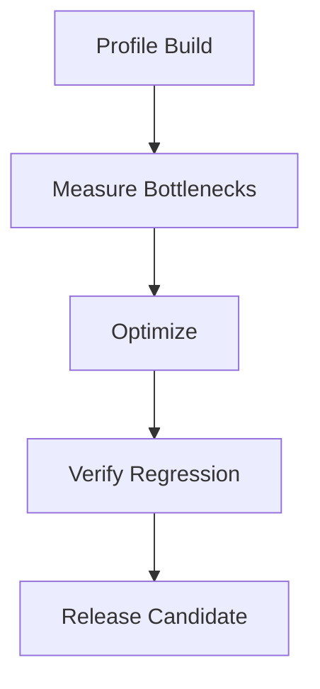

# Performance

## Purpose

This document defines the performance requirements and optimization expectations for Project Echo. The game must remain stable and responsive under multiplayer pressure, especially on the target Windows PC platform.

## Scope

This document covers:

- Frame rate and responsiveness targets
- Memory and asset constraints
- Multiplayer performance expectations
- Profiling and regression testing strategy

This document does not define every optimization implementation detail.

## Dependencies

- Performance targets must support the Unreal-like or Unity-based first-person experience and multiplayer requirements.
- The architecture must allow profiling and optimization without destabilizing gameplay systems.
- The technical stack must be monitored during playtests and release preparation.

## Diagrams

### Performance Pipeline

## Examples

### Example 1: Multiplayer Framerate

The game should maintain a consistent framerate during a crowded objective sequence with 4 players and active creature effects.

### Example 2: Asset Streaming

The game should not stutter when entering a new room or switching between multiple active systems.

## Edge Cases

- A match with many players and active effects causes frame-time spikes.
- Asset loading causes visible hitching during room transitions.
- A memory leak appears after repeated matches or reconnects.
- Network conditions cause additional CPU or bandwidth strain.

## Design Decisions

### Decision 1: Performance Must Be Part of the Design Budget

Performance is not an engineering concern to be solved after content is built. It must be designed into the experience from the start.

### Decision 2: The Core Experience Must Remain Responsive Under Pressure

A game that becomes sluggish during the most important moments is not acceptable.

### Decision 3: Optimization Must Preserve Feel and Readability

The game should not sacrifice mood, clarity, or interaction quality simply to improve performance numbers.

## Balancing Notes

- The game’s visual quality should support the target frame rate without making the environment unreadable.
- Effects should be scaled to the game’s tension and session pacing.
- Multiplayer complexity should be balanced against the target hardware profile.

## Developer Notes

- Profile early and often, especially around networking, AI, and object spawning.
- Keep dynamic effects and particle counts under control during high-stress sequences.
- Track memory, frame time, and network throughput during playtests.

## Implementation Notes

- Establish hardware targets and performance budgets for the MVP.
- Use object pooling, asset streaming, and scene loading controls where appropriate.
- Measure both client frame time and server-side simulation cost.

## Future Improvements

- Improve scalability for higher-end hardware and future platforms.
- Expand performance monitoring for live builds.
- Optimize for future content and facility complexity.

## Risks

- The game may become unstable if performance is not treated as a release requirement.
- Excessive visual effects could break the clarity of important gameplay cues.
- Network replication overhead can become costly during high-pressure sequences.

## Open Questions

- What are the minimum hardware targets for the first release?
- Which performance metrics are most important for the vertical slice?
- How much visual fidelity should be traded off to preserve multiplayer stability?
