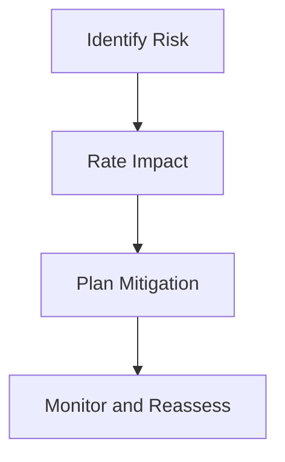

# Technical Risks

## Purpose

This document identifies the most significant technical risks for Project Echo and establishes how the team should respond to them. It is intended to help engineering, design, and production make informed decisions about scope, implementation strategy, and milestone planning.

## Scope

This document covers:

- Major technical risks related to networking, state replication, content complexity, and backend integration
- Risk mitigation strategies
- Review points and decision gates

This document does not replace the engineering backlog or implementation tickets.

## Dependencies

- Technical risk planning depends on the game’s chosen architecture, tools, and production timeline.
- The risks should be revisited during each milestone review.
- Risk mitigation must remain realistic for an indie team.

## Diagrams

### Risk Assessment Flow

## Examples

### Example 1: Network Replication Risk

If the objective state and creature state are not replicated consistently, players may experience irreconcilable gameplay differences.

### Example 2: Content Scope Risk

If designers and artists attempt to create too many puzzle variants or facilities for the MVP, production may fail to finish the vertical slice on time.

## Edge Cases

- A core gameplay feature cannot be implemented as expected under the chosen toolchain.
- A backend dependency becomes unavailable or incompatible with the planned milestone.
- The match state becomes too complex to debug due to over-broad replication.
- The team lacks the time to tune the creature system properly before playtests.

## Design Decisions

### Decision 1: The Team Must Prioritize the Highest-Risk Systems Early

The game’s most critical technical risks are network replication, state authority, and content modularity. These deserve early attention rather than being deferred.

### Decision 2: The MVP Must Be Narrow Enough to Be Technically Safe

The design should not depend on a very large number of systems or features before the first playable build.

### Decision 3: Each Major Technical Risk Should Have a Contingency Plan

The team should know what to reduce, simplify, or delay if a risk becomes a real issue.

## Balancing Notes

- Technical risk mitigation should not create an overly simple or shallow gameplay experience.
- The team should preserve the feel of the game even when simplifying back-end or content systems.
- Risk management should be proactive rather than reactive.

## Developer Notes

- Track technical risks alongside production risk and gameplay risk.
- Link risks to concrete actions, owners, and review dates.
- Use playtests and technical spikes to reduce uncertainty early.

## Implementation Notes

- Create a risk register with categories such as Architecture, Networking, Content Production, Backend, and QA.
- Review risk severity and mitigation at each milestone.
- Keep mitigation design as simple and testable as possible.

## Future Improvements

- Add more detailed automated validation for core systems.
- Expand technical risk tracking into live operations planning.
- Build better instrumentation for game-state debugging and session recovery.

## Risks

- The technical complexity of asymmetric reality may be underestimated.
- Multiplayer state synchronization may become more difficult than expected.
- Backend integration could threaten milestone dates if delayed.
- Over-scoping content systems could overwhelm the team.

## Open Questions

- Which technical spike is most urgent before the vertical slice?
- What is the minimum set of systems that must be fully stable for the first public playtest?
- Which risks are acceptable to carry into launch versus those that must be eliminated earlier?
