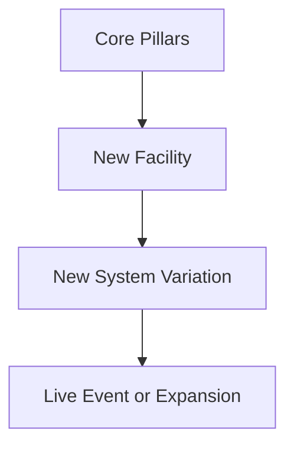

# Future Content

## Purpose

This document defines the post-launch content direction for Project Echo. It identifies how the game can expand while maintaining its core identity and avoiding feature dilution.

## Scope

This document covers:

- Additional facilities and systems
- New creature behaviors and narrative themes
- Seasonal or event-based content
- Content pacing strategy

This document does not define every future expansion in detail.

## Dependencies

- Future content must remain compatible with the existing systems and architecture.
- Expansions should reinforce rather than replace the core communication-driven experience.
- Content production must remain sustainable for a small team.

## Diagrams

### Content Expansion Flow

## Examples

### Example 1: New Facility

A new facility introduces a different environmental logic while reusing the same communication and creature pressure systems.

### Example 2: Event-Based Content

A seasonal update introduces new cosmetic sets and a limited-time themed objective variant without breaking the core loop.

## Edge Cases

- New content introduces too much mechanical variety and weakens the game’s identity.
- An expansion relies on a new system that the current architecture cannot support cleanly.
- Content release pacing outstrips the team’s capacity to support it well.
- Post-launch content creates confusion for new players who encounter too many unfamiliar systems at once.

## Design Decisions

### Decision 1: Future Content Must Expand the Experience, Not Fragment It

New content should broaden the game’s appeal while preserving the core identity of communication-driven horror.

### Decision 2: New Facilities Should Reuse Core Systems

The goal is to expand variety with controlled changes rather than entirely new gameplay pillars every time.

### Decision 3: Live Content Must Be Sustainable

The team should avoid building a content pipeline that becomes too expensive to support after launch.

## Balancing Notes

- All future content should be playtested with the same communication-first standards as the base game.
- New systems should be introduced gradually and documented clearly.
- The game should maintain a consistent tone and clarity even as the content library grows.

## Developer Notes

- Keep expansion content modular and built around the same core systems.
- Ensure future facilities can be authored using the existing puzzle, objective, and map generation frameworks.
- Keep content variety controlled to reduce maintenance costs.

## Implementation Notes

- Use content packs and data-driven definitions for new facilities and puzzle variants.
- Pair new content with clear analytics tracking for balancing and retention.
- Avoid introducing hard dependencies between old and new content unless those dependencies are intentional.

## Future Improvements

- Add more facility themes and narrative contexts.
- Improve procedural support for new content types.
- Create event-driven objectives and cosmetic content drops.

## Risks

- Content growth can become unsustainable if not planned around the existing architecture.
- The game can lose its identity if every expansion introduces a radically different formula.
- Live content can create additional support and QA burden.

## Open Questions

- Which future facility themes are most promising for the first expansion wave?
- How much new content should be released in the first 12 months after launch?
- What content should remain evergreen versus seasonal?
