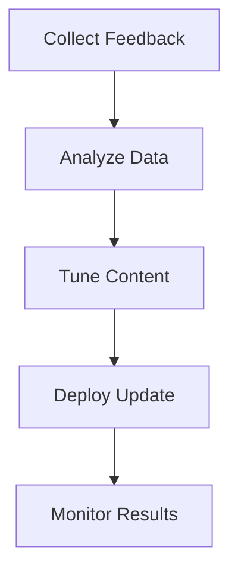

# Live Operations

## Purpose

This document defines the live operations approach for Project Echo. It covers the systems and processes required to support the game after launch, including monitoring, content delivery, community support, and event strategy.

## Scope

This document covers:

- Post-launch support structure
- Content cadence and event planning
- Community and feedback systems
- Monitoring and incident response

This document does not define every future event or community initiative.

## Dependencies

- Live operations depend on the backend, analytics, Steam integration, and progression systems.
- The game must be built with enough observability to support ongoing tuning after launch.
- The team must understand the operational cost of each content drop.

## Diagrams

### Live Operations Loop

## Examples

### Example 1: Event Update

A seasonal event introduces a new cosmetic set and a limited objective variant while preserving the core gameplay loop.

### Example 2: Balance Patch

The team adjusts objective pacing or creature escalation based on telemetry and player feedback after launch.

## Edge Cases

- A content update introduces a bug that affects many players.
- Player feedback reveals a balance issue that requires rapid change.
- A live event creates too much demand for server or backend systems.
- A patch causes progression or save incompatibility.

## Design Decisions

### Decision 1: Live Operations Must Be Planned From the Start

The game should be built with supportability in mind. Launch is not the end of the design effort; it is the start of a live process.

### Decision 2: Live Operations Should Improve the Game, Not Create Noise

Updates should address real player needs and strengthen the experience rather than adding clutter.

### Decision 3: The Team Must Prioritize Stability Over Frequency

A smaller number of high-quality content updates is better than a constant stream of low-value changes.

## Balancing Notes

- Live content should be paced to preserve player anticipation.
- Frequent updates should not create fatigue or change the core identity too abruptly.
- Community feedback should be incorporated through a structured channel, not ad hoc decisions.

## Developer Notes

- Build telemetry and incident reporting into the game from the start.
- Use feature flags where possible to reduce deployment risk.
- Keep update workflows organized and clearly documented.

## Implementation Notes

- Define a release pipeline for patches, hotfixes, and content drops.
- Track update outcomes through analytics and player feedback channels.
- Maintain a clear incident response process for backend or gameplay regressions.

## Future Improvements

- Add deeper event systems and recurring content calendars.
- Expand community-facing tools such as recap summaries and shared stories.
- Improve matchmaking and session quality through live tuning.

## Risks

- Live operations can become a major cost center if the game does not have a clear support model.
- Bad patches can damage player trust quickly.
- Too much content too fast can reduce the quality of the experience.

## Open Questions

- What content cadence is realistic for the first 12 months?
- What is the minimum level of live monitoring required at launch?
- Which updates should be scheduled versus reactive?
