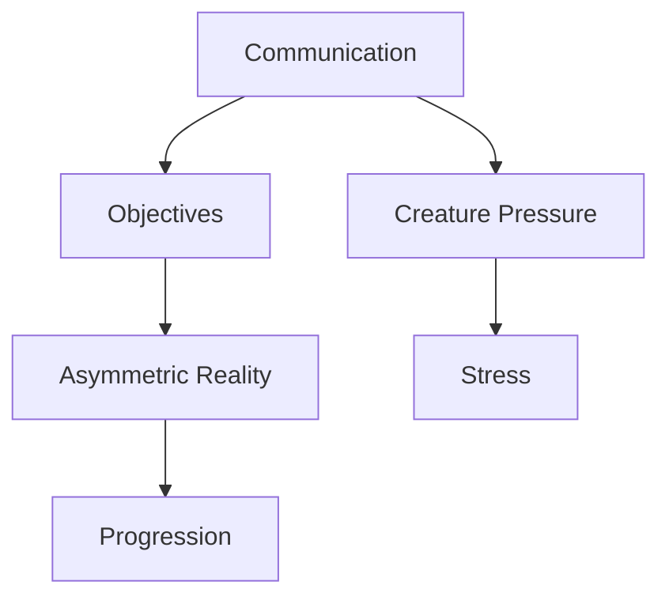

# Appendix

## Purpose

This appendix consolidates supporting reference material and definitions used across the Project Echo design documents. It is intended to reduce ambiguity and provide quick access to commonly referenced terms and standards.

## Scope

This document covers:

- Terminology and shorthand
- Core assumptions and constraints
- Reference tables for systems and states
- Notes for future documentation updates

This document is a reference companion, not a standalone design source.

## Dependencies

- Terms in this appendix should remain aligned with the rest of the repository.
- New systems or design terms should be added here when they become widely used.

## Diagrams

### System Reference Map

## Examples

### Example 1: Terminology

“Reality divergence” refers to the difference between player-specific environmental states within a shared facility.

### Example 2: Constraint Reference

The target session length is 15–30 minutes for a complete match experience.

## Edge Cases

- A term becomes ambiguous across documents and creates confusion.
- A system is described with conflicting terminology in different files.
- A new mechanic is introduced without a corresponding definition.

## Design Decisions

### Decision 1: Keep Terminology Consistent

Every major concept should use the same term across the repository. This reduces ambiguity and makes the documents easier to maintain.

### Decision 2: Define Core Constraints Explicitly

The appendix should preserve the baseline assumptions that affect design, engineering, and production decisions.

## Balancing Notes

- Terminology should be practical, not overly academic.
- Definitions should be specific enough to guide implementation without becoming bloated.

## Developer Notes

- Update this appendix whenever a new system introduces a new term or concept.
- Keep a concise glossary of high-frequency terms such as objective, pressure state, reality divergence, and stress.

## Implementation Notes

- Use this document as the canonical reference for recurring gameplay terms.
- Cross-link terminology changes to the relevant design files.

## Future Improvements

- Expand the glossary with production and engineering terms.
- Add a reference table for system states and tags.
- Include version history for major design changes.

## Risks

- Inconsistent terminology can create implementation drift and design confusion.
- A stale appendix can become less useful over time.
- Overly broad definitions can reduce precision.

## Open Questions

- Which terms should be formalized first for the team’s internal workflow?
- How much design terminology should be captured in the appendix versus the main GDD documents?
- Should the appendix include a changelog for major doc revisions?
