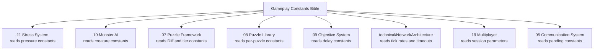
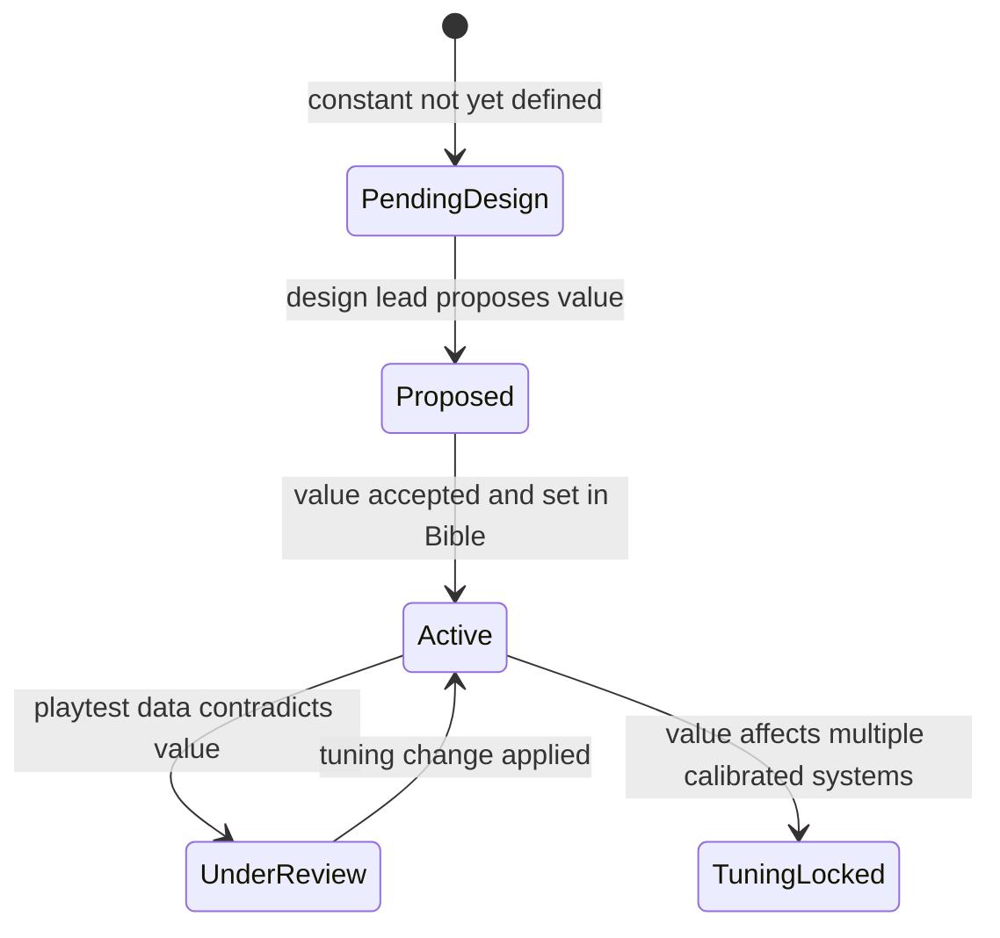

# Gameplay Constants Bible

## Purpose

This document is the single source of truth for every tunable gameplay value in Project Echo. Designers, programmers, and QA use this document to rebalance the game, validate implementations, and catch conflicting values before they reach production.

Every numeric constant that influences gameplay — timing, ranges, decay rates, thresholds, limits, costs, multipliers — is defined here. All other documents reference this Bible. If a value appears only in a source document and not here, it is not authoritative.

## Scope

This document covers all gameplay constants across:
- Global session parameters
- Player systems
- Pressure and stress meters
- Monster AI and creature behavior
- Puzzle framework (shared rules) and per-puzzle constants
- Communication system
- Objective system
- UI and HUD timing
- Audio design thresholds
- Networking parameters
- Progression rewards
- Difficulty scaling
- Accessibility overrides
- Debug and QA parameters
- Analytics event targets

This document does **not** contain:
- Code. Constants are named for reference by programmers; implementation is in the relevant system.
- Design philosophy. Rationale lives in the originating documents.
- Architecture decisions. See `technical/ADR/` for resolved decisions.

## Dependencies

- **Change authority:** This document. To change any value listed here, edit the row in this Bible. Do not change the value in the source document directly.
- Source documents retain their values for readability but carry a Constants Authority notice directing readers here.
- `docs/GDD/11 Stress System.md` — primary source for all pressure constants harvested in §Pressure Constants.
- `docs/GDD/10 Monster AI.md` — primary source for creature constants in §Monster Constants.
- `docs/GDD/08 Puzzle Library.md` — primary source for per-puzzle constants in §Puzzle Constants.
- `docs/GDD/09 Objective System.md` — primary source for objective timing in §Objective Constants.
- `technical/NetworkArchitecture.md` — primary source for network timing in §Networking Constants.
- `docs/GDD/19 Multiplayer.md` — primary source for session parameters.

## Versioning and Change Policy

When a value in this document changes:
1. Update the row here (value + Notes column to record previous value and reason).
2. Verify that source documents referencing the constant are not overriding it with a stale value.
3. QA must re-run balancing tests affected by the change before shipping.
4. Changes to constants marked **Tuning-Locked** require a design lead sign-off.

---

## Table Conventions

| Column | Meaning |
|---|---|
| Constant Name | `SCREAMING_SNAKE_CASE` identifier used by code and documents |
| Description | What this value controls |
| Default Value | Authoritative value. `[PENDING DESIGN]` = not yet finalized |
| Unit | Measurement unit (s = seconds, m = meters, Hz, %, dimensionless) |
| Valid Range | Min–Max the value can be set without breaking system invariants |
| Owner | Which system reads and enforces this constant |
| Referenced By | Which GDD/technical documents cite this value |
| Notes | History, rationale, known tuning dependencies |

---

## 1. Design Philosophy

Gameplay constants exist to make the experience **legible, not balanced**. Legibility first means: a player must be able to understand what is happening to them during a session, even if the outcome is bad. Values should:

1. Stay within ranges where cause and effect are perceptible in real time.
2. Pair pressure escalation with a proportional window for player response.
3. Never produce instant Collapse from a single non-climactic mistake.
4. Keep creature behavior readable across the 2.5–7.0 m/s speed range.
5. Allow a competent team to play within the Tense band deliberately.

Constants marked **Tuning-Locked** below have additional constraints — they sit at the boundary between "feels fair" and "feels arbitrary" and require playtest evidence before changing.

---

## 2. Global Constants

Session-wide invariants shared across all systems.

| Constant Name | Description | Default Value | Unit | Valid Range | Owner | Referenced By | Notes |
|---|---|---|---|---|---|---|---|
| `PLAYER_COUNT_MIN` | Minimum players to start a session | 2 | players | 1–4 | Session Manager | 01 Vision, 19 Multiplayer, 09 Objective System, all puzzle specs | Enforced at lobby; single-player allowed in debug only |
| `PLAYER_COUNT_MAX` | Maximum players per session | 4 | players | 2–4 | Session Manager | 01 Vision, 19 Multiplayer | Vivox and Fusion seat limit; increasing requires platform review |
| `SESSION_DURATION_MIN` | Intended minimum match length | 900 | s | 600–1200 | Objective System | 01 Vision, 09 Objective System, docs/TDD | 15 minutes |
| `SESSION_DURATION_TARGET` | Intended median match length | 1350 | s | 900–1800 | Objective System | 01 Vision, 09 Objective System | 22.5 minutes — midpoint of 15–30 range |
| `SESSION_DURATION_MAX` | Intended maximum match length | 1800 | s | 1200–2700 | Objective System | 01 Vision, 09 Objective System | 30 minutes |
| `PRESSURE_TICK_RATE` | How often the Pressure System recomputes all meters | 10 | Hz | 5–20 | Pressure System | 11 Stress System, technical/NetworkArchitecture | 100 ms tick; all pressure deltas applied per tick |
| `PRESSURE_TICK_INTERVAL` | Duration of one pressure tick | 0.100 | s | — | Pressure System | 11 Stress System | Derived: 1 / PRESSURE_TICK_RATE |

---

## 3. Player Constants

Per-player physical and interaction parameters.

| Constant Name | Description | Default Value | Unit | Valid Range | Owner | Referenced By | Notes |
|---|---|---|---|---|---|---|---|
| `PLAYER_WALK_SPEED` | Base movement speed | [PENDING DESIGN] | m/s | 2.0–5.0 | Player Controller | 04 Player Systems | Playtest target: creature can always close distance at Hunting speed |
| `PLAYER_SPRINT_SPEED` | Speed while sprinting | [PENDING DESIGN] | m/s | WALK+1.5–WALK+3.0 | Player Controller | 04 Player Systems, 11 Stress System | Sprint triggers NOISE_SPRINT contribution; see §Pressure Constants |
| `PLAYER_CROUCH_SPEED` | Speed while crouching | [PENDING DESIGN] | m/s | 0.5–WALK | Player Controller | 04 Player Systems | Should not contribute to NOISE_SPRINT |
| `PLAYER_ACCELERATION` | Movement acceleration rate | [PENDING DESIGN] | m/s² | 5–20 | Player Controller | 04 Player Systems | Higher acceleration increases start-of-sprint noise window |
| `PLAYER_DECELERATION` | Movement deceleration rate | [PENDING DESIGN] | m/s² | 5–30 | Player Controller | 04 Player Systems | — |
| `INTERACTION_TIME_MIN` | Minimum interaction hold duration | 0.5 | s | 0.1–1.0 | Player Controller | 04 Player Systems, docs/TDD | Below 0.5 s feels accidental |
| `INTERACTION_TIME_MAX` | Maximum interaction hold duration | 3.0 | s | 1.0–10.0 | Player Controller | 04 Player Systems, docs/TDD | Above 3 s violates Principle 2 (puzzle readability under pressure) |
| `ISOLATION_DISTANCE_THRESHOLD` | Distance from nearest teammate that triggers isolation penalty | 15.0 | m | 10.0–25.0 | Pressure System | 11 Stress System, 10 Monster AI | **Tuning-Locked.** Matches creature DETECTION_RADIUS. If changed, update both constants together |
| `ISOLATION_STRESS_BONUS` | Additional stress added to isolated player | 3.00 | dimensionless | 0–5 | Pressure System | 11 Stress System | Applied per-player; see STRESS_FORMULA |
| `ISOLATION_BONUS_DECAY` | Rate at which isolation bonus decays when back in range | 0.30 | /sec | 0.10–1.00 | Pressure System | 11 Stress System | Matches NOISE_PASSIVE_DECAY so N and isolation resolve at the same rate |
| `INCAPACITATION_DURATION_STANDARD` | Duration of player incapacitation after creature contact | 30 | s | 15–60 | Player Controller | 10 Monster AI | Reset by teammate revive |
| `INCAPACITATION_DURATION_COLLAPSE` | Incapacitation duration during Collapse band | 60 | s | 30–120 | Player Controller | 10 Monster AI | **Tuning-Locked.** 2× standard; signals Collapse severity |
| `REVIVE_TIME` | Time required for teammate revive | [PENDING DESIGN] | s | 3–15 | Player Controller | 04 Player Systems | Revive in progress generates NOISE_SPRINT-level N contribution TBD |
| `REVIVE_RECOVERY_DELAY` | Grace period after revive before contact is lethal again | [PENDING DESIGN] | s | 1–5 | Player Controller | 04 Player Systems | — |
| `PICKUP_INTERACTION_TIME` | Hold time to pick up an object | [PENDING DESIGN] | s | 0.5–2.0 | Player Controller | 04 Player Systems | Should respect INTERACTION_TIME_MIN |
| `CARRY_SPEED_MODIFIER` | Movement speed multiplier while carrying an object | [PENDING DESIGN] | dimensionless | 0.5–1.0 | Player Controller | 04 Player Systems | — |
| `INVENTORY_SLOTS` | Number of item slots per player | [PENDING DESIGN] | count | 1–4 | Player Controller | 04 Player Systems | — |

---

## 4. Pressure Constants

All numeric values for the Pressure and Stress system. **11 Stress System.md is the primary owner of the equations; this document owns the values plugged into those equations.**

### 4.1 Meter Ranges

| Constant Name | Description | Default Value | Unit | Valid Range | Owner | Referenced By | Notes |
|---|---|---|---|---|---|---|---|
| `METER_VALUE_MIN` | Floor for any individual pressure meter (N, U, D, T) | 0 | dimensionless | — | Pressure System | 11 Stress System | Hard floor; meters cannot go negative |
| `METER_VALUE_MAX` | Ceiling for any individual pressure meter | 10 | dimensionless | — | Pressure System | 11 Stress System | Hard ceiling; contributions clamped at this value |
| `PRESSURE_P_MIN` | Floor for composite pressure P = N + U + D + T | 0 | dimensionless | — | Pressure System | 11 Stress System | — |
| `PRESSURE_P_MAX` | Ceiling for composite pressure P | 40 | dimensionless | — | Pressure System | 11 Stress System | P_MAX = 4 × METER_VALUE_MAX |
| `STRESS_S_MIN` | Floor for per-player stress S_i | 0 | dimensionless | — | Pressure System | 11 Stress System | Hard floor |
| `STRESS_S_MAX` | Ceiling for per-player stress S_i | 10 | dimensionless | — | Pressure System | 11 Stress System | Hard ceiling |

### 4.2 Per-Player Stress Formula

`S_i = clamp(STRESS_S_MIN, STRESS_S_MAX, STRESS_WEIGHT × P + Isolation_i)`

| Constant Name | Description | Default Value | Unit | Valid Range | Owner | Referenced By | Notes |
|---|---|---|---|---|---|---|---|
| `STRESS_WEIGHT` | Coefficient scaling composite P into per-player S | 0.25 | dimensionless | 0.10–0.50 | Pressure System | 11 Stress System | At P=40 with weight 0.25, base S = 10 (max) — isolation cannot make it worse |
| `STRESS_FORMULA` | Canonical formula string (documentation only) | `clamp(0, 10, 0.25×P + Isolation_i)` | — | — | Pressure System | 11 Stress System | See STRESS_WEIGHT; Isolation_i set by ISOLATION_STRESS_BONUS when isolated |

### 4.3 Pressure Band Thresholds

| Constant Name | Description | Default Value | Unit | Valid Range | Owner | Referenced By | Notes |
|---|---|---|---|---|---|---|---|
| `BAND_TENSE_ENTRY` | P threshold to enter Tense from Calm | 10 | dimensionless | 5–15 | Pressure System | 11 Stress System, 07 Puzzle Framework | **Tuning-Locked.** Puzzle Diff scores calibrated against this threshold |
| `BAND_TENSE_EXIT` | P threshold to fall back from Tense to Calm | 8 | dimensionless | 4–12 | Pressure System | 11 Stress System | Hysteresis gap prevents rapid oscillation |
| `BAND_CRITICAL_ENTRY` | P threshold to enter Critical from Tense | 20 | dimensionless | 15–25 | Pressure System | 11 Stress System | **Tuning-Locked** |
| `BAND_CRITICAL_EXIT` | P threshold to fall back from Critical to Tense | 18 | dimensionless | 13–23 | Pressure System | 11 Stress System | Hysteresis gap |
| `BAND_COLLAPSE_ENTRY` | P threshold that begins Collapse countdown | 30 | dimensionless | 25–35 | Pressure System | 11 Stress System | **Tuning-Locked.** Must exceed BAND_CRITICAL_ENTRY by ≥10 |
| `BAND_COLLAPSE_SUSTAIN_TIME` | Seconds P must stay ≥ BAND_COLLAPSE_ENTRY before Collapse activates | 15 | s | 5–30 | Pressure System | 11 Stress System | Prevents instant Collapse from a single Severe failure |
| `BAND_COLLAPSE_FORCED_WINDOW` | Maximum duration of Collapse band before forced drop to Recovery | 20 | s | 10–60 | Pressure System | 11 Stress System | Prevents permanent Collapse soft-lock |
| `BAND_RECOVERY_DURATION` | Duration of Recovery band before re-entering Calm | 10 | s | 5–20 | Pressure System | 11 Stress System | Recovery decay multiplier active during this window |
| `BAND_RECOVERY_P_EXIT` | P must be below this value when Recovery timer expires to enter Calm | 10 | dimensionless | 5–15 | Pressure System | 11 Stress System | If P ≥ this value, Recovery restarts |

### 4.4 Meter Decay Rates

All values expressed per second at the 10 Hz tick rate.

| Constant Name | Description | Default Value | Unit | Valid Range | Owner | Referenced By | Notes |
|---|---|---|---|---|---|---|---|
| `NOISE_PASSIVE_DECAY` | N reduction per second (no noise event active) | 0.30 | /sec | 0.10–1.00 | Pressure System | 11 Stress System | Per tick: 0.03 |
| `UNCERTAINTY_PASSIVE_DECAY` | U reduction per second (no unshared observations present) | 0.10 | /sec | 0.05–0.50 | Pressure System | 11 Stress System | Slower than N; uncertainty lingers |
| `DELAY_PASSIVE_DECAY` | D reduction per second (passive) | 0 | /sec | — | Pressure System | 11 Stress System | D does not decay passively; only reduced by objective events |
| `THREAT_NO_LOS_DECAY` | T reduction per second when creature has no line-of-sight to any player | 0.50 | /sec | 0.10–2.00 | Pressure System | 11 Stress System | T recovers faster than N to allow quick Hunting→Tracking transitions |
| `RECOVERY_DECAY_MULTIPLIER` | All active decay rates are multiplied by this value during Recovery band | 3 | dimensionless | 2–5 | Pressure System | 11 Stress System | Applied to NOISE_PASSIVE_DECAY, UNCERTAINTY_PASSIVE_DECAY, THREAT_NO_LOS_DECAY |

### 4.5 Noise (N) Event Contributions

| Constant Name | Description | Default Value | Unit | Valid Range | Owner | Referenced By | Notes |
|---|---|---|---|---|---|---|---|
| `NOISE_SPRINT` | N added per tick while player is sprinting | 0.40 | /tick | 0.10–1.00 | Pressure System | 11 Stress System | At 10 Hz: 4.0 N per second of sustained sprint |
| `NOISE_FORCED_INTERACTION` | N added on forced or failed interaction event | 1.00 | dimensionless | 0.50–2.00 | Pressure System | 11 Stress System | Slammed door, dropped object, etc. |
| `NOISE_FAILURE_MINOR` | N added when a puzzle fails with FailureSeverityTier Minor | 1.50 | dimensionless | 0.50–2.50 | Pressure System | 11 Stress System, 07 Puzzle Framework, 08 Puzzle Library | **Tuning-Locked.** Diff formula calibrated to these three tiers |
| `NOISE_FAILURE_MODERATE` | N added when a puzzle fails with FailureSeverityTier Moderate | 2.25 | dimensionless | 1.00–3.50 | Pressure System | 11 Stress System, 07 Puzzle Framework, 08 Puzzle Library | **Tuning-Locked** |
| `NOISE_FAILURE_SEVERE` | N added when a puzzle fails with FailureSeverityTier Severe | 3.00 | dimensionless | 1.50–4.00 | Pressure System | 11 Stress System, 07 Puzzle Framework, 08 Puzzle Library | **Tuning-Locked.** Equals NOISE_ALARM — Severe failures are as disruptive as hazard events |
| `NOISE_ALARM` | N added when a hazard or alarm event fires | 3.00 | dimensionless | 1.00–5.00 | Pressure System | 11 Stress System, 08 Puzzle Library | — |

### 4.6 Uncertainty (U) Event Contributions

| Constant Name | Description | Default Value | Unit | Valid Range | Owner | Referenced By | Notes |
|---|---|---|---|---|---|---|---|
| `UNCERTAINTY_UNSHARED_TIMEOUT` | Seconds before an Unshared observation begins contributing to U | 20 | s | 10–60 | Pressure System | 11 Stress System, 07 Puzzle Framework | **Tuning-Locked.** Puzzle Diff formula assumes 20 s |
| `UNCERTAINTY_UNSHARED_CONTRIBUTION` | U added per tick-interval for each Unshared observation past timeout | 1.00 | dimensionless | 0.25–2.00 | Pressure System | 11 Stress System | Applied once per observation, not per tick |
| `UNCERTAINTY_UNSHARED_MAX_PER_ITEM` | Maximum U any single Unshared observation can contribute | 4.00 | dimensionless | 1.00–METER_VALUE_MAX | Pressure System | 11 Stress System | Prevents a single hidden item from maxing U alone |
| `UNCERTAINTY_ON_CONFIRMED` | U reduction applied immediately when an observation reaches Confirmed state | -1.00 | dimensionless | -0.50 – -3.00 | Pressure System | 11 Stress System, 05 Communication System | Negative value = U decreases |

### 4.7 Delay (D) Event Contributions

| Constant Name | Description | Default Value | Unit | Valid Range | Owner | Referenced By | Notes |
|---|---|---|---|---|---|---|---|
| `DELAY_STALL_GRACE` | Seconds an objective can be stalled before D begins increasing | 30.0 | s | 15–60 | Objective System | 09 Objective System, 11 Stress System | Gives teams time to deal with creature before D penalty |
| `DELAY_STALL_INTERVAL` | Seconds between each D increment while stalled past grace | 12.0 | s | 5–30 | Objective System | 09 Objective System, 11 Stress System | — |
| `DELAY_STALL_INCREMENT` | D added per stall interval | 1.00 | dimensionless | 0.25–2.00 | Objective System | 09 Objective System, 11 Stress System | At max stall: D reaches 10 after 30 + 12×10 = 150 s |
| `DELAY_OBJECTIVE_PROGRESS` | D reduction applied on meaningful objective progress | -4.00 | dimensionless | -1.00 – -8.00 | Objective System | 09 Objective System, 11 Stress System | Negative value = D decreases; rewards progress visibly |
| `DELAY_OBJECTIVE_RESOLVE` | D value set on full objective resolution (not decremented, set absolute) | 0 | dimensionless | 0 | Objective System | 09 Objective System, 11 Stress System | Hard reset; clearing an objective wipes all delay |

### 4.8 Threat (T) Constants

| Constant Name | Description | Default Value | Unit | Valid Range | Owner | Referenced By | Notes |
|---|---|---|---|---|---|---|---|
| `DETECTION_RADIUS` | Maximum range at which creature contributes to T | 18.0 | m | 10.0–30.0 | Pressure System | 11 Stress System, 10 Monster AI | **Tuning-Locked.** Matches ISOLATION_DISTANCE_THRESHOLD to tie creature and isolation pressure together |
| `THREAT_FORMULA` | T computation from creature distance (documentation) | `10 × (1 − d ÷ DETECTION_RADIUS)` | — | — | Pressure System | 11 Stress System | d = distance to nearest player; T = 0 when d ≥ DETECTION_RADIUS |
| `THREAT_LOS_FLOOR` | Minimum T while creature has direct line of sight to any player | 4.0 | dimensionless | 2.0–8.0 | Pressure System | 11 Stress System, 10 Monster AI | Prevents T from reading 0 when creature is close but camera-obscured |
| `HUNTING_T_GATE` | Minimum T required for creature to transition from Tracking to Hunting | 6.0 | dimensionless | 4.0–9.0 | Monster AI | 11 Stress System, 10 Monster AI | **Tuning-Locked.** If lowered, Hunting triggers too easily at range |

---

## 5. Monster Constants

All creature behavior parameters. The Monster AI FSM reads from the Pressure System; it does not define pressure values.

### 5.1 Movement Speeds

| Constant Name | Description | Default Value | Unit | Valid Range | Owner | Referenced By | Notes |
|---|---|---|---|---|---|---|---|
| `CREATURE_SPEED_PROBING` | Movement speed during Probing (patrol) state | 2.5 | m/s | 1.0–4.0 | Monster AI | 10 Monster AI | Low enough to make evasion trivial; threat is escalation, not speed |
| `CREATURE_SPEED_TRACKING` | Movement speed during Tracking (investigating LKP) state | 4.5 | m/s | 3.0–6.0 | Monster AI | 10 Monster AI | **Tuning-Locked.** Gap between TRACKING and HUNTING must feel distinct |
| `CREATURE_SPEED_HUNTING` | Movement speed during Hunting (active pursuit) state | 7.0 | m/s | 5.0–10.0 | Monster AI | 10 Monster AI | **Tuning-Locked.** Must be faster than any PLAYER_SPRINT_SPEED |
| `CREATURE_SPEED_RETREATING_INITIAL` | Speed at start of Retreating state | 3.5 | m/s | 2.0–5.0 | Monster AI | 10 Monster AI | Retreating starts fast to create initial evasion sensation |
| `CREATURE_SPEED_RETREATING_FINAL` | Speed at end of Retreating deceleration | 2.0 | m/s | 0.5–3.5 | Monster AI | 10 Monster AI | — |
| `CREATURE_RETREATING_DECEL_DURATION` | Time to decelerate from RETREATING_INITIAL to RETREATING_FINAL | 12 | s | 5–20 | Monster AI | 10 Monster AI | — |
| `CREATURE_SPEED_STALLED` | Speed during Stalled state | 0 | m/s | — | Monster AI | 10 Monster AI | Stalled creature is stationary |
| `CREATURE_POSITION_TICK_RATE` | How often creature world-position is replicated to clients | 20 | Hz | 10–30 | Networking | 10 Monster AI, technical/NetworkArchitecture | **Conflict:** NetworkArchitecture.md currently says 10 Hz. This Bible canonizes 20 Hz. NetworkArchitecture.md must be updated. Reason: PZL-005's position buffer requires 20 Hz fidelity |

### 5.2 Detection and Contact

| Constant Name | Description | Default Value | Unit | Valid Range | Owner | Referenced By | Notes |
|---|---|---|---|---|---|---|---|
| `CREATURE_CONTACT_RANGE` | Distance at which creature contacts and incapacitates a player | 1.5 | m | 0.5–3.0 | Monster AI | 10 Monster AI | — |
| `CREATURE_CONTACT_REFRACTORY` | Cooldown after contact before creature can incapacitate again | 5 | s | 2–15 | Monster AI | 10 Monster AI | Prevents instant consecutive incapacitations |
| `CREATURE_LOS_GRACE_TIMER` | Time creature retains LoS tracking after line-of-sight is broken | 0.5 | s | 0.1–2.0 | Monster AI | 10 Monster AI | Prevents flickering LoS state on partial cover |

### 5.3 Patrol Behavior

| Constant Name | Description | Default Value | Unit | Valid Range | Owner | Referenced By | Notes |
|---|---|---|---|---|---|---|---|
| `PATROL_WAYPOINTS_MIN` | Minimum patrol waypoints per facility | 6 | count | 4–20 | Monster AI | 10 Monster AI | — |
| `PATROL_WAYPOINT_PAUSE_MIN` | Minimum pause duration at each patrol waypoint | 2 | s | 0.5–5.0 | Monster AI | 10 Monster AI | — |
| `PATROL_WAYPOINT_PAUSE_MAX` | Maximum pause duration at each patrol waypoint (randomized) | 4 | s | 2–10 | Monster AI | 10 Monster AI | Randomization prevents pattern-memorization |
| `PATROL_MAX_DENSITY` | Maximum patrol waypoints per 20×20 m area | 2 | count/area | 1–4 | Level Design | 10 Monster AI | — |

### 5.4 Investigation and LKP

| Constant Name | Description | Default Value | Unit | Valid Range | Owner | Referenced By | Notes |
|---|---|---|---|---|---|---|---|
| `INVESTIGATION_PAUSE_MIN` | Minimum time creature pauses at noise event source | 3 | s | 1–5 | Monster AI | 10 Monster AI | — |
| `INVESTIGATION_PAUSE_MAX` | Maximum time creature pauses at noise event source | 5 | s | 3–10 | Monster AI | 10 Monster AI | — |
| `LKP_LOCAL_SEARCH_DURATION` | Duration of area sweep at Last Known Position before returning to patrol | 8 | s | 3–20 | Monster AI | 10 Monster AI | — |
| `HUNTING_LOS_LOSS_TIMEOUT` | Seconds without LoS before Hunting transitions to Tracking | 5 | s | 2–10 | Monster AI | 10 Monster AI | **Tuning-Locked.** Below 2 s creates abrupt state flicker; above 10 s makes Hunting feel unavoidable |
| `HUNTING_PATH_RECALC_INTERVAL` | How often pathfinding is recalculated during Hunting | 0.5 | s | 0.1–2.0 | Monster AI | 10 Monster AI | — |
| `STALLED_FAILURE_THRESHOLD` | Consecutive failed path attempts before entering Stalled state | 3 | count | 2–5 | Monster AI | 10 Monster AI | — |
| `HIGH_PRIORITY_DISTRACTION_RANGE` | Range within which a distraction overrides current hunt target | 3 | m | 1–8 | Monster AI | 10 Monster AI | — |

### 5.5 PZL-005 Integration (Delayed Mirror)

| Constant Name | Description | Default Value | Unit | Valid Range | Owner | Referenced By | Notes |
|---|---|---|---|---|---|---|---|
| `CREATURE_POSITION_BUFFER_FRAMES` | Frame depth of creature position history buffer used by PZL-005 | 200 | frames | 100–400 | Monster AI | 10 Monster AI, 08 Puzzle Library (PZL-005) | At 10 Hz pressure tick / 20 Hz creature tick; 200 frames = 10 seconds of creature history |
| `CREATURE_POSITION_BUFFER_BYTES` | Memory footprint of position buffer | 2400 | bytes | — | Monster AI | 10 Monster AI, 08 Puzzle Library (PZL-005) | Derived; update if frame format changes |

### 5.6 PZL-010 Integration (The Anchor)

| Constant Name | Description | Default Value | Unit | Valid Range | Owner | Referenced By | Notes |
|---|---|---|---|---|---|---|---|
| `ANCHOR_ATTRACTION_MODIFIER` | Additional pathfinding weight toward Anchor location when PZL-010 is active | 0.30 | dimensionless | 0.10–0.60 | Monster AI | 10 Monster AI, 08 Puzzle Library (PZL-010) | +30% weight; suppressed when Hunting |
| `ANCHOR_LKP_BLEND` | Weight of Last Known Position in Tracking target blend when Anchor active | 0.70 | dimensionless | 0.40–0.90 | Monster AI | 10 Monster AI, 08 Puzzle Library (PZL-010) | ANCHOR_LKP_BLEND + ANCHOR_POINT_BLEND must equal 1.0 |
| `ANCHOR_POINT_BLEND` | Weight of Anchor location in Tracking target blend | 0.30 | dimensionless | 0.10–0.60 | Monster AI | 10 Monster AI, 08 Puzzle Library (PZL-010) | Derived: 1.0 − ANCHOR_LKP_BLEND |

---

## 6. Puzzle Constants

### 6.1 Framework Constants (Shared)

Apply to every puzzle. Owned by the Puzzle System, not individual puzzle specs.

| Constant Name | Description | Default Value | Unit | Valid Range | Owner | Referenced By | Notes |
|---|---|---|---|---|---|---|---|
| `DIFF_SCALE_MIN` | Minimum possible Diff score | 0 | dimensionless | — | Puzzle System | 07 Puzzle Framework, 08 Puzzle Library | — |
| `DIFF_SCALE_MAX` | Maximum possible Diff score | 10 | dimensionless | — | Puzzle System | 07 Puzzle Framework, 08 Puzzle Library | Diff = Cd + Id + Td + Fd; each 0, 1, 2, or 2.5 |
| `DIFF_MVP_LOWER` | Minimum recommended Diff for MVP puzzles | 3 | dimensionless | — | Puzzle System | 07 Puzzle Framework | Below 3: trivial; does not justify communication overhead |
| `DIFF_MVP_UPPER` | Maximum recommended Diff for standard MVP puzzles | 7 | dimensionless | — | Puzzle System | 07 Puzzle Framework | Above 7: reserved for special pacing moments |
| `DIFF_SEVERE_THRESHOLD` | Diff at or above which FailureSeverityTier must be Severe | 8 | dimensionless | — | Puzzle System | 07 Puzzle Framework | Design rule, not a runtime check |
| `UNSHARED_OBSERVATION_TIMEOUT` | Aliased from Pressure constants; seconds before unshared observation contributes to U | 20 | s | — | Pressure System | 07 Puzzle Framework, 11 Stress System | Canonical value is `UNCERTAINTY_UNSHARED_TIMEOUT` |

### 6.2 Per-Puzzle Constants

Each puzzle's tunable values. Change here; do not change in 08 Puzzle Library directly.

#### PZL-001 — Pressure Cascade

| Constant Name | Description | Default Value | Unit | Valid Range | Owner | Referenced By | Notes |
|---|---|---|---|---|---|---|---|
| `PZL001_VALVE_HOLD_DURATION` | How long all players must hold valves simultaneously | 5 | s | 2–15 | PZL-001 | 08 Puzzle Library | Core mechanic duration; primary difficulty lever |
| `PZL001_GRACE_WINDOW` | Allowed desync between players entering hold state | 1.5 | s | 0.5–3.0 | PZL-001 | 08 Puzzle Library | Below 0.5 s requires perfect network timing; infeasible |
| `PZL001_ATTEMPT_TIMEOUT` | Time limit per attempt | 12 | s | 5–30 | PZL-001 | 08 Puzzle Library | — |
| `PZL001_INTERACTION_RANGE` | Distance to interact with a valve | 3 | m | 1.5–5.0 | PZL-001 | 08 Puzzle Library | — |
| `PZL001_GAUGE_READ_RANGE` | Distance to read pressure gauge | 1.5 | m | 1.0–3.0 | PZL-001 | 08 Puzzle Library | Shorter than interaction range; requires deliberate positioning |
| `PZL001_FAILURE_COOLDOWN` | Lockout duration after a failed attempt | 20 | s | 5–60 | PZL-001 | 08 Puzzle Library | — |
| `PZL001_BLOCKED_TRIGGER` | Consecutive failures before puzzle enters Blocked state | 3 | count | 2–5 | PZL-001 | 08 Puzzle Library | — |

#### PZL-002 — Convergent Fault

| Constant Name | Description | Default Value | Unit | Valid Range | Owner | Referenced By | Notes |
|---|---|---|---|---|---|---|---|
| `PZL002_TERMINAL_READ_RANGE` | Distance to read terminal values | 2 | m | 1.0–3.0 | PZL-002 | 08 Puzzle Library | — |
| `PZL002_VALUE_RANGE_MIN` | Minimum terminal reading value | -9 | dimensionless | -20 – -1 | PZL-002 | 08 Puzzle Library | — |
| `PZL002_VALUE_RANGE_MAX` | Maximum terminal reading value | 9 | dimensionless | 1–20 | PZL-002 | 08 Puzzle Library | — |
| `PZL002_TOTAL_TERMINALS` | Number of terminals per puzzle instance | 4 | count | 2–6 | PZL-002 | 08 Puzzle Library | — |
| `PZL002_PROTOCOL_SELECT_RANGE` | Distance to operate the protocol selection panel | 3 | m | 1.5–5.0 | PZL-002 | 08 Puzzle Library | — |
| `PZL002_BLOCKED_TRIGGER` | Consecutive failures before Blocked | 4 | count | 2–6 | PZL-002 | 08 Puzzle Library | One more than most puzzles; math puzzle deserves extra attempts |
| `PZL002_BLOCKED_COOLDOWN` | Duration of Blocked state | 60 | s | 30–180 | PZL-002 | 08 Puzzle Library | — |

#### PZL-003 — Consent Lock

| Constant Name | Description | Default Value | Unit | Valid Range | Owner | Referenced By | Notes |
|---|---|---|---|---|---|---|---|
| `PZL003_WINDOW_DURATION` | Time window in which all players must consent | 8 | s | 3–20 | PZL-003 | 08 Puzzle Library | Shorter than most coordination windows; creates urgency |
| `PZL003_HOLD_GRACE_WINDOW` | Desync tolerance for simultaneous hold | 2 | s | 0.5–4.0 | PZL-003 | 08 Puzzle Library | — |
| `PZL003_INTERACTION_RANGE` | Distance to interact with consent terminal | 3 | m | 1.5–5.0 | PZL-003 | 08 Puzzle Library | — |
| `PZL003_TERMINAL_READ_RANGE` | Distance to read terminal countdown display | 2 | m | 1.0–3.0 | PZL-003 | 08 Puzzle Library | — |
| `PZL003_LOCKOUT_DURATION` | Lockout imposed on failure (alarm state) | 45 | s | 20–120 | PZL-003 | 08 Puzzle Library | — |
| `PZL003_LOCKOUT_ALARM_DURATION` | Duration of audible alarm accompanying lockout | 5 | s | 2–10 | PZL-003 | 08 Puzzle Library | Audio plays alongside N spike |
| `PZL003_BLOCKED_TRIGGER` | Consecutive failures before Blocked | 3 | count | 2–5 | PZL-003 | 08 Puzzle Library | — |

#### PZL-004 — Power Allocation

| Constant Name | Description | Default Value | Unit | Valid Range | Owner | Referenced By | Notes |
|---|---|---|---|---|---|---|---|
| `PZL004_POWER_BUDGET` | Total power units available to allocate | 12 | power units | 6–20 | PZL-004 | 08 Puzzle Library | — |
| `PZL004_TOGGLE_LIMIT` | Maximum toggles allowed before configuration locks | 3 | count | 2–6 | PZL-004 | 08 Puzzle Library | Negotiation mechanic lever |
| `PZL004_STABILIZATION_WINDOW` | Time players must hold valid allocation to resolve | 5 | s | 2–10 | PZL-004 | 08 Puzzle Library | — |
| `PZL004_CONFIG_HOLD_MAX` | Time before a held configuration auto-rejects | 10 | s | 5–30 | PZL-004 | 08 Puzzle Library | Prevents stalling by holding a valid config indefinitely |
| `PZL004_HAZARD_ACTIVATION_DELAY` | Delay before a hazard activates after overload | 5 | s | 2–10 | PZL-004 | 08 Puzzle Library | Gives players a window to fix overload before hazard fires |
| `PZL004_INTERACTION_RANGE` | Distance to toggle a power node | 3 | m | 1.5–5.0 | PZL-004 | 08 Puzzle Library | — |

#### PZL-005 — Delayed Mirror

| Constant Name | Description | Default Value | Unit | Valid Range | Owner | Referenced By | Notes |
|---|---|---|---|---|---|---|---|
| `PZL005_MIRROR_DELAY` | Seconds of delay in creature position display for observer | 20 | s | 5–60 | PZL-005 | 08 Puzzle Library, 10 Monster AI | Must be ≤ CREATURE_POSITION_BUFFER_FRAMES ÷ CREATURE_POSITION_TICK_RATE |
| `PZL005_CREATURE_CONTACT_RANGE` | Range within which creature triggers field player failure | 4 | m | 2–8 | PZL-005 | 08 Puzzle Library | Wider than CREATURE_CONTACT_RANGE; field player is exposed without LoS |
| `PZL005_TERMINAL_HOLD` | Duration player must hold terminal to transmit creature position | 3 | s | 1–5 | PZL-005 | 08 Puzzle Library | — |
| `PZL005_FAILURE_COOLDOWN` | Lockout after failure | 90 | s | 30–180 | PZL-005 | 08 Puzzle Library | Long cooldown reflects Severe tier |

#### PZL-006 — Parallel Decay

| Constant Name | Description | Default Value | Unit | Valid Range | Owner | Referenced By | Notes |
|---|---|---|---|---|---|---|---|
| `PZL006_DECAY_RATE_UNATTENDED` | Decay rate when system has no player monitoring | 3.0 | %/sec | 1.0–10.0 | PZL-006 | 08 Puzzle Library | — |
| `PZL006_DECAY_RATE_MONITORED` | Decay rate when system is being monitored but not stabilized | 1.5 | %/sec | 0.5–5.0 | PZL-006 | 08 Puzzle Library | — |
| `PZL006_STABILIZATION_RATE` | Decay reduction per second when player is actively stabilizing | -5.0 | %/sec | -2.0 – -10.0 | PZL-006 | 08 Puzzle Library | Negative = counteracts decay; net at -5 with 1.5 decay = -3.5 %/sec |
| `PZL006_SOLO_STABILIZATION_RATE` | Stabilization rate when only one player is present | -1.5 | %/sec | -0.5 – -3.0 | PZL-006 | 08 Puzzle Library | Same as DECAY_RATE_MONITORED; solo player can only hold not recover |
| `PZL006_RESOLVE_HOLD_DURATION` | Time system must hold 0% decay to resolve | 5 | s | 2–10 | PZL-006 | 08 Puzzle Library | — |
| `PZL006_STARTING_DECAY_PERCENT` | Decay percentage at puzzle start | 30 | % | 10–50 | PZL-006 | 08 Puzzle Library | Also the reset value on retry |
| `PZL006_MIN_SYSTEM_DISTANCE` | Minimum distance between the two decay systems | 25 | m | 15–50 | PZL-006 | Level Design | Enforces player separation; map authoring constraint |
| `PZL006_STABILIZATION_RANGE` | Range to interact with stabilization control | 2 | m | 1.0–3.0 | PZL-006 | 08 Puzzle Library | — |
| `PZL006_FAILURE_COOLDOWN` | Lockout after failure | 120 | s | 60–300 | PZL-006 | 08 Puzzle Library | Long cooldown; double hazard noise spike (Severe + Alarm) |
| `PZL006_BLOCKED_TRIGGER` | Consecutive failures before Blocked | 3 | count | 2–5 | PZL-006 | 08 Puzzle Library | — |
| `PZL006_BLOCKED_COOLDOWN` | Duration of Blocked state | 90 | s | 30–180 | PZL-006 | 08 Puzzle Library | — |

#### PZL-007 — Unreliable Witness

| Constant Name | Description | Default Value | Unit | Valid Range | Owner | Referenced By | Notes |
|---|---|---|---|---|---|---|---|
| `PZL007_REPAIR_TOKENS` | Number of repair attempts available | 3 | count | 1–5 | PZL-007 | 08 Puzzle Library | Exhausting tokens triggers Blocked |
| `PZL007_PROTOCOL_SELECT_RANGE` | Range to operate protocol selection | 3 | m | 1.5–5.0 | PZL-007 | 08 Puzzle Library | — |
| `PZL007_INDICATOR_READ_RANGE` | Range to observe an indicator | 2 | m | 1.0–3.0 | PZL-007 | 08 Puzzle Library | — |
| `PZL007_CROSS_EXAM_RANGE` | Range for cross-examination interaction | 1.5 | m | 1.0–2.5 | PZL-007 | 08 Puzzle Library | Closer than read range; must move to cross-examine |
| `PZL007_BLOCKED_COOLDOWN` | Duration of Blocked state (tokens exhausted) | 60 | s | 30–180 | PZL-007 | 08 Puzzle Library | — |

#### PZL-008 — Tidal Lock

| Constant Name | Description | Default Value | Unit | Valid Range | Owner | Referenced By | Notes |
|---|---|---|---|---|---|---|---|
| `PZL008_STEPS` | Total steps required to resolve puzzle | 6 | count | 3–10 | PZL-008 | 08 Puzzle Library | — |
| `PZL008_STEP_WINDOW` | Time allowed per step | 30 | s | 10–60 | PZL-008 | 08 Puzzle Library | — |
| `PZL008_NODE_POOL_MIN` | Minimum nodes in randomized pool | 8 | count | 4–12 | PZL-008 | 08 Puzzle Library | — |
| `PZL008_NODE_POOL_MAX` | Maximum nodes in randomized pool | 12 | count | 8–20 | PZL-008 | 08 Puzzle Library | — |
| `PZL008_INTERACTION_RANGE` | Range to activate a node | 2 | m | 1.0–3.0 | PZL-008 | 08 Puzzle Library | — |
| `PZL008_MISS_LIMIT` | Misses allowed before step fails | 3 | count | 1–5 | PZL-008 | 08 Puzzle Library | — |
| `PZL008_STEP_MISS_NOISE` | N added per incorrect node activation | 1.00 | dimensionless | 0.25–2.00 | PZL-008 | 08 Puzzle Library | Below NOISE_FAILURE_MINOR; per-miss cost, not full failure cost |
| `PZL008_ACTIVE_NODE_VISIBLE_RANGE` | Distance at which active node indicator is visible | 10 | m | 5–20 | PZL-008 | 08 Puzzle Library | — |
| `PZL008_ALARM_DURATION` | Duration of alarm sound on step failure | 4 | s | 1–8 | PZL-008 | 08 Puzzle Library | — |
| `PZL008_FAILURE_COOLDOWN` | Lockout after step failure | 60 | s | 20–120 | PZL-008 | 08 Puzzle Library | — |
| `PZL008_BLOCKED_TRIGGER` | Consecutive full failures before Blocked | 3 | count | 2–5 | PZL-008 | 08 Puzzle Library | — |

#### PZL-009 — Confession Loop

| Constant Name | Description | Default Value | Unit | Valid Range | Owner | Referenced By | Notes |
|---|---|---|---|---|---|---|---|
| `PZL009_CODE_LENGTH` | Number of alphanumeric characters in solution code | 3 | characters | 2–5 | PZL-009 | 08 Puzzle Library | — |
| `PZL009_DISPLAY_WINDOW` | Seconds code is displayed before cycling | 8 | s | 3–20 | PZL-009 | 08 Puzzle Library | — |
| `PZL009_COMMIT_WINDOW` | Time allowed to commit after display | 20 | s | 10–60 | PZL-009 | 08 Puzzle Library | — |
| `PZL009_COMMIT_GRACE` | Desync tolerance for simultaneous commit | 2 | s | 0.5–4.0 | PZL-009 | 08 Puzzle Library | — |
| `PZL009_ENTRY_TIME_TARGET` | Target entry time for UX benchmarking | 6 | s | — | PZL-009 | 08 Puzzle Library | For QA; not a runtime limit |
| `PZL009_REJECTION_LOCKOUT_TRIGGER` | Rejections before temporary lockout | 3 | count | 2–5 | PZL-009 | 08 Puzzle Library | — |
| `PZL009_REJECTION_LOCKOUT_DURATION` | Duration of temporary lockout per trigger | 60 | s | 30–120 | PZL-009 | 08 Puzzle Library | — |
| `PZL009_BLOCKED_TRIGGER` | Total rejections before Blocked state | 6 | count | 4–10 | PZL-009 | 08 Puzzle Library | 2 × REJECTION_LOCKOUT_TRIGGER |

#### PZL-010 — The Anchor

| Constant Name | Description | Default Value | Unit | Valid Range | Owner | Referenced By | Notes |
|---|---|---|---|---|---|---|---|
| `PZL010_EXTRACTION_DURATION` | Total time required to complete extraction | 90 | s | 45–180 | PZL-010 | 08 Puzzle Library | Longest single puzzle resolve window in the library |
| `PZL010_MIN_FIELD_OBJECTIVES` | Minimum field objectives players must complete during extraction | 2 | count | 1–4 | PZL-010 | 08 Puzzle Library | — |
| `PZL010_CONTACT_RANGE` | Range to interact with Anchor device | 2 | m | 1.0–3.0 | PZL-010 | 08 Puzzle Library | — |
| `PZL010_CONNECTION_ANIMATION` | Duration of connection handshake animation | 5 | s | 2–10 | PZL-010 | 08 Puzzle Library | Players are exposed during this window |
| `PZL010_DISTRACTION_DURATION` | Duration of creature distraction event | 15 | s | 5–30 | PZL-010 | 08 Puzzle Library | — |
| `PZL010_DISTRACTION_COOLDOWN` | Cooldown between distraction events | 45 | s | 20–90 | PZL-010 | 08 Puzzle Library | DISTRACTION_DURATION + DISTRACTION_COOLDOWN = 60 s cycle |
| `PZL010_SENSOR_GRID_RATE` | Rate at which field sensor grid updates | 5 | Hz | 2–10 | PZL-010 | 08 Puzzle Library | Lower than PRESSURE_TICK_RATE; sensor grid is not safety-critical |
| `PZL010_FAILURE_COOLDOWN` | Lockout after failure | 120 | s | 60–300 | PZL-010 | 08 Puzzle Library | Climax puzzle; long cooldown is intentional |
| `PZL010_BLOCKED_TRIGGER` | Consecutive failures before Blocked | 3 | count | 2–5 | PZL-010 | 08 Puzzle Library | — |

---

## 7. Communication Constants

Owned by `05 Communication System.md`. All values pending unless noted.

| Constant Name | Description | Default Value | Unit | Valid Range | Owner | Referenced By | Notes |
|---|---|---|---|---|---|---|---|
| `VOICE_ATTENUATION_DISTANCE` | Distance at which Vivox voice begins attenuating | [PENDING DESIGN] | m | 5–50 | Communication System | 05 Communication System | Vivox spatial configuration |
| `PUSH_TO_TALK_DELAY` | Latency added by PTT before audio transmits | [PENDING DESIGN] | ms | 0–150 | Communication System | 05 Communication System | — |
| `PING_LIFETIME` | Duration a player-placed ping marker persists | [PENDING DESIGN] | s | 3–30 | Communication System | 05 Communication System | — |
| `CONFIRMATION_TIMEOUT` | Time before a Shared observation auto-expires back to Unshared if not Confirmed | [PENDING DESIGN] | s | 10–60 | Communication System | 05 Communication System, 11 Stress System | Affects UNCERTAINTY_ON_CONFIRMED timing |
| `OBSERVATION_TRANSITION_DELAY` | Minimum time between Unshared→Shared state transitions | [PENDING DESIGN] | s | 0–3 | Communication System | 05 Communication System | Prevents accidental instant-Confirm |

---

## 8. Objective Constants

| Constant Name | Description | Default Value | Unit | Valid Range | Owner | Referenced By | Notes |
|---|---|---|---|---|---|---|---|
| `OBJECTIVE_STALL_GRACE` | Aliased as `DELAY_STALL_GRACE`; canonical value is in §Pressure Constants | 30.0 | s | — | Objective System | 09 Objective System | See §4.7 |
| `OBJECTIVE_STALL_INTERVAL` | Aliased as `DELAY_STALL_INTERVAL` | 12.0 | s | — | Objective System | 09 Objective System | See §4.7 |
| `OBJECTIVE_STALL_INCREMENT` | Aliased as `DELAY_STALL_INCREMENT` | 1.00 | dimensionless | — | Objective System | 09 Objective System | See §4.7 |
| `OBJECTIVE_PROGRESS_D_REDUCTION` | Aliased as `DELAY_OBJECTIVE_PROGRESS` | -4.00 | dimensionless | — | Objective System | 09 Objective System | See §4.7 |
| `OBJECTIVE_RESOLVE_D_VALUE` | Aliased as `DELAY_OBJECTIVE_RESOLVE` | 0 | dimensionless | — | Objective System | 09 Objective System | See §4.7 |

> **Note:** Objective constants use values from §4.7 Delay Constants. The `OBJECTIVE_` aliases exist for readability in objective system references; the Pressure System is the change authority for all D-meter values.

---

## 9. UI Constants

All pending design. Owned by `17 UI UX.md`.

| Constant Name | Description | Default Value | Unit | Valid Range | Owner | Referenced By | Notes |
|---|---|---|---|---|---|---|---|
| `HUD_NOTIFICATION_DURATION` | How long a HUD notification remains visible | [PENDING DESIGN] | s | 1–10 | UI System | 17 UI UX | — |
| `HUD_FADE_SPEED` | Speed at which HUD elements fade in or out | [PENDING DESIGN] | s | 0.1–2.0 | UI System | 17 UI UX | — |
| `TOOLTIP_DISPLAY_DELAY` | Time before a tooltip appears on hover | [PENDING DESIGN] | s | 0.1–1.0 | UI System | 17 UI UX | — |
| `INTERACTION_PROMPT_RANGE` | Distance at which interaction prompt becomes visible | [PENDING DESIGN] | m | 1.0–5.0 | UI System | 17 UI UX | Should match puzzle interaction ranges |
| `PRESSURE_METER_UPDATE_RATE` | Rate at which pressure bar UI updates visually | [PENDING DESIGN] | Hz | 5–30 | UI System | 17 UI UX | Decoupled from PRESSURE_TICK_RATE for smoothness |
| `STRESS_VIGNETTE_THRESHOLD` | Per-player stress value at which vignette effect begins | [PENDING DESIGN] | dimensionless | 3–8 | UI System | 17 UI UX | Referenced against STRESS_S_MAX |

---

## 10. Audio Constants

All pending design. Owned by `18 Audio.md`.

| Constant Name | Description | Default Value | Unit | Valid Range | Owner | Referenced By | Notes |
|---|---|---|---|---|---|---|---|
| `FOOTSTEP_DETECTION_RANGE` | World-space range at which player footsteps can be heard | [PENDING DESIGN] | m | 3–20 | Audio System | 18 Audio | Distinct from CREATURE_CONTACT_RANGE |
| `CREATURE_AUDIO_RANGE` | Range of creature ambient audio (breathing, movement) | [PENDING DESIGN] | m | 5–40 | Audio System | 18 Audio, 10 Monster AI | Should exceed DETECTION_RADIUS to give audio warning before T rises |
| `HEARTBEAT_ONSET_STRESS` | Per-player stress value at which heartbeat audio begins | [PENDING DESIGN] | dimensionless | 4–8 | Audio System | 18 Audio, 11 Stress System | Referenced against STRESS_S_MAX |
| `HEARTBEAT_PEAK_STRESS` | Stress value at which heartbeat reaches maximum intensity | [PENDING DESIGN] | dimensionless | 8–10 | Audio System | 18 Audio | — |
| `MUSIC_TENSION_TRANSITION_SPEED` | Crossfade time when transitioning between pressure band music layers | [PENDING DESIGN] | s | 0.5–5.0 | Audio System | 18 Audio, 11 Stress System | Should be shorter than BAND_TENSE_EXIT − BAND_TENSE_ENTRY margin |
| `AMBIENT_MASTER_VOLUME` | Default ambient volume level | [PENDING DESIGN] | dB | -40–0 | Audio System | 18 Audio | — |

---

## 11. Networking Constants

| Constant Name | Description | Default Value | Unit | Valid Range | Owner | Referenced By | Notes |
|---|---|---|---|---|---|---|---|
| `PRESSURE_SNAPSHOT_TICK_RATE` | Aliased as `PRESSURE_TICK_RATE`; rate at which PressureSnapshot is sent to clients | 10 | Hz | — | Networking | technical/NetworkArchitecture | Canonical value: §2 Global Constants |
| `PRESSURE_SNAPSHOT_SIZE_MIN` | Minimum byte size of a PressureSnapshot packet | 29 | bytes | — | Networking | technical/NetworkArchitecture | — |
| `PRESSURE_SNAPSHOT_SIZE_MAX` | Maximum byte size of a PressureSnapshot packet | 61 | bytes | — | Networking | technical/NetworkArchitecture | Variable based on player count |
| `SNAPSHOT_STALENESS_TOLERANCE` | Maximum age of a PressureSnapshot before client discards it | 2.0 | s | 0.5–5.0 | Networking | technical/NetworkArchitecture | — |
| `HOST_MIGRATION_TIMEOUT` | Maximum time allowed for host migration handoff | 3.0 | s | 1.0–10.0 | Networking | technical/NetworkArchitecture, 19 Multiplayer | **Tuning-Locked.** Exceeding this causes session abort |
| `LATE_JOIN_TRANSFER_BUDGET` | Maximum time allowed for state transfer to a late-joining player | 2.0 | s | 0.5–5.0 | Networking | technical/NetworkArchitecture, 19 Multiplayer | — |
| `DISCONNECT_GRACE_WINDOW` | Time a disconnected player's slot is held before reassignment | 60 | s | 10–300 | Networking | technical/NetworkArchitecture, 19 Multiplayer | — |
| `MIN_VIABLE_PARTY_SIZE` | Minimum players required to continue a session after disconnects | 1 | players | 1–PLAYER_COUNT_MIN | Networking | technical/NetworkArchitecture, 19 Multiplayer | Session continues with 1 player; single-player fallback mode |
| `CREATURE_POSITION_TICK_RATE` | Aliased from §Monster Constants; creature world-position replication rate | 20 | Hz | — | Networking | 10 Monster AI, technical/NetworkArchitecture | **Conflict:** NetworkArchitecture.md currently states 10 Hz. This Bible canonizes 20 Hz. See Open Questions. |

---

## 12. Progression Constants

All pending design. Owned by `15 Progression.md`.

| Constant Name | Description | Default Value | Unit | Valid Range | Owner | Referenced By | Notes |
|---|---|---|---|---|---|---|---|
| `XP_REWARD_PUZZLE_MINOR` | XP awarded for resolving a Minor puzzle | [PENDING DESIGN] | XP | — | Progression System | 15 Progression | — |
| `XP_REWARD_PUZZLE_MODERATE` | XP awarded for resolving a Moderate puzzle | [PENDING DESIGN] | XP | — | Progression System | 15 Progression | — |
| `XP_REWARD_PUZZLE_SEVERE` | XP awarded for resolving a Severe puzzle | [PENDING DESIGN] | XP | — | Progression System | 15 Progression | — |
| `XP_REWARD_SESSION_COMPLETE` | XP awarded for completing a full session | [PENDING DESIGN] | XP | — | Progression System | 15 Progression | — |
| `XP_LEVEL_CURVE_EXPONENT` | Exponent in XP-to-level formula | [PENDING DESIGN] | dimensionless | 1.0–3.0 | Progression System | 15 Progression | — |
| `PROGRESSION_CURRENCY_DAILY_LIMIT` | Maximum earnable currency per 24 hours | [PENDING DESIGN] | currency | — | Progression System | 15 Progression | PlayFab CloudScript sanity bound |
| `ACHIEVEMENT_PUZZLE_STREAK` | Puzzle solve streak required for streak achievement | [PENDING DESIGN] | count | 3–10 | Progression System | 15 Progression | — |

---

## 13. Difficulty Scaling

Dynamic scaling applied at session start or between puzzle attempts, based on session band history.

| Constant Name | Description | Default Value | Unit | Valid Range | Owner | Referenced By | Notes |
|---|---|---|---|---|---|---|---|
| `SCALING_BAND_SAMPLE_WINDOW` | Seconds of Band history used to compute session difficulty | [PENDING DESIGN] | s | 30–300 | Puzzle System | 07 Puzzle Framework | — |
| `SCALING_PUZZLE_DIFF_MODIFIER_TENSE` | Diff modifier applied when session is predominately Tense | [PENDING DESIGN] | dimensionless | -1 – +1 | Puzzle System | 07 Puzzle Framework | — |
| `SCALING_PUZZLE_DIFF_MODIFIER_CRITICAL` | Diff modifier applied during sustained Critical band | [PENDING DESIGN] | dimensionless | -2 – +2 | Puzzle System | 07 Puzzle Framework | — |
| `SCALING_COOLDOWN_MODIFIER` | Multiplier on puzzle failure cooldowns during Collapse | [PENDING DESIGN] | dimensionless | 0.5–2.0 | Puzzle System | 07 Puzzle Framework | Lower values during Collapse give teams faster retry |
| `SCALING_SESSION_DIFFICULTY_FLOOR` | Minimum session difficulty class regardless of player performance | [PENDING DESIGN] | dimensionless | 1–5 | Puzzle System | 07 Puzzle Framework | Prevents trivially easy late sessions |
| `SCALING_SESSION_DIFFICULTY_CAP` | Maximum session difficulty class | [PENDING DESIGN] | dimensionless | 5–10 | Puzzle System | 07 Puzzle Framework | — |

---

## 14. Accessibility Overrides

These values replace or augment base constants when accessibility options are active. They do not modify the base constants; they are applied as overrides by the accessibility layer.

| Constant Name | Description | Default Value | Unit | Valid Range | Owner | Referenced By | Notes |
|---|---|---|---|---|---|---|---|
| `ACCESS_HOLD_TO_TOGGLE_ENABLED` | Whether hold-duration inputs can be replaced by toggle | [PENDING DESIGN] | bool | — | Accessibility System | 25 Accessibility | Applies to PZL-001, PZL-003, PZL-005, PZL-008, PZL-010 |
| `ACCESS_EXTENDED_TIMER_MULTIPLIER` | Multiplier applied to all time windows when extended timing is active | [PENDING DESIGN] | dimensionless | 1.25–2.0 | Accessibility System | 25 Accessibility | Applies to PZL003_WINDOW_DURATION, PZL009_COMMIT_WINDOW, etc. |
| `ACCESS_HIGH_CONTRAST_ENABLED` | Whether high-contrast visual mode is active | false | bool | — | UI System | 17 UI UX, 25 Accessibility | — |
| `ACCESS_SUBTITLE_LAG_MAX` | Maximum allowed subtitle delay behind audio | [PENDING DESIGN] | ms | 0–500 | UI System | 17 UI UX, 25 Accessibility | — |
| `ACCESS_REDUCED_FLASH_ENABLED` | Whether creature contact flash effects are suppressed | false | bool | — | UI System | 25 Accessibility | — |
| `ACCESS_INTERACTION_TIME_OVERRIDE` | Override for INTERACTION_TIME_MAX when motor accessibility active | [PENDING DESIGN] | s | 5–10 | Player Controller | 04 Player Systems, 25 Accessibility | — |
| `ACCESS_CREATURE_AUDIO_BOOST` | dB boost applied to creature audio cues when enabled | [PENDING DESIGN] | dB | 3–12 | Audio System | 18 Audio, 25 Accessibility | — |

---

## 15. Debug Constants

Values used only in editor/QA builds. Never shipped in production.

| Constant Name | Description | Default Value | Unit | Valid Range | Owner | Referenced By | Notes |
|---|---|---|---|---|---|---|---|
| `DEBUG_PRESSURE_WARP_STEP` | Amount by which P is modified per debug warp command | 5.0 | dimensionless | 1.0–P_MAX | Debug System | 11 Stress System | Allows jumping between bands in one or two commands |
| `DEBUG_CREATURE_SPEED_MULTIPLIER` | Global speed multiplier applied to creature in debug mode | 0.5 | dimensionless | 0.1–3.0 | Debug System | 10 Monster AI | 0.5 = half speed for QA traversal testing |
| `DEBUG_PUZZLE_FORCE_RESOLVE` | Instantly resolves active puzzle | N/A | bool trigger | — | Debug System | 07 Puzzle Framework | Command, not a value |
| `DEBUG_PUZZLE_FORCE_FAIL` | Instantly fails active puzzle with configured severity | N/A | bool trigger | — | Debug System | 07 Puzzle Framework | — |
| `DEBUG_ISOLATION_OVERRIDE` | Forces isolation bonus on/off regardless of actual player position | N/A | bool override | — | Debug System | 11 Stress System | — |
| `DEBUG_BAND_LOCK` | Locks Pressure Band to a specific value | N/A | enum | — | Debug System | 11 Stress System | Enables sustained single-band playtesting |
| `DEBUG_LATE_JOIN_SIM` | Simulates a late join event in a running session | N/A | bool trigger | — | Debug System | technical/NetworkArchitecture | — |
| `DEBUG_HOST_MIGRATION_SIM` | Forces host migration to next eligible client | N/A | bool trigger | — | Debug System | technical/NetworkArchitecture | — |

---

## 16. Analytics

These are not constants that change gameplay — they define which constant-adjacent values are emitted as analytics events for post-launch tuning.

| Tracked Value | Event Name | Purpose | Owner | Notes |
|---|---|---|---|---|
| Pressure Band distribution per session | `pressure_band_histogram` | Identify if sessions spend too long in Calm or Collapse | Pressure System | Emit per 30 s sample window |
| Per-puzzle Diff vs. actual solve rate | `puzzle_solve_rate_by_diff` | Validate Diff formula against real player behavior | Puzzle System | Track by PuzzleId |
| Per-puzzle failure cause | `puzzle_failure_reason` | Identify which failure modes are most common | Puzzle System | Break down by FailureSeverityTier |
| Per-player isolation duration | `player_isolation_duration` | Detect antisocial play patterns or unfair map layouts | Pressure System | Per session, per player |
| Creature state time breakdown | `creature_state_time_pct` | Validate creature FSM does not over-index on one state | Monster AI | Probing / Tracking / Hunting / Retreating / Stalled |
| Disconnect events per session | `session_disconnect_count` | Monitor stability; abnormal disconnect rates signal host issues | Networking | Tag with migration success/fail |
| Session duration actual vs. target | `session_duration_actual` | Validate SESSION_DURATION_TARGET | Session Manager | Segment by player count and difficulty |
| NOISE_FAILURE_SEVERE activation rate | `severe_failure_frequency` | High frequency signals Severe puzzles are tuned too hard | Pressure System | — |

---

## Cross-Reference Audit

The following documents contain values now owned by this Bible. Each document has received a **Constants Authority Notice** at the top of its relevant section, directing readers to use this Bible as the change authority.

| Source Document | Section Updated | Constants Migrated |
|---|---|---|
| `docs/GDD/11 Stress System.md` | Variables and Formulas | All pressure meter ranges, decay rates, band thresholds, event contributions |
| `docs/GDD/10 Monster AI.md` | Movement System, Detection | All creature speeds, radii, timers, buffer specs |
| `docs/GDD/07 Puzzle Framework.md` | Balancing Philosophy | Diff range targets, FailureSeverityTier noise values |
| `docs/GDD/08 Puzzle Library.md` | All puzzle specs | All per-puzzle timers, ranges, limits |
| `docs/GDD/09 Objective System.md` | Pressure Integration | Stall grace, increment, D contributions |
| `docs/GDD/19 Multiplayer.md` | Session Parameters | Disconnect grace window, min viable party |
| `technical/NetworkArchitecture.md` | Replication Rates | Tick rates, snapshot size, timeouts |

---

## Self-Review

Review performed before completion. Findings and resolutions:

1. **Creature position rate conflict.** `technical/NetworkArchitecture.md` specifies 10 Hz for creature position replication. `10 Monster AI.md` specifies 20 Hz. **Resolution:** This Bible canonizes 20 Hz. Rationale: PZL-005 requires 200 frames of history at its mirror delay (20 s); at 10 Hz that is only 200 frames covering exactly 20 s with zero buffer for jitter. At 20 Hz, 200 frames covers 10 s, and PZL005_MIRROR_DELAY (20 s) requires 400 frames — **this exposes a secondary conflict.** See Open Questions #1.

2. **ISOLATION_DISTANCE_THRESHOLD equals DETECTION_RADIUS.** This is intentional (creature and isolation pressure activate at the same range) but must be documented as a linked pair. Done via **Tuning-Locked** notes on both constants.

3. **ANCHOR_LKP_BLEND + ANCHOR_POINT_BLEND must equal 1.0.** ANCHOR_POINT_BLEND is derived, not independently set. Added derived notation in Notes column.

4. **DELAY constants appear twice.** §Objective Constants aliases §Pressure Constants. Both reference the same values; canonical authority is §4.7. Added explicit alias note.

5. **No movement constants defined anywhere.** Player walk/sprint/crouch speeds are entirely missing from all source documents. All marked [PENDING DESIGN]. See Open Questions #2.

6. **PZL006 solo stabilization.** Two descriptions in source material conflict: one says "50% reduction" and another specifies "-1.5%/sec" equal to MONITORED rate. Resolved by using -1.5%/sec (same as monitored) as the canonical value. The intended design is that solo stabilization holds decay at the monitored rate — the player can observe but not recover.

7. **Difficulty scaling values.** No dynamic scaling values are defined in any source document. Full section marked [PENDING DESIGN]. Listed in Open Questions #3.

---

## Changelog

| Version | Date | Change | Author |
|---|---|---|---|
| 1.0 | 2026-07-09 | Initial creation. All constants harvested from repository as-of commit `de98871`. Creature position rate conflict flagged. All missing values marked [PENDING DESIGN]. | Design System |

---

## Files Modified

The following files were modified as part of the cross-reference audit to add Constants Authority Notices:

1. `docs/GDD/11 Stress System.md`
2. `docs/GDD/10 Monster AI.md`
3. `docs/GDD/07 Puzzle Framework.md`
4. `docs/GDD/09 Objective System.md`
5. `docs/GDD/19 Multiplayer.md`
6. `technical/NetworkArchitecture.md`

`docs/GDD/08 Puzzle Library.md` — notice will be added when the Library undergoes its next revision pass. Individual puzzle specs are long; a blanket section header is less effective than per-section notices, and the risk of accidentally breaking the spec format is higher.

---

## Open Questions

### OQ-1 — Creature Position Rate vs. PZL-005 Buffer

**Problem:** The Bible canonizes `CREATURE_POSITION_TICK_RATE = 20 Hz`. At 20 Hz, 200 frames = 10 seconds. But `PZL005_MIRROR_DELAY = 20 s`. The current buffer size (200 frames) cannot hold 20 s of history at 20 Hz — it would need 400 frames (4800 bytes).

**Options:**
- A. Increase `CREATURE_POSITION_BUFFER_FRAMES` to 400 (4800 bytes) — larger memory footprint, correct at 20 Hz.
- B. Set `CREATURE_POSITION_TICK_RATE` back to 10 Hz (matching NetworkArchitecture.md) — buffer holds 20 s, but creature position fidelity drops.
- C. Keep `CREATURE_POSITION_TICK_RATE = 20 Hz` and reduce `PZL005_MIRROR_DELAY` to 10 s — changes puzzle design.

**Recommended resolution:** Option A. 4800 bytes is acceptable for a host-only buffer. Requires design lead confirmation.

---

### OQ-2 — Player Movement Speeds

No source document defines walk speed, sprint speed, crouch speed, or any movement acceleration values. These must be defined before:
- The noise system (NOISE_SPRINT) can be tuned correctly.
- Creature speeds (HUNTING must exceed sprint) can be validated.
- Puzzle interaction ranges can be tested as "reachable under pressure."

**Action required:** Player Systems owner to propose values for `PLAYER_WALK_SPEED`, `PLAYER_SPRINT_SPEED`, `PLAYER_CROUCH_SPEED`. Design constraint: `CREATURE_SPEED_HUNTING (7.0 m/s) > PLAYER_SPRINT_SPEED > PLAYER_WALK_SPEED > PLAYER_CROUCH_SPEED ≥ 1.0 m/s`.

---

### OQ-3 — Difficulty Scaling System

No source document defines how dynamic difficulty scaling works at runtime. The Gameplay Constants Bible reserves the §Difficulty Scaling section but all values are [PENDING DESIGN]. This is a design gap that must be resolved before content expansion begins.

**Action required:** Design lead to define:
- Whether scaling modifies Diff scores, failure cooldowns, pressure decay rates, or a combination.
- Whether scaling is per-session, per-puzzle, or per-player.
- How scaling interacts with Band history.

---

### OQ-4 — Communication System Numeric Constants

The Communication System (`05 Communication System.md`) has no defined numeric values for ping lifetime, voice attenuation distance, confirmation timeout, or push-to-talk delay. These are required for:
- U meter tuning (UNCERTAINTY_ON_CONFIRMED depends on confirmation timeout).
- Vivox integration configuration.
- Accessibility review of voice-free gameplay.

**Action required:** Communication System owner to define pending constants in this Bible before vertical slice.

---

### OQ-5 — NetworkArchitecture.md Creature Rate Correction

`technical/NetworkArchitecture.md` must be updated to reflect `CREATURE_POSITION_TICK_RATE = 20 Hz` (pending resolution of OQ-1). Until OQ-1 is resolved, `NetworkArchitecture.md` contains a stale value. Do not update it until the design lead confirms which option from OQ-1 is adopted.

---

## Diagrams

---

## Examples

**A designer wants to make the creature feel more threatening:**
- Increase `CREATURE_SPEED_HUNTING` in this document. Do not touch `10 Monster AI.md`.
- Check that it still exceeds `PLAYER_SPRINT_SPEED` (OQ-2 must be resolved first).
- Update the Changelog row.

**A programmer wants to know the actual T value when a player is 9 meters from the creature with LoS:**
- T = 10 × (1 − 9 ÷ 18.0) = 10 × 0.5 = 5.0
- LoS is active, floor is `THREAT_LOS_FLOOR = 4.0`; T = max(5.0, 4.0) = 5.0
- T < `HUNTING_T_GATE (6.0)`, so creature cannot enter Hunting from this position.

**QA wants to validate PZL-009 blocking behavior:**
- `PZL009_REJECTION_LOCKOUT_TRIGGER = 3` → temporary lockout at 3 rejections.
- `PZL009_BLOCKED_TRIGGER = 6` → Blocked state at 6 total rejections (2 lockout cycles).
- `PZL009_REJECTION_LOCKOUT_DURATION = 60 s` per lockout.

---

## Edge Cases

- If `BAND_COLLAPSE_SUSTAIN_TIME` elapses and P drops below `BAND_COLLAPSE_ENTRY` in the same tick, Collapse does not activate. The countdown resets.
- If a player's S_i would exceed `STRESS_S_MAX` due to both full P and isolation, it is hard-clamped at 10. The excess is not carried forward.
- `DELAY_OBJECTIVE_RESOLVE` sets D to 0 absolutely, even if D is currently 0. No double-trigger risk.
- `ANCHOR_LKP_BLEND + ANCHOR_POINT_BLEND = 1.0` is an invariant. If ANCHOR_LKP_BLEND is tuned, ANCHOR_POINT_BLEND must be recalculated.

---

## Design Decisions

- Constants are named in `SCREAMING_SNAKE_CASE` to distinguish them from code variables in documentation.
- Constants that exist in multiple sections (e.g., `DETECTION_RADIUS` appears in Pressure and Monster) are defined once and aliased with cross-references. The §Pressure Constants section is the canonical definition; §Monster Constants contains an alias note.
- **Tuning-Locked** designation is not a permanent freeze — it signals that changing the value requires replaying all calibration assumptions documented alongside the constant.
- [PENDING DESIGN] values are not placeholders for arbitrary numbers. They represent genuine design work that has not been completed yet. Teams must not ship with [PENDING DESIGN] in any constant that is read by a live system.

---

## Future Improvements

- Add a `LAST_TUNED_BY` column once the team grows beyond a single designer.
- Add automated validation that no source document contains a numeric value that conflicts with this Bible (CI lint step).
- Add a `Playtest Evidence` column to record the session data that justified each Tuning-Locked value.
- Expand §Difficulty Scaling once OQ-3 is resolved.

---

## Risks

- If source documents are updated without updating this Bible, values will diverge. The Constants Authority Notice in each document is the only safeguard until CI validation is implemented.
- [PENDING DESIGN] values create a false sense of completeness. Any system that reads a pending constant must have a sensible default in code until the value is finalized here.

---

## Open Questions (Summary)

| ID | Topic | Blocking | Status |
|---|---|---|---|
| OQ-1 | Creature position buffer size at 20 Hz | PZL-005 implementation | Needs design lead decision |
| OQ-2 | Player movement speeds undefined | Creature speed validation; noise tuning | Needs Player Systems owner input |
| OQ-3 | Difficulty scaling system not designed | Content expansion milestone | Needs design lead definition |
| OQ-4 | Communication system numeric constants missing | U-meter tuning; vertical slice | Needs Communication System owner input |
| OQ-5 | NetworkArchitecture.md stale creature rate | Architecture consistency | Blocked on OQ-1 resolution |
