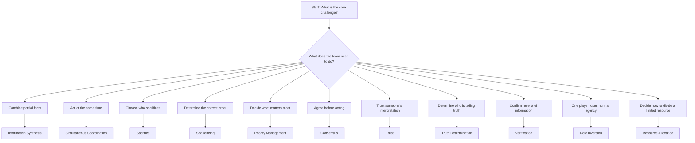
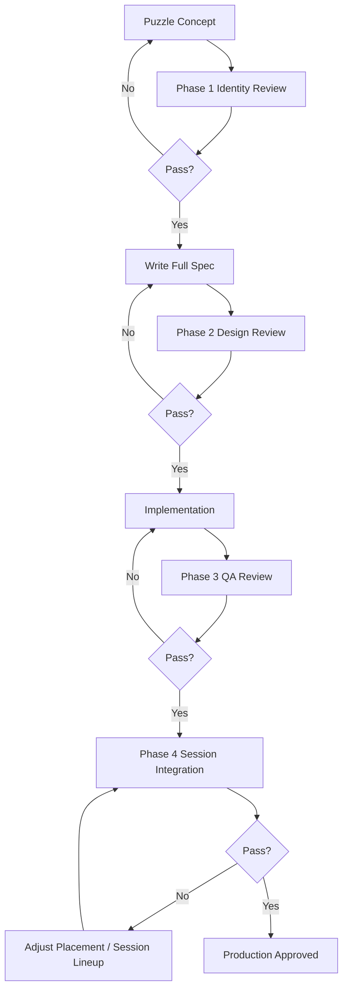

# Puzzle Design Bible

## Purpose

This document is the design authority for all puzzle content in Project Echo. It defines the principles, constraints, communication taxonomy, fairness rules, replayability standards, production constraints, and evaluation process that every current and future puzzle must satisfy. It exists to preserve the game's identity across a growing content catalog and to prevent the puzzle system from drifting toward genre conventions that would dilute what makes Project Echo distinct.

Every new puzzle must pass this document before it enters production.

## Scope

This document covers:

- The communication taxonomy that defines the puzzle vocabulary
- Hard constraints that apply to every puzzle without exception
- Soft guidelines that apply unless explicitly overridden by a design decision
- Fairness rules that distinguish challenging from unfair
- Replayability standards and the model for predicting replayability
- Production cost scoring for design evaluation
- The derivative test and originality review process
- Common design anti-patterns and how to identify them
- The evaluation framework for new puzzle proposals
- The canonical authoring template

This document does not replace [07 Puzzle Framework](07%20Puzzle%20Framework.md), which owns the runtime rules, data model, and lifecycle. This document governs the design decisions made before the Framework is ever invoked. The Framework defines what a puzzle *is*; this document defines what a puzzle *must achieve*.

## Dependencies

- All puzzles must satisfy the runtime rules in [07 Puzzle Framework](07%20Puzzle%20Framework.md).
- All communication patterns referenced here are implemented through [05 Communication System](05%20Communication%20System.md).
- Failure consequences connect to [11 Stress System](11%20Stress%20System.md).
- The existing puzzle catalog is in [08 Puzzle Library](08%20Puzzle%20Library.md).
- Production cost evaluations should be reviewed against [Project-Echo/docs/Roadmap.md](../Roadmap.md) for scope alignment.

---

## Communication Taxonomy

This taxonomy is the design vocabulary of Project Echo's puzzle system. Every puzzle must have a declared primary communication pattern and may declare secondary patterns. No two puzzles in the same session should share an identical primary pattern — variety is the primary driver of replayability across the full session.

### Pattern Definitions

**1. Information Sharing**
One player holds a discrete fact. Another player needs that fact to act. Transfer is one-directional. The challenge is accuracy and speed of relay, not inference.
- Distinguishing feature: the receiving player can verify the information is correct if they could access the source directly.
- Risk of derivativeness: highest. See §Derivative Test.
- Design guidance: use as a secondary pattern only. As a primary pattern, it produces the "guide and executor" dynamic that the game explicitly avoids.

**2. Information Synthesis**
Each player holds a partial fact. The complete picture requires combining facts across multiple players. No single player can solve the puzzle from their information alone even if they had unlimited time.
- Distinguishing feature: the answer cannot be known until multiple players have communicated. It is not a matter of speed — it is a matter of combination.
- Example in library: PZL-002 Convergent Fault (net value from distributed terminal readings).

**3. Sequencing**
Players must determine or execute an ordered set of actions. The correct order is not known to any single player and must be constructed from distributed partial knowledge.
- Distinguishing feature: the order is the puzzle, not the actions themselves. Each individual action is simple; the communication challenge is establishing the sequence.
- Example in library: PZL-008 Tidal Lock (positional coverage in sequence).

**4. Simultaneous Coordination**
Two or more players must act at the same moment. Timing is the primary challenge; information is a secondary challenge. The system only accepts the input when all required players are acting concurrently.
- Distinguishing feature: correct actions performed at different times still fail. The success condition is specifically concurrent.
- Example in library: PZL-001 Pressure Cascade, PZL-003 Consent Lock.

**5. Trust**
One player must act based on another player's information without any independent verification mechanism. The acting player is committed to accepting risk based on their teammate's word alone.
- Distinguishing feature: the acting player cannot verify the information is correct before committing. Acting incorrectly is a real possibility and a real consequence.
- Example in library: PZL-003 (non-countdown players), PZL-005 Delayed Mirror (field players trusting the Mirror Reader's prediction).
- Design note: Trust requires that the trusted player's information is genuinely unverifiable by the acting player, not merely inconvenient to verify. If the acting player could walk over and check, the pattern is Information Sharing, not Trust.

**6. Temporal Reasoning**
Players must reason from time-displaced or predicted information. The answer is not present but must be inferred from past state plus elapsed time plus knowledge of the system's behavior.
- Distinguishing feature: the information source is time-indexed, not current. The player must model change over time, not just relay a static fact.
- Example in library: PZL-005 Delayed Mirror (20-second delayed creature feed).

**7. Negotiation**
Players hold competing or conflicting interests and must reach agreement. The answer is not predetermined; the team constructs it through discussion. Acceptance of any one player's position alone fails the puzzle.
- Distinguishing feature: valid disagreement exists. The team cannot solve the puzzle by deferring to the most confident player — the information from all players is genuinely necessary.
- Example in library: PZL-004 Power Allocation (no player sees all demands; no player can determine correct allocation alone).

**8. Resource Allocation**
A shared, limited resource must be distributed across competing needs that exceed the resource's capacity. The distribution decision requires input from all players.
- Distinguishing feature: the resource cap creates real scarcity. The team cannot satisfy all needs; they must choose what to sacrifice.
- Example in library: PZL-004 Power Allocation (12-unit budget across excess demand).
- Note: Resource Allocation typically co-occurs with Negotiation. It is a distinct pattern because the scarcity is the puzzle constraint, while Negotiation is the communication method used to resolve it.

**9. Observation**
One player continuously observes something that others cannot perceive directly. The observer must describe it accurately enough, and in real time, for others to act on it.
- Distinguishing feature: the observation is dynamic and ongoing, not a one-time fact. The observer's role continues throughout the puzzle; they cannot just give a single report and step away.
- Distinguishing from Information Sharing: Observation is continuous and descriptive; Information Sharing is discrete and one-shot.
- Design note: Observation as a primary pattern is high-risk for derivativeness (approaches the "guide and executor" structure). Use it as a secondary pattern, or ensure that the observer also has a concurrent physical task.

**10. Sacrifice**
One player accepts a cost — mobility loss, increased personal risk, opportunity loss, resource expenditure — so that the rest of the team can succeed at something they otherwise could not. The sacrifice must be real: a sacrifice that costs nothing is not a sacrifice.
- Distinguishing feature: the sacrificing player's contribution is the cost they bear, not an action they take. Their value to the team is their willingness to accept a worse state.
- Example in library: PZL-006 Parallel Decay (solo monitor), PZL-010 The Anchor (immobilized player).
- Design guidance: Sacrifice should never be involuntary (forced by the system without player consent). The sacrificing player must understand what they are accepting and choose it.

**11. Consensus**
All players must agree on a course of action before the system accepts it. No single player can impose a decision; unilateral action is either impossible or fails.
- Distinguishing feature: the system validates whether all players have committed, not merely whether the correct action was taken.
- Example in library: PZL-003 Consent Lock (all must hold simultaneously), PZL-009 Confession Loop (all must confirm receipt simultaneously).

**12. Priority Management**
Multiple valid actions are possible but the team cannot pursue all of them simultaneously. Players must negotiate what to prioritize, when to switch focus, and when to abandon a lower-priority task.
- Distinguishing feature: the challenge is not "what is the right answer" but "what do we do first with limited attention."
- Example in library: PZL-006 Parallel Decay (which system to stabilize first, who monitors the other).

**13. Truth Determination**
Players hold contradictory information and must determine which account reflects reality before acting. The challenge is epistemic: identifying whose information is reliable without direct access to ground truth.
- Distinguishing feature: players have conflicting information, not incomplete information. At least one player's account must be wrong, and the team must identify which.
- Example in library: PZL-007 Unreliable Witness.
- Distinguishing from Negotiation: in Negotiation, all players' information is valid and the challenge is combining it; in Truth Determination, some information is false and the challenge is filtering it.

**14. Verification**
The team must confirm that communication was received and understood correctly before acting. The challenge is not relaying information but proving that the relay was accurate.
- Distinguishing feature: the team can only act once everyone has confirmed receipt. Acting before confirmation is either impossible or fails.
- Example in library: PZL-009 Confession Loop (all must enter what they heard and confirm simultaneously).
- Distinguishing from Consensus: Consensus is about agreeing on a course of action; Verification is specifically about confirming that shared information was received identically by all parties.

**15. Role Inversion**
One player's normal agency — movement, direct action, objective completion — is removed in exchange for a capability that others need but cannot access themselves. Both the inverted player and the remaining players operate in diminished states that only together constitute a full capability.
- Distinguishing feature: the inverted player is not simply in a support role. They have lost the ability to do what they normally can, and they have gained something others cannot replicate. The loss is real and the gain is meaningful.
- Example in library: PZL-010 The Anchor (player loses mobility, gains full sensor grid).

### Communication Pattern Usage Rules

- Every puzzle must declare exactly one primary communication pattern.
- A puzzle may declare secondary patterns. Secondary patterns must genuinely appear in the puzzle experience, not merely be theoretically possible.
- No two puzzles in the same facility session should share an identical primary pattern without a meaningfully different implementation. "Two information synthesis puzzles" is only permitted if the synthesis mechanisms are structurally distinct.
- The communication taxonomy is not exhaustive. New patterns must be proposed, named, defined, and added to this table before being used as a primary pattern in a new puzzle design.

---

## Hard Constraints

These constraints apply to every puzzle without exception. A puzzle that violates any hard constraint is not a valid puzzle for Project Echo, regardless of how interesting its mechanics are.

**HC-1: Multi-Player Dependency**
The puzzle must be unsolvable by a single player acting alone, with unlimited time and no network constraints. If a player could theoretically solve the puzzle by traversing the full facility and interacting with every element in sequence, it fails this constraint.

**HC-2: Communication as Primary Challenge**
The core challenge must be communication, not physical execution. Execution may be challenging, but a team that communicates perfectly should never fail due to execution difficulty alone.

**HC-3: Defined Failure Mode**
Every puzzle must have a specific, documented failure outcome that connects to the Pressure System through a declared `FailureSeverityTier`. Failure that produces no system consequence is not a failure — it is an ignored event.

**HC-4: Retry Availability**
Players must be able to retry a failed puzzle within the same session. The retry may carry cost (cooldown, resource consumption, pressure increase), but permanent inability to attempt the puzzle again is only acceptable in the Blocked state, which itself must have a defined unblock path.

**HC-5: Solvable Without Hidden Knowledge**
The team must be able to solve the puzzle using only information available within the game. A puzzle that requires information from outside the game session (a wiki, a memorized manual, a prior session's knowledge not persisted to save state) is not valid for the MVP.

**HC-6: Player-Count Coverage**
Every puzzle must define its behavior at 2, 3, and 4 players. Player count may change the difficulty, valve count, terminal count, or role distribution — but the puzzle must remain solvable at each count. If a puzzle genuinely cannot work at a specific player count, that count must be explicitly excluded from its Player Count field.

**HC-7: Network Determinism**
Puzzle resolution must be determined server-side. A client may never self-report a resolved state. All interaction events must be RPCs validated by the session authority.

**HC-8: Late Join Safety**
A player joining mid-session must not permanently break any puzzle's state. The puzzle may become harder or require partial restart, but it must not soft-lock.

**HC-9: Declared Diff Score**
Every puzzle must include a calculated `Diff` score using the formula from 07 Puzzle Framework §Difficulty Formula. Puzzles with `Diff` above 8.0 are permitted only if they serve a documented pacing purpose (defined special moment) and carry `FailureSeverityTier: Severe`.

**HC-10: Originality**
Every puzzle must pass the Derivative Test (see §Derivative Test) before entering production. A puzzle that fails any part of the Derivative Test must be redesigned before it is evaluated on any other criteria.

---

## Soft Guidelines

These guidelines represent strong design preferences. A puzzle may deviate from them only with an explicit documented reason in its Developer Notes.

**SG-1: One Clear Core Mechanic**
Each puzzle should have one primary mechanic. Additional layers may exist, but the main resolution should be describable in a single sentence.

**SG-2: Readability Under Pressure**
A puzzle should be understandable within 10–15 seconds of the team encountering it. Players should not need to read instructions or parse complex rules while the creature is active.

**SG-3: No Single Point of Failure Ownership**
The puzzle should not depend on one player to be both the sole information holder and the sole actor. If one player is incapacitated, the team should retain some path to progress.

**SG-4: Failure Teaches**
A failure event should give the team information they can use in the retry. If a team fails and learns nothing from the failure, the retry will be as likely to fail as the original attempt.

**SG-5: Variable Parameters**
Every puzzle should have at least one session-variable parameter (randomized values, randomized locations, shuffled assignments). A puzzle that is identical every session loses replayability after the first solve.

**SG-6: No Brute-Force Path**
A team should not be able to solve the puzzle through random trial and error faster than through coordinated communication. If brute-force is faster than communication, the puzzle fails its identity test.

**SG-7: Meaningful Ambiguity**
Some ambiguity in puzzle design is healthy — it drives discussion. Ambiguity that is unresolvable through play (information that cannot be gathered or reasoned about even with perfect communication) is not.

**SG-8: Narrative Integration**
A puzzle should feel like it belongs in the facility's systems. The interaction verbs (hold a valve, authorize a terminal, stabilize a system) should be consistent with the setting.

---

## Fairness Rules

A puzzle that is difficult is not automatically unfair. A puzzle is unfair when the team cannot determine, from within the rules of the game, what they did wrong or what they should do differently.

**FR-1: Information Must Be Reachable**
Every piece of information the team needs to solve the puzzle must be observable within the facility during the session. Information that can only be known by dying once and retrying is not valid for the MVP.

**FR-2: Failure Must Be Diagnosable**
When a puzzle fails, the team must be able to identify the cause from in-game feedback. "The puzzle just failed" with no signal is unfair. "You released the valve too soon" with a clear visual or audio indication is fair.

**FR-3: No Permanently Blocking Player Absence**
If a player is incapacitated, disconnects, or is otherwise unavailable, the puzzle must not become permanently unsolvable. The puzzle may enter a Blocked state, but it must define a path to recovery.

**FR-4: Asymmetric Information Must Be Physically Accessible**
If a puzzle uses asymmetric information (per 06 Asymmetric Reality), the information assigned to a player must be observable from that player's reality layer. A player must not be assigned information they cannot access in their playthrough.

**FR-5: No Timing Cliffs**
Puzzles with strict timing constraints must give the team enough warning before the constraint is violated. A window that closes with zero indication is unfair. A window with a countdown, an audio cue, or a visual signal is fair.

**FR-6: Network Variance Tolerance**
A puzzle that requires sub-100ms precision to succeed is not valid for a networked game. Timing windows must accommodate the highest expected network latency for the target platform. As a baseline, no timing check should require action within less than 750ms of its trigger.

**FR-7: Retry Must Preserve Learning**
If the team fails a puzzle, their retry should start from a state that allows them to apply what they learned. A full state wipe that resets all clues and randomization is unfair if the team legitimately earned partial knowledge. Partial state resets (values shuffle, locations reset) are acceptable if partial knowledge (which mechanic failed, what the correct approach is) is preserved.

**FR-8: No Hidden Best-of-One**
If a puzzle has a resource limit that can result in a permanent Blocked state (e.g., repair tokens in PZL-007), that Blocked state must have a reachable unblock path. There must not be a puzzle configuration where the team is guaranteed to fail to unblock.

---

## Replayability Standards

A puzzle has high replayability if a team that has solved it before still faces meaningful uncertainty and communication demand in a subsequent session. A puzzle has low replayability if solving it once reveals a fixed pattern that removes uncertainty in future sessions.

### Replayability Factors

**RF-1: Session-Variable Parameters** (Weight: High)
Does the puzzle have at least one parameter that changes per session? Parameters include: numerical values, node or station locations, role assignments, sequence orders, asymmetric information assignments. A puzzle with no session-variable parameters has zero long-term replayability.

**RF-2: Emergent Communication Variance** (Weight: High)
Does the puzzle produce different communication demands based on team composition, player positions, and session state? A puzzle where the same three lines of communication always occur is less replayable than one where the conversation is shaped by who is where.

**RF-3: Creature-State Interaction** (Weight: Medium)
Does the creature's current state alter how the puzzle is approached? A puzzle that can only be cleanly executed in Calm is less replayable than one that forces different decisions depending on whether the creature is Probing or Hunting.

**RF-4: Multiple Valid Solutions** (Weight: Medium)
Does the puzzle have more than one valid approach or answer? A puzzle with exactly one solution loses replayability faster than one where the team's answer varies between sessions.

**RF-5: Skill-Ceiling Communication Demand** (Weight: Medium)
Does the puzzle reward teams that communicate more precisely? A highly replayable puzzle should have a ceiling where experienced teams who communicate perfectly still find satisfaction — not because the puzzle is harder but because the game of communication itself is interesting.

**RF-6: Pressure-Band Sensitivity** (Weight: Low)
Does the team approach the puzzle differently depending on whether they are in Calm, Tense, or Critical? If the puzzle is identical regardless of Band, it misses an opportunity for organic difficulty variance.

### Replayability Rating

Evaluate each factor as Low (0), Medium (1), or High (2). Sum the weighted scores:

| Factor | Weight | Score (0–2) | Weighted |
|---|---|---|---|
| RF-1 Session-Variable Parameters | 2× | _ | _ |
| RF-2 Emergent Communication Variance | 2× | _ | _ |
| RF-3 Creature-State Interaction | 1.5× | _ | _ |
| RF-4 Multiple Valid Solutions | 1.5× | _ | _ |
| RF-5 Skill-Ceiling Communication Demand | 1.5× | _ | _ |
| RF-6 Pressure-Band Sensitivity | 1× | _ | _ |

Maximum weighted score: `(2+2+1.5+1.5+1.5+1) × 2 = 19`. Target thresholds:

| Total Weighted Score | Replayability Rating |
|---|---|
| 0–6 | Low — requires redesign before production |
| 7–11 | Medium — acceptable for MVP; address weak factors post-launch |
| 12–15 | High — target for all production puzzles |
| 16–19 | Very High — exceptional; recommend as anchor puzzle for its placement zone |

A puzzle that scores Low must be redesigned or replaced. A puzzle may not ship on a Low replayability score regardless of how interesting its first encounter is.

---

## Production Constraints

Every puzzle proposal must be evaluated against production cost before design approval. A puzzle that is expensive to produce relative to its design value is not a good puzzle for this team at this scale.

### Cost Dimensions

**PC-1: Art Cost**
What new visual assets does the puzzle require?

| Level | Description | Score |
|---|---|---|
| 0 | Uses only existing facility assets and interaction prefabs | 0 |
| 1 | Requires new prop variants (reskin of existing geometry) | 1 |
| 2 | Requires 1–2 new interactive prop sets with their own animations | 2 |
| 3 | Requires a new environmental system (mirror feed, sensor grid, decay display) | 3 |
| 4 | Requires a new structural room or major architectural addition | 4 |

**PC-2: Programming Cost**
What new system features or interaction types does the puzzle require?

| Level | Description | Score |
|---|---|---|
| 0 | Uses only existing interaction verbs (hold, press, observe) | 0 |
| 1 | Extends an existing system (new configuration of existing components) | 1 |
| 2 | Requires a new puzzle-specific script within the existing framework | 2 |
| 3 | Requires a new sub-system (position buffer, sensor grid renderer) | 3 |
| 4 | Requires a new infrastructure layer (changes to Monster AI, Pressure System, Network layer) | 4 |

**PC-3: Networking Complexity**
What new replication patterns does the puzzle require?

| Level | Description | Score |
|---|---|---|
| 0 | Standard RPCs and `[Networked]` properties; no new patterns | 0 |
| 1 | Per-player replicated views (some clients see different data) | 1 |
| 2 | High-frequency replicated data (>10 Hz or large payload per tick) | 2 |
| 3 | New replication authority model (something other than Host owns a puzzle element) | 3 |

**PC-4: QA Effort**
How complex is the QA validation surface?

| Level | Description | Score |
|---|---|---|
| 0 | Fewer than 10 QA checklist items, no network-specific edge cases | 0 |
| 1 | 10–20 QA items, 1–2 network edge cases | 1 |
| 2 | 20–30 QA items, 3–5 network edge cases | 2 |
| 3 | More than 30 QA items, 6+ network edge cases, creature interaction edge cases | 3 |

**PC-5: Accessibility Effort**
What additional work is required to meet the accessibility standard?

| Level | Description | Score |
|---|---|---|
| 0 | Standard accessible display, no special accommodations required | 0 |
| 1 | 1–2 accessibility-specific options needed (toggle hold, screen reader) | 1 |
| 2 | 3–4 accommodations, some requiring system support (audio read-back, comparison overlay) | 2 |
| 3 | Fundamental accessibility redesign required (core mechanic is inaccessible without alternative) | 3 |

### Total Production Cost Score

Sum all five dimensions. Maximum score: `4+4+3+3+3 = 17`.

| Total Score | Production Category |
|---|---|
| 0–4 | Low cost — prioritize for MVP |
| 5–8 | Medium cost — acceptable for MVP and Vertical Slice |
| 9–12 | High cost — acceptable for post-launch unless justified by high design value |
| 13–17 | Very high cost — requires executive approval; evaluate deferral to future milestone |

### Value-to-Cost Ratio

After computing both Replayability and Production Cost scores:

`Value-to-Cost = Replayability Score / Production Cost Score`

| Ratio | Assessment |
|---|---|
| > 2.0 | Excellent — high design return on production investment |
| 1.0–2.0 | Good — acceptable for any milestone |
| 0.5–1.0 | Acceptable — flag for post-launch unless the puzzle is uniquely essential |
| < 0.5 | Poor — do not produce unless the puzzle is the only available implementation of a critical communication pattern |

---

## Derivative Test

Every puzzle must pass all four parts of this test before entering production. Failing any part requires redesign.

### Comparative Baselines

**Baseline 1: We Were Here Series**
The We Were Here pattern is: one player is physically separated and acts as a guide with exclusive information; another player receives instructions and acts as an executor with exclusive physical access. Information flows in one direction. The guide never acts; the executor never knows. Roles are fixed for the duration.

A puzzle passes this test if it satisfies ALL of the following:
- [ ] Every player who holds unique information also has the ability to take a meaningful physical action.
- [ ] Every player who can take a physical action also holds unique information.
- [ ] The information flow is bidirectional — every player tells every other player something they need.
- [ ] No player is permanently in a "guide" role that never changes during the puzzle.

Exception: Observation and Role Inversion patterns inherently create asymmetric roles. These are permitted ONLY if the asymmetry is temporary, the inverted player still contributes meaningfully, or the role assignment is non-permanent and team-chosen.

**Baseline 2: Keep Talking and Nobody Explodes**
The KTANE pattern is: one player has a device with physical inputs; another player has a manual with rules. The manual is a fixed external reference that maps device state to correct actions. The manual-holder is a human lookup table, not a player with agency. The device-holder is an executor with no understanding of the rules.

A puzzle passes this test if it satisfies ALL of the following:
- [ ] No player holds a document, reference card, or fixed rule set that they simply read and relay to another player.
- [ ] The information each player holds is observable from within the game environment, not from a pre-existing knowledge asset.
- [ ] Players with information also have agency. Players with action also have understanding.
- [ ] The puzzle does not map to a "one player reads, one player does" structure even if both players can theoretically switch roles.

**Baseline 3: Escape Simulator / Escape Room Genre**
The escape room pattern is: players find physical keys, use them on locks, find new items, use those on other things. Progress is a linear item-dependency chain. The challenges are exploration and object recognition, not communication. The puzzle is solved by finding the right thing and putting it in the right place.

A puzzle passes this test if it satisfies ALL of the following:
- [ ] The puzzle does not resolve by finding a hidden physical item and presenting it to a specific receiver.
- [ ] The core challenge is communication-based, not exploration-based.
- [ ] The puzzle would not make sense as a solo puzzle in a non-communication game.
- [ ] There is no single "key-lock" pair that, once found, resolves the puzzle by presence alone.

**Baseline 4: Phasmophobia / Evidence Collection Genre**
The evidence collection pattern is: players gather evidence from a known possibility space. Progress is checking items off a list of possible indicators. The team's task is identifying which predefined category the current match belongs to by accumulating supporting evidence.

A puzzle passes this test if it satisfies ALL of the following:
- [ ] The puzzle is not a process of elimination from a fixed possibility space known before the puzzle is encountered.
- [ ] The team is not compiling a checklist of discrete evidence that maps to a catalog of answers.
- [ ] The solution is not of the form "answer = which category from a known list has the most evidence."
- [ ] The puzzle requires active communication to determine the answer, not passive observation and matching.

### Originality Review Process

1. The puzzle designer writes a one-paragraph description of the puzzle.
2. The description is reviewed against all four baselines above.
3. Each failed checkbox is noted with a specific explanation.
4. For each failed checkpoint, the designer must either: (a) explain why the checkpoint does not apply to this puzzle, with a design argument; or (b) redesign the puzzle to address the failure.
5. Design argument acceptance requires agreement from at least two reviewers.
6. A puzzle that fails all checkpoints of any single baseline cannot enter production regardless of how it performs on other dimensions.

---

## Common Design Anti-Patterns

These are recurring design errors observed in puzzle design across the horror co-op genre. Each anti-pattern has a name, a description, and a recommended correction.

### AP-1: The Passive Encyclopedia
**What it looks like**: One player has exclusive access to a reference (a list, a map, a codex). Their entire role is to read from this reference while another player interacts with the environment.
**Why it fails**: The "encyclopedia" player has no agency. They are a lookup function. After the first session, their role becomes trivial. The puzzle has no communication depth — it is information delivery, not communication.
**Correction**: Replace the reference with an observation that requires interpretation. Give the reference-holder a physical task that competes with their reading. Make the reference incomplete so the team must synthesize.

### AP-2: The One-Way Mirror
**What it looks like**: Player A sees Player B's area. Player B cannot see Player A's area. Player A directs Player B. Communication flows from A to B only.
**Why it fails**: This is the We Were Here structure. Player A is the guide; Player B is the executor. Player B has no information to contribute. Player A has no action to take. The puzzle uses only two of the game's communication capabilities.
**Correction**: Give Player B information that Player A needs to complete their own task. Make the information flow bidirectional. Or: give Player A a physical task in their own room that requires Player B's confirmation.

### AP-3: The Timed Monologue
**What it looks like**: Information is displayed for a short window. One player reads it and describes it to others. Others act on the description. The challenge is description speed under a timer.
**Why it fails**: The core mechanic is how fast one player can talk and how accurately others can hear. It tests vocal clarity and listening speed, not communication quality. After the first session, the description pattern becomes a memorized script.
**Correction**: Add ambiguity to the observation that requires interpretation, not just relay. Make the description challenge about synthesis, not transcription. PZL-009 addresses this by making verification (not speed) the communication challenge.

### AP-4: The False Choice
**What it looks like**: The team believes they have a meaningful negotiation about resource allocation or priority. In practice, one solution is objectively correct and the "negotiation" is just finding the right answer.
**Why it fails**: If the negotiation has a single correct answer, the puzzle is a logic puzzle, not a communication puzzle. Once the optimal strategy is known, the "negotiation" disappears.
**Correction**: Ensure multiple valid solutions exist. Design the solution space so that different teams can legitimately reach different correct answers based on risk tolerance, skill, or session state. PZL-004 ensures at least two valid toggle configurations per session.

### AP-5: The Perfect Information Lock
**What it looks like**: The puzzle has a known-correct answer. Once the team determines the correct answer (through communication), success is automatic. There is no execution challenge, no timing challenge, and no creature-state interaction.
**Why it fails**: The puzzle ends the moment communication is complete. There is no second layer. The team says the answer and wins. This produces very low replayability after the first session.
**Correction**: Add an execution layer or a timing constraint that requires the team to commit. The answer must be acted upon, not merely spoken. Or: make the information degrade over time so that communication too slowly produces a different outcome than communication quickly.

### AP-6: The Invisible Failure
**What it looks like**: The puzzle fails with no clear signal about why. The team tries an action, the system rejects it, and they have no information about what went wrong.
**Why it fails**: Violates Fairness Rule FR-2. The team cannot improve from an invisible failure. Repeated invisible failures produce frustration rather than learning.
**Correction**: Every failure must produce a specific, readable signal. If the signal cannot be communicated clearly within the existing audio/visual system, the failure mode is too complex for the MVP.

### AP-7: The Mandatory Sprint
**What it looks like**: A puzzle requires players to be at specific locations within a tight time window. The time window was designed for walking speed, but creature avoidance consistently requires detours that make walking speed insufficient.
**Why it fails**: The puzzle inadvertently creates a movement-skill challenge rather than a communication challenge. Players who cannot move quickly are penalized for a capability that is not the intended challenge.
**Correction**: Design timing windows against the slowest expected traversal path at walking speed under adverse creature conditions. If the puzzle requires fast movement, declare that in its design and ensure accessibility accommodations.

### AP-8: The Committee Deadlock
**What it looks like**: A puzzle requires unanimous agreement (Consensus pattern) but provides no mechanism for breaking a deadlock. Two players disagree and neither can proceed without the other's cooperation.
**Why it fails**: Without a deadlock-breaker, the puzzle produces a soft lock that can only be resolved by social pressure or waiting. Neither is a designed mechanic.
**Correction**: Every Consensus puzzle must define what happens if consensus is not reached: a timeout, an escalating cost, a fallback path, or a pressure system consequence that creates urgency. The team must be motivated to resolve disagreement.

---

## Evaluation Framework

This is the process for evaluating any new puzzle proposal. Complete all four phases before approving a puzzle for implementation.

### Phase 1: Identity Review (Pre-Design)

Before writing a full spec, answer these questions. If any answer is "no" or "unclear," do not proceed.

- [ ] Does this puzzle have a declared primary communication pattern?
- [ ] Is the primary pattern distinct from all existing puzzles in the current session's lineup?
- [ ] Can the puzzle be described in one sentence that makes the communication challenge clear?
- [ ] Does the puzzle pass all four Derivative Test baselines?
- [ ] Is there a clear failure outcome that connects to the Pressure System?

### Phase 2: Design Review (Pre-Implementation)

Complete the full puzzle spec using the canonical template (see §Authoring Template). Then verify:

- [ ] All Hard Constraints (HC-1 through HC-10) are satisfied.
- [ ] `Diff` score is calculated and documented.
- [ ] Player-count behavior defined for 2, 3, and 4 players.
- [ ] Replayability rating is Medium or above.
- [ ] Production cost score is known and approved for the target milestone.
- [ ] QA Checklist contains at least 10 items, including all items from 07 Puzzle Framework §QA Checklist.
- [ ] Late join, host migration, and save behaviors are fully specified.
- [ ] All soft guidelines (SG-1 through SG-8) are either satisfied or explicitly deviated from with documented reasoning.

### Phase 3: QA Review (Pre-Content Lock)

After implementation, verify:

- [ ] Every item in the QA Checklist passes.
- [ ] The puzzle is testable with exactly 2 players, exactly 3 players, and exactly 4 players.
- [ ] The puzzle can be force-succeeded, force-failed, and reset via debug tools.
- [ ] Failure signals are readable within 3 seconds by a first-time player.
- [ ] The puzzle does not soft-lock under any documented edge case.
- [ ] The puzzle remains playable (though harder) in the Critical pressure band.
- [ ] Communication-first identity is preserved: a team that communicates clearly should solve this puzzle on the first attempt at least 60% of the time.

### Phase 4: Session Integration Review

After QA, verify the puzzle in context:

- [ ] The puzzle's primary communication pattern does not duplicate another active puzzle in the same session.
- [ ] Failure consequences do not produce disproportionate Pressure accumulation when this puzzle is encountered alongside other active puzzles.
- [ ] The puzzle's facility placement is validated against the Placement Recommendations in 08 Puzzle Library §Comparison Table.
- [ ] The puzzle does not create a dependency deadlock with other puzzles or objectives in the facility.

---

## Authoring Template

Every new puzzle specification must use this template. Required fields are marked (R); optional fields are marked (O).

```markdown
## PZL-XXX: [Puzzle Name]

### Puzzle ID (R)
`PZL-XXX`

### Puzzle Name (R)
[Name]

### Purpose (R)
[One paragraph: what communication challenge does this create, and what is its defining moment?]

### Narrative Context (R)
[One paragraph: how does this puzzle fit the facility's systems and story?]

### Player Count (R)
[X–Y. Describe role distribution at each supported player count.]

### Difficulty (R)
`Diff = [value]`

| Term | Score | Rationale |
|---|---|---|
| $C_d$ | | |
| $I_d$ | | |
| $T_d$ | | |
| $F_d$ | | |

### Estimated Solve Time (R)
[X–Y seconds. Describe variance.]

### Required Communication Pattern (R)
**[Primary pattern name].** [Description of what communication the puzzle demands and why.]

### Gameplay Flow (R)
[Numbered steps.]

### State Machine (R)
[Mermaid stateDiagram-v2.]

### Puzzle Layout (R)
[Physical description of interactive elements and their spatial relationships.]

### Interaction Rules (R)
[Specific rules for each interaction type.]

### Success Conditions (R)
[Exact conditions the Host validates.]

### Failure Conditions (R)
[All enumerated failure modes.]

### FailureSeverityTier (R)
`[Minor|Moderate|Severe]` — [full statement of Noise contribution and any additional pressure events.]

### Pressure Events (R)
| Event | Contribution | Source |
|---|---|---|

### Networking Ownership (R)
[Who owns what, what is replicated to whom, what is RPC vs replicated property.]

### Late Join Behaviour (R)
[What a joining player receives and can immediately do.]

### Host Migration Behaviour (R)
[What is lost, what is preserved, and what the incoming Host must initialize from snapshot.]

### Save Behaviour (R)
[What is persisted and what is not persisted.]

### Replication Requirements (R)
[Specific replicated fields and their update rates.]

### Analytics Events (R)
[Named events with fields.]

### Accessibility Notes (R)
[All required accommodations.]

### Edge Cases (R)
[Minimum 5 documented edge cases with explanations.]

### Exploit Prevention (R)
[How server authority prevents client manipulation.]

### Balancing Notes (R)
[Primary tuning parameters and their relationships.]

### QA Checklist (R)
[Minimum 10 items, each as a checkbox.]

### Developer Notes (O)
[Implementation-specific guidance.]

### Future Variants (O)
[2–3 named variants for post-launch consideration.]
```

---

## Diagrams

### Communication Pattern Decision Tree



### Evaluation Gate Flow



---

## Examples

### Example 1: Evaluating a Proposed Puzzle

A designer proposes: "One player is in a locked room with a panel showing colored symbols. Another player is outside and must press buttons on a matching panel. The locked player describes the symbols and the outside player presses them."

**Phase 1 Identity Review:**
- Primary pattern: Information Sharing (one player observes; other acts on description).
- Derivative Test — We Were Here baseline:
  - ✗ The locked player has information and no action. The outside player has action and no information. Roles are fixed.
- **Result: Fails Baseline 1. Redesign required.**

**Redesign prompt**: What if the locked player also has a button they must press, but cannot see which button from their position? The outside player can see the locked player's button through a window but cannot describe colors accurately because their reality layer shows different colors. Now both players have information and both must act. The information flow is bidirectional. This passes Baseline 1.

### Example 2: Applying the Replayability Rating

PZL-004 Power Allocation:

| Factor | Weight | Score | Weighted |
|---|---|---|---|
| RF-1 Variable Parameters | 2× | 2 (demand values randomized) | 4 |
| RF-2 Emergent Communication Variance | 2× | 2 (different players at different terminals creates different conversations) | 4 |
| RF-3 Creature Interaction | 1.5× | 1 (creature adds urgency but doesn't change approach fundamentally) | 1.5 |
| RF-4 Multiple Valid Solutions | 1.5× | 2 (at least two valid configurations guaranteed per session) | 3 |
| RF-5 Skill-Ceiling Demand | 1.5× | 2 (teams with better information-sharing habits solve faster and use fewer toggles) | 3 |
| RF-6 Band Sensitivity | 1× | 1 (more stressful under Critical but puzzle approach is same) | 1 |

**Total: 16.5 / 19 → Very High replayability.**

---

## Edge Cases

- **A puzzle passes the Derivative Test but still feels derivative in play**: this document covers structural derivativeness (guide-executor, evidence-checklist, etc.). Thematic or aesthetic derivativeness (the puzzle "feels like" a We Were Here puzzle even if it isn't structurally one) is a design judgment call, not a rules violation. Flag it during design review and revise if reviewers agree the player experience will be read as derivative.
- **A new communication pattern is proposed that doesn't fit the taxonomy**: add it to the taxonomy before using it as a primary pattern. A pattern that cannot be named and defined is a pattern that cannot be consistently designed for or tested.
- **A puzzle has a Very High production cost but is the only implementation of a critical pattern**: document the justification in Developer Notes and flag it in the milestone review. Do not reject it automatically — but ensure the specific capability it provides cannot be delivered by a lower-cost design.
- **Two puzzles with the same primary pattern must co-exist in the same facility session**: document the implementation distinction clearly in both puzzle specs. The physical mechanic must be different enough that players are not asking "wait, is this the same puzzle?"

## Design Decisions

### Decision 1: The Taxonomy Is Closed During MVP

New communication patterns may be proposed but not deployed without review and addition to this document. During MVP, puzzle authors work from the existing 15-pattern taxonomy. This keeps the puzzle vocabulary learnable and prevents pattern sprawl.

### Decision 2: Production Cost Scores Are Approximate

The cost model is a design tool, not a project management estimate. It exists to force designers to think about implementation cost before committing to a design direction. It should not replace a proper engineering estimate during sprint planning.

### Decision 3: Derivative Test Results Are Non-Negotiable

A puzzle that fails any Derivative Test checkpoint may not enter production regardless of its merits on other dimensions. The decision was made to enforce this as a hard rule rather than a guideline because the team's prior experience with escape-room genre contamination demonstrated that "mostly original" still erodes identity.

### Decision 4: Replayability Targets Communication, Not Randomness

A puzzle with high randomization but low communication variance (the outcome changes but the conversation is always the same) does not have high replayability. Randomness is a tool for enabling communication variance, not a substitute for it.

## Future Improvements

- Add quantitative session-level balance metrics: total `Diff` budget per session, recommended distribution by placement zone.
- Expand the anti-pattern catalog based on findings from playtests.
- Add a cross-puzzle interaction matrix to formally document which puzzles conflict, complement, or require separation.
- Extend the communication taxonomy based on post-launch puzzle designs.

## Risks

- If the evaluation framework is skipped under schedule pressure, the puzzle catalog will drift from the game's identity faster than any single bad puzzle would indicate.
- If the Derivative Test is applied inconsistently, some puzzles will be held to a higher standard than others. The test must be applied identically to every puzzle by the same reviewers.
- The replayability model is unvalidated before launch. Weights and thresholds should be calibrated against observed player behavior during the Vertical Slice milestone.

## Open Questions

- Should the communication taxonomy be exposed to players in any form (a team-facing "communication tip" system)? Or should it remain purely an internal design tool?
- At what point does a puzzle's secondary communication pattern become load-bearing enough to be considered co-primary? Define a threshold.
- Should the derivative test explicitly add additional comparators (e.g., Unfortunate Spacemen, Among Us communication patterns, Hunt: Showdown) as the game develops?
