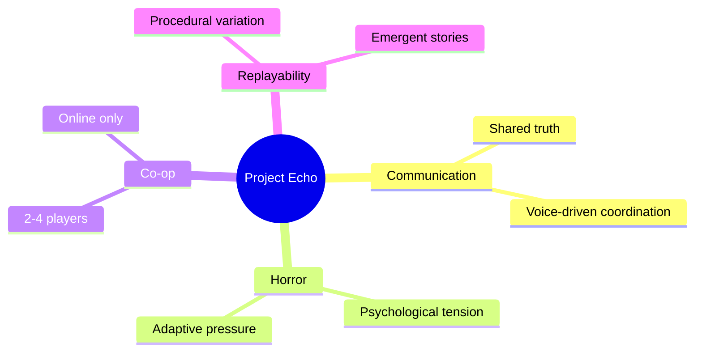

# High Concept

## Purpose

This document defines the commercial and design identity of Project Echo at a level that can be used by designers, engineers, artists, and producers to align on scope and audience. It translates the vision into a concrete product concept that can be pitched, prototyped, and tested.

## Scope

This document covers:

- The game’s market positioning
- The core fantasy and player expectation
- The intended audience and session experience
- The MVP content scope and scope boundaries

This document does not define every mechanics rule; that information belongs in the gameplay and technical documents.

## Dependencies

- The game must preserve the communication-first identity described in the vision document.
- The core concept depends on asymmetric information distributed across players.
- The experience must remain practical for a small indie team to build, test, and support.
- The MVP must fit within an accessible first-session experience of 15–30 minutes.

## Diagrams

### Product Positioning

### MVP Feature Boundary

## Examples

### Example Market Positioning

Project Echo is not marketed as a traditional survival horror game with combat. It is marketed as a co-op communication thriller where players reconstruct reality together under pressure.

### Example Player Promise

Players can expect a session that feels tense, collaborative, and unpredictable. Each match should create a story that feels different from the last.

## Edge Cases

- The game could be mistaken for a generic co-op horror title if the communication design is not emphasized in the pitch.
- A very small team could struggle to support a large-feature roadmap if the product is over-scoped early.
- The experience could become too abstract if the UI does not help players understand what is happening.
- The concept may be hard to explain if there is no simple one-sentence positioning statement.

## Design Decisions

### Decision 1: Position the Game Around Communication, Not Monster Combat

A conventional monster-hunt framing would reduce the game to a familiar pattern. Project Echo should be marketed and designed around the idea that the team’s shared understanding is the real resource in play.

### Decision 2: Keep the MVP Narrow Enough to Finish

The first build should not attempt to deliver dozens of facilities, full progression, and multiple creature systems at launch. The MVP must prove the core fantasy and provide enough content for a meaningful first-session experience.

### Decision 3: Emphasize Replayability Through Systems, Not Content Volume

Replayability should come from procedural room assembly, objective variability, informational asymmetry, and creature adaptation rather than from pushing a large amount of static content.

### Decision 4: Build for Online Co-op First

The game’s strongest identity comes from live communication between players. Local split-screen or single-player modes are not required for the initial release and would dilute focus.

## Future Improvements

- Additional facilities and narrative layers
- Expanded objective and creature systems
- New social features such as post-match recap and community challenges
- Seasonal content and event-driven content drops

## Risks

- The product could be difficult to communicate clearly to players who are used to more conventional co-op horror experiences.
- A strong marketing message is required to prevent the game from being perceived as a generic “monster game.”
- The gameplay loop may feel repetitive if the facility structure is not varied enough.
- The live-service roadmap could become too ambitious if the first release is not carefully constrained.

## Open Questions

- What is the clearest one-line pitch for Steam storefront positioning?
- What content is essential for the vertical slice versus what should wait for later milestones?
- Should the game initially target 3 players or 2–4 players for the first release?
- How much narrative context should be visible before players enter a match?
