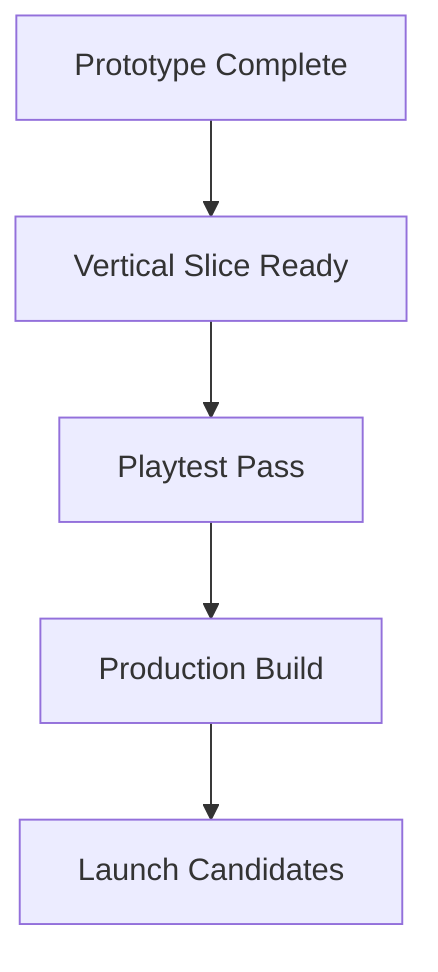

# Milestones

## Purpose

This document converts the roadmap into concrete development checkpoints.

## Scope

Covers milestone criteria, delivery expectations, and success gates for each phase.

## Dependencies

- Each milestone depends on prior design and technical decisions.
- QA and production must review milestone readiness before the next phase begins.

## Diagrams

## Examples

- The prototype milestone requires a complete match flow from lobby to exit.
- The playtest milestone requires at least one successful session with a non-team member.

## Edge Cases

- A milestone may be blocked by an unimplemented backend dependency.
- A milestone can be considered complete only if it is testable end to end.

## Design Decisions

- Milestones are structured around completed player experience rather than raw task completion.
- Each milestone must produce something that can be playtested.

## Future Improvements

- Add milestone retrospectives into the workflow.
- Introduce more granular content delivery gates.

## Risks

- Milestones that are too broad create poor visibility.
- Team members may optimize for implementation speed instead of playtest quality.

## Open Questions — Resolved

- **What is the threshold for a milestone to be considered stable enough for external playtests?**
  - ✅ **Answer**: A milestone is externally testable when it passes a **Playtest Readiness Gate**: (1) the match flow is completable end-to-end without crashes, (2) at least one session can run for 20+ minutes without critical bugs, (3) networking supports at least 2 concurrent players without desync, and (4) voice communication is functional. The **Vertical Slice** milestone is the first external playtest gate.

- **Should internal milestone reviews include a design and technical sign-off?**
  - ✅ **Answer**: **Yes.** Every milestone requires dual sign-off: the Lead Designer confirms the player experience meets GDD intent, and the Principal Architect confirms technical stability and architecture compliance. Both must approve before the milestone is considered complete.

