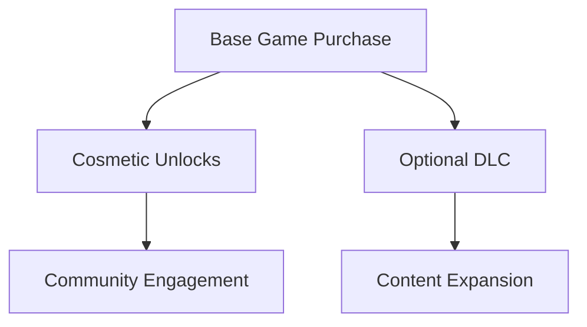

# Monetization

## Purpose

This document defines the commercial strategy for Project Echo and how the game can generate revenue without undermining the core experience.

## Scope

Covers initial release pricing, cosmetics, DLC direction, and live-content economics.

## Dependencies

- Steam distribution and storefront requirements.
- A monetization structure that does not create pay-to-win pressure.
- The game must remain fair and accessible.

## Diagrams

## Examples

- Cosmetic skins for facility equipment and player avatars should be optional.
- New facilities or creature variants may be introduced as paid expansions later.

## Edge Cases

- Cosmetic content should not affect gameplay fairness.
- Monetization should not create pressure to buy content to stay competitive.

## Design Decisions

- Monetization should support content growth without harming the core experience.
- The primary product should be a strong standalone game rather than a monetization-driven experience.

## Future Improvements

- Seasonal cosmetic bundles.
- Limited-time event content.

## Risks

- Poor monetization design can reduce trust in the game.
- Too much paid content too early can damage perceived value.

## Open Questions

- What is the preferred initial price point for Steam?
- How much premium content is appropriate for the first post-launch phase?
