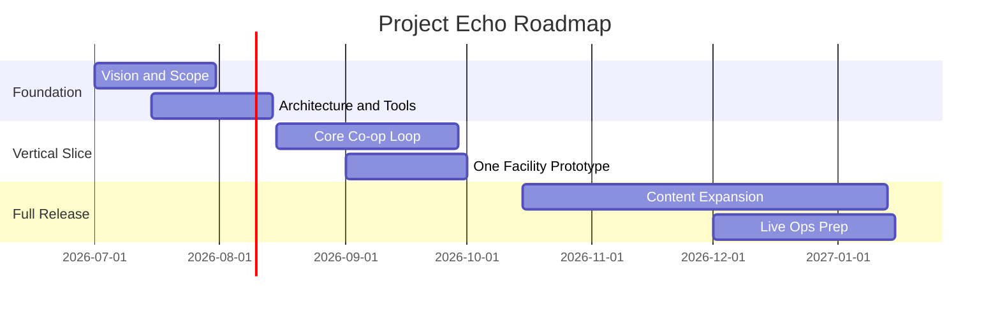

# Roadmap

## Purpose

This document defines the development sequence for Project Echo from concept validation through live operations.

## Scope

Includes milestone planning, release sequencing, and the prioritization logic for major features.

## Dependencies

- The vision and high-concept documents must remain stable.
- The vertical slice must validate the communication-first gameplay loop.
- Production milestones must reflect the team's staffing and tooling limits.
- The "Architecture and Tools" milestone below is gated on the networking topology decision now recorded in [ADR-0002](../technical/ADR/0002-network-topology-host-mode.md) (Fusion Host Mode, no dedicated servers) — this decision is resolved as of this remediation pass and should not consume further schedule time; it was previously an unresolved contradiction between Multiplayer.md and Backend.md that would have blocked "Core Co-op Loop" work if discovered mid-implementation instead of now.

## Diagrams

## Examples

- A prototype can validate the asymmetric information loop before full-level content is built.
- The roadmap should delay advanced creature systems until core communication survives playtests.

## Edge Cases

- Scope growth can cause the vertical slice to slip.
- Feature work may be blocked by backend service readiness.

## Design Decisions

- The roadmap prioritizes a proven communication loop before adding depth systems.
- The MVP is intentionally narrower than the long-term vision.

## Future Improvements

- Add post-launch content packs.
- Expand to additional facilities and creature variants.

## Risks

- Over-scoping can delay the first release.
- Feature creep can reduce polish.

## Open Questions

- Which milestone is the minimum viable public playtest?
- What content is required for a convincing vertical slice?
