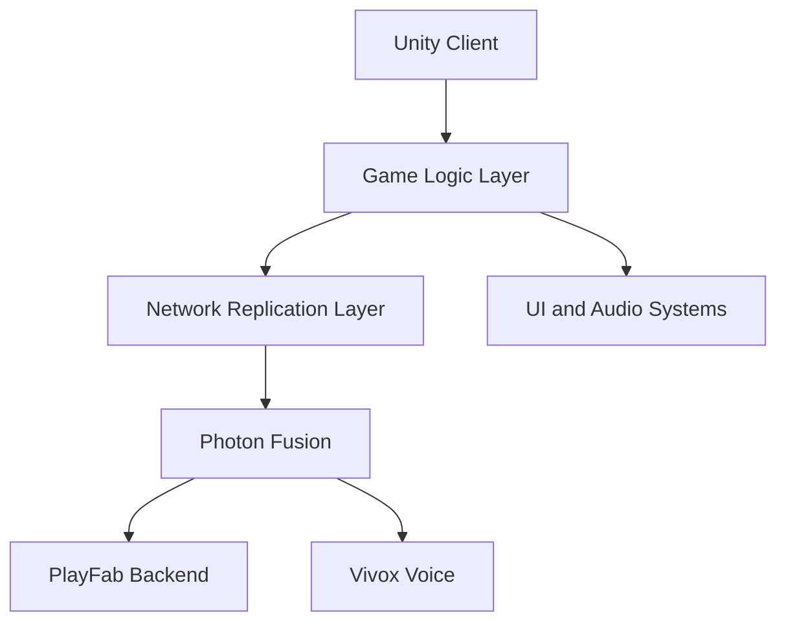
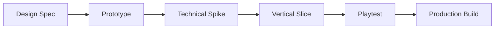

# Technical Design Document

## Purpose

This document defines the technical and production framework for Project Echo. It translates the gameplay vision into implementation guidance, identifies major technical dependencies, and establishes a practical development approach for a small team working in Unity 6.

## Scope

This document covers:

- Core technical architecture assumptions
- Multiplayer architecture and replication strategy
- Content pipeline expectations
- Development workflow and implementation priorities

This document does not replace engine-specific implementation files or source code comments.

## Dependencies

- Unity 6 must support the required scene flow, networking model, and performance targets.
- Photon Fusion 2 is the authoritative multiplayer layer, running in **Host Mode** (client-hosted, with native host migration) — [ADR-0001](../technical/ADR/0001-photon-fusion-2-as-networking-middleware.md), [ADR-0002](../technical/ADR/0002-network-topology-host-mode.md). No dedicated server infrastructure exists for the MVP; this is a deliberate cost/complexity choice, not an oversight.
- PlayFab and Vivox must be integrated in a way that does not compromise the core gameplay loop.
- The technical architecture must support rapid iteration for content and gameplay changes.

## Diagrams

### High-Level System Architecture

### Development Workflow

## Examples

### Example Technical Constraint

If the creature’s state must be shared across all players, it should be modeled as a replicated simulation rather than a local-only AI script. This preserves consistency and prevents players from seeing contradictory creature states.

### Example Content Pipeline

A puzzle designer should be able to add a new objective to the game by creating a prefab, defining the required state transitions, and registering it in the objective library. No custom engine-level coding should be required for basic content creation.

## Edge Cases

- A player joins after an objective has already started.
- The host leaves mid-session — resolved by Fusion's native host migration; see technical/NetworkArchitecture.md §Host Migration for the concrete hand-off sequence (this is no longer an open edge case, it has a defined procedure).
- A puzzle state is altered by a desynchronized client input.
- Voice chat is unavailable while the team is in an active objective sequence.
- A client experiences high latency during a critical interaction.

## Design Decisions

### Decision 1: Use Replicated State, Not Local Simulation

The game should avoid relying on each client to independently simulate critical systems such as creature state, objective progression, or facility hazard states. Shared systems are replicated from a single authoritative source — the elected Host under Fusion Host Mode (ADR-0002), not a distributed or client-guessed value — to reduce mismatch and cheating. See technical/NetworkArchitecture.md for the concrete topology this decision resolves to.

### Decision 2: Keep Gameplay Logic Data-Driven

Objectives, puzzle types, and environmental behaviors should be implemented using data-driven systems wherever practical. This allows designers to create and tune content without requiring engine-level changes for every new map component.

### Decision 3: Prioritize Reliable Communication over Fancy Features

Voice quality, connection stability, and clear state visibility are more important than novelty. A technically impressive feature that undermines communication will hurt the product more than it helps.

### Decision 4: Separate Content Authoring from Runtime Logic

The content pipeline should allow artists and designers to author new rooms, clues, and interactions through prefabs and data assets rather than by writing custom code each time.

## Future Improvements

- More advanced dynamic puzzle authoring tools
- Better match analytics and telemetry hooks
- More robust session recovery systems
- Cross-platform support after the initial Steam release

## Risks

- Network replication mistakes may make the game feel inconsistent or unfair.
- The backend stack could become overly complex for a small team if every service is implemented too early.
- A data-driven content model may become too abstract if documentation and tooling are weak.
- Voice integration could introduce significant platform and compliance overhead.

## Open Questions

- What is the minimum set of replicated systems needed for the MVP? Interim answer: Pressure/Stress (11 Stress System.md), Puzzle state (07), Objective state (09), and player transforms — the three systems that already define their own replicated snapshot as of this remediation pass.
- Should objective state be handled by a general state machine or a dedicated objective manager? Still open — owner: Gameplay Engineering, to be decided during the Objective System technical pass (see this remediation's own Priority 8).
- How much telemetry is necessary before the first public playtest? Still open — owner: Production, tied to the Playtest Guide to be added under Priority 7.
- What fallback exists if Photon Fusion or PlayFab services are unavailable during a session? Still open for PlayFab (backend/persistence); for Photon specifically, Host Mode means there is no separate "Photon service" the match depends on beyond the relay for connectivity — a relay outage prevents new connections but does not require an additional fallback design beyond standard reconnect handling, since there is no dedicated server to fail over from.
