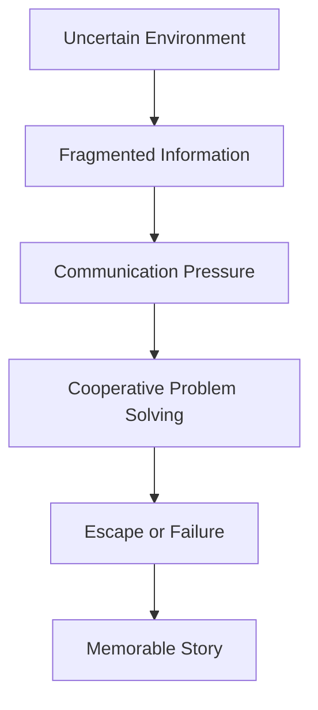
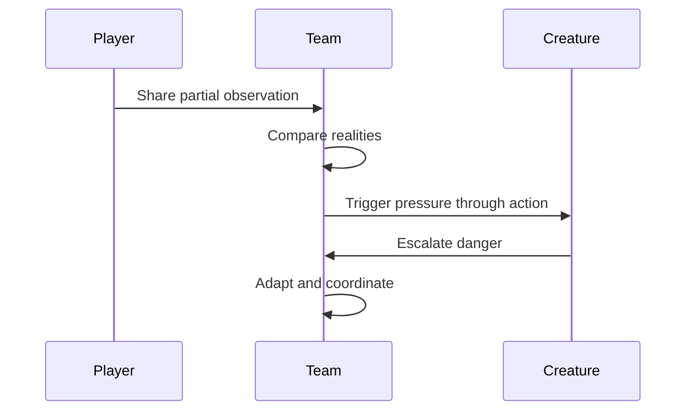

# Vision

## Purpose

This document defines the long-term creative and strategic vision for Project Echo. It establishes the game’s identity, emotional promise, and design direction so that subsequent documents remain aligned.

## Scope

This document covers:

- The game’s narrative and experiential promise
- The core fantasy of cooperative communication under uncertainty
- The intended emotional arc of each session
- The design principles that distinguish Project Echo from other co-op horror titles

This document does not contain detailed system implementation or level-specific content.

## Dependencies

- The product must remain compatible with the core concept of fragmented realities.
- The game must be designed for 2–4 online players.
- The experience must fit within a 15–30 minute session length.
- The design must remain feasible for an indie team using Unity 6 and Photon Fusion 2.

## Diagrams

### Vision Architecture

### Emotional Arc

## Examples

### Example 1: Shared Truth Emerges Slowly

One player sees an emergency panel and another sees a maintenance key. Neither can solve the situation alone. The team must determine that the panel is only actionable when the key is present, and the creature begins to move once the team hesitates.

### Example 2: Miscommunication Causes a Dangerous Mistake

A player reports that a door is locked, but another player interprets that as a signal to force it. The action creates noise, alerts the creature, and forces the team to recover under pressure.

## Edge Cases

- A player withhold information because they are afraid of being wrong.
- The team becomes overly dependent on one player’s interpretation of reality.
- The game creates too much confusion and no longer feels legible.
- One player is much more experienced than the others and dominates the decision-making.
- Voice chat is unavailable and text messaging becomes the primary tool.

## Design Decisions

### Decision 1: The Game Must Be Defined by Communication

The central fantasy is not “hide from a monster” but “assemble reality through conversation.” That identity is the product’s strongest differentiator. Other co-op horror games often rely on combat, stealth, or simple monster avoidance. Project Echo should instead make every successful outcome feel like a shared act of interpretation.

### Decision 2: Fragmentation Should Be Structured, Not Arbitrary

The asymmetric reality system is valuable only if the information differences are meaningful and learnable. A random distribution of details would feel unfair. Instead, each player’s reality should expose a coherent but incomplete subset of the truth.

### Decision 3: The Creature Should Be a Pressure System

A conventional enemy would overemphasize combat. The creature is better used as an adaptive pressure layer that reacts to noise, mistakes, and hesitation. This creates a stronger match between the game’s theme and its mechanics.

### Decision 4: Storytelling Should Be Emergent

The game is designed to create memorable stories through collaboration, misunderstanding, and pressure rather than rigid script events. That choice increases replayability and supports a live-operations future.

## Future Improvements

- New facilities with unique narrative logic
- Additional creature behavior patterns
- More nuanced emotional states and environmental storytelling
- Expanded post-match storytelling tools such as recap clips and shared event logs

## Risks

- The concept may be too abstract if the system is not communicated clearly through play.
- The game could feel unfair if players are punished for honest mistakes without any reliable recovery path.
- The concept may become repetitive if every facility uses the same communication structure.
- The franchise could lose identity if future content shifts toward conventional horror combat.

## Open Questions

- How much of the facility should be discoverable through environmental storytelling versus explicit puzzle logic?
- Should the game include a limited tutorial layer for first-time groups or rely entirely on emergent learning?
- What emotional range should the experience cover beyond tension and panic?
- How much lore should be revealed to players during matches versus through external media?
