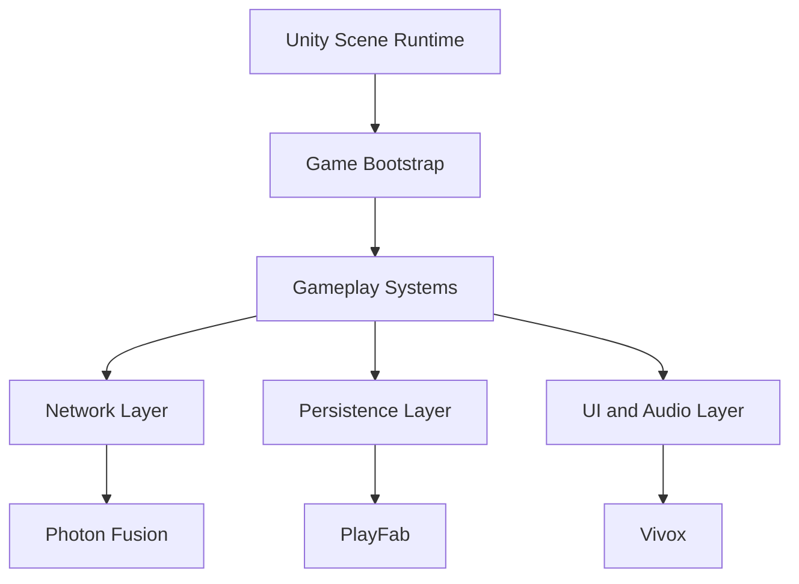
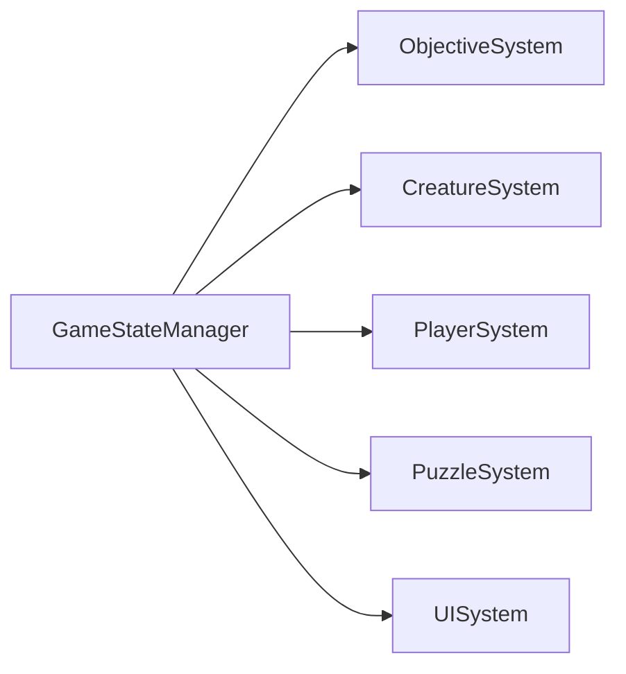

# Architecture

## Purpose

This document defines the technical architecture for Project Echo. It establishes the runtime structure, major systems boundaries, and the implementation strategy needed to support asymmetric multiplayer horror gameplay in Unity 6.

## Scope

This document covers:

- Core runtime architecture
- System ownership and responsibilities
- Dependency boundaries between gameplay and infrastructure systems
- Extension strategy for future content

This document does not replace engine-specific implementation files.

## Dependencies

- Unity 6 is the engine runtime.
- C# is the implementation language.
- Photon Fusion 2 provides authoritative networking services.
- PlayFab provides account and persistence services.
- Vivox provides voice communication.

## Diagrams

### High-Level Runtime Architecture

### System Ownership Model

## Examples

### Example 1: Objective Execution

A relay puzzle resolves by sending an event to the ObjectiveManager. The manager updates the match state, triggers creature pressure, and notifies the UI.

### Example 2: Player Interaction

A player presses the interact key. The InputController sends a request to the InteractionService, which validates the action against the authoritative game state before applying it.

## Edge Cases

- The same object is used by multiple players in close succession.
- A client sends an interaction request while the server is still resolving a prior action.
- A network disconnect occurs during creature state transition.
- The host leaves after objective state has already changed.

## Design Decisions

### Decision 1: Use Authoritative Simulation for Critical Systems

The match state must be resolved by authoritative systems rather than purely local predictions. This protects fairness and prevents state divergence.

### Decision 2: Keep Gameplay Systems Modular

Systems such as objectives, puzzles, creature logic, player control, and UI should be loosely coupled. This reduces the risk of creating a monolithic runtime state machine.

### Decision 3: Keep the Runtime Layer Thin

The engine should not contain business logic that belongs in data-driven systems. The architecture should make it easy to author content through data assets and prefabs.

## Future Improvements

- Add a formal event bus for cross-system communication.
- Introduce more robust runtime profiling hooks.
- Expand the architecture to support additional facilities without rewriting core systems.

## Risks

- Over-coupling can create fragile systems and long debugging cycles.
- Too much authority on the client can create desync and cheating concerns.
- Content-driven architectures can become hard to maintain if the schema is not controlled.

## Open Questions — Resolved

- **Is a dedicated event bus necessary for the MVP or can a service locator pattern suffice?**
  - ✅ **Answer**: **A dedicated event bus is necessary.** Cross-system communication (creature escalation → audio response, objective completion → UI update, accessibility settings → rendering + audio) requires loose coupling. A service locator alone creates tight coupling between systems. See the event bus design in the QuestBit architecture docs (`docs/architecture/06_event_bus.md`) for a reference implementation using strongly-typed events.

- **How much state should be replicated versus computed locally for performance reasons?**
  - ✅ **Answer**: Per [ADR-005](technical/ADR/ADR-005-authority-model.md), all gameplay-critical state (objectives, creature, puzzles, hazards) is server-replicated. Only player movement and local audio/VFX feedback are computed locally. This prioritizes consistency over minimal bandwidth usage.

- **Should the architecture favor a single monolithic GameManager or a distributed service model?**
  - ✅ **Answer**: **Distributed service model.** The `GameStateManager` orchestrates high-level flow (match start, match end, phase transitions), but individual systems (ObjectiveSystem, CreatureSystem, PuzzleSystem, PlayerSystem, UISystem) own their own state and communicate via the event bus. This is consistent with Design Decision 2 ("Keep Gameplay Systems Modular").

