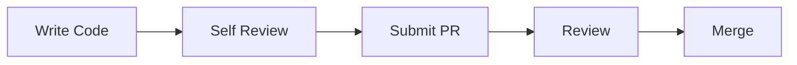

# Coding Standards

## Purpose

This document defines the engineering standards for Project Echo so that code remains readable, safe, and maintainable across the full production team.

## Scope

This document covers:

- Naming conventions
- File organization rules
- C# style expectations
- Error handling and logging expectations
- Testing and documentation standards

## Dependencies

- Code must work in Unity 6 with C#.
- The standards must be compatible with team collaboration in Git and code review workflows.
- Both gameplay systems and infrastructure code must follow the same baseline conventions.

## Diagrams

### Code Review Flow

## Examples

### Example 1: Naming

Use PascalCase for class names, camelCase for local variables, and clear domain names such as ObjectiveManager or CreatureThreatModel.

### Example 2: Error Handling

A failed interaction should not silently fail. The code should log the condition and produce a consistent gameplay response.

## Edge Cases

- A method returns a null state that the caller assumes is valid.
- Events fire before the target object is fully initialized.
- A network callback arrives after a scene transition.
- Logging is too noisy in a release build and obscures meaningful failures.

## Design Decisions

### Decision 1: Prefer Clarity Over Cleverness

The team should favor readable, explicit code over highly compressed or clever implementations.

### Decision 2: Use Domain-Driven Naming

Code should be named around the gameplay concept it serves rather than around implementation details.

### Decision 3: Keep State Changes Explicit

State transitions should be obvious in code, not hidden in side effects or implicit logic.

## Future Improvements

- Introduce stronger static analysis rules and code quality checks.
- Add style enforcement to CI pipelines.
- Expand documentation requirements for public systems and major services.

## Risks

- Inconsistent code standards increase technical debt.
- Poor naming and structure make debugging slower and more expensive.
- Weak error handling creates unstable gameplay states under network or content issues.

## Open Questions

- Should the team enforce a strict code style tool such as .editorconfig or StyleCop?
- What level of unit-test coverage is expected for gameplay systems?
- Should the team use nullable reference types across the project from the start?
