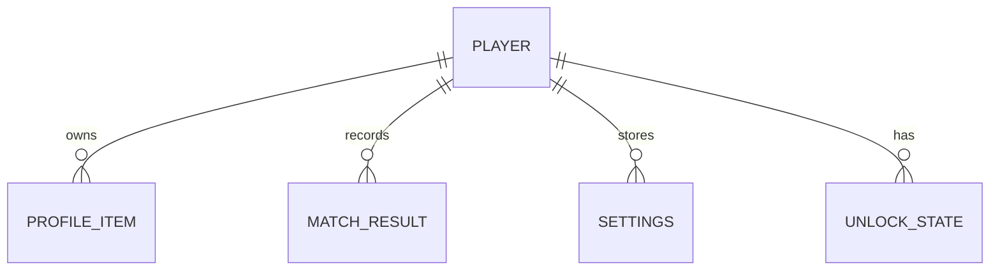

# Database

## Purpose

This document defines the data persistence strategy for Project Echo. It covers player profiles, unlock state, settings, analytics data, and session metadata that need to be stored reliably.

## Scope

This document covers:

- Save data model
- Player account state
- Cloud persistence
- Analytics event storage
- Save versioning and migrations

## Dependencies

- PlayFab is the primary backend persistence layer.
- Steam account identity and PlayFab account identity must be mapped cleanly.
- The save model must align with progression and cosmetic systems.

## Diagrams

### Persistence Model

## Examples

### Example 1: Player Profile

A player profile stores account ID, display name, cosmetic unlocks, and progression level.

### Example 2: Match Result

A completed session is stored with match ID, start time, outcome, communication metrics, and duration.

## Edge Cases

- A save is written while another save is still in progress.
- A player has a stale local profile due to previous cloud state mismatch.
- A new build introduces a schema version that older saves cannot interpret.
- A player changes devices and the profile must be resolved carefully.

## Design Decisions

### Decision 1: Keep the Core Persistence Model Small and Versioned

The database schema should persist only what is needed for player continuity and analytics. Overly large schemas create migration complexity.

### Decision 2: Treat Save State as a Contract

Every saved field should have a defined meaning and a migration path. The team should not introduce ad hoc save values without documentation.

### Decision 3: Separate Gameplay State from Profile State

Match state should not be persisted in the same way as account progression. They have different failure modes and update frequencies. Concretely: match state (Pressure, Puzzle, Objective) is Host-authoritative and never written here at all (see [technical/NetworkArchitecture.md §Save Synchronization](NetworkArchitecture.md#save-synchronization)); only account progression is. Each connected client writes its own progression record independently and directly — this table is never populated via a relay through the match Host.

## Future Improvements

- Add richer analytics schemas for post-match review data.
- Support more advanced live-ops content flags and feature gates.
- Expand cloud save diagnostics and repair tools.

## Risks

- Schema drift can break player data or make migration difficult.
- Save conflicts can cause loss of progress if not handled carefully.
- Analytics data can grow quickly and become expensive to store and process.

## Open Questions

- What data should be persisted locally versus in cloud storage for the MVP?
- How much match telemetry is necessary before launch?
- Should progression be tied to account identity or Steam identity only?
