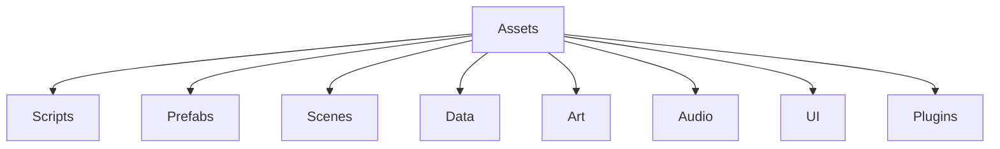

# Folder Structure

## Purpose

This document defines the recommended source tree layout for the Project Echo codebase. It exists to keep the project understandable for designers, engineers, and technical artists over the full production lifecycle.

## Scope

This document covers:

- Source folder organization
- Content and tooling folders
- Runtime versus editor-only folders
- Shared conventions for scripts, assets, and data files

## Dependencies

- The structure must work with Unity 6 projects.
- The layout should support collaborative development in Git.
- It must allow the team to isolate gameplay systems, content assets, and platform integrations.

## Diagrams

### Suggested Project Layout

## Examples

### Example 1: Gameplay Code

All gameplay scripts should sit under a clear folder such as Assets/Scripts/Gameplay, with separate subfolders for player systems, objectives, puzzles, and creature behavior.

### Example 2: Content Assets

Room templates, puzzle definitions, and facility data should be stored under Assets/Data or Assets/Content and grouped by system.

## Edge Cases

- A new feature is implemented in the wrong folder and becomes hard to find.
- Shared utilities conflict with gameplay code because the folder naming is too loose.
- Art or audio assets are stored without clear ownership or system grouping.

## Design Decisions

### Decision 1: Separate Gameplay Logic from Content Assets

This keeps the runtime code easier to reason about and reduces the chance that designers accidentally edit logic scripts.

### Decision 2: Group by System, Not by File Type Alone

Folders should reflect gameplay responsibility rather than just technical category.

### Decision 3: Keep Runtime and Editor Code Separate

Editor-only tooling should stay in Editor-specific folders to avoid shipping unnecessary code in builds.

## Future Improvements

- Add a formal asset naming convention guide for content creators.
- Split large folders further as content volume increases.
- Standardize folder-level README files for complex subsystems.

## Risks

- A poor folder structure slows onboarding and increases merge conflicts.
- Overly deep hierarchies make it harder to find relevant files quickly.
- Mixing runtime and tooling code can produce avoidable build issues.

## Open Questions

- Should the team use a single shared Assets root or a modular package-based structure?
- How much content should be kept outside the main Assets tree for tools or external pipelines?
- What folder conventions should apply to generated or imported files?
